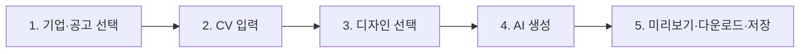
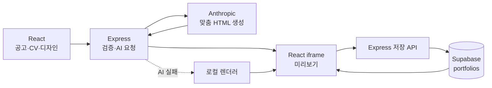

# CV2PF 10분 발표 슬라이드 설계서

## 발표 목표

처음 보는 사람도 다음 세 문장에 답할 수 있게 한다.

1. CV2PF는 누구의 어떤 문제를 해결하는가?
2. React, Express, AI, Supabase가 어떻게 한 바퀴 연결되는가?
3. 기업·JD 맞춤 포트폴리오가 기존 생성기와 무엇이 다른가?

발표 8분 40초, 질의응답 1분 20초를 기준으로 한다. 라이브 데모가 느려지면 슬라이드 6의
설명을 30초 줄인다.

## 슬라이드 구성

| # | 시간 | 슬라이드 제목 | 한 문장 메시지 | 권장 시각 자료 |
| --- | ---: | --- | --- | --- |
| 1 | 0:00–0:40 | 이력서 한 장을, 지원 기업에 맞는 사이트로 | CV2PF는 지원처마다 달라지는 포트폴리오 제작 비용을 줄인다 | 선택 화면 + 결과 화면 전후 비교 |
| 2 | 0:40–1:30 | 사용자가 겪는 문제 | 같은 경험도 기업과 JD에 따라 보여줄 근거의 우선순위가 다르다 | 일반 포트폴리오 vs JD 맞춤 비교 |
| 3 | 1:30–2:30 | 5단계 사용자 여정 | 공고 선택부터 생성·저장까지 하나의 흐름으로 연결했다 | `기업·공고 → CV → 디자인 → 생성 → 결과` |
| 4 | 2:30–3:30 | 화면·서버·DB가 도는 구조 | React 요청이 Express와 AI를 거쳐 결과가 되고 Supabase에 남는다 | README Mermaid 아키텍처 |
| 5 | 3:30–4:20 | 작게 만들고 검증한 과정 | mock 화면, 수직 슬라이스, DB, TDD 순으로 위험을 줄였다 | 주차별 작업 타임라인 |
| 6 | 4:20–7:10 | 라이브 데모 | 한 공고를 고르고 CV를 넣어 맞춤 HTML을 생성·저장한다 | 실제 브라우저 |
| 7 | 7:10–8:00 | 기업 5개를 비교하는 이유 | 공고마다 서로 다른 강조점이 결과 생성의 맥락이 된다 | 5개 기업 비교 표 |
| 8 | 8:00–8:40 | 검증 결과와 한계 | 사실성 원칙과 폴백으로 안전하게 동작하지만 공고 자동 수집은 다음 단계다 | 테스트 결과 + 한계 3개 |
| 9 | 8:40–10:00 | Q&A | 핵심 결정을 근거와 함께 답한다 | QR/저장소 링크, 예상 질문 |

## 슬라이드별 상세 정보

### 1. 이력서 한 장을, 지원 기업에 맞는 사이트로

- 화면 문구: “지원 기업과 JD를 고르면, 내 경험의 강조 순서를 바꿔 독립 실행형 포트폴리오를 만듭니다.”
- 처음 10초에는 기술 이름보다 사용자 결과를 먼저 말한다.
- 결과물이 서버 안에만 있는 것이 아니라 HTML 파일로 내려받을 수 있다는 점을 보여준다.

### 2. 사용자가 겪는 문제

- 기존 방식: 모든 회사에 같은 포트폴리오를 제출
- 문제: 채용 담당자가 원하는 근거를 찾기 어렵고, 지원자가 매번 사이트를 수정해야 함
- 해결 가설: 공고의 인재상·업무·기술을 먼저 고르면 관련 경험을 앞에 배치할 수 있음
- 금지 원칙: CV에 없는 경험이나 수치를 생성하지 않음

### 3. 5단계 사용자 여정

- React `App`의 state가 현재 단계와 선택한 공고, CV, 디자인, 결과를 관리한다.
- 완료한 단계는 다시 돌아가 수정할 수 있다.

### 4. 화면·서버·DB가 도는 구조

- API 키는 브라우저가 아니라 Express 환경 변수에만 둔다.
- 생성 API 입력: `targetMarkdown + cvMarkdown + designMarkdown`
- Supabase에는 결과 HTML과 이름·직함·테마·생성 시각을 저장한다.

### 5. 작게 만들고 검증한 과정

1. 기획과 동작 프로토타입으로 사용자 흐름 확인
2. React 컴포넌트와 mock 데이터로 화면 상태 전환 확인
3. Express 생성·저장 API와 Supabase를 연결해 수직 슬라이스 완성
4. 즐겨찾기 같은 작은 기능을 테스트 먼저 작성하는 TDD로 구현
5. 공고 선택을 앞단에 추가하고 생성 프롬프트까지 연결

Agent는 계획 분해, 초기 UI, 반복 테스트와 기능 검증에 사용했다. 세부 스타일과 상태 로직은
코드를 직접 통제하며 수정했다.

### 6. 라이브 데모

권장 시나리오는 QANDA Frontend Engineer다. 프로젝트의 TDD 경험을 공고의 테스트 역량과
연결해 설명하기 쉽다.

1. QANDA 카드 선택 — 인재상, JD 핵심 업무, 강조점 확인
2. `개발자` 샘플 CV 선택 — 파싱된 경력·프로젝트 개수 확인
3. `Minimal Clean` 디자인 선택
4. 생성 버튼 — JD 분석 단계와 API 요청 확인
5. 결과 화면 — 지원 목표 배지, 맞춤 HTML, 공고 원문 링크 확인
6. HTML 다운로드
7. Supabase 저장 후 최근 기록에서 다시 열기

데모 안전장치:

- 서버 AI가 실패해도 로컬 렌더러가 독립 실행형 HTML을 만든다.
- 폴백 결과에는 “문장 재구성은 제한됨”이 표시된다.
- 발표 전 QANDA 공고 원문 탭과 샘플 CV를 준비한다.

### 7. 기업 5개를 비교하는 이유

- 토스: 주도성·제품 임팩트
- LINE Pay: 대규모 트래픽·협업·실험
- Coupang Play: 멀티 플랫폼·성능
- CLO Virtual Fashion: 시스템 설계·글로벌 협업
- QANDA: 문제 정의·테스트·교육 임팩트

같은 프론트엔드 CV라도 어떤 문제와 결과를 먼저 보여줄지 달라진다는 점이 핵심이다.

### 8. 검증 결과와 한계

검증:

- 공고 5개가 고유한 ID와 공식 출처를 갖는지 단위 테스트
- 선택 공고가 API body에 들어가는지 테스트
- AI 프롬프트에 사실을 꾸며내지 않는 규칙이 있는지 테스트
- AI 실패 시 로컬 HTML이 생성되고 목표 회사가 표시되는지 테스트
- 전체 client/server test와 production build

한계:

- 현재 5개 공고는 확인일 기준으로 직접 큐레이션한 예시이며 자동 갱신되지 않는다.
- 로컬 폴백은 회사·직무를 표시하지만 CV 문장을 AI처럼 재구성하지 않는다.
- 공고와 CV의 적합도 점수는 아직 제공하지 않는다.

다음 단계:

- 채용 공고 URL 입력과 최신 상태 재확인
- “왜 이 경험을 강조했는지” 근거 표시
- 생성 전 사용자 승인과 문장별 편집 기능

### 9. Q&A

화면에는 “CV2PF = 지원 목표 + 실제 CV + 디자인 → 검증 가능한 HTML” 한 줄을 남긴다.
자세한 답변은 발표 대본의 예상 질문을 참고한다.

## 발표 전 체크리스트

- [ ] `npm test`와 `npm run build` 성공
- [ ] client와 server 실행, Supabase 환경 변수 확인
- [ ] 샘플 개발자 CV가 즉시 선택되는지 확인
- [ ] QANDA 선택 → 생성 → 다운로드 → 저장 → 재조회 1회 리허설
- [ ] AI 실패 시 폴백 화면도 한 번 확인
- [ ] 브라우저 배율 100%, 알림·메신저 끄기
- [ ] 데모 실패 대비 결과 화면 캡처 준비
- [ ] 8분 40초에 발표를 끝내고 Q&A로 전환

