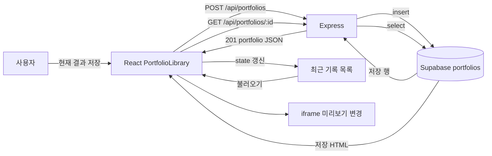
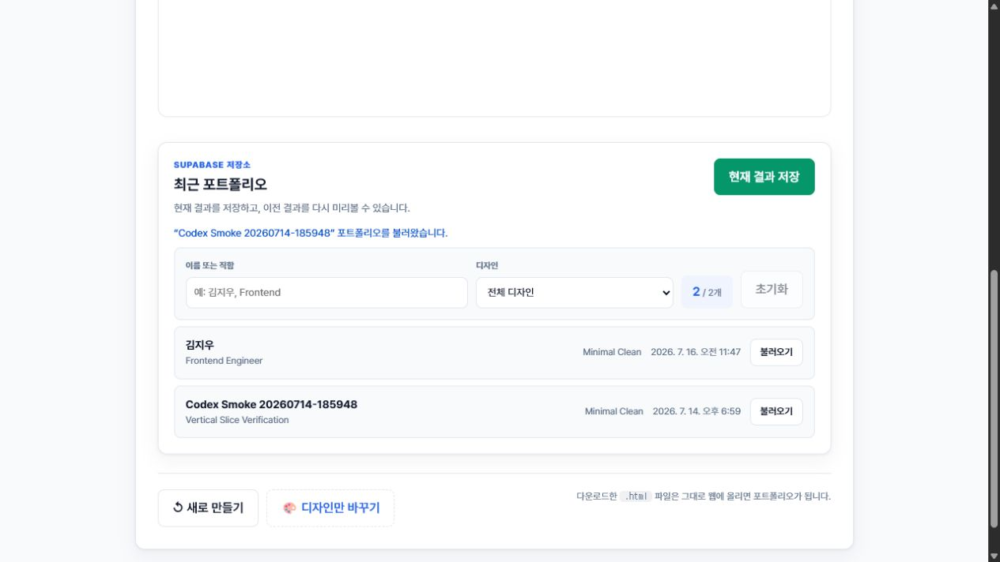

# 2주차 발표·데모와 Task 마감

> 작성일: 2026-07-16
>
> 핵심 기능: 생성된 포트폴리오를 React 화면에서 저장하고, Express를 거쳐 Supabase에 영속화한 뒤 다시 조회한다.

## 1. 30초 요약

CV2PF는 CV와 디자인을 선택해 포트폴리오 HTML을 만든다. 이번 주에는 결과 화면에서 현재
포트폴리오를 저장하고 최근 기록을 다시 불러오는 첫 수직 슬라이스를 완성했다. mock으로 화면
상태를 먼저 만든 뒤 Express API와 Supabase 한 테이블을 연결했고, 전용 `feature-verifier`
Agent로 FE·BE·DB·통합 흐름을 검증했다.

## 2. 연결 구조



핵심 경계는 브라우저가 Supabase를 직접 호출하지 않는다는 점이다. React는 상대경로 `/api`만
사용하고 secret key는 Express 서버 환경변수에만 둔다.

## 3. 3분 데모 대본

### 데모 전 확인

```bash
npm run dev
curl http://localhost:4000/api/health
```

`databaseConfigured=true`를 확인하고 브라우저에서 `http://localhost:5173`을 연다.

### 시연 순서

| 시간 | 화면 동작 | 설명할 내용 | 성공 신호 |
| ---: | --- | --- | --- |
| 0:00 | 개발자 샘플 CV 선택 | React state가 입력과 파싱 미리보기를 갱신한다. | 이름·직함·기술 개수 표시 |
| 0:30 | Minimal Clean 선택 후 생성 | CV와 디자인으로 독립 HTML을 만든다. | 결과 iframe 표시 |
| 1:00 | `현재 결과 저장` 클릭 | React가 Express POST를 호출하고 Express가 Supabase에 insert한다. | `저장했습니다` 메시지, 목록 개수 증가 |
| 1:40 | 최근 기록의 `불러오기` 클릭 | 상세 GET으로 DB에 저장된 HTML을 조회한다. | `불러왔습니다` 메시지, iframe 내용 변경 |
| 2:15 | 이름·직함 또는 디자인 필터 사용 | 필터 state는 부모가 소유하고 자식은 props·callback을 받는다. | 결과 개수와 목록 즉시 변경 |
| 2:40 | 검증 문서 제시 | Agent가 코드 존재가 아닌 실행 증거로 판정했다. | FE·BE·DB·통합 모두 PASS |

## 4. 실제 데모 증거



2026-07-16 실제 환경에서 확인한 결과다.

```text
GET /api/health: status=ok, databaseConfigured=true
저장 전 목록: 1개
React 저장 성공: “김지우” 포트폴리오를 저장했습니다.
저장 후 목록: 2개
저장 ID: d76d2755-6085-481e-980a-ab33367557f6
GET /api/portfolios/:id: name·title·html 확인
기존 기록 불러오기: iframe 제목이 Codex Smoke 20260714-185948로 변경
검증 시각: 2026-07-16T11:49:00+09:00
```

## 5. 예상 질문과 답변

### state와 props는 어떻게 다른가?

`PortfolioLibrary`가 목록·검색어·디자인 필터를 state로 소유한다. `PortfolioFilters`는 값을
props로 받고, 사용자 입력은 callback props로 부모에게 전달한다. state는 값의 주인이고 props는
부모와 자식 사이의 전달 통로다.

### 왜 목록 API에서 HTML을 빼는가?

완성 HTML은 크기가 크다. 목록에는 이름·직함·디자인·시간만 내려 응답을 줄이고, 사용자가
불러오기를 누른 한 건만 상세 API로 조회한다.

### 왜 Supabase를 브라우저에서 직접 호출하지 않는가?

서버 전용 secret key 노출을 막고 입력 검증·오류 매핑을 Express 한 곳에서 관리하기 위해서다.

### Agent는 무엇을 검증했는가?

`feature-verifier`는 요구사항을 FE·BE·DB·통합 계층으로 나누고 자동 테스트, API 상태 코드,
실제 DB insert/select, 브라우저 화면 변화를 증거로 PASS·FAIL·BLOCKED를 판정한다.

## 6. 이번 주 완료 Task

| 이슈 | 결과 | 증거 |
| --- | --- | --- |
| [#8 저장·조회 API](https://github.com/dolphin1404/NaverConnect_wm/issues/8) | Done | Express 3개 API, Supabase migration, 서버 테스트 7개 |
| [#9 결과 화면 연결](https://github.com/dolphin1404/NaverConnect_wm/issues/9) | Done | 저장·목록·상세·필터 UI, 브라우저 실제 DB 데모 |
| [#10 기능 검증 Agent](https://github.com/dolphin1404/NaverConnect_wm/issues/10) | Done | `feature-verifier`, 검증 문서, 실제 smoke test |

병합된 과제 PR:

- [#1033 포트폴리오 저장·조회 수직 슬라이스](https://github.com/connect-AIAgentChallenge-26-1/hub/pull/1033)
- [#1158 mock 화면 흐름과 데이터 모델 설계](https://github.com/connect-AIAgentChallenge-26-1/hub/pull/1158)

## 7. 다음 주로 넘긴 Task

초기 주간 계획의 AI 비교 경로는 수직 슬라이스 저장·조회 기능을 우선하면서 다음 주 후보로
조정한다. 완료로 표시하지 않고 Project의 Todo에 유지한다.

| 이슈 | 상태 | 조정 이유 | 다음 시작점 |
| --- | --- | --- | --- |
| [#2 Claude API 실제 요청](https://github.com/dolphin1404/NaverConnect_wm/issues/2) | Todo | 실제 DB 수직 슬라이스 우선 | API 키·타임아웃 smoke test |
| [#3 AI 결과 비교](https://github.com/dolphin1404/NaverConnect_wm/issues/3) | Todo | #2 선행 필요 | 결정적/AI 모드 상태 설계 |
| [#4 자동 폴백](https://github.com/dolphin1404/NaverConnect_wm/issues/4) | Todo | #3 선행 필요 | 실패 유형과 안내 문구 정의 |
| [#5 파서 테스트](https://github.com/dolphin1404/NaverConnect_wm/issues/5) | Todo | API·필터 테스트만 완료 | `parseCv` fixture 3~5개 추가 |
| [#6 새 클론·AI 데모](https://github.com/dolphin1404/NaverConnect_wm/issues/6) | Todo | AI 경로 미완료 | #2~#5 후 최종 재현 |

다음 주 월요일 권장 순서는 `#2 → #3 → #4 → #5 → #6`이다. P0인 #2~#4를 먼저 유지하고,
시간이 부족하면 #6의 문서 범위를 줄인다.

## 8. 최종 검증

```text
feature-verifier: PASS
client tests: 8 passed
server tests: 7 passed
lint: passed
production build: passed
actual React → Express → Supabase → React browser cycle: passed
```
