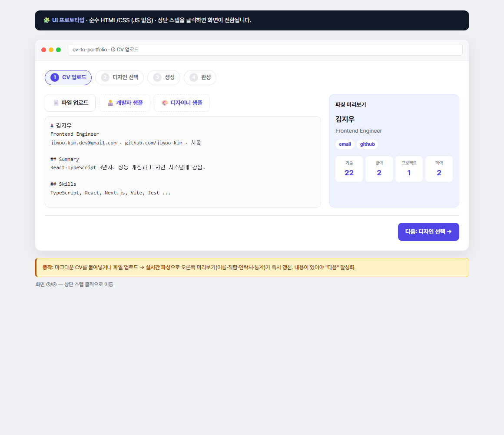
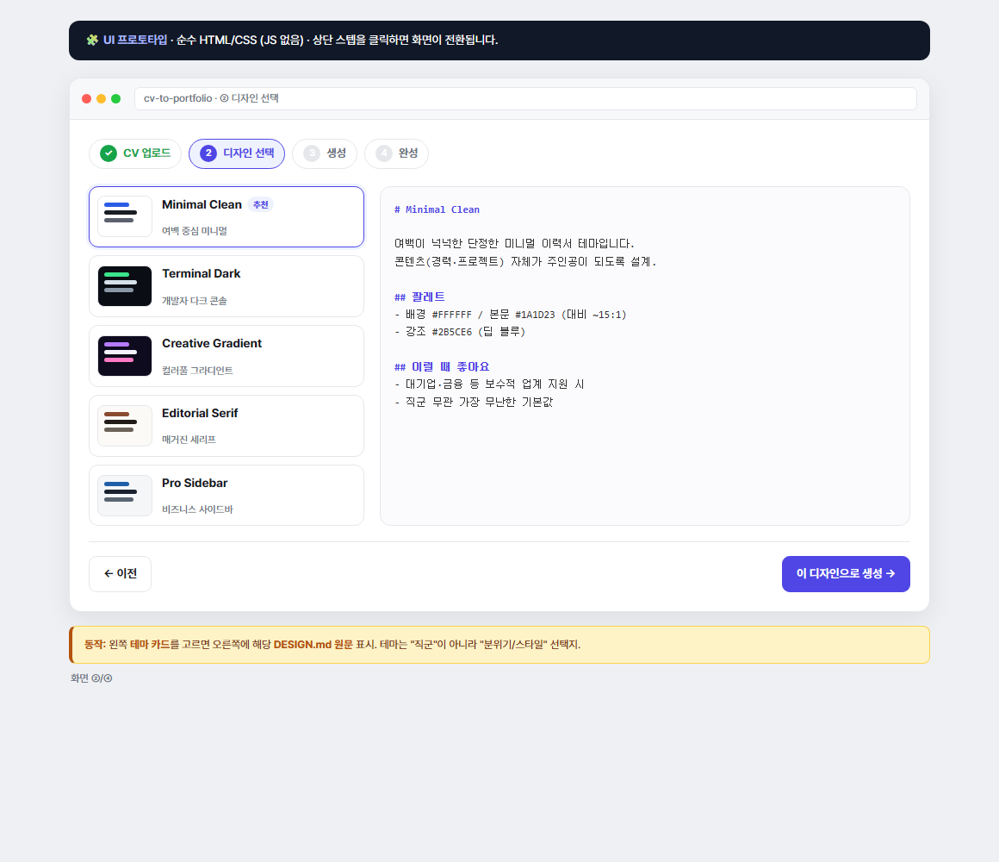
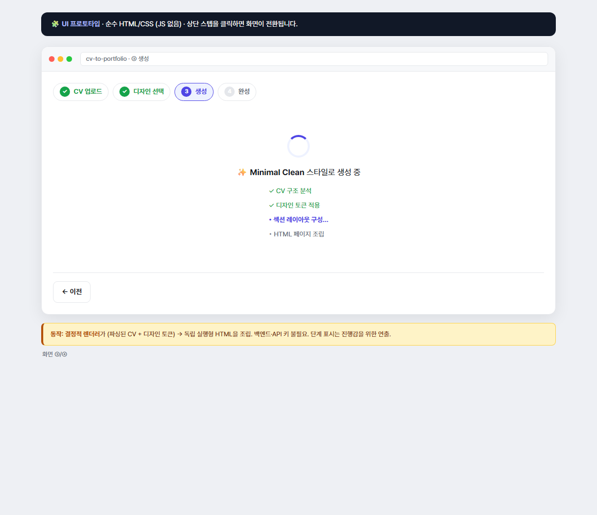
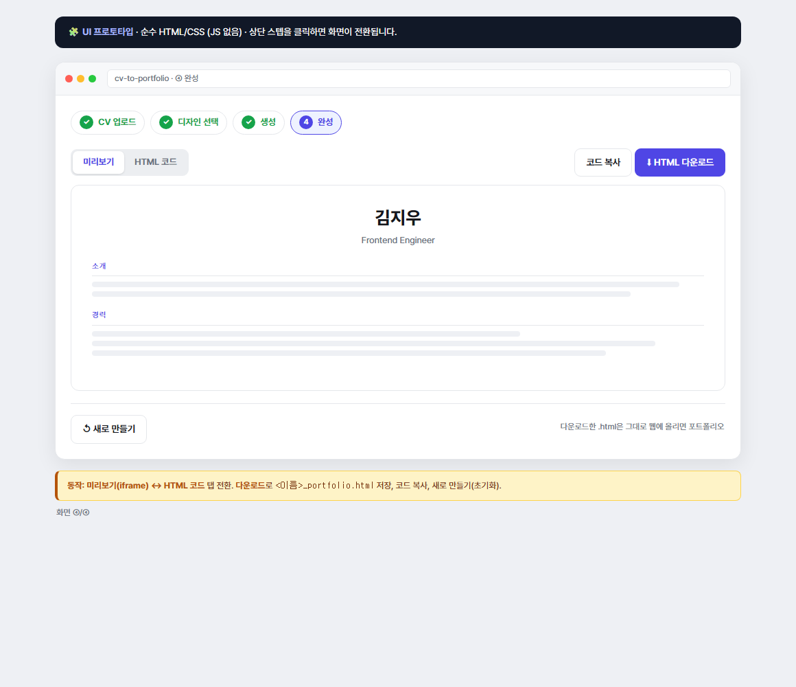

# 기획서 — CV → 포트폴리오 생성기

> 무엇을 만들지 정하고, 나와 Agent가 같은 기준을 보기 위한 문서.
> 상태: v0.3 (프로토타입) · 코드: [`cv-to-portfolio/`](..) · [PR #1](https://github.com/dolphin1404/NaverConnect_wm/pull/1)
> 결정 반영: 직군 무관 타깃 · 결정적 렌더러 유지 · 배포 미정 (§8) · UI 화면 구조 추가(§3)

---

## 1. 문제 정의

**한 줄:** 이력서 "내용"은 있는데, 그것을 보여줄 "포트폴리오 사이트"로 만드는 일이 여전히 번거롭다.

- 취준·이직 중인 사람은 **직군을 막론하고** 경력·프로젝트(CV)는 정리돼 있지만, 이를 웹 포트폴리오로 바꾸려면 **디자인·퍼블리싱·배포**라는 별도 노동이 필요하다.
- 기존 방법의 한계
  - **직접 코딩** — 자유롭지만 시간·기술 부담이 크다. (비개발 직군엔 진입장벽 자체가 큼)
  - **템플릿 빌더(노션·링크트리 등)** — 빠르지만 디자인이 획일적이고, 결과물을 내 파일(HTML)로 소유·수정하기 어렵다.
  - **범용 AI에 통째로 요청** — 결과가 매번 달라 재현·비교가 어렵고 디자인 방향을 통제하기 힘들다.
- **우리가 푸는 문제:** 내용(CV)과 디자인(DESIGN.md)을 **분리**해, 사용자는 *내용은 올리기만, 디자인은 고르기만* 하면 **완성된 독립 실행형 포트폴리오 HTML**을 즉시 얻는다.
  - → 결과는 **파일로 소유·배포** 가능하고, 디자인 선택은 **재현·비교** 가능하다.

## 2. 사용자 시나리오

**주 사용자:** 취준/이직 중인 **모든 직군의 사람**(직군 무관 — 개발자·디자이너뿐 아니라 마케터·기획자·사무직 등). 전제: 자신의 이력을 마크다운으로 정리할 수 있는 사람.

### 해피 패스 (핵심 흐름) — 각 단계는 §3의 화면 ①~④에 대응
1. **업로드**〔화면 ①〕 — CV(마크다운)를 붙여넣거나 `.md/.txt` 파일로 올린다. → *이름·직함·연락처·스킬·경력·프로젝트·학력*으로 파싱된 결과를 즉시 확인.
2. **디자인 선택**〔화면 ②〕 — 5개 `DESIGN.md` 테마 카드를 훑고, 각 테마 설명을 읽고 하나를 고른다.
3. **생성**〔화면 ③〕 — "이 디자인으로 생성"을 누르면 선택한 디자인으로 포트폴리오가 조립된다.
4. **전달**〔화면 ④〕 — 미리보기로 확인하고 `이름_portfolio.html`로 다운로드한다. (또는 HTML 코드 복사)

### 부가 시나리오
- **비교** — 같은 CV로 여러 테마를 바꿔가며 생성해 고른다.
- **수정 후 재생성** — CV 내용을 고쳐 다시 만든다.
- **직접 편집** — 받은 HTML을 열어 세부를 다듬은 뒤 원하는 곳에 배포한다.

## 3. 화면 구조 (UI)

> **순수 HTML/CSS 프로토타입:** [`prototype.html`](prototype.html) — 상단 스텝을 클릭하면 화면이 전환됩니다(JS 없음).
> (GitHub은 HTML을 소스로 보여주므로, 클릭 가능한 버전은 파일을 내려받아 브라우저로 열어 확인하세요. 아래는 각 화면 캡처.)

### ① CV 업로드

- 좌: 파일 업로드 / 샘플 버튼 + 마크다운 입력 영역. 우: **실시간 파싱 미리보기**(이름·직함·연락처·통계).
- 내용이 있어야 "다음: 디자인 선택" 활성화.

### ② 디자인 선택

- 좌: 미니 스와치가 달린 **테마 카드 5종**. 우: 선택한 테마의 **`DESIGN.md` 원문**.
- 테마는 "직군"이 아니라 "분위기/스타일" 선택지. 기본값 = Minimal Clean.

### ③ 생성

- **결정적 렌더러**가 (파싱된 CV + 디자인 토큰) → 독립 실행형 HTML을 조립. 백엔드·API 키 불필요.
- 단계 표시(분석→토큰→레이아웃→조립)는 진행감을 위한 연출.

### ④ 완성(결과)

- **미리보기(iframe) ↔ HTML 코드** 탭 전환. **다운로드**(`<이름>_portfolio.html`) · 코드 복사 · 새로 만들기.

## 4. 핵심 기능 (핵심 먼저, 서브는 뒤로)

### 4.1 CV 파싱 — *가장 핵심*
- **입력:** 마크다운 이력서(형식 자유) · **출력:** `{ 이름, 직함, 연락처[], 요약, 스킬[], 경력[], 프로젝트[], 학력[] }`
- **제약:** 사람마다 형식이 달라 **관대하게(휴리스틱)** 파싱하고, 실패해도 **원문은 항상 보존**한다.
- **직군 무관 원칙:** 특정 직군 전용 필드를 가정하지 않는다. 섹션은 **있으면 렌더, 없으면 생략**.

### 4.2 디자인 테마 시스템
- 각 테마 = 사람이 읽는 **`DESIGN.md`** + 생성기가 쓰는 **디자인 토큰**(색·폰트·레이아웃·헤더 스타일).
- 현재 5종: **Minimal Clean(기본)** · Terminal Dark · Creative Gradient · Editorial Serif · Pro Sidebar.

### 4.3 생성 엔진 — *결정적 렌더러(확정)*
- **입력:** 파싱된 CV + 디자인 토큰 · **출력:** **독립 실행형 HTML 1개**(인라인 CSS, 외부 의존 없음).
- 레이아웃 4종(single-column / timeline / two-column / sidebar), 사용자 입력은 이스케이프.
- **방식 결정:** 실 LLM이 아닌 **결정적 렌더러 유지** → 재현·비교가 쉽고 백엔드·API 키 불필요.

### 4.4 결과 전달
- 미리보기 ↔ HTML 코드 탭 · 파일 다운로드 · 코드 복사 · 새로 만들기.

### 서브 기능 (후순위)
- 샘플 CV 제공, 실 LLM 생성 경로(`generateWithAI.js` seam, 현재 미사용), (향후) PDF/DOCX 업로드.

## 5. 범위 / 비범위

| | 내용 |
| --- | --- |
| **MVP(현재)** | 핵심 기능 4가지 + 브라우저 단독 동작(백엔드·API 키 불필요), 결정적 렌더러 |
| **비범위(현재)** | 백엔드/계정/저장, 실제 LLM 호출, PDF 파싱, 배포 자동화 |

## 6. 향후 로드맵
- **직군 확장** — 비개발 직군용 테마·샘플 CV 추가, 파싱의 직군 일반화 검토.
- **PDF/DOCX 파싱** 파이프라인.
- **실 LLM 생성**은 선택적 옵션(seam)으로만 열어둠 — 기본은 결정적 렌더러 유지.
- **배포(원클릭)** — 제품 범위 포함 여부 *미정*(§8).

## 7. 열린 질문 (다음에 함께 정할 것)
- 직군 무관으로 넓힐 때, **비개발 직군용 테마/샘플**을 몇 개까지 먼저 갖출지?
- 파싱이 다양한 이력 형식(경력 중심 vs 프로젝트 중심 등)을 얼마나 관대하게 받아줄지 기준?

## 8. 결정 사항 (2026-07-07)
- **주 타깃:** 취준생 전반(**직군 무관**).
- **생성 방식:** **결정적 렌더러 유지**(실 LLM은 선택적 seam으로만).
- **배포 범위:** **나중에 결정**(로드맵에 열어둠).
