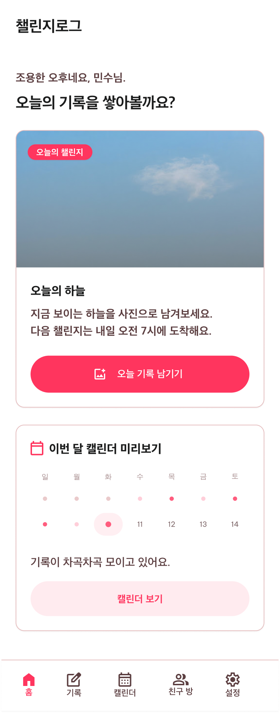
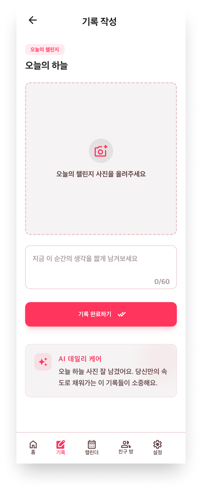
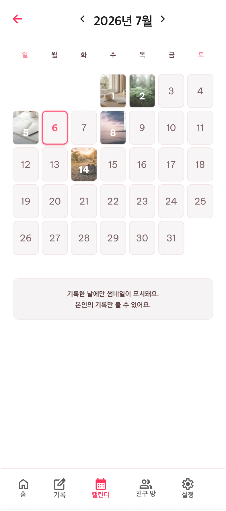
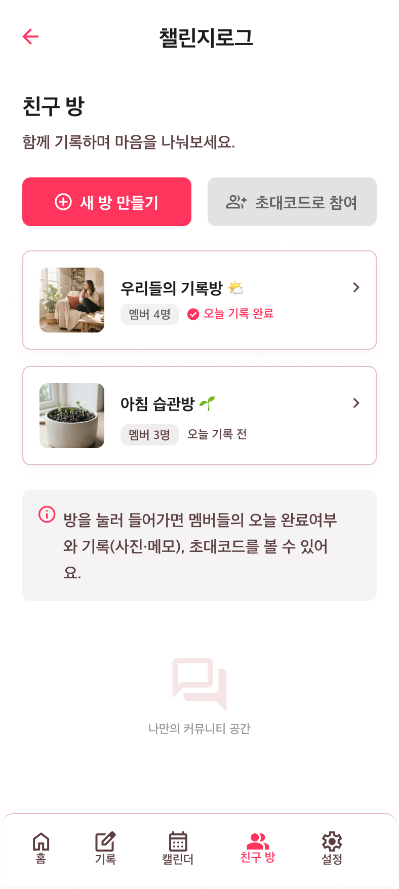
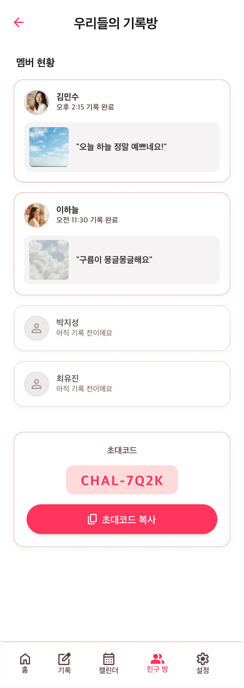
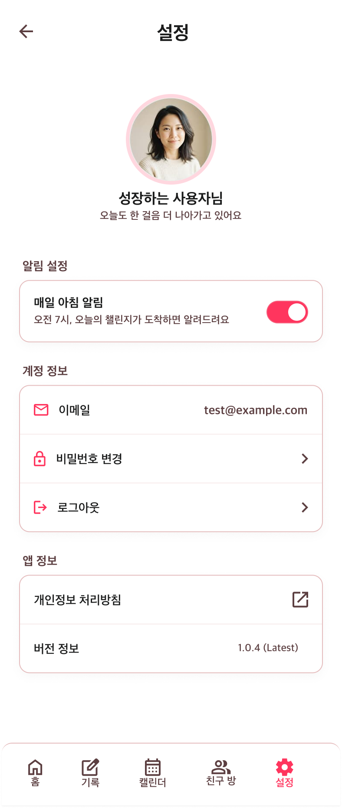

# design-guide.md — 챌린지로그 디자인 가이드 (Stitch 프롬프트용)

> Google Stitch 등 AI 디자인 도구에 이 문서를 그대로 붙여넣어 화면을 생성합니다.
> Stitch는 보통 화면 1개당 프롬프트 1회로 생성하므로, 아래 "화면별 명세"를 화면마다 나눠 넣고
> 매번 "디자인 토큰 · 절대 원칙" 섹션을 함께 포함해 톤을 통일하세요.
> 생성 결과는 이 문서 맨 아래 [Stitch 결과물](#stitch-결과물) 섹션에 링크/스크린샷으로 남깁니다.

---

## 프로젝트 한 줄 소개

**챌린지로그**: 매일 오전 7시 랜덤 챌린지를 받고, 하루 1장 사진 + 한 줄 메모로 기록하는 모바일 우선 웹앱.
3~6명 친구 방에서 그날의 완료 여부(O/X)와 완료자의 기록을 공유할 수 있다.

---

## 절대 원칙 (Stitch 프롬프트에 반드시 포함)

1. **비교 요소 절대 금지** — 랭킹, 순위, 리더보드, 스트릭(연속 기록일수), "누가 더 많이/자주 기록했는지" 같은 정량적 비교 UI를 만들지 않는다. 친구 방은 오늘 완료 여부(O/X)와 완료자의 사진·한 줄 메모만 보여준다. 기록 개수·빈도·연속일 집계나 멤버 간 순위는 절대 표시하지 않는다.
2. **공부/자기계발 인증류 기능 금지** — 스터디 타이머, 집중 시간 측정, 인증 성공/실패 판정, 습관 점수화·등급화 UI를 넣지 않는다.

---

## 디자인 토큰

### 색상 — 라이트 모드

| 토큰 | 값 | 용도 |
|---|---|---|
| `accent` | `#ff355e` | 브랜드 강조색 (버튼, 태그, 활성 탭) |
| `accent-bg` | `rgba(255, 53, 94, 0.1)` | 강조색 배경 (태그 칩) |
| `card` | `#ffffff` | 카드 배경 |
| `border` | `#ececec` | 카드·구분선 |
| `muted` | `#8a8a8a` | 보조 텍스트 |
| `heading` | `#1a1a1a` | 제목·본문 강조 텍스트 |
| `surface` | `#ffffff` | 화면 배경 |
| `done` | `#3fa66a` | 완료(O) 상태 |
| `done-bg` | `rgba(63, 166, 106, 0.12)` | 완료 배지 배경 |

### 색상 — 다크 모드

| 토큰 | 값 |
|---|---|
| `accent` | `#ff6e89` |
| `accent-bg` | `rgba(255, 110, 137, 0.16)` |
| `card` | `#201f1f` |
| `border` | `#333131` |
| `muted` | `#b9b3b3` |
| `heading` | `#f5efee` |
| `surface` | `#141313` |
| `done` | `#7fd39a` |
| `done-bg` | `rgba(127, 211, 154, 0.16)` |

미완료(X) 상태는 별도 색 없이 `border`/`muted` 톤의 중립 회색 배지를 사용한다.

### 타이포그래피

- 폰트: `Pretendard`, 대체: `system-ui, 'Segoe UI', Roboto, sans-serif`
- 화면 타이틀 (h1): 22px, `heading` 색상
- 섹션 제목 (h2): 17px, `heading` 색상
- 본문: 14px, `muted` 색상, line-height 1.5
- 캡션/보조 텍스트 (메모, 설명): 12px, `muted`
- 버튼 텍스트: 15px, 600 weight
- 하단 네비게이션 라벨: 11px

### 레이아웃 & 형태

- 화면 폭: 모바일 우선, 최대 420px 중앙 정렬 (웹앱이지만 모바일 뷰포트 기준으로 디자인)
- 카드: 흰 배경, 1px `border`, 라운드 16px, 패딩 18px, 옅은 그림자
- 버튼(Primary): 가득 채움, pill 라운드(999px), `accent` 배경, 흰 텍스트
- 버튼(Secondary): 가득 채움, pill 라운드, 투명 배경, 1px `border`, `heading` 텍스트
- 태그 칩: pill 라운드(999px), `accent-bg` 배경, `accent` 텍스트, 12px
- 업로드 박스: 점선 테두리, 라운드 14px, 중앙 정렬 안내 텍스트
- 원형 배지(완료 O/X): 28px 원, 완료는 `done`/`done-bg`, 미완료는 중립 회색
- 아바타: 36~44px, 원형 또는 라운드 사각형, `accent-bg` 배경 + 이니셜/이모지
- 하단 네비게이션: 5개 탭 고정, 아이콘(이모지) + 라벨, 활성 탭만 `accent` 색 + bold

---

## 화면 목록 (6종)

| # | 화면명 | 경로 | 소스 |
|---|---|---|---|
| 1 | 홈 | `/` | `public/prototype/index.html` |
| 2 | 기록 작성 | `/record` | `public/prototype/record.html` |
| 3 | 캘린더 | `/calendar` | `public/prototype/calendar.html` |
| 4 | 친구 방 목록 | `/rooms` | `public/prototype/rooms.html` |
| 5 | 친구 방 상세 | `/rooms/:id` | `public/prototype/room.html`, `room2.html` (완료/미완료 두 상태 예시) |
| 6 | 설정 | `/settings` | `public/prototype/settings.html` |

모든 화면 하단에는 동일한 5탭 네비게이션(홈🏠 · 기록📷 · 캘린더📅 · 친구 방👥 · 설정⚙️)이 고정된다.

---

## 화면별 명세

### 1. 홈 (`/`)

- 상단: "Prototype" 라벨 + "챌린지로그" 타이틀
- 카드1: 태그 "오늘의 챌린지" + 제목 "오늘의 하늘" + 설명 "지금 보이는 하늘을 사진으로 남겨보세요. 다음 챌린지는 내일 오전 7시에 도착해요."
- Primary 버튼: "오늘 기록 남기기" → 기록 작성 화면으로 이동
- 카드2: "이번 달 캘린더 미리보기" + 설명 + Secondary 버튼 "캘린더 보기"

### 2. 기록 작성 (`/record`)

- 상단: "기록 작성" 타이틀
- 카드: 오늘의 챌린지 태그 + 제목("오늘의 하늘")만 요약 표시
- 폼: 사진 업로드 박스("오늘의 챌린지 사진을 올려주세요" + 파일 선택), 한 줄 메모 입력(최대 60자, 글자 수 카운터), Primary 버튼 "기록 완료하기"
- 제출 후 예시 카드: "AI 데일리 케어" 태그 + 응원 메시지 예시("오늘 하늘 사진 잘 남겼어요...") + 안내문("점수나 등급은 없어요")
- **주의**: 인증 성공/실패, 점수, 타이머 UI 금지 — AI 메시지는 항상 응원·제안 톤

### 3. 캘린더 (`/calendar`)

- 월 이동 헤더: "‹ 2026년 7월 ›"
- 요일 행(일~토) + 7열 그리드
- 기록 있는 날: 사진 썸네일 배경 + 날짜 숫자(하단 그라디언트 오버레이)
- 기록 없는 날: 빈 칸에 날짜 숫자만
- 오늘 날짜: accent 색 아웃라인 강조
- 하단 안내문: "기록한 날에만 썸네일이 표시돼요. 본인의 기록만 볼 수 있어요."

### 4. 친구 방 목록 (`/rooms`)

- 상단 액션: Primary "새 방 만들기" + Secondary "초대코드로 참여" (가로 배치)
- 방 카드 리스트 (각 항목): 아바타(이모지) + 방 이름 + 멤버 수·오늘 상태 요약("멤버 4명 · 오늘 기록 완료") + 화살표
  - 예시1: "우리들의 기록방" 🌤️, 멤버 4명, 오늘 기록 완료
  - 예시2: "아침 습관방" 🌱, 멤버 3명, 오늘 기록 전
- 하단 안내문: "방을 눌러 들어가면 멤버들의 오늘 완료 여부와 기록(사진·메모), 초대코드를 볼 수 있어요."
- **주의**: 방 카드에 순위·기록 횟수·연속일 표시 금지

### 5. 친구 방 상세 (`/rooms/:id`)

- 상단: 뒤로가기("‹ 친구 방 목록") + 방 이름 타이틀
- 안내문: "오늘 완료 여부와 함께, 기록을 남긴 멤버의 사진·한 줄 메모를 볼 수 있어요. 기록 개수나 순위는 표시되지 않아요."
- 카드: "오늘의 완료 현황" + 멤버별 행
  - 완료(O) 멤버: 아바타 + 이름 + 한 줄 메모 + 기록 사진 썸네일 + 완료 배지(O, `done` 색)
  - 미완료(X) 멤버: 아바타 + 이름 + 미완료 배지(X, 중립색) — 사진/메모 없음
  - 예시 상태 A ("우리들의 기록방"): 4명 중 2명 완료(사진·메모 있음), 2명 미완료
  - 예시 상태 B ("아침 습관방"): 3명 전원 미완료
- 카드: "초대코드" + 코드 텍스트(예: `CHAL-7Q2K`) + Secondary 버튼 "초대코드 복사"
- **주의**: 순위·기록 횟수·연속일 UI 절대 금지 — O/X와 완료자 콘텐츠 공유만

### 6. 설정 (`/settings`)

- 카드1 "알림": "매일 아침 알림" 항목 + 설명("오전 7시, 오늘의 챌린지가 도착하면 알려드려요") + 토글 스위치(on)
- 카드2 "계정": 이메일 표시(읽기전용), "비밀번호 변경" 이동 항목, "로그아웃" 이동 항목

---

## Stitch 작업 팁

- Stitch는 한 프롬프트당 화면 1개를 생성하는 편이므로, 위 "화면별 명세"를 화면마다 나눠서 넣고 **디자인 토큰 · 절대 원칙 섹션은 매번 함께 포함**해 톤을 통일하세요.
- 색상은 hex 값을 그대로 프롬프트에 적어주면 재현율이 높습니다.
- 친구 방 상세는 완료/미완료 두 상태를 각각 한 번씩 생성해 두면 실제 데이터 변화를 확인하기 좋습니다.

---

## Figma

- 프로토타입 파일: https://www.figma.com/design/59PrnP1sga42H0kq71hv8Y/챌린지로그-프로토타입?node-id=0-1
- 색상 변수(Colors)·Spacing·Radius, BottomNav 컴포넌트까지 만들어둔 상태. 6화면 제작은 Figma MCP 월간 호출 한도로 중단됨 — 재개 시 이 파일을 그대로 이어서 사용.

---

## Stitch 결과물

> 이미지 파일은 `design-assets/stitch/`에 저장합니다.

- [x] 홈 — `design-assets/stitch/home.png`
- [x] 기록 작성 — `design-assets/stitch/record.png`
- [x] 캘린더 — `design-assets/stitch/calendar.png`
- [x] 친구 방 목록 — `design-assets/stitch/rooms-list.png`
- [x] 친구 방 상세 (완료 상태) — `design-assets/stitch/room-detail-done.png`
- [x] 설정 — `design-assets/stitch/settings.png`

| 홈 | 기록 작성 | 캘린더 |
|---|---|---|
|  |  |  |

| 친구 방 목록 | 친구 방 상세 (완료) | 설정 |
|---|---|---|
|  |  |  |
