# Mealyze 아키텍처 — 데이터 흐름 한눈에 보기

> 이 문서의 모든 그림은 **Mermaid**로 그렸다. GitHub·VS Code가 빌드 없이 그대로 렌더하고, 텍스트라
> git diff로 변경 이력이 남으며, 코드가 바뀌면 그림도 같은 PR에서 함께 고칠 수 있어서다.
> (PlantUML은 렌더 서버가 필요하고, Structurizr는 별도 모델 빌드가 필요해 README 임베드에 맞지 않는다.)
>
> 압축본은 [README](../../README.md#아키텍처-한눈에-보기)에 있다. 이 문서는 그 확장판이다.

---

## 1. 시스템 전체 구조

한 문장 요약: **브라우저(또는 웹뷰 앱)가 화면을 다 그리고, 비밀 키가 필요한 외부 호출만 Express 프록시가 대신하며, 데이터는 로그인 여부에 따라 localStorage나 Supabase로 갈린다.**

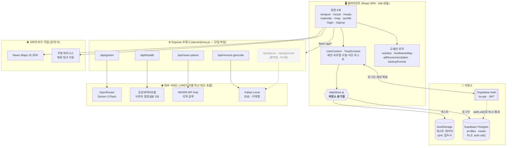

**핵심 규칙 3가지**

| 규칙 | 이유 |
|---|---|
| 비밀 키는 서버에만 | `OPENROUTER_API_KEY`·`FOODSAFETY_*`·`NAVER_SEARCH_*`·`KAKAO_REST_API_KEY`는 브라우저에 절대 안 나간다. `/api/*`는 오직 이걸 위해 존재한다 |
| `VITE_` 키는 공개 전제 | 지도 SDK 키와 Supabase anon key는 번들에 박힌다. 접근 제어는 키가 아니라 **RLS와 도메인 등록**이 한다 |
| 화면은 저장소를 모른다 | 게스트/로그인 분기는 `dataStore.js` 한 곳에만 있다 |

---

## 2. 저장소 분기 — 게스트 우선(guest-first) 설계

로그인은 **선택**이다. 로그인 없이도 모든 화면이 완전히 동작한다.

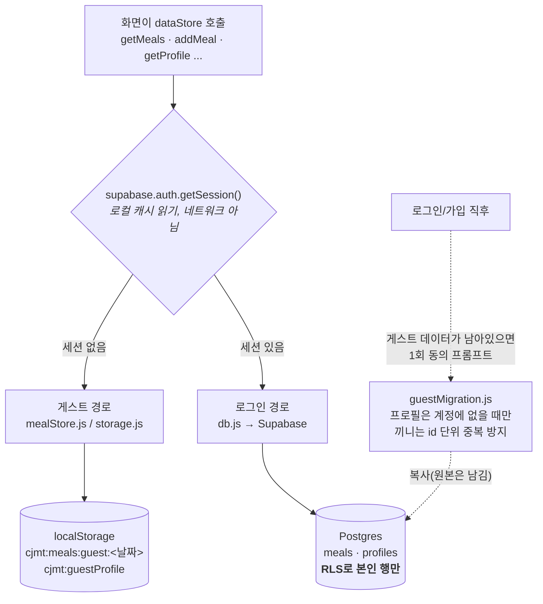

> **로컬에만 남는 것**: 달력의 수동 상태 표시(`dayStatus`), 카드 표시 설정(`cardSettings`), 광고 노출/클릭 집계(`adData`).
> 이들은 `effectiveUserId`(로그인=uid, 게스트=`'guest'`)로 키를 잡지만 **저장 위치는 항상 기기**다 → 3장 발견 4번 참고.

---

## 3. 핵심 흐름 — 사진 한 장이 영양 수치가 되기까지

이 앱에서 가장 복잡한 경로다. **AI는 "무엇을 얼마나"만 답하고, 실제 수치는 식약처 DB에서 온다.**

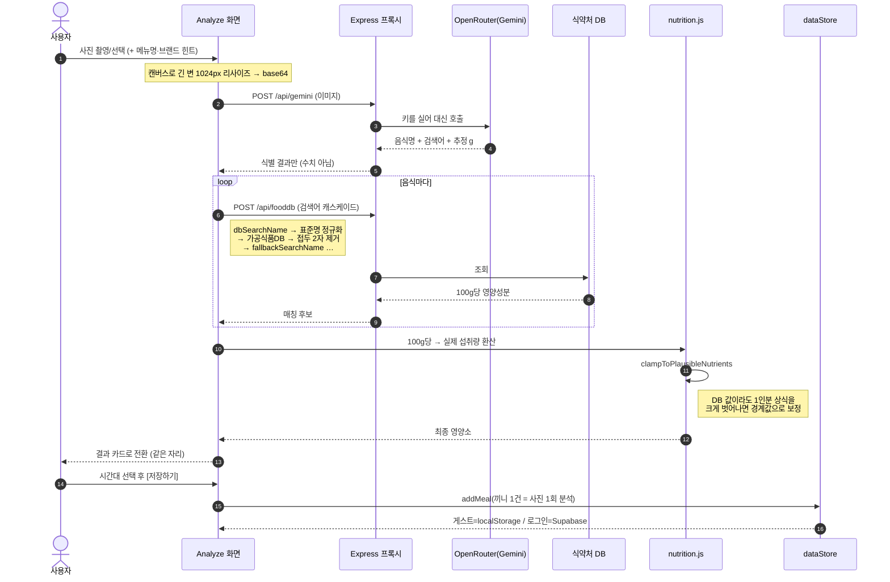

**분석 경로가 셋이라는 점에 주의** — 셋 다 같은 결과 카드/저장 흐름으로 합류한다.

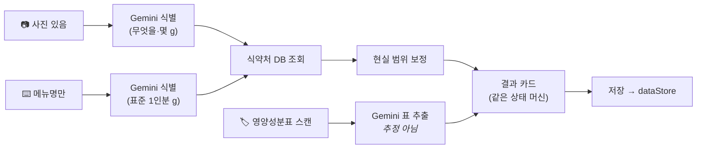

> 사진·텍스트 경로는 **같은 함수(`resolveFoodItem`)로 합류한다** — AI는 식별(검색명·그램)만 하고,
> 실제 수치는 둘 다 식약처 DB 캐스케이드에서 온다(실패 시에만 AI 추정치 폴백 + 현실 범위 보정).
> 같은 음식이면 사진으로 찍든 타이핑하든 같은 수치·같은 출처 배지가 나온다.

---

## 4. 인증 — 아이디/비밀번호를 Supabase Auth 위에 얹은 방식

```mermaid
flowchart LR
    subgraph ui["가입/로그인 화면"]
        id["아이디<br/>영문소문자+숫자 4~20"]
        pw["비밀번호<br/>8자+ 영문+숫자"]
        nick["닉네임"]
    end

    map["authId.js<br/><b>아이디 → 합성 이메일</b><br/>&lt;아이디&gt;@mealyze.app"]
    gt["Supabase Auth (GoTrue)<br/>bcrypt 해싱 · JWT 발급"]
    meta["user_metadata<br/>nickname · login_id"]
    rls["RLS: auth.uid()"]

    id --> map --> gt
    pw --> gt
    nick --> meta
    gt --> meta
    gt -->|"세션 → localStorage<br/>자동 로그인 유지"| rls

    lock["로그인 실패 5회 → 1분 잠금<br/><i>기기 로컬 카운터</i>"] -.->|"서버 레이트리밋 앞단"| gt
```

**왜 합성 이메일인가**: 이메일 컬럼의 UNIQUE 제약이 그대로 아이디 중복 방지가 되고, 비밀번호 해싱·세션·RLS를 **한 줄도 바꾸지 않고** 인증 수단만 교체할 수 있다. 이 도메인으로는 메일을 보내지도 받지도 않는다(Supabase에서 "Confirm email"을 반드시 꺼야 하는 이유).

---

## 5. 배포 토폴로지 — 한 코드베이스, 세 갈래

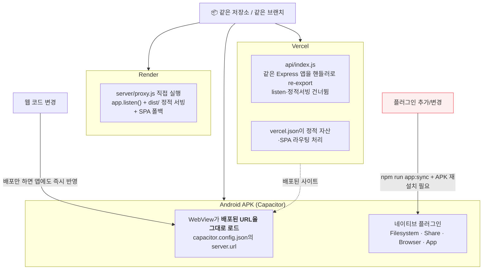

> `process.env.VERCEL` 유무로 같은 파일이 두 모드로 동작한다. **업데이트 채널이 둘**이라는 점이 함정 → 발견 5번

---

## 6. CSV 백업 — 내보내기 둘, 가져오기 하나

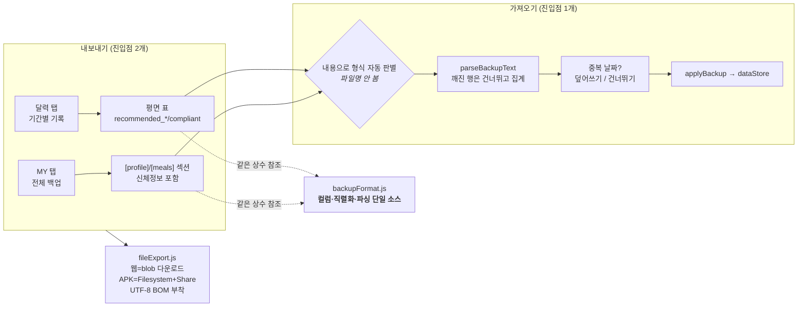

---

## 7. 광고 — 사용자별 개인화는 판정 단계에서 일어난다

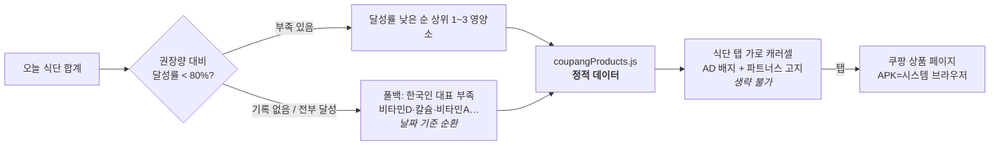

> **상품 카탈로그는 전 사용자가 공유**하고, 개인화는 "어떤 영양소가 부족한가" 판정에서만 일어난다.
> 쿠팡 검색 API는 계정 기준 **시간당 10회** 제한이라 런타임 호출이 불가능하기 때문 → [next-쿠팡API-자동추천-프롬프트.md](next-쿠팡API-자동추천-프롬프트.md)

---

## 8. 4주차 추가 — 학식·급식 / 직업 추천 / AI 식습관 분석

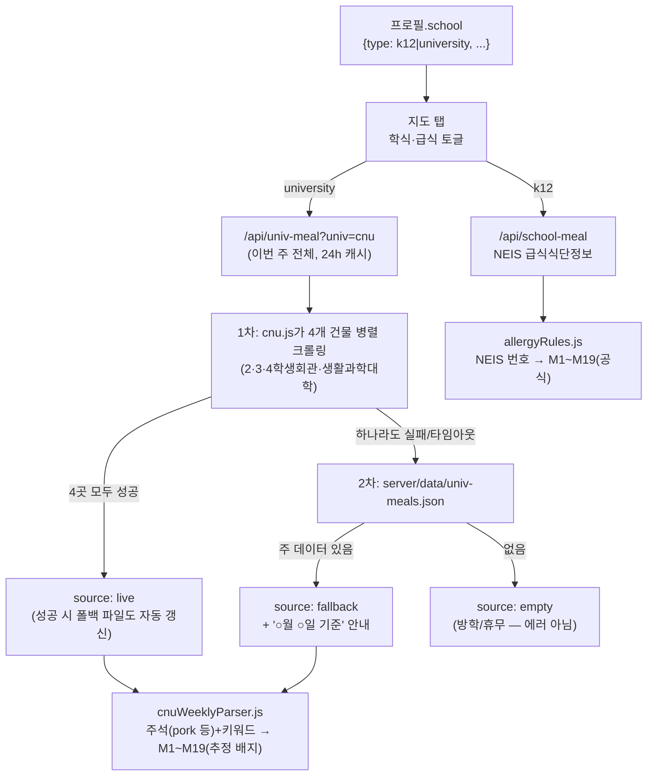

- **급식·학식 카드는 하나를 공유한다**(`MealCard.jsx`, 보강 Step 6) — 메뉴마다 알레르기 칩을 반복하지
  않고 메뉴명 옆 번호 위첨자(`src/lib/allergyDisplay.js`) + 카드 하단 범례 1줄로 축약해, 알레르기
  코드 통일(NEIS 공식 번호 ↔ 학식 키워드 추정, 둘 다 `allergyRules.js`의 M1~M19)의 이점이 표시
  레이어에서도 그대로 드러난다 — `estimated` 플래그로 배지만 다르게 그린다.
- **대학 학식은 5개 식당 × 주간 단위**(보강 Step 7)로 한 번에 받아온다 — 제1학생회관은 이 크롤링
  시스템에 실제 데이터가 없어(실측) 크롤링 대상에서 빼고 외부 안내 페이지 링크로 대체한다. 하이브리드
  판정은 `src/lib/cnuWeekFallback.js`의 순수 함수(`resolveCnuWeekResult`) 하나로 분리돼 있어, HTML
  파서(`src/lib/cnuWeeklyParser.js`)·크롤러(`server/univMealAdapters/cnu.js`)를 몰라도 테스트할 수
  있다. 화면은 이 주 전체를 한 번만 받아 날짜·식당·학생/직원 트랙 전환을 전부 클라이언트에서 처리한다
  (탭 클릭마다 서버를 다시 부르지 않는다).
- **직업 기반 추천**(`src/lib/occupationKeywords.js`)은 지도 탭에서 부족 영양소 추천과 **병렬로**
  돌아가는 완전히 별개의 검색이다 — 실패해도 서로 영향을 주지 않고, 지도에는 색이 다른 핀(빨강/파랑)
  으로 함께 표시된다(`NaverPlaceMap.jsx`). 직업 미설정이면 이 경로 자체가 아예 실행되지 않는다.
- **AI 식습관 분석**은 원본 끼니 기록을 절대 Gemini에 보내지 않는다 — `src/lib/dietSummary.js`가 만든
  집계 요약(일평균 칼로리·영양소별 달성률·자주 먹은 음식·과다/부족 항목)만 `/api/gemini`로 전달된다.
  같은 기간(7/30일) 분석은 하루 1회만 실제 호출하고(`dietAnalysisCache.js`, localStorage), 이후
  재방문·재클릭은 캐시만 보여준다 — 그래서 화면에 "다시 분석" 버튼이 없다.

---

## 9. 그림을 그리며 발견한 것 (다음 작업 후보)

다이어그램으로 옮겨 적으면서 **실제로 어긋나 있던 연결**들이다. 이번 작업에서는 코드를 고치지 않았고, 여기 기록만 남긴다.

### 🔴 1. 기간별 CSV의 `recommended_*`/`compliant`는 항상 빈칸이다

`csv.js`의 내보내기가 `dailyRecord.getRecord()`로 "그날의 권장량 스냅샷"을 읽는데, **그 스냅샷을 쓰는 유일한 함수 `dailyRecord.upsertMeal()`을 아무도 호출하지 않는다.**

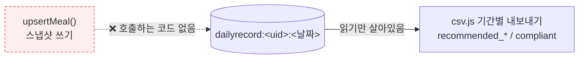

끼니 저장은 전부 `dataStore → mealStore/Supabase`로 가는데 이 스냅샷 경로만 옛 구조에 남았다. 결과적으로 신규 기록에서는 그 컬럼들이 **항상 빈 값으로 나간다**(파일 형식은 유효해 가져오기는 정상).
→ 선택지: ⓐ 컬럼을 내보내기에서 빼거나 ⓑ 저장 시점의 `effectiveRecommended`를 실제로 스냅샷하거나.

### 🟠 2. Kakao는 "롤백용"인데 키는 현역이다

`/api/places`·`/api/geocode`·`kakao.js`의 `searchPlaces`·`PlaceMap.jsx`·`useKakaoLoader.js`는 네이버 전환 후 아무 화면도 안 쓴다. 그런데 **`/api/reverse-geocode`(좌표→지역명)는 지금도 쓰여서** `KAKAO_REST_API_KEY`는 여전히 필수다. "롤백용 코드"와 "현역 기능"이 같은 키·같은 파일을 공유해, 롤백 코드를 지우려 해도 깔끔히 안 떨어진다.
→ 선택지: 역지오코딩을 네이버로 옮겨 Kakao 의존을 완전히 끊거나, 롤백 경로를 정식으로 폐기 선언.

### ✅ 3. ~~텍스트 분석은 식약처 DB를 안 탄다~~ (해소됨)

정확도 개선 작업에서 텍스트 경로를 사진 경로와 같은 구조(AI 식별 → `resolveFoodItem` 공유 →
식약처 DB 캐스케이드)로 재구성해 해소됐다. 같은 음식이면 두 경로의 수치·출처 배지가 일치한다.

### 🟡 4. 로그인해도 기기에 남는 설정이 있다

`dayStatus`(달력 수동 상태), `cardSettings`(표시할 영양소), `adData`(광고 집계)는 `effectiveUserId`로 키를 잡지만 저장 위치는 항상 localStorage다. 즉 **같은 계정으로 다른 기기에 로그인하면 이 설정들은 따라오지 않는다.** 식단·프로필은 동기화되는데 설정만 안 되니 사용자 기대와 어긋날 수 있다.

### 🟡 5. 업데이트 채널이 둘이다

APK가 원격 URL을 로드하므로 **웹 배포 = 앱 업데이트**지만, Capacitor 플러그인은 **APK 재설치**가 필요하다. 웹 코드가 새 플러그인을 쓰기 시작하면, 배포는 됐는데 구버전 APK에서만 깨지는 상태가 생긴다(3주차 CSV 저장이 정확히 이 형태였다).
→ 선택지: 네이티브 기능 호출부에 "플러그인 없음" 폴백을 두거나(현재 `fileExport`는 이미 폴백 있음), 앱 안에 최소 버전 안내.

### 🟡 6. 게스트 데이터는 기기 하나에 묶인다

게스트는 `GUEST_ID = 'guest'` 고정 버킷 하나뿐이라, 한 브라우저 = 한 게스트다. 기기 이동 수단은 CSV 백업뿐이고, **캐시를 지우면 복구 경로가 없다.** 의도된 설계지만 사용자에게는 그 사실이 MY 탭 안쪽에만 있다.

---

## 부록 — 화면과 데이터의 대응

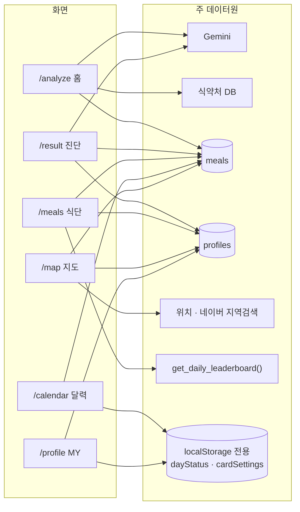

| 화면 | 하는 일 | 로그인 필요? |
|---|---|---|
| `/analyze` | 사진·메뉴명·라벨 분석 → 끼니 저장 | ❌ |
| `/result` | 오늘 부족 영양소 진단 + AI 보충 메뉴 추천 | ❌ |
| `/meals` | 오늘 섭취량, 국민평균 비교, 영양제 광고, 순위 | 순위만 ✅ |
| `/calendar` | 날짜별 기록·상태, 기간별 CSV 내보내기 | ❌ |
| `/map` | 부족 영양소 기반 주변 식당 추천 | ❌ |
| `/profile` | 신체정보, 표시 설정, CSV 백업/복원 | ❌ |
