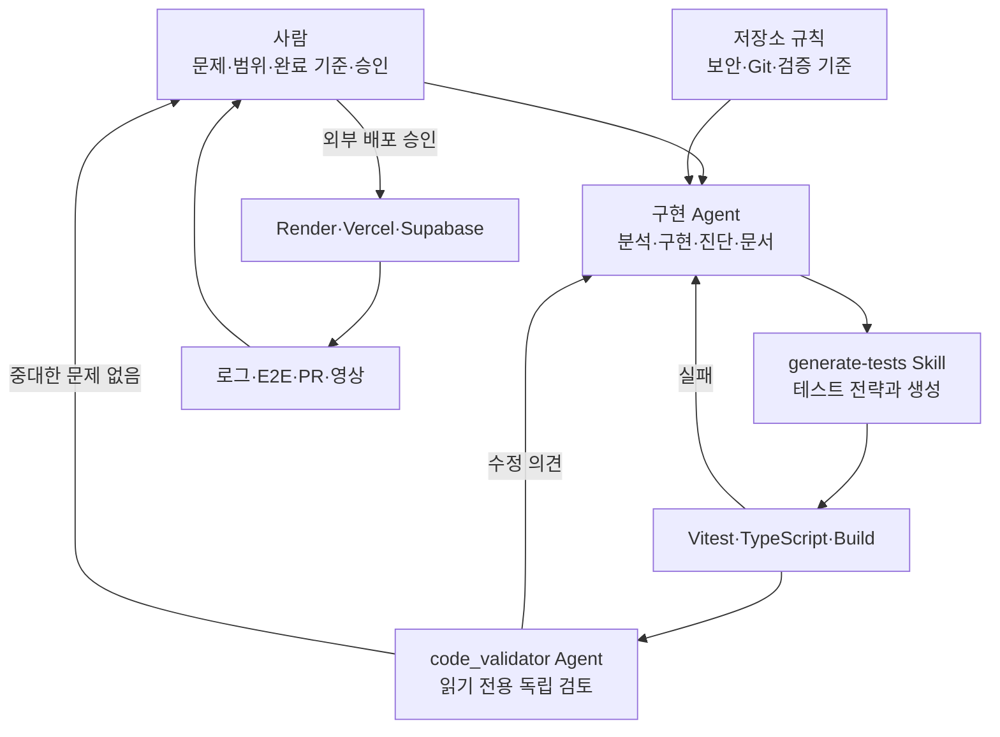

# Agent 협업 가이드

## Agent·Skill·규칙 문서 관계

## 4주간 협업 정리

| 자산                   | 사용 시점                 | 역할                                             | 사람이 확인한 기준             |
| ---------------------- | ------------------------- | ------------------------------------------------ | ------------------------------ |
| 구현 Agent             | 요구 분석부터 PR 준비까지 | 코드 탐색, 기능 구현, 오류 진단, 문서 동기화     | 실제 사용자 흐름과 diff        |
| `generate-tests` Skill | 기능 변경 직후            | Vitest/RTL/Supertest의 성공·실패·fallback 테스트 | 테스트가 요구사항을 검증하는지 |
| `code_validator` Agent | 품질 게이트 후            | 보안, 회귀, 데이터 손실, 누락 테스트 독립 검토   | 발견 사항 반영 여부            |
| 저장소 규칙·워크플로   | 모든 단계                 | 비밀정보 금지, 변경 보존, 검증·PR 기준 통일      | 체크리스트와 실행 증거         |
| 사람                   | 우선순위·실제 API·배포    | 범위 결정, 키/권한 관리, 화면·배포 최종 판정     | 데모 시나리오 전체 통과        |

협업은 “사람이 완료 기준 결정 → Agent가 작은 변경과 테스트를 제안·구현 → 자동
검증 → 독립 검토 → 사람이 실제 화면 판단”의 반복으로 운영했다. Agent 출력 자체가
완료 증거가 아니라 코드 diff, 테스트 결과, 배포 로그와 실제 DB 행을 증거로 삼는다.

## 데모 직전 체크

- [ ] Vercel 홈을 시크릿 창에서 열었다.
- [ ] Render `/health`가 `200`이다.
- [ ] 새 항목 저장 후 Supabase 최신 행을 확인했다.
- [ ] 카테고리 조회와 아카이브/복원이 동작한다.
- [ ] 데모용 텍스트, 예비 저장 항목과 발표 순서를 준비했다.
- [ ] 관계도를 발표 화면에서 읽을 수 있다.
- [ ] 영상 URL이 로그인 없이 재생되고 `demoVideoUrl`에 반영되었다.
- [ ] `demoUrl`, thumbnail, screenshots가 유효하다.
