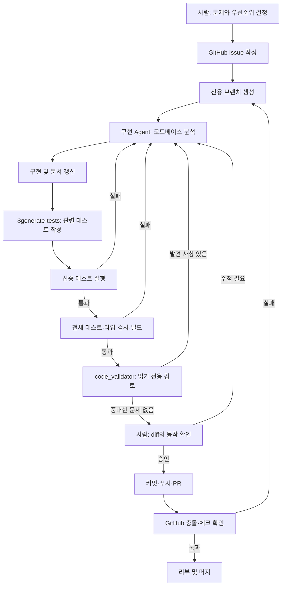

# AI 개발 워크플로

Later는 사람이 제품 방향과 완료 기준을 결정하고, AI Agent가 분석·구현·검증을
지원하는 방식으로 개발합니다. AI가 만든 결과도 코드, 테스트, 실행 결과를 근거로
사람이 최종 판단합니다.

## 전체 흐름



## 역할

### 사람

- 사용자 문제, 우선순위, 범위와 완료 기준을 결정합니다.
- 구현 결과를 실제 화면과 사용 시나리오로 확인합니다.
- AI의 제안과 검증 결과를 이해한 뒤 머지 여부를 결정합니다.
- API 키, 권한 확대, 외부 배포와 삭제 같은 중요한 작업을 승인합니다.

### 구현 Agent

- 저장소와 기존 변경을 먼저 조사합니다.
- 요구사항 범위 안에서 코드와 migration을 구현합니다.
- 오류를 재현하고 근거를 바탕으로 수정합니다.
- 구현되지 않은 기능이나 확인하지 않은 결과를 완료로 보고하지 않습니다.

### `$generate-tests` Skill

- 변경 유형에 맞는 Vitest, React Testing Library, Supertest 테스트를 선택합니다.
- 성공 흐름뿐 아니라 오류, fallback, 경계 조건과 상태 전환을 검증합니다.
- Supabase, Gemini, Storage와 외부 네트워크를 mock으로 격리합니다.

사용 예시:

```text
Use $generate-tests to add focused tests for the current Later code changes.
```

### `code_validator` Agent

- `.codex/agents/code-validator.toml`에 정의된 읽기 전용 Agent입니다.
- 정확성, 데이터 손실, 보안, 회귀와 테스트 누락을 우선 검토합니다.
- 코드를 수정하지 않고 심각도, 영향, 파일 위치와 근거를 보고합니다.

사용 예시:

```text
code_validator Agent를 사용해 현재 브랜치를 N046_김예진 브랜치와 비교 검토해줘.
```

## 단계별 절차

### 1. 이슈 작성

이슈 제목은 다음 형식을 사용합니다.

```text
[N046_김예진][P0|P1|P2] 작업 이름
```

본문에는 최소한 다음 항목을 작성합니다.

- 목표
- 작업 내용
- 완료 기준
- Parent 및 Previous 이슈

### 2. 브랜치 생성

한 이슈에는 한 기능 브랜치를 사용합니다.

```text
feature/<issue-number>-<short-description>
```

작업 전 `git status`와 대상 브랜치 최신 상태를 확인합니다. 선행 PR이 열려 있는
상태에서 후속 작업을 시작하면 PR 본문에 선행 관계를 명시합니다.

### 3. 구현

관련 화면, API, 타입, migration과 기존 테스트를 함께 읽습니다. 데이터 모델 변경은
DB migration, 서버 select 컬럼, 프론트엔드 타입을 한 흐름으로 수정합니다.

작업 중에는 다음 원칙을 지킵니다.

- 기존 사용자 변경을 덮어쓰지 않습니다.
- 비밀 키와 `.env` 실제 값은 커밋하지 않습니다.
- 외부 입력과 AI 응답을 신뢰하지 않고 검증합니다.
- 이미지 파일은 DB 본문이 아니라 Storage에 저장합니다.
- AI 장애가 핵심 저장 흐름 전체를 중단하지 않도록 fallback을 유지합니다.
- 삭제, 강제 push, 배포처럼 복구가 어려운 작업은 대상을 확인하고 승인받습니다.

### 4. 테스트와 검증

관련 테스트를 먼저 실행합니다.

```bash
npx vitest run path/to/changed.test.ts
```

관련 테스트가 통과하면 전체 품질 게이트를 실행합니다.

```bash
npm test
npx tsc --noEmit
npm run build
```

실패는 다음과 같이 분류합니다.

- 단언 실패: 요구사항, 구현 또는 테스트 기대값을 다시 확인합니다.
- 타입·빌드 실패: 런타임 경로와 타입 계약을 함께 수정합니다.
- 소켓·네트워크 권한 오류: 권한이 허용된 환경에서 재현한 뒤 코드 문제인지 판단합니다.
- 외부 API 실패: mock 테스트와 fallback을 확인하고 실제 호출 실패와 분리합니다.

### 5. 독립 검토

`code_validator` Agent에 대상 브랜치와 base를 명시합니다. 발견 사항이 있으면 구현
단계로 돌아가 수정하고 관련 테스트부터 다시 실행합니다. 발견 사항이 없어도 실행하지
못한 검증과 남은 위험을 기록합니다.

### 6. 커밋과 PR

커밋 전 다음을 확인합니다.

```bash
git diff --check
git status --short
git diff --stat
```

커밋 메시지는 작업 결과가 드러나는 명령형 Conventional Commit을 사용합니다.

```text
feat: add content archive and restore flow
docs: document AI development workflow
fix: preserve fallback when Gemini validation fails
```

PR에는 목표, 주요 변경, 검증 결과, migration이나 환경 설정, 선행 PR과
`Closes #<issue-number>`를 작성합니다. 생성 후 GitHub의 `mergeable`과
`mergeable_state`를 확인합니다.

## PR 전 체크리스트

- [ ] 이슈의 완료 기준을 모두 충족했다.
- [ ] 구현하지 않은 기능을 완료로 표현하지 않았다.
- [ ] migration과 애플리케이션 타입·쿼리가 일치한다.
- [ ] 중요한 성공·오류·fallback·상태 전환 테스트가 있다.
- [ ] `npm test`가 통과한다.
- [ ] `npx tsc --noEmit`이 통과한다.
- [ ] `npm run build`가 통과한다.
- [ ] `code_validator` 검토 결과를 확인했다.
- [ ] 비밀정보와 불필요한 생성 파일이 diff에 없다.
- [ ] PR이 대상 브랜치와 충돌 없이 mergeable 상태다.
