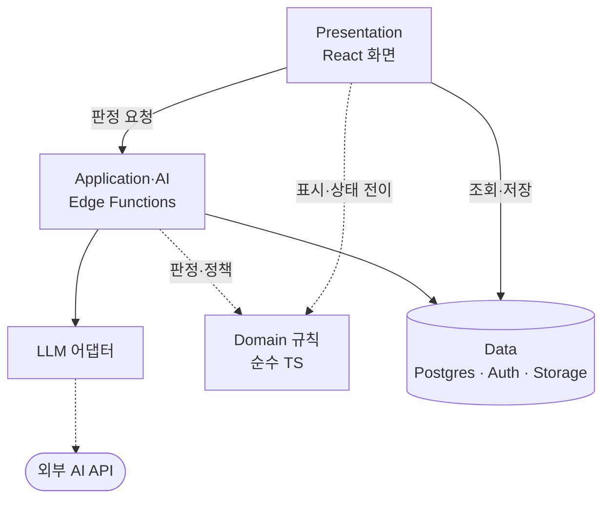

# ARCHITECTURE

**이 문서의 역할**: 계층 경계와 데이터 흐름 — 왜 이 구조인가. 기능 사양은 `PRD.md`, 파일 위치는 `CODE_MAP.md`, 화면 표현은 `UI_GUIDE.md`, 금지 표현은 `GOTCHAS.md`, 결정의 근거와 기각한 대안은 `ADR.md`에 있다. 여기서 그것들을 다시 쓰지 않는다.

## 계층 구조

생산 스택은 `ADR.md`의 ADR-0002로 확정됐다. 계층은 4개이고, 각 계층은 한 가지 책임만 진다. 실제 폴더와 파일 경로는 `CODE_MAP.md`에 있다.

| 계층 | 스택 | 책임 | 하지 않는 일 |
|---|---|---|---|
| Presentation | React + TypeScript + Vite | 화면, 폼, 상태 표시, 사장님 선택 수집 | 유형·위험도 판정, LLM 호출 |
| Application·AI | Supabase Edge Functions (Deno) | 판정 요청 처리, LLM 호출, 정책 검사, 저장 | 화면 상태 관리 |
| Domain 규칙 | 순수 TypeScript | 결정적 판정 — 분류 엣지 케이스, 금칙 정책, 문의 항목 매칭, 인사이트 임계값, 만료 이벤트 제외 | I/O, 네트워크, 런타임 전역 접근 |
| Data | Supabase (로컬 CLI + Docker) | Postgres + RLS, Auth, Storage | 도메인 판단 |

도메인 모델은 `Store`, `Review`, `ReplyDraft`, `StoreProfile`, `ResponseCase`, `AnalysisReport` 6개다.

## 의존 방향

실선은 호출, 점선은 import다. **반대 방향 화살표는 없다.** Domain 규칙은 어느 계층도 부르지 않고, Data는 화면을 모른다.

- 화면이 import하는 도메인 모듈은 표시와 상태 전이에 필요한 것뿐이다. 분류·위험도 규칙은 판정 경로에 있으므로 화면이 직접 들고 있지 않는다.
- 화면은 Edge Function을 개별 화면에서 흩어 부르지 않고 단일 호출 모듈(`frontend/src/shared/ai.ts`)을 거친다. 호출 지점이 흩어지면 로딩·실패·"확인 필요" 처리가 화면마다 달라진다.

## 판정 경로

분류·답글 초안·위험도는 모두 같은 6단계를 지난다. 무엇을 AI가 판정하고 무엇을 규칙이 판정하는지는 `PRD.md` 6.2가 기준이고, 여기서는 그 둘이 **어떤 순서로 맞물리는지**만 정한다.

| # | 단계 | 어디서 | 실패하면 |
|---|---|---|---|
| 1 | 판정 요청 | 화면 → 단일 호출 모듈 → Edge Function | 화면에 실패를 드러낸다. 조용히 삼키지 않는다 |
| 2 | LLM 호출 | LLM 어댑터 (공급자 선택·타임아웃·재시도 상한) | 3단계를 건너뛰고 4단계로 |
| 3 | 구조화 출력 스키마 검증 | Edge Function | 출력을 버리고 4단계로 |
| 4 | 규칙 fallback | Domain 규칙 모듈 | — (여기가 바닥이다) |
| 5 | 정책 검사 | Domain 규칙 모듈 | 재생성하거나 "확인 필요"로 넘긴다 |
| 6 | 저장 | Data | 저장하지 않는다 |

- **LLM이 1순위이고 규칙은 fallback이다.** 규칙 엔진은 지우지 않지만 판정의 기본 경로도 아니다.
- **실패는 아래로만 흐른다**: LLM → 규칙 → "확인 필요". 어느 단계도 실패를 성공으로 승격하지 않는다. 그래서 이 구조의 최악은 "사장님이 직접 확인해야 함"이지 "틀린 답글이 저장됨"이 아니다.
- 5단계는 LLM이 쓴 문장이든 규칙이 만든 문장이든 똑같이 거친다. 출처에 따라 검사를 건너뛰는 경로를 만들지 않는다.

## 신뢰 경계

경계는 셋이고, 각 경계에서 신뢰하지 않는 대상이 다르다.

| 경계 | 바깥 | 안에서 신뢰하지 않는 것 |
|---|---|---|
| 브라우저 ↔ Supabase | 브라우저 | 클라이언트가 보낸 소유권 값. 매장 식별자는 요청 본문이 아니라 세션에서 파생한다 |
| Edge Function ↔ 외부 AI API | 외부 API | LLM 출력. 스키마 검증과 정책 검사를 통과하기 전에는 저장도 표시도 하지 않는다 |
| 시스템 ↔ 리뷰 본문 | 리뷰 작성자 | 본문의 내용. 리뷰 본문은 **데이터이지 지시가 아니다** — 본문에 적힌 문장이 분류·판정을 바꾸면 안 된다 |

- LLM 호출부는 `supabase/functions/_shared/llm/` 어댑터 뒤에만 존재한다. 프론트에서 이 모듈에 닿는 import 경로가 없다는 것이 "LLM은 Edge에서만"의 기술적 정의다. 정책 문장이 아니라 확인 가능한 사실이어야 한다.
- 외부 AI API로 나가는 것은 판정에 필요한 리뷰 정보와 매장 프로필뿐이다. 증거 파일과 계정 자격증명은 이 경계를 넘지 않는다.
- Edge Function은 요청한 사장님의 권한으로 DB에 접근한다. RLS를 우회하는 관리자 키 경로를 만들면 격리가 함수 하나에서 통째로 뚫린다.

## 규칙의 단일 출처

- **결정적 규칙은 저장소에 한 벌만 둔다.** 같은 규칙의 두 번째 사본을 만들지 않는다.
- 규칙 모듈은 런타임 중립이다. React도, Supabase 클라이언트도, Deno 전역도 import하지 않는다. 그래야 Edge(Deno)·화면(브라우저)·테스트(Node)에서 같은 코드가 돈다. 이 제약이 "LLM·DB 없이 단위 테스트 가능"의 전제다.
- 사본이 갈라져도 한쪽이 호출되지 않는 동안에는 드러나지 않는다. 배선이 붙는 순간 같은 리뷰가 화면과 서버에서 다르게 분류된다. 사본 금지는 정리 취향이 아니라 이 사고를 막는 규칙이다.
- 금칙 검사는 LLM 프롬프트가 아니라 이 모듈이 한다. 프롬프트로 부탁한 정책은 우회되지만, 통과해야 저장되는 검사는 우회되지 않는다.

## 도메인 모델 경계

- `Store`가 최상위 소유자다. 계정 1개에 `Store` 1개가 붙고, 나머지 모델은 모두 `Store`에 매인다.
- `Review` 1건에 `ReplyDraft` 1건이 대응한다. 악성 의심으로 판정되면 초안 대신 `ResponseCase`가 생긴다.
- `Store`를 벗어나 조회하는 경로는 만들지 않는다. 이것이 매장 격리의 기술적 정의다.
- 플랫폼은 경계가 아니라 `Review`의 속성이다. 그래서 채널별 어댑터 계층이 필요 없다.

## 저장하는 것과 파생하는 것

| 구분 | 대상 |
|---|---|
| 저장 | 리뷰 원본, 매장 프로필, 답글 초안, 사건 기록과 증거 파일 |
| 파생 | 분석 리포트, AI 인사이트, 홈의 통계 카드와 처리 큐 — 조회 시점에 리뷰 집합에서 계산 |
| 저장하지 않음 | 플랫폼 자격증명, 정책 검사를 통과하지 않은 LLM 원문, 작성자 신원 |

파생물을 저장하면 두 가지가 따라온다. 원본 리뷰가 수정·삭제될 때 수치가 어긋나고, 파기해야 할 대상이 하나 더 늘어난다.

## 의존 관계 원칙

- **화면은 규칙을 소유하지 않는다.** 화면은 판정 결과를 표시하고 사장님의 선택을 받는다. 판정을 화면에 두면 규칙이 두 벌이 되고, 그 다음 순서는 위의 "규칙의 단일 출처"에 적힌 사고다.
- 답글 상태는 화면 조작의 부산물이 아니라 도메인 전이의 결과다. 화면은 "완료로 표시" 같은 사건을 보내고, 어떤 상태로 갈지는 도메인이 정한다.
- 매장 격리 규칙은 RLS에 있고 화면과 함수는 그 위에서 돈다. 조회 경로가 하나 늘 때마다 조건문을 덧붙여야 하는 구조로 만들지 않는다.
- 제품 안에 외부 플랫폼을 향해 나가는 쓰기 경로가 없다. 아웃바운드는 클립보드뿐이다.
- 파기는 실제 삭제 경로다. 화면에서 숨기는 플래그로 대체하지 않고, DB 행과 Storage 파일을 함께 지운다.
- AI 공급자 교체는 어댑터 안에서 끝나야 한다. 교체할 때 Edge Function 본문이나 화면이 바뀐다면 경계가 잘못 그어진 것이다.

## 남은 결정

- **LLM 공급자 확정.** 지금 정해진 것은 실행 방식까지다 — 공급자는 `LLM_PROVIDER`로 주입하고, `fake`를 기본값으로 둬 네트워크 없이 전체 루프가 돌아야 한다. 공급자를 확정하면 `ADR.md` 작성 기준("교체 비용이 큰 결정")에 따라 ADR을 남긴다.
- **배포 방식** (ADR-0002 후속 작업)

확정된 결정과 그 근거, 기각된 대안은 `ADR.md`에 있다.
