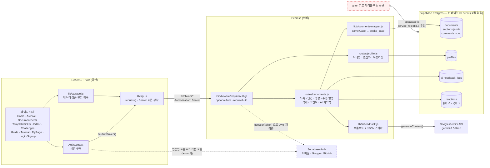
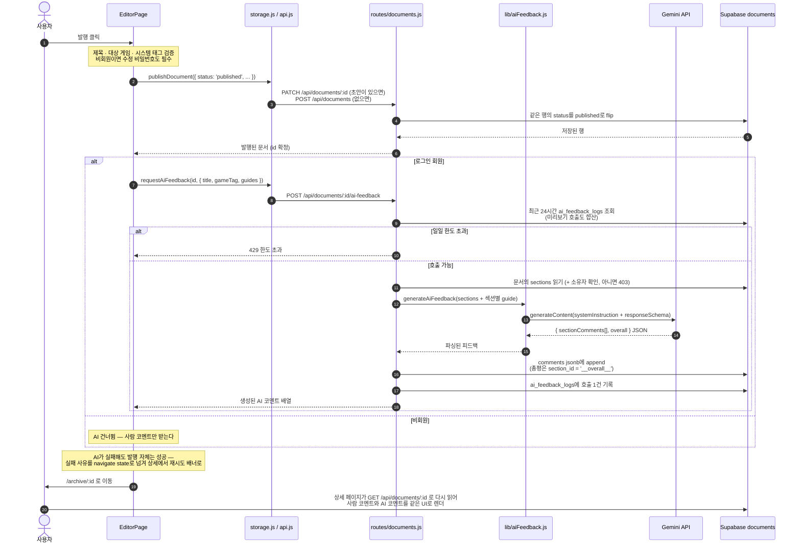
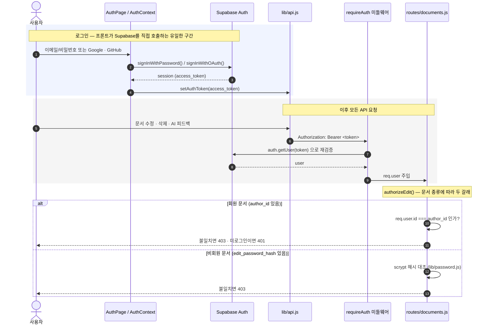

# 아키텍처 — 화면 · 서버 · DB 데이터 흐름

역기획소(respec)의 전체 구조와 주요 데이터 흐름을 그림으로 정리한 문서다. 다이어그램은 [Mermaid](https://mermaid.js.org/)로 작성했다 — 텍스트라서 코드가 바뀌면 diff로 추적되고, GitHub·VSCode가 그림으로 렌더링한다.

> 2주차 시점의 간이 다이어그램은 [`PRESENTATION-week2.md`](./PRESENTATION-week2.md#3-아키텍처--데이터가-흐르는-길)에 그대로 보존되어 있다. 이 문서는 인증(Supabase Auth)과 AI 자동 피드백(Gemini)이 들어온 3주차 이후 기준이다.

## 1. 전체 구조

**읽는 법 네 가지:**

1. **데이터 창구는 하나다.** 모든 화면은 [`lib/storage.js`](../frontend/src/lib/storage.js) → [`lib/api.js`](../frontend/src/lib/api.js)의 `request()`만 통과한다. 프론트가 Supabase 데이터를 직접 부르는 곳은 없다. 그래서 2주차에 localStorage → REST API로 갈아탈 때 화면 코드는 거의 손대지 않았고, 앞으로 저장소가 또 바뀌어도 교체 지점은 이 파일 하나다.
2. **점선이 유일한 예외다.** 인증만 프론트가 Supabase Auth를 직접 호출한다([`lib/supabaseClient.js`](../frontend/src/lib/supabaseClient.js) · anon 키). 백엔드를 거치면 비밀번호를 서버가 중계해야 하고 OAuth 리다이렉트도 서버가 떠안게 되므로, 이 한 경로만 예외로 뒀다. 대신 발급된 access token은 `AuthContext`가 `setAuthToken()`으로 `api.js`에 흘려보내고, 이후 서버는 그 JWT를 **다시 검증**한다.
3. **LLM 키는 서버 안쪽에만 있다.** `GEMINI_API_KEY`는 `backend/.env`에만 존재하고, 프론트 번들에는 어떤 형태로도 들어가지 않는다. 화면은 항상 `/api/documents/:id/ai-feedback`을 통해서만 AI 결과를 받는다.
4. **DB로 가는 문은 백엔드 하나다.** 모든 테이블에 RLS를 켜되 정책은 하나도 두지 않았다([`schema.sql`](../backend/db/schema.sql)). anon 키는 프론트 번들에 그대로 실려 공개되므로, 정책이 없으면 그 키만으로 PostgREST에서 테이블을 통째로 읽고 쓸 수 있다. 백엔드는 `service_role`로 RLS를 우회하므로 정상 동작하고, 그 외 경로는 전부 막힌다.

## 2. 발행 → AI 자동 피드백

에디터에서 "발행"을 누른 순간부터 상세 페이지에 AI 총평이 뜨기까지의 흐름이다. ([`EditorPage.jsx:291-348`](../frontend/src/pages/EditorPage.jsx#L291-L348))

**설계 의도:**

- **발행은 새 행을 만들지 않는다.** 초안 행의 `status`를 `published`로 뒤집는다. 그래야 작성 중 달린 코멘트와 `created_at`이 보존된다.
- **AI 코멘트는 서버가 직접 append 한다.** 프론트가 받아서 다시 저장하는 경로였다면 중복 저장이나 유실이 생긴다. 나아가 `toDbRow()`는 클라이언트가 보낸 `comments`를 **아예 받지 않는다** — 받아주면 재발행 한 번에 그동안 쌓인 피드백이 지워진다(§4-3).
- **AI 코멘트와 사람 코멘트는 같은 자료구조다.** `is_ai` 플래그만 다르다. 덕분에 상세 페이지는 렌더 로직을 하나만 갖는다.
- **섹션별 `guide`를 함께 보낸다.** 그 섹션이 무엇을 다뤄야 하는지를 모델에게 알려주지 않으면 어느 문서에나 붙는 뻔한 코멘트가 나온다. `responseSchema`로 출력 구조까지 강제한다.

## 3. 인증과 수정 권한

- 프론트가 받은 토큰을 서버가 **그대로 믿지 않고** `auth.getUser(token)`으로 다시 검증한다([`requireAuth.js`](../backend/src/middleware/requireAuth.js)).
- 문서 소유자(`author_id`)는 **서버가 주입한다.** 클라이언트가 보낸 `author_id`는 [`documents-mapper.js:40-57`](../backend/src/lib/documents-mapper.js#L40-L57)의 `toDbRow()`가 아예 받지 않는다.
- 비회원도 글을 쓸 수 있게 하되, 아무나 수정하지 못하도록 scrypt 해시된 "수정용 비밀번호"를 건다. 해시 자체는 API 응답에 절대 나가지 않고 `hasEditPassword` 불리언 힌트만 나간다.
- 라우트별 인증 요구:

  | 라우트                                    | 인증                           | 비고                                             |
  | ----------------------------------------- | ------------------------------ | ------------------------------------------------ |
  | `GET /api/documents`                      | optionalAuth                   | 초안은 항상 소유자 스코프, 그 외엔 발행분만      |
  | `GET /api/documents/:id`                  | optionalAuth                   | 발행분은 공개, 초안은 소유자/비번만 (아니면 404) |
  | `POST /api/documents`                     | optionalAuth                   | 로그인 시 회원 문서, 아니면 비번 문서            |
  | `PATCH · DELETE /api/documents/:id`       | optionalAuth + `authorizeEdit` | 소유자 또는 비번                                 |
  | `POST /api/documents/:id/comments`        | optionalAuth                   | 작성자명·`is_ai`는 서버가 결정                   |
  | `POST /api/documents/:id/ai-feedback`     | requireAuth                    | 본인 문서만 · 일일 한도                          |
  | `POST /api/documents/ai-feedback/preview` | requireAuth                    | 저장은 안 하지만 같은 한도에 합산                |
  | `GET /api/documents/:id/reactions`        | optionalAuth                   | 카운트는 공개, 내 반응 여부는 로그인 시          |
  | `POST /api/documents/:id/reactions`       | requireAuth                    | 좋아요·북마크 토글                               |
  | `POST /api/documents/:id/verify-edit`     | 없음                           | 비번 대조 자체가 인증이다                        |
  | `GET · PATCH /api/profile`                | requireAuth                    |                                                  |

  > 이 표를 처음 채우던 날 `POST /:id/comments` 칸만 비어 있었다. 그 빈칸에서 출발한 수정이 아래 §4다.

## 4. 그림이 잡아낸 것 — 발견과 조치

이 문서를 처음 쓴 날, 위 §3의 인증 표를 채우다 **`POST /:id/comments` 칸만 비어 있는 것**을 봤다. 코드를 순서대로 읽을 때는 보이지 않던 구멍이었다. 라우트를 한 줄씩 나열해 같은 축으로 정렬하니 빠진 칸이 그냥 눈에 띄었다.

그 한 칸을 메꾸러 들어갔다가 같은 성격의 문제 — **"클라이언트가 보낸 값을 서버가 그대로 믿는다"** — 를 몇 군데 더 찾았다. 아래 7건은 전부 조치를 마쳤고, 회귀 테스트로 잠갔다.

### (1) 코멘트를 AI 코멘트로 위장할 수 있었다 ✅

**발견** — `POST /:id/comments`만 미들웨어 없이 열려 있었다. `author`는 클라이언트가 보낸 문자열이 그대로 저장됐고(프론트는 `'나 (데모)'`를 하드코딩해 보내고 있었다), `isAi: true`를 실어 보내면 사람이 쓴 글이 **AI 피드백 배지를 달고** 표시됐다. 이 서비스는 "AI 피드백"이 핵심 기능이라 그 라벨의 신뢰가 곧 제품의 신뢰다.

**왜 놓쳤나** — 코멘트는 "읽기처럼 가벼운 쓰기"로 취급했다. 문서 CRUD에는 처음부터 권한을 걸었지만 코멘트는 부가 기능이라 생각해 그냥 열어뒀다.

**조치** — `optionalAuth` 추가. `author`는 서버가 `resolveAuthorName()`으로 정하고(로그인 시 프로필 닉네임, 아니면 `'익명'`), `is_ai`는 클라이언트 입력을 아예 읽지 않고 **항상 `false`로 하드코딩**한다. AI 코멘트는 AI 라우트만 만들 수 있다. ([`documents.js`](../backend/src/routes/documents.js) `POST /:id/comments`)

### (2) 남의 초안이 목록과 단건 조회로 새어나갔다 ✅

**발견** — (1)을 고치며 조회 라우트를 다시 보다 찾았다. `GET /api/documents?status=draft`는 `mine=true`가 없으면 **모든 사용자의 초안**을 돌려줬고, `GET /:id`에는 인증이 아예 없어 UUID만 알면 남의 미완성 초안을 열 수 있었다. 역기획서 초안은 공개 전의 습작이라 유출되면 곤란하다.

**조치** — 목록은 `status === 'draft'`거나 `mine=true`면 **항상 소유자 스코프**로 강제하고, `status`를 생략해도 발행분만 나가게 했다. 단건은 `optionalAuth`를 붙여 남의 회원 초안은 **404로 존재 자체를 숨기고**(403은 "있긴 하다"를 알려준다), 비회원 초안은 `x-edit-password` 헤더가 맞아야 열린다.

### (3) 문서를 고쳐 재발행하면 코멘트와 좋아요가 지워졌다 ✅

**발견** — `toDbRow()`가 클라이언트의 `comments`·`likes`·`bookmarks`를 그대로 받아 쓰고 있었다. 에디터는 발행 요청에 `comments: []`, `likes: 0`을 실어 보낸다. 즉 **이미 코멘트가 달린 문서를 수정해 재발행하면 그동안 받은 피드백이 전부 사라졌다.** 권한 문제가 아니라 데이터 손실이다.

**조치** — `toDbRow()`에서 세 필드를 받지 않는다. 코멘트는 코멘트 엔드포인트가, 카운트는 `syncReactionCounts()`가 서버에서만 관리한다. 클라이언트 → DB 방향의 코멘트 매퍼(`mapCommentToDb`)는 삭제했다. ([`documents-mapper.js`](../backend/src/lib/documents-mapper.js))

### (4) anon 키만으로 DB에 직접 접근할 수 있었다 ✅

**발견** — 다이어그램에서 "프론트 → Supabase" 점선을 그리다 물었다. _저 anon 키로 Auth 말고 다른 것도 되나?_ 됐다. 테이블에 RLS가 꺼져 있어서, 번들에 공개된 anon 키만으로 PostgREST를 통해 `documents`를 통째로 읽고 쓸 수 있었다. 백엔드에 아무리 권한 검사를 붙여도 **옆문이 열려 있으면 의미가 없다.**

**조치** — `documents`·`profiles`·`ai_feedback_logs`·`reactions` 전부 RLS를 켜되 **정책은 하나도 만들지 않았다.** 백엔드는 `service_role`이라 RLS를 우회하므로 그대로 동작하고, 그 외 경로는 전부 막힌다. ([`schema.sql`](../backend/db/schema.sql))

### (5) 미리보기로 AI 일일 제한을 우회할 수 있었다 ✅

**발견** — `/ai-feedback/preview`는 Gemini를 실제로 호출하면서 `ai_feedback_logs`에 기록하지 않았다. "저장을 안 하니 세지 않는다"는 판단이었는데, **비용이 드는 건 저장이 아니라 호출**이다. 에디터의 미리보기 버튼만 반복해 누르면 한도가 무의미했다.

**조치** — `isAiLimitExceeded()` 헬퍼를 뽑아 발행 피드백과 미리보기가 **같은 한도를 공유**하게 했다. 미리보기도 로그에 기록한다. 대신 한도를 5 → 10으로 올려 정상 사용을 막지 않는다. 덤으로 `POST /:id/ai-feedback`에 소유자 검사를 추가해 **남의 문서에 AI 코멘트를 붙이는 것**도 막았다.

### (6) AI 피드백 실패가 조용히 사라졌다 ✅

**발견** — 발행 후 AI 호출이 실패하면 `catch {}`로 삼키고 상세 페이지로 넘어갔다. 발행 자체는 살리려는 의도였지만, 사용자는 **AI 총평이 왜 없는지 알 수 없었다.** 한도 초과인지 일시 오류인지도 구분되지 않았다.

**조치** — 에디터가 실패 사유를 `navigate` state로 넘기고, 상세 페이지가 `aiError` 배너와 **재시도 버튼**을 띄운다(`retryAiFeedback`). 성공하면 문서를 다시 읽어 총평을 채운다. ([`DocumentDetailPage.jsx`](../frontend/src/pages/DocumentDetailPage.jsx))

### (7) 프론트의 Supabase 직접 호출이 인증 하나뿐인 건 의도된 설계다 ✓

이건 문제가 아니라 확인이었다. 그림에서 점선이 하나뿐이라는 게 "프론트는 Supabase 데이터를 직접 부르지 않는다"는 규칙이 실제로 지켜지고 있다는 증거다. 앞으로 이미지 업로드(Supabase Storage)를 붙일 때 점선이 하나 더 생기려 할 텐데 — **업로드는 백엔드가 서명 URL을 발급하는 방식으로 가고, 점선은 늘리지 않는다.**

### 회귀 테스트

고친 것이 다시 열리지 않도록 [`documents.auth.test.js`](../backend/src/routes/documents.auth.test.js)에 테스트를 추가했다. 백엔드 전체 21건 통과.

| 잠근 것     | 테스트                                                                                                                                                  |
| ----------- | ------------------------------------------------------------------------------------------------------------------------------------------------------- |
| 코멘트 위조 | `isAi=true`를 보내도 사람 코멘트로 저장한다                                                                                                             |
| 초안 유출   | 비로그인 `status=draft`는 빈 배열 / `status` 없이 호출해도 발행분만 / 남의 회원 초안은 404 / 비회원 초안은 비번이 맞아야 열림 / 발행 문서는 누구나 열람 |
| 재발행 손실 | 클라이언트가 보낸 `comments`·`likes`·`bookmarks`는 무시한다 / 섹션의 `guideKey`는 보존한다                                                              |
| AI 권한     | 남의 문서에는 AI 코멘트를 붙일 수 없다 (403)                                                                                                            |

## 5. 남은 것

**`comments` JSONB의 동시 쓰기 유실** — 코멘트 추가는 문서 행 전체를 읽고 배열에 붙여 다시 쓰는 read-modify-write다. 두 사람이 같은 문서에 동시에 코멘트를 달면 뒤에 쓴 쪽이 앞의 것을 덮어쓴다. 위 7건과 달리 이건 스키마를 바꿔야 해서 미뤘다.

[`data-model.md`](./data-model.md)에 이미 "**다른 사람이 코멘트를 쓸 때** 테이블로 분리한다"는 조건을 적어뒀고, 사람 코멘트 + AI 코멘트가 들어온 지금 그 조건이 충족됐다. 알림("내 문서에 새 코멘트")·마이페이지("내가 쓴 코멘트")도 분리가 선행되어야 만들 수 있다. → [`BACKLOG.md`](./BACKLOG.md)
