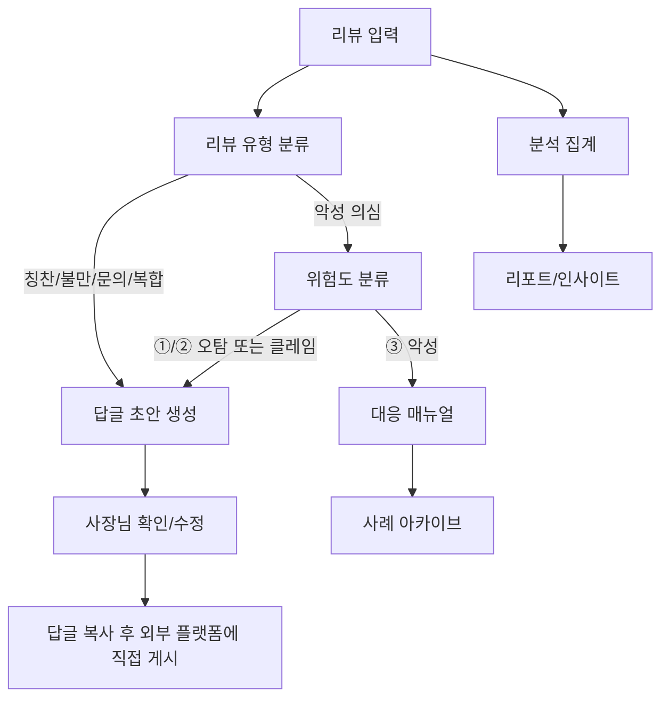

# ARCHITECTURE

## 목적

리뷰지기는 소상공인 사장님이 리뷰 입력부터 답글 작성, 분석, 악성 리뷰 대응까지 한 화면 흐름 안에서 처리하도록 돕는 AI 에이전트다.

현재 저장소는 제품 구현 전 단계의 정적 프로토타입이다. 이 문서는 앞으로 실제 앱을 만들 때 유지해야 할 도메인 경계와 데이터 흐름을 정의한다.

## 현재 구조

```text
.
├─ docs/                        # PRD, 도메인·UI·검증·ADR 기준
├─ HARNESS/                     # 개발 Phase 실행·검증·실패 증거 계층
├─ prototype/index.html          # 7개 화면을 담은 정적 프로토타입
└─ prototype/styles.css          # 디자인 시스템, 레이아웃, :target 화면 전환
```

현재 구현은 외부 라이브러리, JavaScript, 서버, DB, 실제 AI 호출을 사용하지 않는다.

`HARNESS/`는 배포되는 제품 런타임이 아니다. PRD를 읽는 Worker, 독립 Verifier와 Controller를 분리해 기능 단위 Phase(`00` 공통 기반부터 `06` MVP 통합 검증까지)를 실행하고, 각 Attempt·Failure·승인·checkpoint 증거를 서명해 남기는 개발 제어면이다. 하네스 준비 완료를 제품 구현 완료로 간주하지 않는다.

## 목표 MVP 구조

생산 스택은 `docs/adr/ADR-0002-생산-스택.md`로 확정됐다: React + TypeScript + Vite 프론트엔드 / Supabase 백엔드(로컬 CLI + Docker). 다음 계층 경계를 유지한다.

```text
Presentation — React + TypeScript + Vite (frontend/src/features/<기능>)
  └─ 화면, 폼, 상태 배지, 사용자 흐름

Application·AI — Supabase Edge Functions (supabase/functions/)
  ├─ classify-review   # 리뷰 유형 분류
  ├─ generate-reply    # 답글 초안 생성
  ├─ assess-risk       # 블랙컨슈머 위험도 판정
  └─ LLM 호출과 API 키는 여기에만 존재한다 (브라우저 금지)

Domain 규칙 — 순수 TypeScript 모듈 (LLM·DB 없이 Vitest로 검증)
  ├─ 분류 엣지 케이스 규칙, 금칙 정책, 인사이트 감지, 만료 이벤트 제외
  └─ Review, ReplyDraft, StoreProfile, AnalysisReport, ResponseCase 모델

Data — Supabase (로컬 CLI + Docker)
  ├─ Postgres + RLS(매장 소유권 강제, supabase/migrations의 SQL만으로 변경)
  ├─ Auth (이메일 로그인)
  └─ Storage (블랙컨슈머 증거 파일, RLS 적용)
```

## 핵심 도메인 기능

### 리뷰 입력

- 한 건 입력과 일괄 붙여넣기를 모두 지원한다.
- MVP에서는 사용자가 직접 복사한 리뷰만 받는다.
- 닉네임은 반복 악성 고객 추적에 필요하지만, 개인정보 최소 수집 원칙에 따라 선택값으로 둔다.

### 리뷰 유형 분류

- 입력: 리뷰 본문, 별점, 주문 메뉴, 플랫폼, 작성일, 닉네임
- 출력: 유형 1개, 세부 카테고리, 분류 근거, 확인 필요 여부
- 유형: 칭찬, 불만, 문의, 악성 의심
- 복합 리뷰는 기본적으로 불만으로 분류하고 복합 플래그를 둔다.

### 답글 초안 생성

- 매장 프로필을 유일한 정보 출처로 사용한다.
- 악성 의심 리뷰에는 초안을 만들지 않고 대응 센터로 연결한다.
- 금칙 표현, 보상 약속, 확인되지 않은 사실, 법적 위협 표현을 차단한다.

### 분석 리포트

- 누적 리뷰 10건 미만이면 콜드 스타트 안내를 보여준다.
- 10건 이상이면 반응 비율, 별점 추이, 카테고리 언급량, 메뉴별 키워드, AI 인사이트를 제공한다.

### 블랙컨슈머 대응

- 위험도 ① 단순 불만, ② 정당한 클레임, ③ 악성으로 분류한다.
- ①·②는 일반 답글 흐름으로 복귀할 수 있어야 한다.
- ③은 답글 가이드, 신고 절차, 증거 수집, 법적 대응 일반 안내의 4단계를 제공한다.
- 신고·게시·법률 판단은 시스템이 자동 수행하지 않는다.

### 매장 프로필

- 답글 톤, 운영 정보, 이벤트, 금지 표현을 관리한다.
- 문의 답변은 등록된 운영 정보 안에서만 생성한다.
- 이벤트는 기간이 끝나면 자동으로 답글에서 제외되어야 한다.

## 데이터 흐름



## 의존 관계 원칙

- 화면은 도메인 규칙을 직접 소유하지 않는다. 화면은 결과를 표시하고 사용자 선택을 받는다.
- LLM 호출은 Supabase Edge Functions에서만 수행하고 API 키를 브라우저에 두지 않는다. 프롬프트가 제품 정책을 우회하지 못하게 금칙 검사를 LLM과 분리된 순수 TS 정책 모듈로 둔다.
- 플랫폼 연동은 어댑터로 분리한다. 배민 수동 입력으로 시작하더라도 네이버, 쿠팡이츠, 요기요, 구글 리뷰를 추가할 수 있어야 한다.
- Phase 2 자동화는 MVP 흐름을 깨지 않아야 한다. 자동화가 들어와도 악성 리뷰는 항상 수동 승인이다.

## 결정된 것과 남은 것

결정됨 (ADR-0002, 2026-07-22):

- 프론트엔드: React + TypeScript + Vite
- 백엔드·DB·인증·스토리지: Supabase (로컬 CLI + Docker)
- LLM 실행 위치: Supabase Edge Functions (프론트 직접 호출 금지)
- MVP에 이메일 로그인과 RLS 매장 격리 포함

남은 결정 (별도 ADR):

- LLM 공급자 확정 (하네스 입력 `llm-provider`로 주입, `fake` 모드 지원)
- 배포 방식 (제품 Phase 2 이후)
- 플랫폼 자동 수집·게시 방식 (제품 Phase 2)
