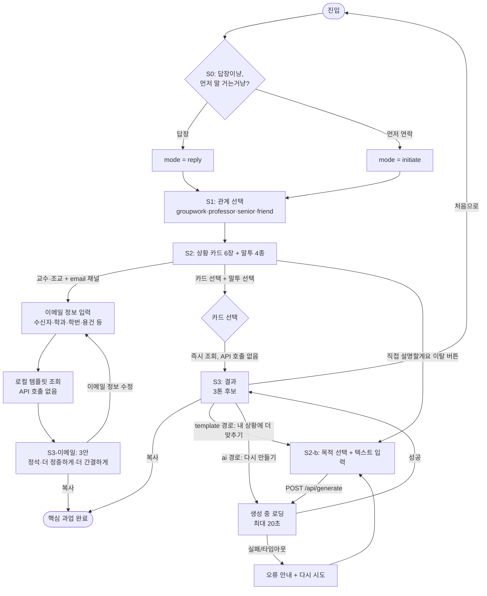
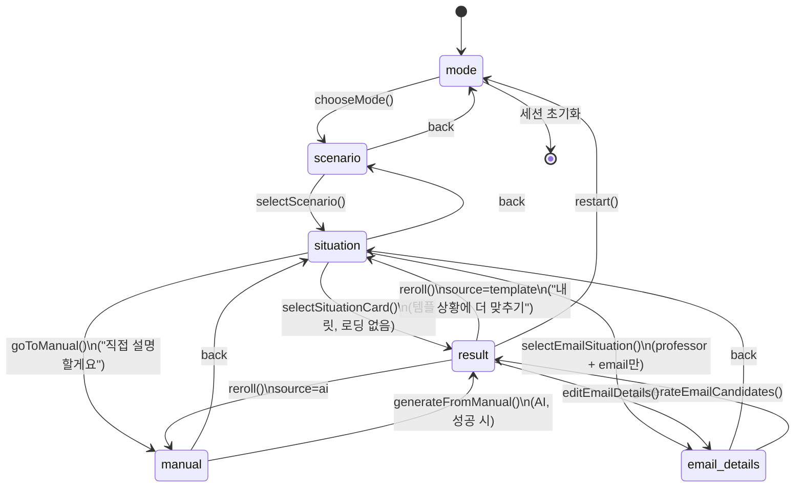
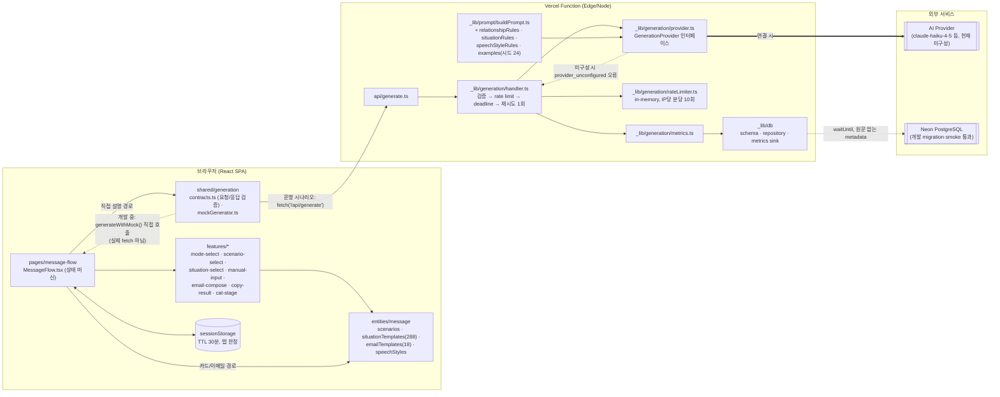
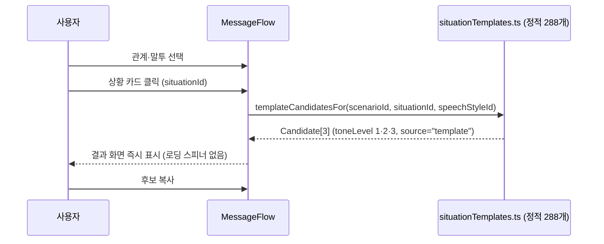
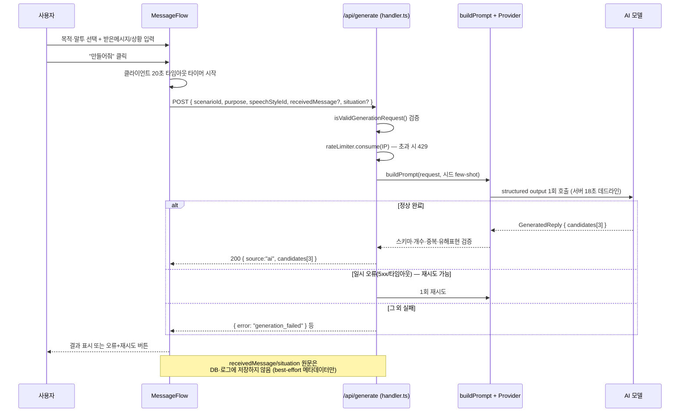
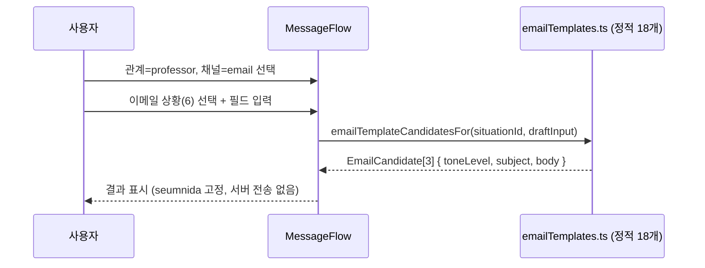
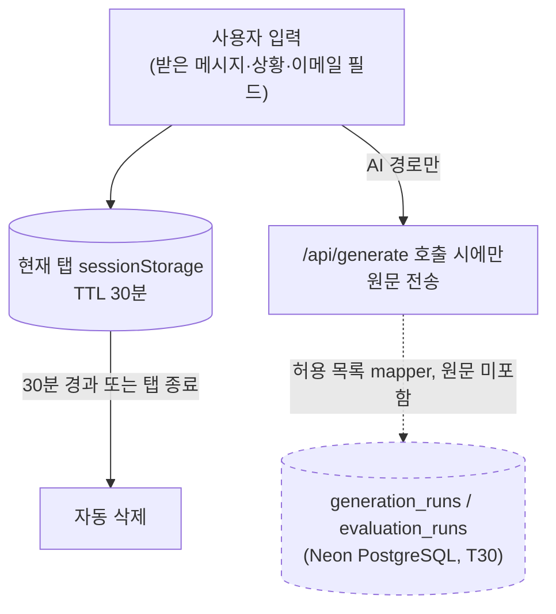

# 답냥이 — 기능 동작 구조 개요 (발표용)

> 이 문서는 발표 자료 준비를 위해 현재 코드 상태를 기준으로 정리한 **동작 구조 요약**이다. 계약의 정본은 `docs/SPEC.md`, 화면 상태는 `docs/SCREENS.md`이며, 이 문서는 그 둘을 다이어그램으로 재구성한 것이다. 코드가 바뀌면 이 문서도 갱신해야 한다.

## 1. 한 줄 요약

자유 대화형 챗봇이 아니라, **관계(4) → 상황카드(6) → 말투(4) → 톤(3)** 를 몇 번의 클릭으로 조합해 즉시 문장을 받거나, 카드가 안 맞을 때만 **AI 1회 호출**로 대체 문장을 만드는 "선택형 UI + 결정적 템플릿 우선" 구조다.

---

## 2. 유저플로우

핵심 포인트: **카드 경로와 AI 경로는 사용자의 명시적 선택으로만 갈린다.** `situationId`가 있으면 항상 템플릿, 없으면 항상 AI — 모델이 라우팅을 추론하지 않는다 (`docs/SPEC.md` 2장).

---

## 3. 화면 상태 머신 (`Step`)

`src/pages/message-flow/MessageFlow.tsx`의 `step` 상태를 그대로 옮긴 것이다. `sessionStorage`에 30분 TTL로 저장되어 새로고침해도 복원되지만, 저장된 상태가 현재 스키마와 안 맞으면(관계 변경, 이메일/메신저 채널 전환 등) 안전한 이전 단계로 강등된다.

---

## 4. 시스템 아키텍처

**계층 원칙**: `entities`(데이터/타입) → `features`(단일 책임 UI 조각) → `pages`(오케스트레이션). `shared/generation`은 화면과 API가 **동일한 계약**(`GenerationRequest`/`GenerationResponse`)을 쓰게 만드는 접합부다 — 목·템플릿·실 API가 응답 타입 수준에서 구분되지 않는다.

---

## 5. 데이터 흐름 — 세 가지 경로

### 5-1. 상황 카드 경로 (템플릿, API 호출 없음)

### 5-2. "직접 설명할게요" 경로 (AI, 서버 1회 호출)

### 5-3. 교수·조교 이메일 경로 (템플릿, 로컬 전용)

---

## 6. 데이터 경계 (개인정보·저장 정책)

- 카드/이메일 경로는 애초에 서버로 아무것도 보내지 않는다.
- AI 경로만 원문이 외부 provider로 나간다 — 화면에 사전 고지 필요 (SPEC 2장).
- `DATABASE_URL`이 있는 서버 환경에서만 Neon HTTP repository를 만들고, 없거나 설정에 실패하면 no-op sink로 강등한다. DB write는 Vercel `waitUntil()`에 등록하며 실패해도 생성 응답을 바꾸지 않는다.
- 로그인·영구 사용자 프로필·서버 측 대화 이력이 없다 — 전부 탭 스코프.

---

## 7. 발표 시 짚으면 좋은, 놓치기 쉬운 포인트

- **"AI 서비스"처럼 보이지만 기본 경로는 AI를 안 씀.** 288개 카드 템플릿이 커버하는 상황이면 API 호출 자체가 없다 — 응답속도·비용·환각 리스크가 구조적으로 0이라는 게 AI 챗봇과의 핵심 차별점. 발표에서 "왜 자유 챗봇이 아닌가"의 답이 됨.
- **현재 코드는 AI를 아직 실제로 안 부른다.** `MessageFlow.tsx`가 `fetch('/api/generate')`가 아니라 `generateWithMock()`을 직접 호출 중이고, `api/generate.ts`의 provider도 `createUnconfiguredGenerationProvider()`(항상 실패)다. 서버 계약·프롬프트 조립·핸들러(재시도/데드라인/rate limit)는 완성됐지만 실제 모델 연결은 아직이다. 발표에서 "지금 데모는 어디까지 실물이냐"는 질문이 나올 걸 대비해 이 경계선을 먼저 밝히는 게 좋다.
- **DB 데이터 계층은 실제 Neon 개발 DB까지 검증해 T30을 완료했다.** 네 테이블 schema·migration·repository와 원문 비저장·실패 격리 테스트를 구현하고, 실제 generate handler의 background sink 및 public 테이블 네 개의 임시 메타데이터 기록·조회·정리를 통과했다. Vercel Preview의 `waitUntil()` 수명주기와 환경별 `DATABASE_URL` 분리는 T31 최종 통합에서 확인한다.
- **라우팅에 판단이 없다.** 카드 유무만으로 템플릿/AI가 갈린다. "AI가 상황을 보고 알아서 템플릿을 쓸지 생성할지 정한다"는 오해를 사전에 차단하면 신뢰도 있는 설명이 됨.
- **톤(toneLevel)과 말투(speechStyleId)는 서로 다른 축.** 톤=전달 강도(기본/부드럽게/분명하게), 말투=문장 말끝(습니다체/요체/이다체/용용체). 4 말투 × 3톤 × 6상황 × 4관계 = 288개라는 조합 폭발을 "왜 결정적 템플릿을 골랐는가"의 근거로 쓸 수 있음.
- **하드 실패 기준이 수치로 못박혀 있다.** T25 검수는 288개 전수 0건 하드페일, 96/96 톤 정렬 일치를 요구 — "느낌상 괜찮다"가 아니라 통과선이 있는 QA 프로세스라는 점은 포트폴리오/발표에서 신뢰도를 높이는 디테일.
- **AI 경로도 자율 에이전트가 아니라 경계가 고정된 1회 워크플로.** 계획·도구선택·멀티턴 없음, structured output + 서버 재검증 + 최대 1회 재시도. "왜 agent loop나 RAG가 없냐"는 질문에 대한 명확한 설계 근거(SPEC 2장 "단일 AI 생성 워크플로").
- **서버 rate limit은 알고 쓰는 한계다.** Vercel 서버리스 인스턴스별 in-memory 카운터라 완벽한 분산 제한이 아님 — 이후 Upstash 등으로 교체 예정이라는 점을 미리 밝히면 "허점을 숨기지 않는 설계"로 보임.
- **자리 표시자(`[이름]`, `[날짜]`)는 버그가 아니라 의도된 출력.** 입력에 없는 사실을 지어내지 않기 위한 장치이며, 클라이언트가 이를 하이라이트해 "빈칸을 채워주세요"로 안내한다 — 환각 방지 UX로 강조할 만한 지점.
- **냥이 캐릭터(Three.js)는 3단계 폴백을 가진 컴포넌트.** WebGL/에셋 미제공/`prefers-reduced-motion`이면 정적 이미지나 배지로 자동 강등된다(T29) — 접근성·성능을 고려한 설계라는 점이 데모 화면만 봐서는 잘 안 보임.
