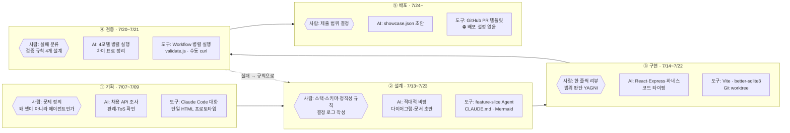
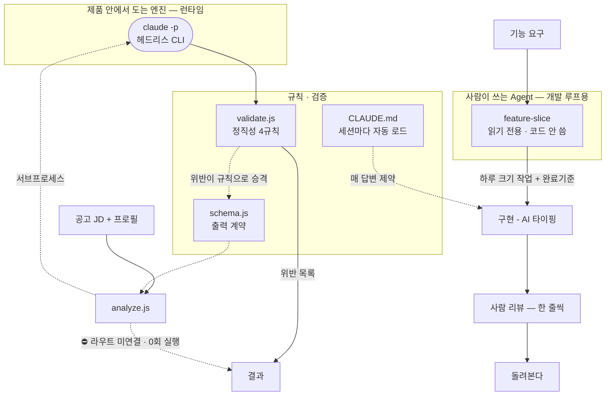

# Agent 협업 과정 — 무엇을 사람이 정하고, 무엇을 AI가 했나

> 작성 2026-07-30 · 4주차 정리. **추측 없이 커밋·문서·코드에 남은 증거만** 적는다.
> 근거 표기 규칙: 커밋 해시 / 파일:줄 로 출처를 단다. 증거 없는 항목은 "증거 없음"이라고 쓴다.
> (근거를 붙이는 이유는 `CLAUDE.md` 규칙 6 — 그럴듯하게 지어내지 않기.)

---

## 0. 한 장 요약

읽는 법: `{{육각형}}` = 사람이 정한 것, `[사각형]` = AI가 한 것.
④에서 ②로 돌아가는 점선이 이 프로젝트의 핵심 루프다 — **모델이 틀린 지점을 검증 규칙으로 승격**시켰다
(`docs/모델 비교 — 갭분석 baseline.md:55-58` → `server/harness/validate.js`).

---

## 1. 단계별로 쓴 도구

| 단계 | 도구 | 무엇에 썼나 | 근거 |
|---|---|---|---|
| **기획** | Claude Code 대화 | 문제 정의·수요 검증·경쟁 분석 | `커리어 코파일럿 기획.md` (342줄) |
| | 웹 조사 (AI) | 채용 API 엔드포인트 직접 fetch 확인, 판례 조사 | 같은 문서 11.1·11.2 |
| | 단일 HTML 프로토타입 | 화면 흐름을 코드 없이 먼저 확인 | `ba49882` `27649a3` |
| **설계** | **`feature-slice` Agent** | 기능 요구 → 하루 크기 작업 단위 분해 | `8a4b5f0` (7/13), `.claude/agents/feature-slice.md` |
| | **`CLAUDE.md` 프로젝트 메모리** | 협업 규칙을 매 세션 자동 로드 = 규칙의 제도화 | `6cdde71` (7/23) |
| | Mermaid 다이어그램 | 부품 3개의 연결 상태를 한 장으로 | `38eaa85`, `README.md:10-57` |
| | 결정 로그 (문서) | 판단 궤적 보존 | `docs/하네스 설계.md:57-61` |
| **구현** | Claude Code (코드 작성) | React 컴포넌트·Express 라우트·하네스 3파일 | `5c0ad84` `79b7f7c` `38eaa85` |
| | Vite + proxy | FE :5173 → BE :3000 연결 | `vite.config.js` |
| | better-sqlite3 | Supabase → SQLite 전환 | `5c0ad84` (`supabaseClient.js` 삭제) |
| | 마이그레이션 SQL 기록 | 스키마 변경 이력 | `supabase/migrations/*.sql` |
| | Git worktree | 작업 분리 | `.claude/worktrees/` |
| **검증** | **Workflow 병렬 실행** | 같은 입력을 4개 모델(fable/haiku/sonnet/opus)에 동시 투입 | `docs/모델 비교 — 갭분석 baseline.md:5` — run `wf_f3f3eaf6-7d9` |
| | **`validate.js` 정직성 검증기** | LLM 출력을 코드로 검사 (규칙 4개) | `server/harness/validate.js` (82줄) |
| | **`schema.js` 출력 스키마** | JSON 모양을 계약으로 강제 | `server/harness/schema.js` (82줄) |
| | 수동 curl 스모크 테스트 | API 동작 확인 | `docs/차후 공부 방안.md:13` |
| | 사람의 한 줄씩 리뷰 | AI 코드를 읽고 되묻기 | `CLAUDE.md` 규칙 4 |
| **배포** | GitHub PR 템플릿 | 주차별 제출 규격 (설명 가능/못한 부분 분리) | `.github/pull_request_template.md` |
| | `showcase.json` | 챌린지 제출물 명세 | `dae3fd6` (7/24) |
| | — | **⛔ 실제 배포 설정이 없다** (vercel/docker/.env.example 전무) | 파일 부재 |

> **자동화 테스트는 0개다.** `npm test`가 없고 `package.json`에 test 스크립트도 없다.
> 검증은 전부 (a) 코드 검증기 `validate.js` (b) 수동 curl (c) 사람 리뷰 3종이었다.

---

## 2. Agent · Skill 이 실제로 붙은 자리

**두 층을 구분하는 게 중요하다.**

- **개발 루프의 Agent** (`feature-slice`) — 내가 코드를 만들 때 쓰는 도구.
- **제품 런타임의 엔진** (`claude -p` + 하네스) — 사용자가 쓸 때 도는 것.

이 둘을 섞어 "Agent를 썼다"고 하면 심사자가 무엇을 평가할지 알 수 없다.
`showcase.json`의 `agentTools`는 앞의 층만 적고 있어서, **뒤의 층(하네스)이 제출물에서 빠져 있다** → 3절 정정 대상.

### 사용 이력이 없는 것

| 항목 | 상태 |
|---|---|
| `feature-verify` Agent | **파일도 커밋 이력도 없음.** `.claude/agents/`에 `feature-slice.md` 하나뿐 (`git log -- .claude/agents/*` = 커밋 1건) |
| oh-my-claudecode 스킬 | 설치는 돼 있으나(`.omc/project-memory.json`) **이 프로젝트에서 스킬을 쓴 증거는 못 찾음** |
| Ollama 로컬 모델 | 미착수 (`docs/하네스 설계.md:64` 에서 "확인 필요"로 남음) |

---

## 3. 실제와 맞지 않는 항목 — 정정 목록

`showcase.json`과 `plan.md`를 실제 코드·커밋과 맞춰봤다. **4건이 틀렸다.**

| # | 어디 | 지금 적힌 것 | 사실 | 어떻게 고칠까 |
|---|---|---|---|---|
| **1** | `showcase.json` → `agent.agentTools[1]` | `feature-verify` Agent를 제출물로 명시 | 그런 파일이 없다. 커밋 이력에도 없다 | **결정 필요** — 삭제할지, 데모 전에 실제로 만들지 |
| **2** | `showcase.json` → `기능 개발 Workflow` 5단계 | "feature-verify Agent로 실제 동작 점검" | 실제 검증은 **수동 curl + 브라우저 확인 + `validate.js`** 였다 | 실제 수단으로 문장 교체 |
| **3** | `showcase.json` → `agentTools` | 하네스(`schema`/`validate`/`analyze`)가 없다 | 코드 216줄이 있고, 검증 규칙은 모델 비교에서 도출됐다 — **가장 강한 산출물인데 누락** | `type: "harness"` 항목으로 추가 |
| **4** | `docs/plan.md:135` | ".gitignore가 .claude/를 무시 → **Agent 2개가 커밋 안 됨**" | 틀렸다. `.claude/`는 `c0fdee3`(7/06)부터 무시 목록에 있었지만 `feature-slice.md`는 **그 뒤인 7/13에 커밋됐고 지금도 추적된다** — `git ls-files`로 확인. 무시 규칙을 뚫고 올라간 예외다. 안 올라간 건 "2개"가 아니라 **애초에 없는 1개** | 문장 수정 — 문제는 미추적이 아니라 **부재** |

### 왜 이게 중요한가

이 프로젝트가 검증하려는 규칙이 바로 **"근거 없으면 충족으로 표시하지 않는다"**
(`server/harness/analyze.js:18`, `showcase.json` features 3번).
제출물에 근거 없는 Agent를 적는 건 **자기 규칙을 자기가 위반하는 것**이라 가장 아픈 자리다.

### 반대로, 있는데 안 적힌 것 (추가 권장)

- **Workflow 병렬 실행** — 4모델 동시 비교. `showcase.json`은 결과(fit 26~70)만 적고 **어떻게 얻었는지**를 안 적었다.
- **Supabase → SQLite 전환 이력** — `store.js` 한 파일 교체로 끝난 것이 계층 분리의 실증인데, 마이그레이션 SQL만 남고 서술이 없다.

---

## 4. 사람이 정한 것 vs AI가 한 것

### 4-1. 사람만 할 수 있었던 판단 (근거 있는 것만)

| 판단 | 무엇을 정했나 | 왜 AI가 못 하나 | 근거 |
|---|---|---|---|
| **목적 → 스택** | Java/Spring 지망인데도 Node+Express+SQLite | "오픈소스 배포"라는 **목적**은 사람이 정한다. AI는 돌아가는 스택을 고르지, 목적에 맞는 스택을 고르지 않는다 | `하네스 설계.md:58` |
| **범위 (YAGNI)** | 엔진 어댑터를 **안** 만들기로 결정 | 두 번째 엔진이 알려줄 모양을 지금 추측하지 않는 절제 | `하네스 설계.md:59` |
| **측정 순서** | 루프보다 지표를 먼저 정의 | 사후에 고른 지표는 항상 좋아 보인다(생존편향)는 **자기 편향 인식** | `plan.md:65-73` |
| **조작 방지 짝 지표** | 위반 수(↓)와 근거 밀도(유지)를 함께 본다 | "위반 0"은 aiBar를 안 쓰면 쉽게 달성된다 — **지표가 속일 수 있음을 예측** | `plan.md:76-81` |
| **정직성 규칙 4개** | 무엇을 위반으로 볼지 정의 | 검증 규칙 자체의 설계 = 무엇을 검증할지 정하기 | `모델 비교.md:55-58` |
| **2축 등급 교정** | AI가 "위키=deep"으로 구현을 부풀린 것을 개념/구현 2축으로 분리 | 자기 실력에 대한 정직한 자가신고 | `기획.md` 11.3 마지막 항목 |
| **규칙의 유효기간** | 20줄 규칙 신설 — "3주간 직접 타이핑 0줄"을 스스로 진단 | 규칙 4가 성장을 막고 있다는 **전제의 재검토** | `CLAUDE.md:18-23` |
| **결정 보류** | 규칙 4 처리를 "지금 결정하지 않는다" | 실행 로그가 없을 때 결정을 미루는 판단 | `plan.md:130` |
| **법적 범위** | 경쟁 채용DB 크롤 배제 | 판결문을 읽고 리스크를 감수 여부로 환산 | `기획.md` 11.2 |

### 4-2. AI가 한 것

- 코드 타이핑 — React 컴포넌트·CSS, Express 라우트, `store.js`/`db.js`, 하네스 3파일, 마이그레이션 SQL
- 조사 — 채용 API 엔드포인트 실제 fetch 확인, 판례·연구 검색
- 실행 — 4모델 병렬 호출, 결과 표 정리
- 문서 초안 — Mermaid 다이어그램, `showcase.json` 초안, 각 문서 뼈대
- **적대적 비평** — 설계를 그대로 받지 않고 "과적합 아냐?" "이 스키마 여기서 깨져"로 찌르는 역할 (`하네스 설계.md:42`)

### 4-3. AI가 틀렸고 사람이 잡은 것 ★

**이 목록이 4주간 역량이 드러난 실제 지점이다.** (설계 문서보다 이쪽이 증거로 강하다)

| AI가 틀린 것 | 사람이 어떻게 잡았나 | 근거 |
|---|---|---|
| 저장 로직을 2회 조회로 짜고 더 짧은 방법을 **먼저 말하지 않음** | 코드를 읽다가 되물어서 `RETURNING` 대안을 끌어냄 | `showcase.json` developmentWithAI, `server/store.js:15-20` |
| "작은 모델은 페르소나 효과 있다"고 근거 없이 주장 | 논문으로 반증 → **규칙 6(근거 필수)이 이 사고에서 생김** | `CLAUDE.md:28` |
| 검증 규칙 하나가 **사용자 1명(승현)의 전제**를 기준으로 작성됨 | 오픈소스 목적과 불일치 판정. **동작 오류가 없어 테스트로는 안 잡히는 결함** | `showcase.json` developmentWithAI |
| 판례 금액·"ATS" 용어·쿠팡 ATS 종류를 틀림 | 1차 출처 재확인으로 5건 정정 | `기획.md` 11.3 |
| 스킬 등급을 단일 축으로 부풀림 | 개념/구현 2축 + 구현 보수적으로 교정 | `기획.md` 11.3 |

마지막 항목이 특히 중요하다 — **테스트가 통과해도 목적에 안 맞을 수 있다.** 이건 자동화로 잡히지 않는다.

---

## 5. 바이브코딩이 안 되는 지점 (이 프로젝트가 찾은 답)

| 층 | AI가 할 수 있나 |
|---|---|
| 코드 타이핑 | ✅ 거의 전부 |
| 버그 수정·리팩터 | ✅ 지시하면 |
| "이 추상화가 지금 필요한가" | ❌ 목적을 모른다 |
| "무엇을 위반으로 볼 것인가" | ❌ 기준 자체의 설계 |
| "이 지표가 나를 속이고 있나" | ❌ 자기 편향 인식 |
| "이 규칙의 전제가 아직 맞나" | ❌ 규칙의 유효기간 판단 |
| "동작은 맞는데 목적에 안 맞다" | ❌ 맥락 |

---

## 6. 아직 안 돈 것 (정직하게)

- **하네스 0회 실행** — `server/index.js`에 라우트가 `/api/interests` 3개뿐. `POST /api/analyze`가 없어 `analyze.js`를 부르는 곳이 없다.
- **`InterestSection` 죽은 코드** — `src/App.jsx` import 목록에 없다.
- **재생성 루프 미구현** — `validate.js`는 위반을 모아 반환만 한다 (`analyze.js:3` 주석에 명시).
- **자동화 테스트 0개.**
- **배포 없음** — `showcase.json`의 `demoUrl`이 빈 문자열.

---

## 관련
- `CLAUDE.md` — 협업 행동강령(정본) · `docs/협업 행동강령.md` — 요약
- `docs/plan.md` — 4주차 계획 (3절 #4 정정 대상)
- `docs/하네스 설계.md` — 역할 분담 표·결정 로그
- `docs/모델 비교 — 갭분석 baseline.md` — 검증 규칙의 출처
- `README.md` — 아키텍처 다이어그램 (코드 배선 관점)
