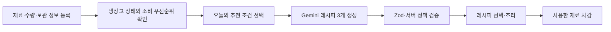
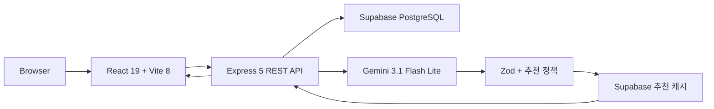
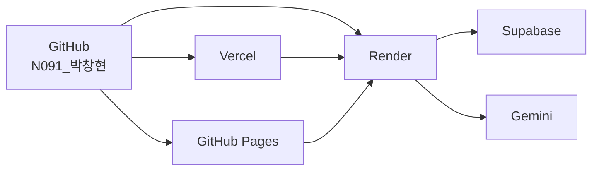

# 있는대로 데모데이 발표 가이드

> 2026년 7월 31일 데모 기준  
> 이 문서는 서비스 소개, 실제 시연, 기술 설명, 예상 질문과 장애 대응을 한 번에 준비하기 위한 최종 발표 가이드입니다.

## 1. 발표에서 반드시 전달할 한 문장

**있는대로는 냉장고 속 보유 재료와 소비기한을 바탕으로, 지금 만들기 좋은 1인분 레시피를 Gemini로 생성하고 서버에서 검증해 주는 식재료 관리 서비스입니다.**

발표 전체에서는 다음 세 가지를 반복해서 강조합니다.

1. 냉장고 재료를 기록하는 데서 끝나지 않고 오늘의 메뉴 결정까지 연결합니다.
2. Gemini의 답을 그대로 보여주지 않고 구조와 서비스 정책을 서버에서 검증합니다.
3. 추천한 레시피로 요리한 뒤 실제 사용량을 냉장고 재고에 다시 반영합니다.

## 2. 서비스 소개

### 해결하려는 문제

자취생은 냉장고에 어떤 재료가 있는지 잊거나 소비기한을 놓치기 쉽습니다. 남은 재료를 확인하더라도 그 재료로 무엇을 만들 수 있는지 다시 검색하고, 1인분에 맞는 조합을 판단해야 합니다.

### 제안하는 해결 방법

`있는대로`는 다음 과정을 하나의 서비스 흐름으로 연결합니다.

### 핵심 사용자

- 혼자 식사를 준비하는 자취생
- 냉장고에 재료는 있지만 메뉴 결정을 미루는 사람
- 소비기한이 가까운 재료를 먼저 사용하고 싶은 사람
- 필요한 경우 부족 재료 몇 개를 추가해 더 완성도 높은 메뉴를 만들고 싶은 사람

### 구현된 제품 범위

- 재료명, 수량, 보관 방법과 소비기한 관리
- 소비기한과 재료 특성을 반영한 Gemini 1인분 레시피 추천
- 최초 3개 추천과 기존 목록 아래에 3개씩 추가 추천
- 부족 재료 허용 범위 0~5개 설정
- 추천 이유, 필수·선택·대체 재료, 조리 순서와 안전 안내
- 레시피 저장
- 요리 후 실제 사용 재료 차감

### 의도적으로 제외한 범위

- 로그인·회원가입의 실제 인증
- 사용자의 식단을 평가하거나 교정하는 식단 코칭
- AI가 추정한 칼로리와 영양소 수치
- 상품 가격 비교, 장바구니와 결제

이 범위를 질문받으면 “핵심 문제인 재료 관리와 오늘의 메뉴 결정에 집중하기 위해 제외했다”고 설명합니다.

## 3. 권장 데모 구성

전체 발표가 5분이라면 서비스 소개 40초, 사용자 시나리오 2분 30초, 기술 설명 1분 20초, 마무리 30초로 구성합니다.

| 구간 | 시간 | 전달할 내용 |
| --- | ---: | --- |
| 문제와 서비스 소개 | 0:00~0:40 | 냉장고에 재료가 있어도 메뉴 결정과 소비기한 관리가 어렵다는 문제 |
| 핵심 사용자 시나리오 | 0:40~3:10 | 냉장고 확인 → 조건 선택 → 추천 → 상세 → 재료 차감 |
| 기술과 AI 검증 | 3:10~4:30 | React, Express, Supabase, Gemini, Zod와 추천 정책 |
| 결과와 마무리 | 4:30~5:00 | 공개 배포, 테스트, 핵심 가치 재강조 |

시간이 3분이라면 상세 레시피의 모든 영역을 읽지 말고, 추천 이유·재료 구분·조리 순서만 짚습니다.

## 4. 핵심 사용자 시나리오

### 시나리오 설정

> 혼자 사는 사용자가 냉장고에 남은 고기와 채소를 확인하고, 소비기한이 가까운 재료를 먼저 활용해 오늘 저녁 메뉴를 결정한 뒤 실제 사용량을 차감합니다.

### 1단계: 서비스 소개

**조작**

1. `서비스 소개` 탭을 엽니다.
2. 서비스가 해결하는 문제와 세 가지 핵심 흐름을 짧게 보여줍니다.

**발표 멘트**

> 있는대로는 냉장고에 남은 재료와 소비기한을 기억하고, 지금 만들기 좋은 1인분 메뉴까지 이어 주는 서비스입니다. 단순한 재고 목록이 아니라 오늘 무엇을 먹을지 결정하는 과정을 줄이는 것이 목표입니다.

### 2단계: 내 냉장고 확인

**조작**

1. `내 냉장고` 탭으로 이동합니다.
2. 소비 우선 재료 안내와 전체 재료 수를 보여줍니다.
3. 재료 카드에서 수량, 보관일수, 보관 방법과 태그를 보여줍니다.
4. 시간이 허용되면 `재료 추가` 버튼의 등록 폼을 열어 입력 항목만 보여줍니다.

**발표 멘트**

> 사용자는 재료의 수량과 보관 방법, 소비기한을 함께 기록합니다. 서비스는 날짜를 기준으로 먼저 확인해야 할 재료를 구분하고, 단백질·채소·가공식품 같은 태그를 추천 우선순위에 활용합니다.

**기술적으로 전달할 점**

- React가 재료 목록과 등록·수정 상태를 관리합니다.
- Express API가 입력을 검증하고 Supabase PostgreSQL에 저장합니다.
- 날짜, 수량과 단위는 추천 전에 서버에서 정규화합니다.

### 3단계: 오늘의 추천 조건 선택

**조작**

1. `오늘의 메뉴` 탭으로 이동합니다.
2. `먼저 먹을 재료부터`, `간편하고 익숙하게`, `영양 균형을 챙겨서` 중 하나를 선택합니다.
3. 데모에서는 `먼저 먹을 재료부터`를 권장합니다.
4. 부족 재료 허용을 `최대 1개` 또는 `최대 2개`로 선택합니다.

**발표 멘트**

> 추천 조건은 사용자의 오늘 상황을 표현합니다. 소비기한 우선 모드는 임박 재료를 우선하되 억지스러운 조합은 피합니다. 부족 재료를 허용하면 냉장고 재료만 억지로 섞지 않고, 한두 가지를 추가해 더 자연스러운 메뉴도 추천할 수 있습니다.

### 4단계: Gemini 추천 확인

**조작**

1. 생성된 메뉴 3개의 이름, 시간, 난이도와 부족 재료를 보여줍니다.
2. 세 메뉴가 서로 다른 조리 형태인지 짚습니다.
3. `다른 추천 보기`를 누르면 기존 3개 아래에 새로운 3개가 추가되는 것을 보여줍니다.

**발표 멘트**

> Gemini는 한 번에 정확히 세 개의 레시피를 구조화된 데이터로 생성합니다. 추가 추천을 누르면 기존 결과를 교체하지 않고 아래에 세 개를 더합니다. 서버는 이전 메뉴의 이름, 조리법과 주재료를 다시 전달해 비슷한 메뉴가 반복되지 않도록 합니다.

**성공 기준**

- 처음에 메뉴 3개가 표시됩니다.
- 추가 추천 후 기존 메뉴가 유지되고 새 메뉴 3개가 아래에 추가됩니다.
- 허용한 개수보다 많은 부족 재료가 포함되지 않습니다.

### 5단계: 레시피 상세 확인

**조작**

1. 한 메뉴의 `레시피 보기`를 누릅니다.
2. 추천 이유를 보여줍니다.
3. 대체 재료, 보유·선택 재료와 부족 재료 구분을 보여줍니다.
4. 조리 순서와 안전 주의사항을 보여줍니다.
5. 상단의 레시피 저장 버튼도 짧게 언급합니다.

**발표 멘트**

> 상세에서는 단순히 메뉴 이름만 보여주지 않습니다. 왜 이 메뉴를 추천했는지, 어떤 재료를 보유하고 있는지, 대체 가능한 재료와 실제 조리 순서가 무엇인지 확인할 수 있습니다. 육류처럼 주의가 필요한 재료가 있으면 안전 안내도 함께 생성합니다.

### 6단계: 요리 완료와 재료 차감

**조작**

1. `이 레시피로 요리했어요`를 누릅니다.
2. 차감할 재료와 사용량을 확인합니다.
3. 확인 후 냉장고로 돌아가 수량 변화를 보여줍니다.

**발표 멘트**

> 추천은 요리에서 끝나지 않습니다. 사용자가 실제 사용량을 확인한 뒤 차감하면 냉장고 수량이 갱신됩니다. 이 결과가 다음 추천의 입력이 되어 재료 관리와 메뉴 결정이 하나의 순환 구조가 됩니다.

## 5. 기술 구조

### 전체 아키텍처

| 계층 | 기술 | 역할 |
| --- | --- | --- |
| Frontend | React, Vite | 재료 관리, 추천 조건, 추천 목록, 레시피 상세와 차감 |
| Backend | Node.js, Express | REST API, 업무 규칙, Gemini 호출과 오류 변환 |
| Validation | Zod | 요청, 환경변수와 Gemini 구조화 응답 검증 |
| Database | Supabase PostgreSQL | 보유 재료와 추천 캐시 저장 |
| Generative AI | Gemini API | 조건에 맞는 1인분 레시피 3개 생성 |
| Logging | Pino, pino-http | 개인정보를 제외한 구조화 운영 로그 |
| Quality | Vitest, Testing Library, oxlint | 단위·통합·사용자 흐름 회귀 검증 |

### 추천 요청의 실제 처리 순서

1. 프런트엔드가 추천 모드, 부족 재료 허용 수와 이전 추천 요약을 Express에 전달합니다.
2. Express가 Supabase에서 현재 보유 재료를 직접 조회합니다.
3. 만료 재료를 제외하고 수량·단위·소비기한과 태그를 정규화합니다.
4. 서버가 소비 우선순위를 계산하고 필요한 필드만 Gemini에 전달합니다.
5. Gemini가 정확히 3개의 구조화 JSON 레시피를 생성합니다.
6. Zod가 필드, 자료형, 1인분, 조리 단계와 응답 개수를 검증합니다.
7. 서버 정책이 부족 재료 수, 보유 재료 활용, 중복과 메뉴 다양성을 검증합니다.
8. 검증 실패 사유를 Gemini에 전달해 최대 3회까지 다시 생성합니다.
9. 통과한 3개를 반환하고 같은 조건의 결과를 Supabase에 캐시합니다.

### Gemini 응답을 그대로 사용하지 않는 이유

생성형 AI는 자연스러운 문장을 만들 수 있지만 다음 오류가 발생할 수 있습니다.

- 요청한 개수와 다른 레시피 반환
- 보유하지 않은 재료를 보유 재료로 표시
- 허용한 수보다 많은 부족 재료 사용
- 이전 추천과 매우 비슷한 메뉴 반복
- 만료 재료 포함
- 조리 단계나 필수 필드 누락

따라서 생성은 Gemini가 담당하고, 서비스에 노출할 수 있는 결과인지 판단하는 책임은 서버가 담당합니다.

### 추천 품질 정책

- 한 번에 정확히 3개의 레시피를 생성합니다.
- 부족 재료는 사용자가 선택한 0~5개 범위 안에서만 허용합니다.
- 모든 메뉴는 기본 양념 외의 실제 보유 재료를 최소 한 가지 사용합니다.
- 만료된 재료는 추천에서 제외합니다.
- 일반적으로 먹는 조합과 자연스러운 맛을 우선합니다.
- 균형 모드는 서로 다른 영양 식품군을 최소 두 가지 활용합니다.
- 추가 추천은 이전 결과와 조리 형태·핵심 조리법·주재료가 충분히 달라야 합니다.
- 최대 5개 묶음, 총 15개까지 추천합니다.

### 캐시를 사용하는 이유

- 같은 재료와 조건에서 Gemini를 반복 호출하지 않습니다.
- 응답 시간을 줄이고 API 사용량을 절약합니다.
- 재료 또는 추천 조건이 달라지면 다른 캐시 키를 사용합니다.
- 한국 시간 자정이 지나면 소비기한 잔여일이 달라지므로 캐시가 만료됩니다.

### 보안과 개인정보

- `GEMINI_API_KEY`와 `SUPABASE_SECRET_KEY`는 Render 서버 환경변수에만 저장합니다.
- 프런트엔드 번들에는 비밀키가 포함되지 않습니다.
- Gemini에는 추천에 필요한 허용 필드만 전달합니다.
- DB 내부 ID, 연결 정보, 사용자 메모와 불필요한 시각 정보는 전달하지 않습니다.
- 로그에는 API 키, 전체 재료 목록과 전체 Gemini 응답을 기록하지 않습니다.

## 6. 품질 검증

2026년 7월 30일 최종 개발 상태를 기준으로 다음 품질 게이트를 통과했습니다.

- 테스트 파일 17개
- 자동화 테스트 112개 통과
- oxlint 정적 분석 통과
- Vite production build 통과
- GitHub Pages 자동 배포 성공

주요 테스트 범위는 다음과 같습니다.

- 재료 등록·수정과 소비기한 계산
- 수량과 단위 정규화
- 재료 태그와 추천 우선순위
- Gemini 요청·응답 스키마
- 추천 품질 정책과 중복 방지
- 캐시와 한국 시간 만료
- 추천 API 오류 처리
- 최초 3개와 추가 3개 누적
- 레시피 저장과 사용 재료 차감

## 7. 배포 구조와 공개 주소

| 구성 | 서비스 | 주소 |
| --- | --- | --- |
| 주 프런트엔드 | Vercel | [todays-fridge-n091.vercel.app](https://todays-fridge-n091.vercel.app) |
| 배포 확인용 프런트엔드 | GitHub Pages | [pkchanghyun-pixel.github.io/hub](https://pkchanghyun-pixel.github.io/hub/) |
| API | Render | [API 상태 확인](https://todays-fridge-api-n091.onrender.com/api/health) |
| 데이터베이스 | Supabase | 보유 재료와 추천 캐시 |

## 8. 발표용 기술 설명

### 20초 버전

> 프런트엔드는 React와 Vite, API는 Express, 데이터는 Supabase를 사용했습니다. 서버가 실제 보유 재료를 조회해 Gemini에 필요한 정보만 전달하고, 생성된 세 개의 레시피는 Zod와 서비스 정책을 모두 통과해야 사용자에게 표시됩니다.

### 60초 버전

> 사용자가 추천 조건을 고르면 React가 Express API로 요청합니다. Express는 Supabase의 현재 재료를 읽고 만료 재료를 제외한 뒤 소비기한과 태그로 우선순위를 계산합니다. Gemini는 이 정보를 이용해 정확히 세 개의 1인분 레시피를 JSON으로 생성합니다. 하지만 AI 결과를 바로 사용하지 않고 Zod로 구조를 검증하고, 서버 정책으로 부족 재료 수, 보유 재료 활용, 중복과 메뉴 다양성을 다시 확인합니다. 실패하면 이유를 포함해 최대 세 번 재생성하고, 성공 결과는 한국 시간 자정까지 캐시합니다.

## 9. 예상 질문과 답변

### 왜 일반 레시피 검색이 아니라 생성형 AI를 사용했나요?

보유 재료, 수량, 소비기한, 부족 재료 허용 범위와 오늘의 상황이 매번 달라집니다. 고정된 레시피 검색만으로는 이 조합을 모두 만족시키기 어렵기 때문에 Gemini로 후보를 생성하고 서버 정책으로 품질을 통제했습니다.

### AI가 잘못된 레시피를 만들면 어떻게 하나요?

Zod 구조 검증과 서버 정책 검증을 모두 통과해야 합니다. 부족 재료 수, 만료 재료, 보유 재료 활용, 중복과 조리 단계 등을 확인하고 실패 이유를 전달해 최대 3회 다시 생성합니다.

### 왜 한 번에 3개를 추천하나요?

하나만 보여주면 선택권이 부족하고 너무 많으면 결정 부담이 커집니다. 먼저 3개를 보여주고 필요할 때 기존 결과 아래에 3개씩 추가하는 방식으로 선택지와 집중도를 균형 있게 구성했습니다.

### 부족한 재료가 있는 메뉴도 추천하는 이유는 무엇인가요?

보유 재료만 강제하면 실제로 먹기 어색한 조합이 생길 수 있습니다. 사용자가 허용 범위를 직접 정하고, 그 범위 안에서는 한두 가지 재료를 추가해 더 자연스럽고 완성도 높은 메뉴를 추천하도록 했습니다.

### 같은 추천이 반복되지 않나요?

레시피 fingerprint와 이전 추천의 이름, 조리 형태, 조리 기법과 주재료를 전달합니다. 서버는 새 결과가 기존 결과와 충분히 다른지도 검증합니다.

### 추천 결과는 왜 캐시하나요?

같은 재료와 조건으로 Gemini를 반복 호출하는 비용과 대기 시간을 줄이기 위해서입니다. 소비기한 기준이 바뀌는 한국 시간 자정에는 캐시를 만료합니다.

### 영양 정보는 정확한가요?

의학적·영양학적 정량 분석 서비스가 아니므로 칼로리나 영양소 수치를 AI가 추정하지 않습니다. 재료 구성을 바탕으로 탄수화물·단백질·채소 같은 정성적 균형만 안내합니다.

### 로그인이 실제로 되나요?

현재 로그인·회원가입 버튼은 향후 기능을 표현하는 UI이며 실제 인증은 연결하지 않았습니다. 이번 데모의 핵심 범위는 냉장고 관리와 검증된 레시피 추천입니다.

### 여러 사용자의 냉장고를 구분할 수 있나요?

실제 인증과 사용자별 데이터 분리는 다음 단계입니다. 현재 데모는 핵심 추천 흐름을 검증하는 단일 서비스 데이터 범위입니다.

### 가장 어려웠던 기술 문제는 무엇이었나요?

AI가 자연스러운 문장을 생성하는 것과 서비스 규칙을 정확히 지키는 것은 별개의 문제였습니다. 구조화 출력, Zod 검증, 업무 정책과 재생성 피드백을 계층으로 나누면서 예측하기 어려운 AI 응답을 서비스에서 다룰 수 있게 만든 점이 핵심 과제였습니다.

### Codex와 Gemini의 역할은 어떻게 다른가요?

Codex는 요구사항을 작업으로 나누고 코드·테스트·문서를 함께 만드는 개발 파트너로 사용했습니다. Gemini는 완성된 서비스 안에서 사용자의 재료 조건에 맞는 레시피를 생성하는 기능입니다.

### 다음 단계는 무엇인가요?

실제 인증과 사용자별 냉장고 분리, 알레르기·채식 설정, 추천 피드백을 반영한 개인화가 우선입니다. 다만 먼저 현재 핵심 흐름의 사용성 데이터를 확인한 뒤 확장합니다.

## 10. 데모 장애 대응

### 데모 시작 전 체크리스트

- [ ] Vercel 서비스가 열리는지 확인
- [ ] Render `/api/health`가 정상 응답하는지 확인
- [ ] 냉장고 재료가 조회되는지 확인
- [ ] 추천 요청을 한 번 실행해 Gemini와 캐시 상태 확인
- [ ] 시연할 재료의 수량과 소비기한 확인
- [ ] 브라우저 확대 비율 100%와 발표 해상도 확인
- [ ] 알림, 자동 업데이트와 불필요한 탭 닫기
- [ ] 프로젝트 소개 영상과 포스터를 로컬에서도 열 수 있게 준비

### Gemini 응답이 늦을 때

> 생성형 AI 요청은 외부 API 상태에 따라 시간이 걸릴 수 있습니다. 같은 조건의 성공 결과는 캐시해 이후 요청 시간을 줄였습니다.

기다리는 동안 추천 검증 구조를 설명합니다. 요청을 연속해서 여러 번 누르지 않습니다.

### Gemini 사용량 제한 또는 네트워크 오류

마지막 성공 추천이 화면에 남아 있다면 그 결과로 상세 시연을 계속합니다. 결과가 없다면 프로젝트 소개 영상의 추천 장면으로 전환하고 Zod·서버 정책 검증을 설명합니다.

### Render가 절전 상태일 때

첫 API 요청이 느릴 수 있으므로 발표 최소 10분 전에 `/api/health`를 열어 둡니다.

### 재료 데이터가 예상과 다를 때

시연 직전에 기준 재료를 확인하고 수량을 기록합니다. 차감 시연 후에는 수량이 실제로 변하므로 같은 시나리오를 반복할 경우 다시 보정합니다.

### 공개 서비스에 접속하지 못할 때

1. Vercel 주소를 다시 확인합니다.
2. GitHub Pages 배포 주소로 전환합니다.
3. 두 주소 모두 사용할 수 없으면 프로젝트 소개 영상과 포스터로 흐름을 설명합니다.

## 11. 발표 시 피해야 할 표현

- “AI가 항상 완벽한 레시피를 만듭니다.”
- “정확한 영양 분석을 제공합니다.”
- “사용자별 맞춤 서비스가 이미 구현되어 있습니다.”
- “로그인과 개인정보 분리가 완료되었습니다.”
- “소비기한을 법적·의학적으로 보장합니다.”

대신 다음처럼 설명합니다.

- “AI 후보를 서버 정책으로 검증합니다.”
- “재료 구성을 바탕으로 정성적 영양 균형을 안내합니다.”
- “현재는 핵심 사용자 흐름을 검증한 데모 범위입니다.”

## 12. 마무리 멘트

### 15초 버전

> 있는대로는 냉장고 속 재료를 기록하는 데서 멈추지 않고, 오늘의 메뉴와 조리 후 재고까지 연결합니다. 생성형 AI의 유연함과 서버 검증의 안정성을 함께 사용해 자취생의 매일 반복되는 메뉴 고민을 줄였습니다.

### 한 문장 버전

> 냉장고에 있는 재료가 오늘의 한 끼가 되도록, 있는대로가 메뉴 결정부터 재고 정리까지 연결합니다.

