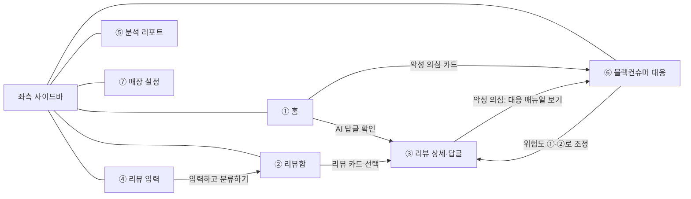
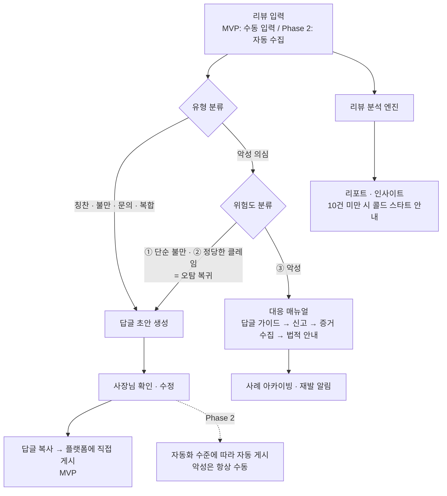

# 리뷰지기 — 리뷰 관리 AI 에이전트 기획서

> 소상공인을 위한 리뷰 자동 답글 · 분석 · 블랙컨슈머 대응 에이전트
>
> **[HTML·CSS 프로토타입 바로 보기](../prototype/index.html)**

---

## 1. 개요

### 1.1 문제 정의

- 소상공인(특히 배달 매장 사장님)은 매일 쏟아지는 리뷰에 일일이 답글을 달 시간이 부족하다.
- 리뷰는 매출에 직결되지만, 리뷰 데이터를 모아서 분석하고 개선점을 찾는 일은 사실상 불가능하다.
- 악성 리뷰·블랙컨슈머를 만났을 때 어떻게 대응해야 하는지(신고 절차, 법적 대응) 아는 사장님이 거의 없다.

### 1.2 목표

리뷰 답글 작성 → 리뷰 분석 → 악성 리뷰 대응까지, 리뷰 관리 전 과정을 대신해주는 AI 에이전트를 만든다.

### 1.3 타겟 사용자

- 1차: 배달의민족을 사용하는 외식업 소상공인
- 확장: 네이버 스마트플레이스, 쿠팡이츠, 요기요, 구글 리뷰 등 모든 리뷰 채널을 쓰는 소상공인

---

## 2. 핵심 기능

> **집중 원칙**: MVP는 아래 5개 핵심 기능(2.1~2.5)의 완성도에 집중한다. 서브 기능(챗봇 알림, 자동 수집, 자동 게시, 멀티 플랫폼)은 Phase 2 이후로 미루고 늘리지 않는다.

### 2.1 리뷰 유형 분류

리뷰가 입력되면 유형·카테고리·분류 근거를 자동 판별한다.

- **입력**: 리뷰 본문, 별점, 주문 메뉴(선택), 유입 플랫폼, 작성 일자, 닉네임(선택)
- **출력**: 유형 1개 + 세부 카테고리(맛/양/배달/포장/서비스, 복수 가능) + 분류 근거 한 줄(리뷰 상세 화면에 표시)

| 유형 | 판정 기준 |
|---|---|
| 칭찬 | 긍정 경험 위주, 별도 요구사항 없음 |
| 불만 | 맛·양·배달·포장·서비스에 대한 구체적 부정 경험 |
| 문의 | 질문 포함(영업시간, 메뉴, 배달 범위, 원산지 등) |
| 악성 의심 | 욕설·비하, 협박(별점 테러·유포 예고), 환불·보상 강요, 허위 사실 정황, 동일인 반복 저격 중 **하나라도** 감지 |

**엣지 케이스 규칙**

| 상황 | 처리 |
|---|---|
| 복합 리뷰(칭찬+불만 혼재, 가장 흔한 케이스) | **불만**으로 분류하되 복합 플래그를 붙여 답글 구조를 "감사 → 사과 → 개선"으로 변경 (2.3) |
| 문의+불만 혼재 | 불만으로 분류, 답글에 문의 답변 포함 |
| 별점과 본문 불일치(별 1개 + 칭찬 본문 등) | 본문 우선 판정 + 답글 상태를 "확인 필요"로 표시 |
| 분류 확신이 낮은 리뷰 | 유형을 확정하지 않고 "확인 필요" 상태로 두고 사장님이 유형을 직접 지정 |
| 악성 "의심" | 어디까지나 의심 단계. 확정은 위험도 분류(2.5)와 사장님 판단으로 |

**답글 상태 정의**: `초안 대기`(초안 생성됨, 사장님 미확인) → `확인 필요`(악성 의심·분류 애매 등 판단 필요) → `완료`(게시 후 완료 표시)

### 2.2 매장 프로필 (톤앤매너)

답글 생성과 문의 답변의 **유일한 정보 출처**. 매장 설정 화면에서 관리한다.

| 그룹 | 필드 | 용도 |
|---|---|---|
| 기본 정보 | 매장명, 업종, 대표 메뉴 | 답글 문맥 |
| 답글 톤 | 말투(존댓말 기본/친근함/간결함), 인사말, 맺음말, 이모지 사용 여부 | 초안 문체 결정 |
| 운영 정보 | 영업시간, 휴무일, 배달 범위, 주차, 원산지 등 | **문의 답변의 근거 데이터** |
| 이벤트 | 진행 중 이벤트 내용 + 기간 | 답글에 자연스럽게 반영, **기간 만료 시 자동 제외** |
| 금지 표현 | 사장님이 등록하는 금칙어 목록 | 초안에 포함 시 자동 재생성 (2.3) |

- 문의 답변은 **운영 정보에 등록된 항목만** 답한다. 등록되지 않은 질문은 "확인 후 안내드리겠습니다" 형태의 안전 문구로 생성한다.
- 설정 화면에서 선택한 톤이 반영된 **샘플 답글 미리보기**를 즉시 보여준다.

### 2.3 답글 초안 생성

| 유형 | 답글 구조 |
|---|---|
| 칭찬 | 감사 → 리뷰의 구체적 언급 반영 → 재방문 유도 |
| 불만 | 공감·사과 → 원인 설명(확인된 것만) → 개선 약속 |
| 복합 | 긍정 언급 감사 → 불만 사과 → 개선 약속 |
| 문의 | 답변(운영 정보 기반) → 감사 |
| 악성 의심 | 초안을 만들지 않고 대응 매뉴얼로 연결 (2.5) |

**생성 규칙 (금칙 — 7장 리스크 표와 연동)**

1. 보상·환불 약속 금지 ("서비스 드리겠습니다" 류). 보상 언급은 사장님이 직접 수정으로만 추가 가능
2. 확인되지 않은 사실 단정 금지 (조리 상태, 배달 시간 원인 등)
3. 매장 프로필에 없는 이벤트·정보 언급 금지
4. 법적 판단·위협성 표현 금지
5. 사장님이 등록한 금지 표현 포함 시 자동 재생성

**동작 사양**

- 길이: 기본 100~200자 (톤 "짧게" 선택 시 80자 내외), 글자수 표시
- 톤 3종: `기본` / `더 정중하게` / `짧게` — 화면에서 칩으로 전환, 즉시 재생성
- "다시 생성" 무제한, 텍스트 직접 수정 가능
- **MVP 게시 방식**: "답글 복사하기" → 사장님이 배민 사장님 페이지에 직접 붙여넣기 → "완료로 표시"로 상태 관리 (MVP에는 자동 게시 없음)

### 2.4 리뷰 분석

**MVP 범위 (대시보드 조회형)**

| 기능 | 사양 |
|---|---|
| 손님 반응 요약 | 긍정/부정/중립 비율 도넛 차트 |
| 별점 추이 | 주차별 평균 별점 라인 차트 |
| 카테고리별 언급 | 맛/양/배달/포장/서비스별 언급량 + 긍·부정 비율 막대 |
| 메뉴별 핵심 키워드 | 메뉴 단위 자주 언급되는 키워드 태그 |
| AI 인사이트 카드 | 직전 동기간 대비 카테고리별 언급량·부정 비율이 크게 변하면(예: 2배 이상) 생성, 최대 3개 노출. 예: "포장 관련 칭찬이 34% 늘었어요", "심야 시간대 배달 지연 언급이 늘고 있어요" |

- 기간: 주간 / 월간 / 직접 선택
- **콜드 스타트**: 누적 리뷰 10건 미만이면 리포트 대신 안내 + 진행 표시를 보여주고, 과거 리뷰 일괄 입력을 유도한다
- 정기 리포트 발송(주간·월간 요약 푸시)은 Phase 2

### 2.5 블랙컨슈머 대응

**위험도 판정 기준과 위험도별 대응**

| 위험도 | 판정 기준 | 대응 |
|---|---|---|
| ① 단순 불만 | 감정적 표현은 있으나 실제 경험 기반, 별도 요구 없음 | **일반 불만 답글 흐름으로 복귀** (= 악성 의심 오탐) |
| ② 정당한 클레임 | 구체적 피해 사실 + 합리적 요구(환불·재배달 등) | 답글 흐름 복귀 + 클레임 처리 가이드 제공 |
| ③ 악성 | 욕설·인신공격, 협박(별점 테러·유포 예고), 과도한 보상 요구, 허위 사실 적시 정황, 반복 저격 | 대응 매뉴얼 4단계 진행 |

- **오탐 처리**: 사장님이 위험도를 직접 조정할 수 있고, ①·②로 조정하면 답글 초안 생성으로 자동 복귀한다
- 위험도가 ③이어도 **답글·신고 등 모든 실행은 사장님이 수행** — 시스템은 절대 자동 처리하지 않는다

**③ 악성 대응 매뉴얼 4단계**

1. **답글 작성 가이드**: 감정을 배제한 정중한 대응 예시문 제공 + 복사 버튼 (허위 사실에 대한 사실관계만 간결히)
2. **플랫폼 신고 절차**: 배민 셀프서비스 기준 단계별 체크리스트 (리뷰 신고 → 게시중단 요청)
3. **증거 수집 체크리스트**: 주문 내역 캡처, 리뷰 캡처, 배달 완료 기록, CCTV 등 항목별 체크 + 파일 첨부, 증거 정리 리포트 인쇄
4. **법적 대응 안내**: 일반적인 절차 정보만 제공. 화면에 **"일반적인 정보 안내이며 법률 자문이 아닙니다" 고지 필수** (7장 리스크 연동)

**사례 아카이빙**: 사건 단위 기록(리뷰 원문, 위험도, 수행 단계, 첨부 증거). 동일 닉네임 재발 시 알림. 수집·보관은 최소 원칙(7장 개인정보 리스크 연동).

### 2.6 답글 자동화 수준 — *Phase 2*

MVP는 전 건 수동(복사 → 직접 게시)이며, 자동 게시가 열리는 Phase 2에 사장님이 매장 설정에서 선택한다.

| 수준 | 동작 |
|---|---|
| 수동 승인 | 에이전트는 초안까지만 작성, 사장님이 확인·수정 후 게시 |
| 조건부 자동 | 칭찬 등 안전한 유형은 자동 게시, 불만·악성은 승인 필요 |
| 완전 자동 | 모든 답글 자동 게시 (악성 리뷰는 예외적으로 항상 승인 필요) |

---

## 3. 사용자 시나리오 (사장님 관점)

> 페르소나: "행복분식 강남점" 김사장님(52). 배민 리뷰 하루 5~15건, 영업 마감 후 10분 안에 리뷰를 처리하고 싶다.

### S1. 최초 설정 — 가입 직후 1회, 약 10분

| # | 사장님 행동 | 화면 | 시스템 동작 |
|---|---|---|---|
| 1 | 가입 후 매장 설정으로 이동 | ⑦ 매장 설정 | 설정 안내 표시 |
| 2 | 매장 정보·말투·인사말·운영 정보·금지 표현 입력 | ⑦ 매장 설정 | 프로필 저장, 선택한 톤의 샘플 답글 미리보기 |
| 3 | 배민에서 과거 리뷰를 복사해 한꺼번에 붙여넣기 | ④ 리뷰 입력 | 리뷰 단위 자동 분리 → 유형·카테고리 일괄 분류 |
| 4 | 홈에서 첫 현황 확인 | ① 홈 | 통계 카드 생성, 10건 이상이면 분석 리포트 활성화 |

### S2. 일상 사용 — 매일 마감 후, 핵심 루프

| # | 사장님 행동 | 화면 | 시스템 동작 |
|---|---|---|---|
| 1 | 접속해 오늘 현황 확인 ("답글 대기 5건, 악성 의심 1건") | ① 홈 | 통계 카드 + 처리 필요 리뷰 큐(악성 우선 정렬) |
| 2 | 배민 사장님 페이지에서 새 리뷰 복사 | (외부) 배민 | — |
| 3 | "한꺼번에 붙여넣기"에 붙여넣고 확인 | ④ 리뷰 입력 | 리뷰 분리 → 분류 → 결과 미리보기 |
| 4 | 리뷰함에서 "초안 대기" 필터로 미처리만 조회 | ② 리뷰함 | 상태·유형별 필터링 |
| 5 | 리뷰를 열어 초안 확인, 필요 시 수정·톤 변경·다시 생성 | ③ 리뷰 상세 | 초안 + 분류 근거 표시, 재생성 |
| 6 | "답글 복사하기" → 배민에 붙여넣어 게시 | ③ → (외부) 배민 | 클립보드 복사 + 붙여넣기 안내 문구 |
| 7 | 돌아와서 "완료로 표시" | ③ 리뷰 상세 | 상태 완료 처리, 대기 건수 차감 |
| 8 | 대기 0건 확인 후 종료 | ① 홈 | — |

### S3. 악성 리뷰 발생 시

| # | 사장님 행동 | 화면 | 시스템 동작 |
|---|---|---|---|
| 1 | 홈에서 "악성 의심 1건" 경고 확인 후 진입 | ① 홈 → ⑥ 대응 센터 | 사건 리스트에 신규 사건 표시 |
| 2 | 사건을 열어 위험도와 감지 사유 확인 | ⑥ 대응 센터 | 위험도 배너 + 감지 근거 표시 |
| 2-a | **오탐이라고 판단되면** 위험도를 ①·②로 조정 | ⑥ 대응 센터 | 일반 답글 흐름으로 복귀 → S2의 5단계로 |
| 3 | ③ 악성 확정: 답글 가이드 예시문을 복사해 정중한 답글 게시 | ⑥ → (외부) 배민 | 감정 배제 예시문 제공 |
| 4 | 신고 절차 체크리스트를 따라 배민에 리뷰 신고 | ⑥ + (외부) 배민 | 단계별 체크 저장 |
| 5 | 증거 수집 체크리스트 수행(주문 내역·캡처·CCTV 첨부) | ⑥ 대응 센터 | 파일 보관, 증거 리포트 인쇄 |
| 6 | 필요 시 법적 대응 일반 안내 확인 | ⑥ 대응 센터 | 고지 문구와 함께 일반 정보 제공 |
| 7 | 사례 저장 | ⑥ 대응 센터 | 아카이빙, 동일 닉네임 재발 시 알림 |

### S4. 주간 리뷰 — 주 1회

| # | 사장님 행동 | 화면 | 시스템 동작 |
|---|---|---|---|
| 1 | 주말 마감 후 분석 리포트 진입, 기간 "주간" 선택 | ⑤ 분석 리포트 | 주간 데이터 집계 |
| 2 | 반응 요약·별점 추이·카테고리별 언급 확인 | ⑤ 분석 리포트 | 차트 렌더링 |
| 3 | AI 인사이트 확인 ("심야 시간대 배달 지연 언급 증가") | ⑤ 분석 리포트 | 변화 감지 기반 카드 생성 |
| 4 | 개선 행동(심야 조리 인력 보강 등) + 신규 이벤트를 프로필에 등록 | ⑦ 매장 설정 | 이후 답글에 이벤트 자동 반영 |

---

## 4. 화면 구조 (UI)

### 4.1 정보 구조와 화면 이동

좌측 사이드바(모든 화면 공통, 상단바에 매장명 표시): **홈 · 리뷰함 · 리뷰 입력 · 분석 리포트 · 블랙컨슈머 대응 · 매장 설정**

### 4.2 ① 홈 — 대시보드

> [프로토타입에서 홈 화면 보기](../prototype/index.html#home)

- **표시**: 통계 카드 4개(신규 리뷰/답글 대기/평균 별점/악성 의심-레드 강조), 손님 반응 추이 차트, AI 인사이트 카드, "지금 처리가 필요한 리뷰" 큐(악성 우선 정렬)
- **동작**: 리뷰 카드의 "AI 답글 확인" → ③ 리뷰 상세로 이동. 악성 의심 카드 → ⑥ 대응 센터로 이동. 접속 시 가장 먼저 보이는 화면으로, S2 루프의 시작점과 종착점

### 4.3 ② 리뷰함 — 리뷰 목록

> [프로토타입에서 리뷰함 보기](../prototype/index.html#inbox)

- **표시**: 유형 필터 탭(전체/칭찬/불만/문의/악성 의심) + 답글 상태 드롭다운(초안 대기/확인 필요/완료), 리뷰 카드(플랫폼 칩·별점·닉네임·날짜·본문·주문 메뉴 태그·유형 배지·상태 칩), 악성 의심 카드는 레드 보더, 페이지네이션
- **동작**: 카드 클릭 → ③ 리뷰 상세. 리뷰 0건이면 빈 상태 + "리뷰 입력하러 가기" CTA

### 4.4 ③ 리뷰 상세 · 답글 작성 — 핵심 화면

> [프로토타입에서 리뷰 상세·답글 보기](../prototype/index.html#detail)

- **표시**: 좌측 원본 리뷰(플랫폼·별점·닉네임·메뉴·본문·유형 배지) + AI 분류 근거 한 줄, 우측 AI 답글 초안 에디터(톤 칩 3종, 수정 가능한 본문, 글자수, 다시 생성)
- **동작**: 톤 칩 전환·"다시 생성" → 초안 즉시 갱신. **"답글 복사하기"(1차 버튼)** → 클립보드 복사 + "배민 사장님 페이지에 붙여넣어 주세요" 안내 → "완료로 표시"로 상태 종결. 악성 의심 리뷰는 에디터 대신 경고 배너 + "대응 매뉴얼 보기" → ⑥으로 전환

### 4.5 ④ 리뷰 입력 — MVP 수동 입력

> [프로토타입에서 리뷰 입력 보기](../prototype/index.html#input)

- **표시**: 탭 2개 — "한 건씩 입력"(유입 경로/작성 일자/별점/주문 메뉴/리뷰 내용) · "한꺼번에 붙여넣기"(대형 붙여넣기 영역 → 분리된 리뷰 목록 미리보기). 우측에 분류 결과 실시간 미리보기, 하단에 "과거 리뷰도 붙여넣으면 분석이 더 정확해져요" 안내
- **동작**: "입력하고 분류하기" → 분류 후 ② 리뷰함으로. 일괄 붙여넣기는 리뷰 단위 자동 분리 → 행별 유형 배지 확인 → 일괄 등록
- **구현 반영**: 반복 악성 고객 추적(2.5)을 위해 닉네임(선택) 입력 필드를 포함한다.

### 4.6 ⑤ 분석 리포트

> [프로토타입에서 분석 리포트 보기](../prototype/index.html#report)

- **표시**: 기간 선택(주간/월간/직접 선택), 고객 반응 도넛, 별점 추이 라인, 카테고리별 언급 막대(긍·부정 분리), 메뉴별 핵심 키워드, AI 인사이트 카드
- **동작**: 기간 변경 시 전체 차트 갱신. 누적 10건 미만이면 리포트 대신 안내 + 진행 표시(콜드 스타트, 2.4)

### 4.7 ⑥ 블랙컨슈머 대응 센터

> [프로토타입에서 블랙컨슈머 대응 보기](../prototype/index.html#response)

- **표시**: 좌측 사건 리스트(위험도 필터: 전체/악성/정당한 클레임/단순 불만), 우측 사건 상세 — 고위험 감지 배너, 답글 작성 가이드(예시문+복사), 플랫폼 신고 절차 체크리스트, 증거 수집 체크리스트(첨부), 리포트 인쇄
- **동작**: 매뉴얼 4단계를 위에서 아래로 수행, 단계별 체크 저장. 위험도를 ①·②로 조정하면 ③ 리뷰 상세(일반 답글 흐름)로 복귀. 법적 안내 영역에는 "법률 자문 아님" 고지 상시 노출

### 4.8 ⑦ 매장 설정

> [프로토타입에서 매장 설정 보기](../prototype/index.html#settings)

- **구성**: 2.2 매장 프로필의 5개 그룹(기본 정보/답글 톤/운영 정보/이벤트/금지 표현)을 섹션으로 배치, 우측에 선택한 톤이 반영된 샘플 답글 미리보기 카드
- Phase 2 대비: "답글 자동화 수준" 라디오 카드 3개를 **"Phase 2 예정" 칩과 함께 비활성** 상태로 배치
- 저장 시 홈으로 돌아가며, 선택한 말투·인사말·이벤트가 반영된 샘플 답글을 같은 화면에서 확인한다.

### 4.9 디자인 시스템

**Traditional Premium Heritage** 테마를 사용한다. 딥 버건디(`#650B12`)를 핵심 행동과 내비게이션에, 골드(`#B88A24`)를 강조 요소에, 아이보리(`#F6F1E8`)를 배경에 적용한다. 외부 폰트 없이 실행하기 위해 시스템의 `Georgia`·`바탕`·고딕 계열을 사용한다. 큰 본문, 명확한 상태 배지, 낮은 정보 밀도로 40~60대 사장님의 가독성을 우선한다.

### 4.10 프로토타입 검토 방법

- 시작 파일: **[`prototype/index.html`](../prototype/index.html)**
- 파일 구성: `index.html`에 화면 ①~⑦을 통합하고 `styles.css`에서 화면 전환과 반응형 레이아웃을 담당한다.
- 구현 범위: 공통 내비게이션, 리뷰 입력 → 리뷰함 → 답글 확인 → 완료, 악성 의심 → 대응 센터의 핵심 이동 흐름
- 기술 범위: 외부 라이브러리·프레임워크·JavaScript 없이 로컬 `HTML`과 `CSS`만 사용
- 시연 데이터: 행복분식 강남점의 가상 리뷰. AI 분석·데이터 저장·배민 게시는 구현하지 않고 화면 상태로 시연
- 권장 검토 순서: `prototype/index.html` → ④ 리뷰 입력 → ② 리뷰함 → ③ 리뷰 상세·답글 → ① 홈

---

## 5. 서비스 흐름 (시스템 관점)

1. **입력**: 리뷰가 들어온다 (MVP는 수동 입력, Phase 2부터 자동 수집).
2. **분류**: 유형을 판별하고, 악성 의심이면 위험도를 추가 판별한다. 위험도 ①·②는 오탐으로 보고 일반 답글 흐름으로 복귀한다.
3. **대응**: 일반 리뷰는 답글 초안을 생성하고, ③ 악성은 대응 매뉴얼을 제시한다.
4. **게시**: MVP는 사장님이 초안을 복사해 플랫폼에 직접 게시하고 완료로 표시한다. 자동 게시는 Phase 2에서 자동화 수준 설정에 따라 열린다.
5. **분석**: 쌓인 리뷰를 분석해 리포트와 인사이트를 제공한다.

---

## 6. 데이터 수집 전략

국내 리뷰 플랫폼은 공식 리뷰 API를 제공하지 않으므로 단계적으로 접근한다.

| 플랫폼 | 공식 API | 수집 방법 |
|---|---|---|
| 배달의민족 | ❌ | MVP: 수동 입력 → 이후: 스크래핑 API 중개 서비스(하이픈 등) 또는 자체 브라우저 자동화 |
| 쿠팡이츠 / 요기요 | ❌ | 배민과 동일한 방식으로 확장 |
| 네이버 스마트플레이스 | ❌ | 동일 |
| 구글 비즈니스 프로필 | ✅ | 공식 API로 리뷰 조회 + 답글 게시 가능 (사용 승인 신청 필요) |

- 수집·게시 로직은 **플랫폼별 어댑터 모듈**로 분리해, 배민으로 시작하더라도 다른 채널 추가가 쉽도록 설계한다.
- 사장님 본인 계정으로 본인 매장 리뷰를 다루는 구조지만, 자동화 시의 계정 제재·자격증명 리스크는 7장에서 별도 관리한다.

---

## 7. 로드맵

| 단계 | 범위 |
|---|---|
| **Phase 1 (MVP)** | 리뷰 수동 입력 → 유형 분류 + 답글 초안 생성(복사 게시) + 기본 분석 + 블랙컨슈머 대응 매뉴얼, 웹 대시보드 (화면 ①~⑦) |
| **Phase 2** | 배민 리뷰 자동 수집, 답글 게시 자동화(수준 선택), 정기 리포트, 챗봇 알림(카카오톡/텔레그램 푸시), 매장 장르에 따른 웹 색상 테마 최적화 |
| **Phase 3** | 네이버·쿠팡이츠·요기요·구글 등 멀티 플랫폼 확장 |

---

## 8. 리스크와 대응

| 리스크 | 대응 |
|---|---|
| 플랫폼 약관(스크래핑) 이슈 | MVP는 수동 입력으로 회피, 자동화 시 상용 중개 서비스 활용 검토 |
| 사장님 계정 제재(자동 수집·게시 감지 시 불이익은 매장 계정이 받음) | 플랫폼별 제재 사례 조사 후 보수적 운영(요청 빈도 제한 등), 도입 전 사장님에게 리스크 고지·동의 |
| 계정 자격증명 보관(유출 시 매장 운영 피해 직결) | 암호화 저장·접근 최소화, 비밀번호를 보관하지 않는 인증 방식(세션·토큰) 우선 검토 |
| 오답글 게시(브랜드 이미지 손상) | 자동화 수준을 사장님이 선택, 악성 리뷰는 항상 승인 필수, 보상 약속·미확인 사실 등 금칙 표현 필터(2.3) |
| 악성 리뷰 오탐(정당한 불만을 악성으로 분류) | 위험도 3단계 분류 + 오탐 시 일반 답글 흐름으로 복귀(2.5) + 최종 판단은 사장님이 수행 |
| 법적 대응 안내의 변호사법 저촉 소지 | 일반적인 절차·정보 안내로 한정 + 화면에 "법률 자문 아님" 고지 상시 노출, 개별 사안 판단은 제휴 변호사 연결로 분리 |
| 고객 개인정보 처리(리뷰 데이터 저장, 반복 악성 고객 추적) | 개인정보보호법 검토, 수집·보관 최소화, 개인정보 처리방침 수립 |
