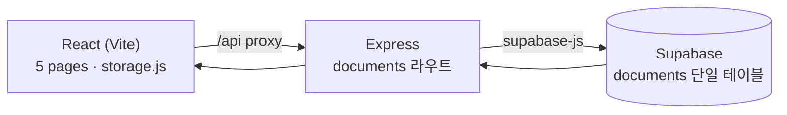

# 역기획소(respec) — 1주차 수직슬라이스 발표·데모

> 발표자: N011 권혁준 · 주제: Express + DB(Supabase) 핵심 — 라우트·REST·한 테이블 CRUD
> 함께 보기: [`PRESENTATION-week2.html`](./PRESENTATION-week2.html) (슬라이드 덱, 브라우저로 열기)

## 1. 한 줄 소개

게임 기획자 지망생이 **역기획서를 틀부터 배우고, 쓰고, 사람과 AI 양쪽에게 피드백받는** 웹 플랫폼. 이번 주는 그중 **작성 흐름을 화면 → Express → Supabase로 한 바퀴 실제 연결**했다.

## 2. 이번 주에 만든 것 (수직슬라이스)

지난 주까지는 목데이터·localStorage로 도는 클릭 프로토타입이었다. 이번 주에 **저장·조회를 실제 서버와 DB로** 옮겼다.

- **Express REST API** — `documents` 단일 테이블에 대한 CRUD 6개 라우트(목록·단건·생성·수정/발행·삭제·코멘트)
- **Supabase 연결** — 한 테이블에 저장·조회, 발행 시 게임·직군 태그 필수(DB 제약)
- **프론트-백엔드 연결** — `storage.js` 하나만 API 호출로 교체, 5개 페이지 async 전환
- **기능 검증 에이전트** — 저장→조회 왕복을 점검하는 서브에이전트를 만들어 이 슬라이스를 검증

## 3. 아키텍처 — 데이터가 흐르는 길



핵심 설계 3가지:

1. **교체 지점은 `frontend/src/lib/storage.js` 하나** — 함수 이름·시그니처를 유지한 채 localStorage를 async fetch로 바꿨다. 그래서 화면 코드는 `useEffect`/`await`만 손대면 됐다.
2. **camel↔snake 변환은 백엔드 경계에서 한 번** — `backend/src/lib/documents-mapper.js`. 프론트는 snake_case를 절대 보지 않고, `publishedAt`은 `yyyy-mm-dd`로 정규화한다.
3. **발행 = 같은 행의 status flip** — 초안(draft)을 지우고 새로 만드는 게 아니라, 한 행의 `status`를 `published`로 바꾼다. 코멘트·생성시각이 보존된다.

관련 파일: [`backend/src/routes/documents.js`](../backend/src/routes/documents.js) · [`backend/src/lib/documents-mapper.js`](../backend/src/lib/documents-mapper.js) · [`frontend/src/lib/storage.js`](../frontend/src/lib/storage.js) · [`.claude/agents/feature-verify.md`](../.claude/agents/feature-verify.md)

## 4. 라이브 데모 스크립트 (약 3분)

### 사전 준비

```bash
# 터미널 1 — 백엔드 (Supabase 키가 backend/.env 에 있어야 함)
cd backend && npm run dev      # http://localhost:4000

# 터미널 2 — 프론트엔드
cd frontend && npm run dev     # http://localhost:5173
```

브라우저로 http://localhost:5173 접속. 개발자도구 Network 탭을 열어두면 요청이 실제로 나가는 걸 보여줄 수 있다.

### 시연 순서

| # | 무엇을 하나 | 무엇을 보여주나 (증거) |
|---|---|---|
| 1 | **작성하기 → 시스템 템플릿** 선택, 섹션 가이드 보며 개요 작성 | 백지가 아니라 섹션 프리셋·가이드가 뜬다 |
| 2 | **임시저장** | Network 탭에 `POST /api/documents` **201** + 서버가 발급한 `uuid`. 마이페이지에 초안이 뜬다 |
| 3 | **AI 피드백 받기** | 섹션별 코멘트(모의)가 붙는다 |
| 4 | 게임·시스템 태그 채우고 **발행** | `PATCH`로 같은 행 status flip → `/archive/<uuid>`로 이동 |
| 5 | 상세에서 **섹션 코멘트 등록 → 새로고침(F5)** | 코멘트가 **그대로 유지** — 화면 상태가 아니라 DB에 저장됐다는 증거 |
| 6 | **둘러보기(아카이브)·마이페이지** | 방금 문서 카드 + 시드 데모 문서, "받은 피드백" 수 반영 |
| 7 | **DB 증거** | Supabase 대시보드 `documents` 테이블, 또는 아래 curl |

### 저장 증명용 curl (백엔드만으로)

```bash
# 발행 문서 목록 — 실제 DB에서 온 응답
curl "http://localhost:4000/api/documents?status=published"

# 태그 없이 발행 시도 → 400 (publish_requires_tags 제약이 막는다)
curl -X POST http://localhost:4000/api/documents \
  -H "content-type: application/json" \
  -d '{"status":"published","title":"태그없음","sections":[]}'
```

### 데모가 안 뜰 때 대비

서버가 안 뜨면 슬라이드 덱([`PRESENTATION-week2.html`](./PRESENTATION-week2.html))의 "증거" 슬라이드에 응답 예시와 검증 결과가 있으니, 흐름은 그것으로 설명할 수 있다. 데모용 문서 1건은 미리 DB에 시드해 두었다("메이플스토리 스타포스 강화 역기획").

## 5. "화면만 바뀐 것" 아님 — 검증 결과

- **feature-verify 에이전트: 7개 요구사항 전부 PASS** — health·저장/조회 왕복·발행 status flip·`publish_requires_tags` 가드·코멘트 매핑·비-uuid 404·프론트 async 연동
- **헤드리스 브라우저 E2E**: 작성→임시저장→이어쓰기 복원→발행→상세 코멘트→**새로고침 후 유지**→아카이브·마이페이지 반영 전부 통과
- **실제 Supabase 행 확인**: 한글·snake_case(`is_ai`/`section_id`/`published_at`)·sections 7개·코멘트까지 온전히 저장

## 6. 이번 주 Task 현황 (2주차 마일스톤)

**P0 전부 완료:**

- [x] #3 Supabase 프로젝트 + `documents` 단일 테이블
- [x] #4 backend Supabase 클라이언트 연결
- [x] #5 문서 저장 API (`POST`/`GET /api/documents`)
- [x] #6 기능 검증 Agent 생성
- [x] #7 `storage.js` → API 교체
- [x] #8 EditorPage 초안 저장 DB 연결
- [x] #9 검증 Agent로 저장 경로 점검
- [x] #10 발행 API + 발행 조건(게임·직군 태그 필수)
- [x] #11 DocumentDetailPage 조회를 DB에서
- [x] #12 수직슬라이스 E2E 검증 + PR

**이월:**

- [ ] #13 마크다운 에디터 라이브러리 검토 (P1) → 다음 주로

## 7. 다음 주 — 3주차 커뮤니티

- 아카이브·상세를 실제 데이터로 확장 (이번 주 토대 위에서)
- 섹션별 코멘트 — 저장은 이미 되니 조회·알림으로 확장
- 좋아요/북마크 영속화 (현재 임시 상태)
- 이월: 로그인·회원가입, 마크다운 에디터 라이브러리
