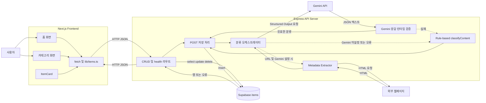
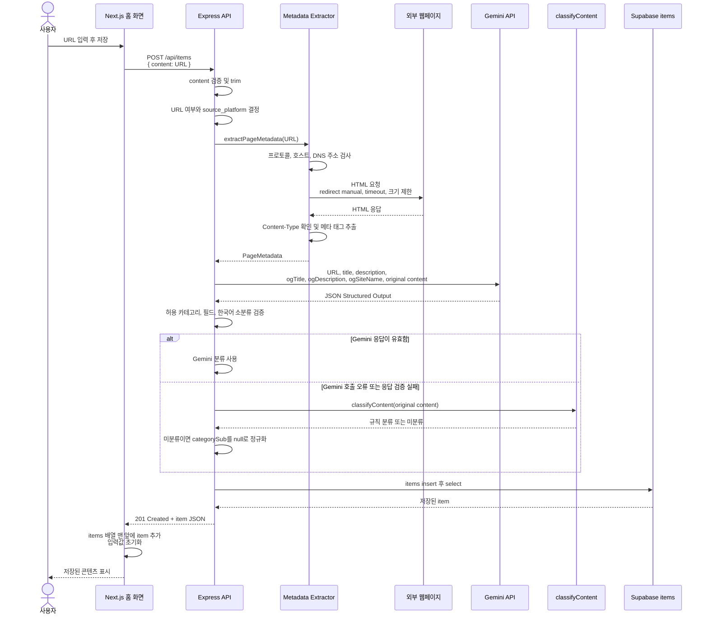

# Later 서비스 구조 및 데이터 흐름

## 프로젝트 개요

Later는 나중에 다시 보고 싶은 URL이나 텍스트를 저장하고, 저장된 항목을 대분류와
소분류로 자동 분류해 다시 찾기 쉽게 보여주는 서비스다. 현재 홈 화면에서는 항목을
생성·조회·수정·삭제할 수 있고, 카테고리 화면에서는 저장된 항목을 분류별로 필터링할
수 있다.

## 주요 구성 요소

| 구성 요소 | 실제 역할 |
| --- | --- |
| User | 홈 화면에 URL 또는 텍스트를 입력하고 저장된 항목을 조회·수정·삭제한다. |
| Next.js Frontend | `app/page.tsx`와 `app/categories/page.tsx`에서 Express API를 `fetch`로 호출하고 응답을 React 상태에 반영한다. API 기준 주소는 `NEXT_PUBLIC_API_BASE_URL`이며 기본값은 `http://localhost:4000`이다. |
| Express API Server | `server/index.ts`에서 입력 검증, 분류 흐름 조정, Supabase CRUD, CORS 및 HTTP 응답 처리를 담당한다. |
| Metadata Extractor | `server/metadata.ts`에서 URL의 HTML을 가져와 `title`, `description`, `og:title`, `og:description`, `og:site_name`, `og:type`을 추출한다. Gemini 입력에는 이 중 `og:type`을 제외한 값이 전달된다. |
| Gemini Classification | `server/geminiClassification.ts`에서 `@google/genai`의 `models.generateContent`를 호출한다. JSON Schema 출력과 별도의 런타임 검증을 모두 통과한 분류만 사용한다. |
| Rule-based Fallback | 같은 파일의 `classifyWithFallback`이 Gemini 미설정·호출 오류·잘못된 응답 시 `server/classification.ts`의 도메인/키워드 규칙을 사용한다. 규칙도 분류하지 못하면 `미분류 / null`로 정규화한다. |
| Supabase | Express 서버가 `SUPABASE_URL`과 `SUPABASE_SERVICE_ROLE_KEY`로 서버 전용 클라이언트를 생성해 `items` 테이블을 조회·삽입·수정·삭제한다. |

`lib/supabaseClient.ts`에도 브라우저용 Supabase 클라이언트 선언이 존재하지만 현재
애플리케이션 코드에서는 import되지 않는다. 현재의 실제 데이터 경로는 프론트엔드가
Supabase에 직접 접근하는 방식이 아니라, 항상 Express API를 거치는 방식이다.

## 서비스 아키텍처



메타데이터 추출은 입력이 HTTP/HTTPS URL이고 `GEMINI_API_KEY`와 `GEMINI_MODEL`이
모두 설정된 경우에만 실행된다. Gemini를 사용하지 않는 경우에는 URL 원문을 바로
규칙 기반 분류기로 전달한다.

## URL 콘텐츠 저장 흐름

다음 다이어그램은 Gemini 환경 변수가 설정된 상태에서 유효한 URL을 저장하는 실제
흐름을 나타낸다.



메타데이터 추출 중 오류가 발생하면 Express가 경고를 남기고 `metadata=null`인 상태로
URL 원문을 Gemini에 전달한다. 따라서 메타데이터 실패만으로 저장 요청이 실패하지
않는다.

## 콘텐츠 조회 흐름

홈과 카테고리 화면은 마운트될 때 각각 `GET /api/items`를 호출한다. Express는
`items` 테이블에서 아래 열을 선택하고 `created_at` 내림차순으로 반환한다.

```text
id, title, original_url, source_platform, category_main, category_sub, created_at
```

홈 화면은 응답을 최근 저장 목록으로 표시한다. 카테고리 화면은 같은 응답을
클라이언트에서 대분류·소분류별로 집계하고 필터링하며, 별도의 카테고리 API는 없다.

## CRUD 데이터 흐름

| Method | Endpoint | 역할 | 주요 입력 | 주요 출력 | 오류 및 fallback |
| --- | --- | --- | --- | --- | --- |
| `GET` | `/` | API 안내 | 없음 | `{ message, health, items }`, `200` | 별도 오류 처리 없음 |
| `GET` | `/health` | 서버 헬스 체크 | 없음 | `{ "status": "ok" }`, `200` | 별도 오류 처리 없음 |
| `GET` | `/api/items` | 콘텐츠 목록 조회 | 없음 | 최신순 item 배열, `200` | Supabase 또는 설정 오류 시 `500` |
| `POST` | `/api/items` | URL 또는 텍스트 분류 및 저장 | JSON `{ "content": string }` | 생성된 item, `201` | 입력 오류 `400`; Gemini·메타데이터 실패는 아래 fallback 적용; Supabase 오류 `500` |
| `PATCH` | `/api/items/:id` | 제목 수정 | 양의 정수 `id`, JSON `{ "title": string }` | 수정된 item, `200` | 잘못된 ID·제목 `400`, 대상 없음 `404`, Supabase 오류 `500` |
| `DELETE` | `/api/items/:id` | 콘텐츠 삭제 | 양의 정수 `id` | `{ "success": true, "id": number }`, `200` | 잘못된 ID `400`, 대상 없음 `404`, Supabase 오류 `500` |
| `PATCH` | `/api/items` | ID 없는 수정 요청 거부 | 없음 | `{ "error": "id가 필요합니다." }`, `400` | DB 호출 없음 |
| `DELETE` | `/api/items` | ID 없는 삭제 요청 거부 | 없음 | `{ "error": "id가 필요합니다." }`, `400` | DB 호출 없음 |

수정과 삭제에서 ID가 양의 안전 정수가 아니면 `400`, 대상 행이 없으면 `404`를
반환한다. Supabase 작업 또는 서버 설정 오류는 `500`으로 반환된다.

## 오류 및 fallback 흐름

| 상황 | 현재 구현 동작 |
| --- | --- |
| `content`가 문자열이 아니거나 공백뿐임 | 메타데이터·분류·DB 호출 없이 `400`과 `{ "error": "content는 비어 있지 않은 문자열이어야 합니다." }`를 반환한다. |
| 입력 문자열이 유효한 HTTP/HTTPS URL이 아님 | 요청을 거부하지 않는다. 일반 텍스트로 취급해 `source_platform="manual"`, `original_url=null`, `type="text"`로 저장하며 Gemini가 설정돼 있으면 원문만 전달한다. |
| Gemini 환경 변수가 하나라도 없음 | 서버는 정상 시작한다. Gemini와 메타데이터 추출을 건너뛰고 `classifyContent()`를 사용한다. |
| 메타데이터 추출 실패 | 오류를 응답으로 반환하지 않는다. 경고를 기록하고 URL 원문 및 빈 메타데이터로 Gemini 분류를 계속한다. |
| Gemini API 호출 실패 또는 빈/JSON 파싱 불가 응답 | `classifyWithFallback()`이 오류를 잡고 `classifyContent()`를 실행한다. |
| Gemini Structured Output이 런타임 검증에 실패 | 허용되지 않은 대분류, 추가 필드, `null` 소분류, 영문 소분류, 30자 초과 소분류 등은 거부하고 `classifyContent()`를 실행한다. 단, 대분류가 `미분류`이면 소분류 입력값과 관계없이 `null`로 정규화한다. |
| Rule-based 분류도 일치하지 않음 | `classifyContent()`의 `미분류 / 기타` 결과를 최종적으로 `미분류 / null`로 정규화한다. |
| Supabase 저장 실패 | 저장 fallback이나 재시도는 구현되어 있지 않다. 서버 로그를 남기고 `500`과 `{ "error": "항목을 저장하지 못했습니다." }`를 반환한다. 환경변수 미설정 오류는 해당 설정 오류 메시지를 반환한다. |
| 프론트엔드가 Express에 연결하지 못함 | 화면에 Express 서버와 CORS 설정을 확인하라는 오류 메시지를 표시한다. 자동 재시도는 구현되어 있지 않다. |

메타데이터 추출기는 HTTP/HTTPS만 허용하고, URL 인증 정보와 localhost·사설 IP를
거부한다. DNS 결과와 redirect 목적지를 다시 검사하며, 기본 5초 timeout, 1MB 응답
크기, 최대 5회 redirect, HTML Content-Type 제한을 적용한다.

## 환경 변수

### Express 서버: `server/.env`

실제 키 값은 저장소에 커밋하지 않는다. 이름과 기본 동작은
`server/.env.example` 및 서버 코드를 기준으로 한다.

| 변수 | 필수 여부 | 용도와 기본 동작 |
| --- | --- | --- |
| `PORT` | 선택 | Express 포트. 미설정 시 `4000` |
| `CLIENT_ORIGIN` | 선택 | 허용할 프론트엔드 origin의 쉼표 구분 목록. 미설정 시 `http://localhost:3000` |
| `SUPABASE_URL` | DB 사용에 필수 | 서버가 접속할 Supabase 프로젝트 URL |
| `SUPABASE_SERVICE_ROLE_KEY` | DB 사용에 필수 | 서버 전용 Supabase service-role 키 |
| `GEMINI_API_KEY` | Gemini 사용 시 필수 | Gemini API 인증 키 |
| `GEMINI_MODEL` | Gemini 사용 시 필수 | 호출할 Gemini 모델명. 코드 기본값은 없다. |

`GEMINI_API_KEY`와 `GEMINI_MODEL` 중 하나라도 없으면 Gemini 분류를 비활성화하고
규칙 기반 분류만 사용한다.

### Next.js 프론트엔드: `.env.local`

| 변수 | 필수 여부 | 용도와 기본 동작 |
| --- | --- | --- |
| `NEXT_PUBLIC_API_BASE_URL` | 선택 | Express API 기준 주소. 미설정 시 `http://localhost:4000` |

`lib/supabaseClient.ts`는 `NEXT_PUBLIC_SUPABASE_URL`과
`NEXT_PUBLIC_SUPABASE_ANON_KEY`를 참조하지만 현재 import되지 않으므로 현행
사용자 흐름에는 사용되지 않는다.

## 코드 위치

| 영역 | 파일 |
| --- | --- |
| 홈 및 API 호출 | `app/page.tsx` |
| 카테고리 화면 및 클라이언트 필터링 | `app/categories/page.tsx` |
| 항목 수정·삭제 UI | `app/ItemCard.tsx` |
| API 기준 주소와 공통 응답 타입 | `lib/items.ts` |
| Express 라우트와 Supabase CRUD | `server/index.ts` |
| URL 메타데이터 추출 | `server/metadata.ts` |
| Gemini 호출·검증·fallback 조정 | `server/geminiClassification.ts` |
| 도메인·키워드 규칙 분류 | `server/classification.ts` |
