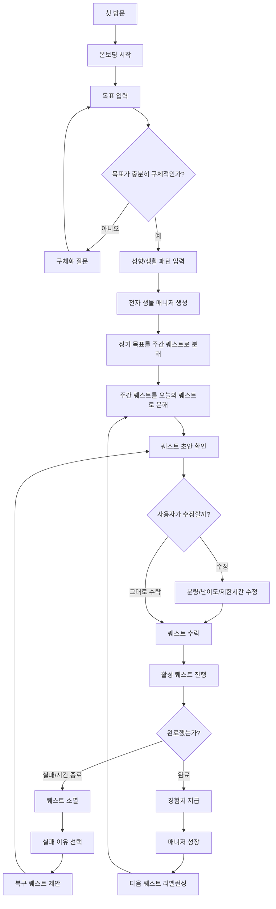
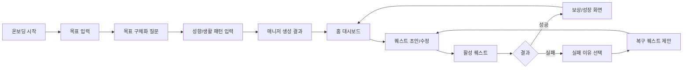

# 나를 믿는 너를 믿어 - User Flow / 화면 목록 / 와이어프레임

## 1. User Flow

### 핵심 루프



### 사용자 시나리오 예시

목표: 정보처리기사 자격증 취득

1. 사용자가 앱에 처음 접속한다.
2. 목표 입력 화면에서 `정보처리기사 자격증 취득`을 입력한다.
3. 앱은 목표가 너무 넓으면 시험 날짜, 하루 공부 가능 시간, 현재 수준을 질문한다.
4. 사용자는 하루 30분, 필기 중심, 데이터베이스가 약하다고 입력한다.
5. 전자 생물 매니저가 생성된다.
6. 매니저는 장기 목표를 주간 퀘스트로 나눈다.
7. 주간 퀘스트에서 오늘 수행 가능한 일일 퀘스트를 제안한다.
8. 사용자는 퀘스트를 수락하기 전에 분량과 제한 시간을 조정한다.
9. 사용자가 퀘스트를 완료하면 매니저가 경험치를 얻는다.
10. 실패하면 퀘스트는 소멸하고, 매니저는 실패 이유를 바탕으로 복구 퀘스트를 제안한다.

## 2. 화면 목록

| 우선순위 | 화면 | 목적 | MVP 여부 |
|---:|---|---|---|
| 1 | 온보딩 시작 화면 | 서비스 컨셉과 전자 생물 매니저의 정체성 전달 | MVP |
| 2 | 목표 입력 화면 | 장기 목표와 목표 카테고리 입력 | MVP |
| 3 | 목표 구체화 질문 화면 | 추상적인 목표를 실행 가능한 목표로 바꿈 | MVP |
| 4 | 성향/생활 패턴 입력 화면 | 하루 가능 시간, 난이도 선호, 동기부여 방식 수집 | MVP |
| 5 | 매니저 생성 결과 화면 | 전자 생물 매니저 타입과 초기 상태 표시 | MVP |
| 6 | 홈 대시보드 | 매니저 상태, 오늘 퀘스트, 경험치, 진행률 표시 | MVP |
| 7 | 퀘스트 초안/수정 화면 | AI가 만든 퀘스트를 사용자가 수락 전 조정 | MVP |
| 8 | 활성 퀘스트 화면 | 남은 시간, 수행 조건, 완료/실패 처리 | MVP |
| 9 | 퀘스트 결과 화면 | 성공 보상 또는 실패 이유 선택 | MVP |
| 10 | 복구 퀘스트 제안 화면 | 실패 후 낮은 부담의 재도전 퀘스트 제안 | MVP |
| 11 | 목표 관리 화면 | 장기 목표와 주간 퀘스트 목록 관리 | 1차 확장 |
| 12 | 주간 리포트 화면 | 성공률, 실패 패턴, 다음 주 추천 확인 | 2차 확장 |
| 13 | 매니저 성장/꾸미기 화면 | 외형 변화, 아이템, 말투 변화 확인 | 2차 확장 |

## 3. MVP 화면 흐름



## 4. 화면별 와이어프레임

### 4.1 온보딩 시작 화면

```text
┌──────────────────────────────────────────────┐
│ 나를 믿는 너를 믿어                          │
│                                              │
│ 나의 목표를 퀘스트로 바꾸고,                 │
│ 전자 생물 매니저와 함께 성장하는 웹앱        │
│                                              │
│        [시작하기]                            │
│                                              │
│ 작은 성취가 매니저의 성장으로 돌아옵니다.    │
└──────────────────────────────────────────────┘
```

핵심 의도:
- 첫 화면에서 단순 일정 앱이 아니라 전자 생물 매니저와 함께 성장하는 앱임을 전달한다.
- 푸시 알림이나 강제성보다 “기다리는 존재”의 감정을 보여준다.

### 4.2 목표 입력 화면

```text
┌──────────────────────────────────────────────┐
│ 어떤 목표를 함께 키워볼까?                   │
│                                              │
│ 목표 입력                                    │
│ [ 정보처리기사 자격증 취득              ]    │
│                                              │
│ 카테고리                                     │
│ [공부] [운동] [취미] [커리어] [생활습관]     │
│                                              │
│ 목표 기간                                    │
│ [ 6주 ]                                      │
│                                              │
│                         [다음]               │
└──────────────────────────────────────────────┘
```

핵심 의도:
- 장기 목표를 입력받는다.
- 목표가 추상적이면 다음 화면에서 구체화 질문으로 넘긴다.

### 4.3 목표 구체화 질문 화면

```text
┌──────────────────────────────────────────────┐
│ 목표를 조금 더 구체화해볼게                  │
│                                              │
│ "정보처리기사 자격증 취득"을 위해            │
│ 먼저 어떤 부분부터 시작할까?                 │
│                                              │
│ ○ 필기 이론                                  │
│ ○ 기출 문제                                  │
│ ○ 실기 준비                                  │
│ ○ 아직 모르겠음                              │
│                                              │
│ 하루에 사용할 수 있는 시간                   │
│ [ 30분 ]                                     │
│                                              │
│                         [퀘스트 만들기]      │
└──────────────────────────────────────────────┘
```

핵심 의도:
- “멋진 사람이 되고 싶다” 같은 추상 목표도 실행 가능한 형태로 좁힌다.
- AI가 바로 퀘스트를 만들지 않고 필요한 질문을 먼저 던진다.

### 4.4 매니저 생성 결과 화면

```text
┌──────────────────────────────────────────────┐
│ 너의 전자 생물 매니저가 깨어났어             │
│                                              │
│              ◇ 루미 ◇                       │
│          전자 생물형 페이스메이커            │
│                                              │
│ 레벨 1   EXP 0 / 100                         │
│ 상태: 첫 퀘스트를 기다리는 중                │
│                                              │
│ "네 목표를 오늘 할 수 있는 크기로 나눠볼게." │
│                                              │
│                         [홈으로 가기]        │
└──────────────────────────────────────────────┘
```

핵심 의도:
- 매니저는 현실 동물이 아니라 전자 생물이다.
- 나약한 보호 대상이 아니라 사용자의 목표를 함께 밀어주는 페이스메이커다.

### 4.5 홈 대시보드

```text
┌────────────────────────────────────────────────────────┐
│ 나를 믿는 너를 믿어                         [목표 관리] │
├───────────────────────┬────────────────────────────────┤
│ 매니저 상태           │ 오늘의 퀘스트                   │
│                       │                                │
│  ◇ 루미 ◇             │ 정보처리기사 DB 개념 15분 공부  │
│  Lv. 1                │ 유형: 시간형                    │
│  EXP 20 / 100         │ 보상: EXP 20                    │
│  상태: 대기 중        │ 제한: 오늘 23:59                │
│                       │                                │
│ "기다리고 있었어."    │ [수정] [수락]                   │
├───────────────────────┴────────────────────────────────┤
│ 이번 주 목표: 데이터베이스 과목 1회독                  │
│ 진행률: 2 / 5 퀘스트 완료                              │
└────────────────────────────────────────────────────────┘
```

핵심 의도:
- 사용자가 돌아왔을 때 매니저가 기다리고 있다는 느낌을 준다.
- 오늘의 퀘스트와 매니저 성장을 한 화면에서 연결한다.

### 4.6 퀘스트 초안/수정 화면

```text
┌──────────────────────────────────────────────┐
│ 오늘의 퀘스트를 확인해줘                     │
│                                              │
│ 제목                                         │
│ [ 데이터베이스 개념 15분 공부 ]              │
│                                              │
│ 유형                                         │
│ [시간형 ▼]                                   │
│                                              │
│ 분량                                         │
│ [15분]                                       │
│                                              │
│ 난이도                                       │
│ [쉬움] [보통] [어려움]                       │
│                                              │
│ 예상 보상: EXP 20                            │
│                                              │
│                         [수락하기]           │
└──────────────────────────────────────────────┘
```

핵심 의도:
- AI가 만든 퀘스트를 사용자가 그대로 받지 않고 조정할 수 있다.
- 수락 전 수정이 핵심 안전장치다.

### 4.7 활성 퀘스트 화면

```text
┌──────────────────────────────────────────────┐
│ 활성 퀘스트                                  │
│                                              │
│ 데이터베이스 개념 15분 공부                  │
│                                              │
│ 남은 시간: 04:21:33                          │
│ 보상: EXP 20                                 │
│ 유형: 시간형                                 │
│                                              │
│ [완료했어]                 [포기/실패 처리]  │
│                                              │
│ 루미: "끝까지 기다릴게. 네 속도로 해."        │
└──────────────────────────────────────────────┘
```

핵심 의도:
- 퀘스트를 수행 중인 상태를 명확히 보여준다.
- 완료/실패 판단은 MVP에서 사용자 직접 입력을 기본으로 한다.

### 4.8 퀘스트 결과 화면

```text
┌──────────────────────────────────────────────┐
│ 퀘스트 완료                                  │
│                                              │
│ 데이터베이스 개념 15분 공부                  │
│                                              │
│ 획득 보상: EXP +20                           │
│ 루미 레벨: 1                                 │
│ EXP: 40 / 100                                │
│                                              │
│ 루미: "오늘의 작은 성공이 쌓였어."            │
│                                              │
│                         [다음 퀘스트 보기]   │
└──────────────────────────────────────────────┘
```

실패 시:

```text
┌──────────────────────────────────────────────┐
│ 퀘스트가 소멸했어                            │
│                                              │
│ 실패 이유를 알려줘                           │
│ ○ 시간이 부족했다                            │
│ ○ 목표가 너무 컸다                           │
│ ○ 집중이 안 됐다                            │
│ ○ 컨디션이 좋지 않았다                       │
│ ○ 까먹었다                                   │
│                                              │
│                         [복구 퀘스트 받기]   │
└──────────────────────────────────────────────┘
```

핵심 의도:
- 실패를 비난하지 않고 리밸런싱 데이터로 전환한다.

### 4.9 복구 퀘스트 제안 화면

```text
┌──────────────────────────────────────────────┐
│ 다시 시작할 수 있는 크기로 줄였어             │
│                                              │
│ 기존 퀘스트                                  │
│ 데이터베이스 개념 15분 공부                  │
│                                              │
│ 복구 퀘스트                                  │
│ 데이터베이스 핵심 개념 5분 읽기              │
│                                              │
│ 보상: EXP 5                                  │
│                                              │
│ [수정]                         [수락하기]    │
└──────────────────────────────────────────────┘
```

핵심 의도:
- 실패 후 바로 낮은 부담의 재도전 루프를 제공한다.
- 실패가 누적돼도 사용자가 앱을 떠나지 않게 한다.

## 5. 핵심 기능 2개

### 1. 목표 -> 퀘스트 생성

이 기능은 서비스의 정체성이다. 사용자가 장기 목표를 입력하면 전자 생물 매니저가 주간/일일 퀘스트로 쪼개준다. 단순 일정 앱이 아니라 목표를 게임식 데이터로 변환하는 앱이 되는 지점이다.

### 2. 퀘스트 결과 -> 매니저 성장/복구

이 기능은 감정적 루프다. 사용자가 성공하면 매니저도 성장하고, 실패하면 매니저가 다시 수행 가능한 복구 퀘스트를 제안한다. 이 루프가 있어야 제목인 `나를 믿는 너를 믿어`가 살아난다.

## 6. 햇살하루 백업 전략

햇살하루는 삭제하지 않고 backup으로 두는 것이 좋다.

추천 방식:

1. 현재 햇살하루 작업은 이미 commit/push된 상태이므로 Git 기록에 남아 있다.
2. 새 프로젝트로 대체하기 전, 필요하면 `backup/haetsalharu` 브랜치를 만들어 보관한다.
3. 같은 제출 브랜치에서 새 프로젝트를 진행해야 한다면, 햇살하루 코드는 별도 백업 브랜치에 두고 현재 브랜치에서는 새 프로젝트로 교체한다.
4. wiki에는 새 프로젝트 기획을 중심으로 작성하고, 햇살하루는 이전 아이디어 또는 backup으로만 언급한다.

권장 결론:

```text
햇살하루는 backup으로 보존하고,
현재 제출/기획의 메인은 "나를 믿는 너를 믿어"로 전환한다.
```

## 7. Wiki 업로드 위치

기획 문서는 fork한 저장소의 Wiki에 두는 것이 좋다.

권장 위치:

```text
YIFNEN/hub Wiki
```

권장 Wiki 페이지 구성:

1. Home
   - 프로젝트 한 줄 소개
   - 핵심 문제 정의
   - MVP 요약
2. Project Plan
   - 문제 정의
   - 사용자 시나리오
   - 핵심 기능
   - 우선순위
3. User Flow and Wireframes
   - User Flow
   - 화면 목록
   - 와이어프레임
4. Agent Design
   - 목표 해석 Agent
   - 퀘스트 생성 Agent
   - 리밸런싱 Agent
   - 피드백 Agent

