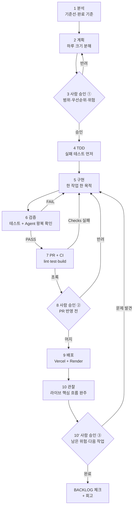
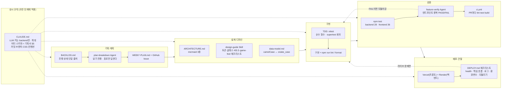

# 나의 개발 워크플로우 — 순서와 확인 기준

> 4주간 respec을 만들면서 **실제로 반복된 절차**를 적은 문서다. 앞으로 할 일의 계획표가 아니라, 이미 여러 번 돌려본 순서를 다음 프로젝트에서도 쓸 수 있게 고정한 것이다.
> 진행 상태의 단일 출처는 [`BACKLOG.md`](./BACKLOG.md), 구조·데이터 흐름은 [`ARCHITECTURE.md`](./ARCHITECTURE.md), 배포 설정은 [`DEPLOY.md`](./DEPLOY.md)다. 이 문서는 **그 문서들을 어떤 순서로 쓰는지**를 다룬다.

## 1. 워크플로우를 왜 문서로 만드나

작업 목록(=BACKLOG)만 있으면 "무엇을 할지"는 알지만 "어디까지 하면 끝인지"와 "실패했을 때 어디로 돌아갈지"는 매번 새로 판단해야 한다. 4주 동안 같은 판단을 반복하다 실제로 다음 문제를 겪었다.

- 화면이 그려지면 "됐다"고 넘어갔는데, 실제로는 DB까지 왕복하지 않은 경우가 있었다 → **완료 기준을 "FE→BE→DB 한 바퀴가 관찰될 때"로 못 박고, 그 검사를 Agent에게 시켰다.**
- 디자인 스타일을 세 번 갈아엎으면서 판단 기준이 머릿속에만 있었다([`my-first-skill-design-guide.md`](./my-first-skill-design-guide.md)) → **기준을 Skill 체크리스트로 옮겼다.**
- 주차 목표를 손으로 쪼개다 보니 크리티컬 패스(사용자 Supabase 키)를 늦게 발견했다([`WEEK2-PLAN.md`](./WEEK2-PLAN.md) §Agent 리뷰 비교) → **분해를 Agent에게 독립으로 한 번 더 시키고 내 계획과 비교했다.**

그래서 이 문서는 단계마다 **입력 / 하는 일 / 확인 기준 / 결과물 / 실패 시 돌아갈 곳** 다섯 칸을 채우는 형식으로 썼다.

## 2. 단계별 절차

| 단계 | 입력 | 하는 일 | 확인 기준(이게 되면 통과) | 결과물 | 실패 시 돌아갈 곳 |
|---|---|---|---|---|---|
| **1 분석** | 주차 목표, `project-plan.md`, 지난 주 이월분 | 이번 주 기준선 한 문장으로 정하고, 바꿀 파일·데이터·제약을 적는다 | 완료 기준이 **눈으로 판정 가능한 문장**이다("API 만들기" ✕ / "저장→조회 왕복이 sections 포함해 확인된다" ○) | BACKLOG 주차 섹션 갱신 | — |
| **2 계획** | 1의 기준선 | `plan-breakdown` Agent로 하루 크기 작업 분해 → 내 계획과 비교 → 이견을 문서에 남기고 GitHub Issue 등록 | 작업이 하루 크기이고, 의존·순서·**컷 순서**가 붙어 있다 | `WEEK*-PLAN.md`, 이슈 | 1 (기준선이 흔들리면) |
| **3 사람 승인 ①** | 2의 표 | 범위·우선순위·위험을 내가 확정한다. Agent 이견은 채택/기각을 근거와 함께 기록 | 범위 밖 항목이 "이월"로 명시됐다 | 승인된 계획 | 2 |
| **4 TDD** | 승인된 작업 1개 | 순수 함수는 실패 테스트부터(`autosave.js`·`documents-mapper.js`), 라우트는 supertest 회귀 테스트부터 | 새 테스트가 **먼저 실패**했고, 최소 구현으로 통과한다 | `*.test.js(x)` | 3 (요구사항이 모호하면) |
| **5 구현** | 4의 테스트 | 한 작업에 한 목적만. 계획에 없는 변경은 멈추고 보고 | 관련 테스트 + `npm run lint`가 통과한다 | 커밋(Conventional Commits) | 4 |
| **6 검증** | 구현된 기능 + 요구사항 목록 | ① `npm test` 양쪽 ② `feature-verify` Agent로 엔드포인트 왕복 ③ 새 화면이면 `design-guide` Skill 점검 | Agent 보고가 **요구사항별 PASS**(하나라도 FAIL이면 전체 FAIL, 검증이 막히면 BLOCKED) | PASS/FAIL 표 | 5 (FAIL), 3 (요구사항 자체가 틀렸으면) |
| **7 PR + CI** | 검증 통과분 | PR 생성 → [`ci.yml`](../.github/workflows/ci.yml)이 backend test / frontend lint·test·build를 자동 실행 | Checks 전부 초록 + 내가 diff를 읽었다 | PR, CI 로그 | 5 |
| **8 사람 승인 ②** | PR + CI 결과 | 코드·테스트 결과를 내가 확인하고 머지 | BACKLOG 체크가 실제 파일과 일치한다 | 머지 커밋 | 7 |
| **9 배포** | 머지된 `main` | Vercel(프론트)·Render(백엔드) 자동 배포. 환경변수·주소는 `DEPLOY.md` 표대로 | `/api/health` → `db:ok`, 프론트 200, 번들이 Render 주소를 호출 | 라이브 주소 | 8 |
| **10 관찰 + 사람 승인 ③** | 라이브 주소 | 핵심 흐름을 **실제 사용자처럼** 1회 완주하고, 남은 위험을 적는다 | 로그인→작성→발행→AI 채점→리더보드가 라이브에서 끝까지 돈다 | `DEPLOY.md` 검증 기록, 알려진 한계 목록 | 9 (설정), 5 (버그) |

**핵심 규칙 하나**: 6단계의 완료 기준은 "코드가 그럴듯하다"가 아니라 "요청이 backend를 거쳐 DB에 저장되고 다시 조회되어 화면 데이터로 돌아오는 한 바퀴가 관찰됐다"다. 이 한 줄이 이 워크플로우의 중심이고, `feature-verify` Agent의 판정 기준을 그대로 이 문장으로 썼다.

## 3. 개발 루프 (사람 승인 지점 포함)

사람이 멈춰 서는 지점은 셋뿐이다 — **계획 뒤 / PR 반영 전 / 배포 뒤**. 그 사이는 Agent와 도구가 돌리고, 나는 결과만 판정한다. (DB 스키마를 바꾸는 작업은 여기에 하나를 더 넣는다: `schema.sql` 적용 전 데이터 손실·권한 확인. 3주차 RLS 활성화와 `reactions` 테이블 추가에서 그렇게 했다.)

## 4. Agent·Skill 협업 배치 (누가 어디에 붙어 있나)

실제로 만들어 쓴 것은 **Agent 2개 + Skill 1개**뿐이다. 셋 다 공통 설계 원칙이 하나 있다: **판단 근거를 프로젝트 문서에서 먼저 읽게 한다.** 그래서 같은 질문에 매번 다른 기준으로 답하지 않는다.

| 도구 | 종류 | 언제 | 입력 | 출력 | 하지 않는 일 |
|---|---|---|---|---|---|
| [`plan-breakdown`](../.claude/agents/plan-breakdown.md) | Agent | 주간 계획 세울 때 | 주차 목표 + BACKLOG·기획서·CLAUDE.md | 작업/우선순위/순서/완료 기준/의존/요일 **표 1개** + 컷 순서 + 이견 | 파일 생성·수정, 이슈 등록, 우선순위 임의 변경 |
| [`feature-verify`](../.claude/agents/feature-verify.md) | Agent | "다 됐다"고 말하기 직전 | 검증할 기능 + 요구사항 목록 | 요구사항별 PASS/FAIL 표 + 종합 판정(PASS/FAIL/BLOCKED) + 재현 커맨드 | 코드 수정, 파괴적 DB 작업, "아마 됐을 것" 판정 |
| [`design-guide`](../.claude/skills/design-guide/SKILL.md) | Skill | 새 화면 만들거나 고칠 때 | 완성된 화면 + design-tokens.css·DESIGN_SYSTEM.md | 8항목 체크리스트 점검 결과 | 색·radius 즉흥 결정(토큰에 없으면 토큰부터 추가) |

## 5. 사람이 결정한 것 vs AI가 수행한 것

| 구분 | 사람(나) | AI(Agent·Claude Code) |
|---|---|---|
| 문제·범위 | 무슨 문제를 풀지, 무엇을 MVP에서 뺄지(기획서 §8), 일정이 밀릴 때 자르는 순서 | 요구사항을 하루 크기 작업으로 분해, 누락·크리티컬 패스 지적 |
| 우선순위 | P0/P1/P2 확정. Agent 이견의 채택·기각(예: 마크다운 에디터 라이브러리를 P0→P1로 내린 것은 내 판단) | 이견을 근거와 함께 "비고"로 제안 |
| 설계 | 데이터 모델·인증 방식·"프론트는 Supabase를 인증에만 직접 쓴다"는 경계 결정 | 스키마 초안, 다이어그램 작성, 매핑표 정리 |
| 디자인 | 스타일 방향(쿨톤 글래스, 강조색은 gold 하나), "인스타그램 같다"류 감각 판정 | 토큰 기반 구현, 체크리스트 자체 점검 |
| 구현 | 완료 인정 여부 | 테스트·코드 초안 작성, 리팩터, 포맷 |
| 검증 | 라이브에서 실제 사용자처럼 써보고 "쓸 만한가" 판정 | 엔드포인트 왕복 확인, 회귀 테스트 작성, PASS/FAIL 보고 |
| 배포 | 배포 시점, 되돌릴지 여부, 비밀값 취급 | 설정 문서화, 환경변수 표, 검증 커맨드 실행 |

가장 크게 남은 것은 **아키텍처 다이어그램을 AI와 함께 그리는 과정에서 "클라이언트가 보낸 값을 서버가 그대로 믿는" 문제를 7건 짚어낸 일**이다([`ARCHITECTURE.md`](./ARCHITECTURE.md) §4 — 6건은 고치고 1건은 "의도된 설계"로 확정). 코드를 읽는 것만으로는 안 보였고, 화살표마다 "이 값은 누가 정하나"를 설명하게 만들자 드러났다. 발견은 AI가 했고, 무엇을 먼저 막을지와 403이 아니라 404로 숨기는 판단은 내가 했다. 고친 뒤에는 전부 회귀 테스트를 붙였다.

## 6. 실패했을 때 (복구 순서)

**오류 화면 → 로그 → 원인 후보 → 수정 → 테스트 → 재배포.** 4주간 실제로 이 경로를 탄 사례:

| 증상 | 로그·관찰 | 원인 | 조치 |
|---|---|---|---|
| Vercel 배포가 거부됨 | Vercel 빌드 로그 | Hobby 플랜이 `Co-Authored-By` 트레일러를 "협업 커밋"으로 판정 | 단일 작성자 커밋 + 커밋 이메일 GitHub 인증 |
| 배포본이 API를 못 찾음 | 브라우저 Network(상대경로 `/api` 404) | `VITE_API_URL` 미설정 → 프론트가 자기 도메인을 호출 | Render 주소 + `/api`를 Vercel 환경변수에 넣고 재배포 |
| 첫 요청이 50초 걸림 | Render 로그(콜드스타트) | 무료 인스턴스 슬립 | 데모 직전 워밍업을 체크리스트에 넣음 |
| AI 예시 생성이 중단 | `429 GenerateRequestsPerDayPerProject...` | Gemini 무료 티어 하루 20건 | 발표용 한도를 보존하고 예시 생성은 이월 |
| 재발행하니 코멘트가 사라짐 | 응답 비교 | `toDbRow()`가 클라이언트의 `comments: []`를 그대로 저장 | 서버가 해당 필드를 아예 받지 않도록 + 회귀 테스트 2건 |

원칙: **로그를 보기 전에 코드를 고치지 않는다.** 그리고 고친 뒤에는 같은 증상을 잡는 테스트를 남겨서, 같은 실패로 두 번 돌아오지 않게 한다.

## 7. 쓰지 않은 요소와 그 이유

워크플로우 구성 요소는 보통 다섯이다 — 프로젝트 지침 / Skill / Agent / Hook / Script. 이 프로젝트에서 실제로 쓴 것은 앞의 셋과 CI뿐이고, 나머지는 의도적으로 비웠다.

- **Hook (미도입).** 저장 뒤 자동 검사를 걸 만큼 반복 사건이 많지 않았다. 포맷은 `npm run format`을 커밋 전에 직접 돌리고, 테스트는 PR에서 CI가 대신한다. 1인·4주 규모에서 Hook은 관리 비용이 이득보다 컸다. 팀이 되거나 커밋 빈도가 올라가면 "저장 시 prettier + 관련 테스트"부터 붙일 것이다.
- **Script (별도 도입 안 함).** 이미 `npm test` / `npm run lint` / `npm run build` / `npm start`가 그 역할을 한다. 예외로 하나 만든 것이 `backend/scripts/generate-examples.mjs`(AI 예시 대량 생성)인데, 이건 "같은 결과가 필요한 실행"이라 Script가 맞는 자리였다.
- **만들려다 안 만든 2주차 P0 2건.** `test-writer` Skill과 `code-review` Agent를 계획했지만 만들지 않았다. 테스트 작성은 TDD 단계에서 매번 같은 절차로 돌아가 Skill로 뽑을 만한 변주가 없었고, 코드 리뷰는 `feature-verify`(동작 검증) + 아키텍처 다이어그램 리뷰(설계 검증) + CI(회귀 검증) 셋으로 나눠 커버했다. BACKLOG에는 지우지 않고 "미실행 + 대체 수단"으로 남겨 뒀다.

## 8. 다른 프로젝트로 옮길 때

이 워크플로우에서 프로젝트에 묶여 있는 부분은 다섯 군데다. 여기만 바꾸면 그대로 쓸 수 있다.

1. **문서 다섯 개의 경로와 역할** — 진행 상태(BACKLOG), 기획(project-plan), 구조(ARCHITECTURE), 데이터(data-model), 배포(DEPLOY). Agent들이 "먼저 참조할 것"으로 이 경로를 읽는다.
2. **완료 기준의 정의** — 여기서는 "FE→BE→DB 왕복". 백엔드가 없는 프로젝트면 "화면→저장소→재조회"처럼 그 프로젝트의 가장 긴 경로로 바꿔 쓴다.
3. **상시 규칙(CLAUDE.md)** — 비밀값 경계, 스키마 일치, 커밋·CSS 컨벤션.
4. **디자인 기준** — 토큰 파일 + 체크리스트. 스타일이 바뀌면 화면·토큰·문서·Skill 문구를 **한꺼번에** 고친다(하나만 고치면 다음 검토가 낡은 기준으로 통과된다).
5. **CI 대상 명령** — `ci.yml`의 job 두 개(백엔드 test / 프론트 lint·test·build).

## 9. 이 워크플로우를 스스로 점검하는 기준

- **재현** — 다른 사람이 이 문서만 보고 같은 순서로 돌릴 수 있는가? → §2 표에 입력·결과물이 있다.
- **검증** — 각 단계의 완료를 눈으로 확인할 수 있는가? → 확인 기준을 전부 관찰 가능한 문장으로 썼다.
- **중단** — 위험하면 멈추는가? → `feature-verify`는 BLOCKED로 멈추고, 계획 단계마다 컷 순서를 정한다.
- **복구** — 실패 뒤 어디서 다시 시작하나? → §2 마지막 칸 + §6.
- **개선** — 실행 기록이 다음 버전에 반영되나? → 주차마다 BACKLOG를 먼저 고친 뒤 작업하고, 발견 사항은 문서(ARCHITECTURE §4, 이 문서 §6·§7)에 남긴다.
