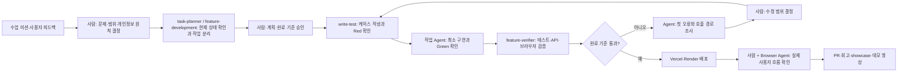
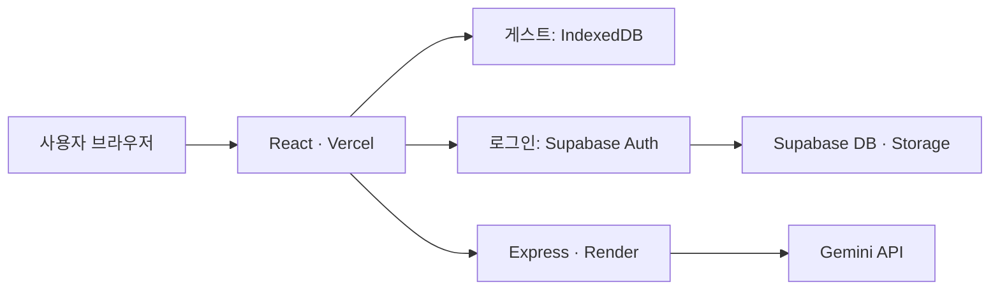

# 하루 체크아웃 개발 워크플로우

## 1. 4주간 작업 근거

2026년 7월 6일부터 7월 29일까지 작성한 계획, 진행 기록, 회고와 54개 커밋을 기준으로 정리했다.

| 기간 | 실제 작업 | 대표 결과물 |
|---|---|---|
| 1주차 | 문제 정의, 사용자 흐름, React 프로토타입 | `docs/plan.md`, 초기 화면과 기획 문서 |
| 2주차 | React 수직 기능 구현, 컴포넌트 분리, 데이터 모델 설계 | 입력→AI 정리→저장 흐름, `task-planner`, `feature-verifier` |
| 3주차 | 기능 설계 후 TDD, API·브라우저 검증 | 체크인 삭제, 주간 필터, `feature-development`, `write-test` |
| 4주차 | 개인정보 기준 재정의, 게스트·로그인 저장 분리, 배포 | IndexedDB, Supabase Auth·Storage, Vercel·Render, PWA, 데모 영상 |

계획은 `docs/plan.md`와 `docs/backlog.md`, 실제 결과는 `docs/progress.md`, 판단과 시행착오는 `docs/learning/retrospectives.md`, 최종 결과는 `showcase/showcase.json`에 남겼다.

## 2. 반복해서 사용한 작업 순서

### 입력

- 수업의 주차별 미션
- 사용자 또는 멘토 피드백
- 현재 코드와 이전 커밋
- 오류 화면, 테스트 결과, 브라우저 요청과 서버 로그

### 작업 순서

1. **원문 확인**: 수업 자료와 요구사항을 먼저 읽는다.
2. **현재 상태 확인**: 코드, `git log`, 계획과 진행 문서를 확인해 이미 구현된 범위를 찾는다.
3. **작업 분리**: 한 번에 검증 가능한 작은 작업과 완료 기준을 정한다.
4. **사람의 승인**: 저장 방식, 개인정보 처리, 기능 범위와 화면 흐름을 사용자가 결정한다.
5. **테스트 작성**: 분기나 계산이 있는 로직은 케이스를 정하고 실패하는 테스트부터 확인한다.
6. **최소 구현**: 기존 구조와 브라우저 기본 기능을 우선 사용해 테스트가 통과하는 만큼만 구현한다.
7. **로컬 검증**: 클라이언트·서버 테스트와 프로덕션 빌드를 실행한다.
8. **실제 검증**: API 응답, 브라우저 흐름, 새로고침 후 데이터, Supabase와 서버 로그를 확인한다.
9. **배포와 기록**: Vercel·Render에 반영하고 PR, 진행 문서, 회고와 showcase를 갱신한다.

### 확인 기준

- 완료 기준을 눈으로 확인할 수 있는 문장으로 작성했는가
- 프런트엔드와 백엔드 테스트가 통과하는가
- 프로덕션 빌드가 통과하는가
- 실제 배포 주소에서 같은 기능이 동작하는가
- 새로고침 후 데이터가 의도한 저장소에 남는가
- 실패한 항목을 통과했다고 기록하지 않았는가
- API 키와 서비스 키가 코드와 Git에 포함되지 않았는가

### 결과물

- 기능 코드와 테스트
- 기능별 설계 문서
- Vercel·Render 배포 주소
- Git 커밋과 PR
- 검증 기록, 회고, showcase와 데모 영상

## 3. 문제가 생겼을 때 돌아가는 순서

1. 빌드 로그, 테스트 결과 또는 브라우저 요청에서 **첫 오류 하나**를 고른다.
2. 화면, 프런트엔드, 서버, 외부 서비스 중 어느 구간의 문제인지 좁힌다.
3. 관련 호출 경로와 기존 테스트를 확인한다.
4. 원인 한 곳만 최소 수정한다.
5. 실패했던 검사를 다시 실행한다.
6. 로컬에서 통과하면 배포하고 같은 흐름을 실제 주소에서 확인한다.
7. 다시 실패하면 추측으로 여러 설정을 바꾸지 않고 1번으로 돌아간다.

## 4. 사람과 Agent의 협업 흐름

## 5. 단계별 역할

| 단계 | 사람이 결정한 내용 | AI·Agent가 수행한 내용 | 사용한 Agent·Skill·도구 |
|---|---|---|---|
| 기획 | 대학생의 감정 정리 문제, AI의 역할 제한 | 자료 구조화, 사용자 흐름과 백로그 초안 | `task-planner` |
| 설계 | 게스트 우선, AI 전송 동의, 로그인 저장 선택 | 화면→데이터→API 흐름과 구현안 비교 | `feature-development` |
| 구현 | 적용할 방법과 완료 범위 승인 | React·Express 코드와 최소 구현 작성 | 작업 Agent, Ponytail |
| 테스트 | 중요한 실패·경계 사례 승인 | Red→Green 실행, 회귀 테스트 작성 | `write-test`, Vitest, `node:test` |
| 검증 | 실제로 통과했다고 인정할 기준 결정 | 코드·API·브라우저·로그 결과 수집 | `feature-verifier`, Browser Agent |
| 배포 | 환경변수의 실제 값 입력, 재배포 승인 | Vercel·Render 설정과 연결 상태 확인 | Codex 작업 Agent, 전용 브라우저 |
| 기록 | PR과 회고에 남길 내용 선택 | 문서 초안, showcase와 영상 편집 | Codex 작업 Agent |

## 6. 실제로 사용한 Agent와 Skill

### Agent

- **task-planner**: 현재 상태를 읽고 작업을 검증 가능한 크기로 나눴다.
- **feature-verifier**: 코드를 수정하지 않고 테스트, API와 완료 기준을 확인했다.
- **Codex 작업 Agent**: 코드 점검, 배포 설정, 브라우저 조작, 로그 확인과 영상 편집을 수행했다.

### Skill

- **feature-development**: 현재 코드 분석→화면·데이터·흐름 설계→방법 비교→승인→구현 순서를 만들었다.
- **write-test**: 테스트 케이스 승인→Red→최소 구현→Green 순서를 반복했다.
- **Ponytail**: 새 라이브러리와 불필요한 구조를 추가하지 않고 기존 기능과 브라우저 기본 기능을 우선 사용했다.
- **retro**: 실제 커밋과 작업 내용을 기준으로 회고 초안을 만드는 로컬 Skill로 사용했다.

## 7. 최종 서비스 연결

- FE: `https://haru-checkout-n114.vercel.app`
- BE 상태 확인: `https://haru-checkout-api.onrender.com/api/health`
- 영상: `https://youtu.be/CFum9nr6JDk`

환경변수는 값이 아니라 등록 여부만 확인한다.

- Vercel: `VITE_API_BASE_URL`, `VITE_SUPABASE_URL`, `VITE_SUPABASE_PUBLISHABLE_KEY`
- Render: `CORS_ORIGIN`, `SUPABASE_URL`, `SUPABASE_SERVICE_ROLE_KEY`, `AI_BASE_URL`, `AI_MODEL`, `AI_API_KEY`

## 8. 2026-07-30 최종 검증

### 로컬

- [x] 프런트엔드 테스트 21개 통과
- [x] 백엔드 테스트 12개 통과
- [x] Vite 프로덕션 빌드 통과

### 배포

- [x] Vercel 첫 화면 접속
- [x] Render 상태 API에서 `{"status":"ok","storage":"supabase"}` 응답
- [x] 기존 테스트 계정의 로그인 세션 복원
- [x] Gemini가 감정·원인·내일의 작은 행동 생성
- [x] 로그인 기록과 사진을 Supabase에 저장
- [x] 캘린더·상세 화면에서 저장된 기록과 사진 확인
- [x] 검증용 기록 삭제 후 목록에서 사라짐 확인
- [x] 새로고침 후 IndexedDB 게스트 기록 2개 유지 확인
- [x] PWA manifest와 모바일 메타 정보 확인
- [x] 브라우저 오류·경고 로그 없음
- [x] Render 로그에서 서버 실행과 `storage mode: supabase` 확인
- [x] YouTube 일부 공개 영상 2분 4초 재생 가능

새 회원가입과 서로 다른 두 계정의 RLS 격리는 오늘 다시 실행하지 않았다. 기존 테스트 계정의 세션 복원과 사용자별 기록·사진 저장 흐름을 데모 기준으로 확인했다.

### 환경변수 등록 확인

- Vercel: `VITE_API_BASE_URL`, `VITE_SUPABASE_URL`, `VITE_SUPABASE_PUBLISHABLE_KEY`
- Render: `AI_API_KEY`, `AI_BASE_URL`, `AI_MODEL`, `CORS_ORIGIN`, `SUPABASE_SERVICE_ROLE_KEY`, `SUPABASE_URL`

값은 열거나 문서에 기록하지 않았다.

## 9. 데모 순서

1. 상담 수요 증가와 긴 대기 기간 때문에 상담을 기다리는 동안 감정을 정리할 도구가 필요했다.
2. 게스트로 들어가 감정과 사진을 AI 없이 IndexedDB에 저장한다.
3. 동의 후 Gemini가 감정, 원인, 내일의 작은 행동으로 정리하는 모습을 보여준다.
4. 기록 상세와 삭제를 보여준다.
5. 회원가입·로그인 후 기록과 사진이 Supabase에 저장되는 흐름을 보여준다.
6. 앞으로 누적 기록을 감정 변화 보고서로 확장할 계획을 설명한다.

Agent 협업은 다음 한 문장으로 설명한다.

> 저는 문제, 개인정보 원칙과 완료 기준을 결정했고, Agent는 계획 분리, 코드와 테스트 초안, 배포 조작과 검증을 수행했습니다. 결과는 테스트만 믿지 않고 실제 브라우저와 서버 로그로 다시 확인했습니다.

## 10. 오늘 제외한 작업

- 감정 변화 보고서 신규 구현
- UI 전면 수정
- 새로운 Agent 또는 Skill 추가
- 데모와 관계없는 리팩터링

현재 기능을 안정적으로 설명하고 검증하는 데 필요한 작업만 진행한다.
