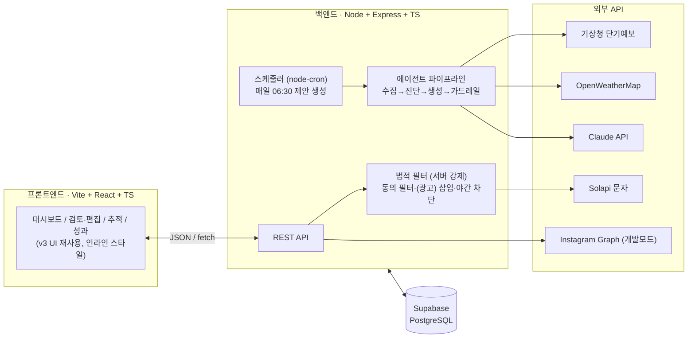

# WeatherPilot 기술 실행 로드맵 — 프로토타입에서 배포까지

> **작성 기준**: 2026-07-08 (수) / 챌린지 마감 2026-07-31 → **가용 기간 약 3주, 1인 개발**
> **현재 상태**: React + TS UI 프로토타입 v3 완성 (전부 mock 데이터, 백엔드 없음)
> **스타일링 제약**: Tailwind·Styled-components 등 외부 스타일링 라이브러리 금지. 인라인 스타일·순수 CSS 객체만 사용 (현행 유지)

---

## 0. 시니어의 스코프 판단 — 먼저 이것부터 정한다

3주 안에 "전부 진짜"는 불가능하다. 아래 표대로 자르고 시작한다. 이 표가 이 문서 전체의 전제다.

| 영역 | 판단 | 이유 |
|---|---|---|
| 날씨 API (기상청+OpenWeather) | ✅ **실연동** | 무료, 발급 당일, 프로젝트의 정체성 |
| LLM 제안 생성 (Claude API) | ✅ **실연동** | 에이전트 서사의 핵심, 비용 소액 |
| DB·스케줄러·백엔드 | ✅ **실구축** | API 키를 프론트에 둘 수 없으므로 백엔드는 선택이 아니라 필수 |
| 문자 발송 (Solapi/CoolSMS) | ✅ **실연동 (본인 번호 테스트)** | 개인 가입 가능, 발신번호 등록 1일 내, 소액 |
| POS 연동 | ❌ **하지 마라 → 수동 일매출 입력 + CSV 업로드로 대체** | 국내 POS 오픈 API는 사실상 없음(제휴 계약 필요). 3주 안에 불가능 |
| Instagram 자동 게시 | ⚠️ **본인 계정 한정 (개발 모드)** | 앱 리뷰 없이 개발 모드에서 본인 비즈니스 계정 게시 가능. 타인 계정은 리뷰 필요 → 범위 밖 |
| X 자동 게시 | ⚠️ **시도하되 폴백 준비** | 무료 티어 정책 변동이 잦음. 안 되면 "게시 시뮬레이션 + 복사하기"로 폴백 |
| 카카오 알림톡 | ❌ **포기** | 사업자등록 + 채널 심사(1~2주) 필요. 챌린지 범위 밖 |
| 080 수신거부 실회선 | ❌ **모의 (문구 삽입만)** | 대행사 부가서비스 계약 필요. UI·로직은 구현, 회선은 모의 |
| 단골 개인정보 | ❌ **실연락처 수집 금지 → 더미 데이터** | 챌린지에서 실개인정보를 다루는 순간 리스크만 생긴다 |

**결론**: "날씨→분석→생성→검토→문자 실발송(본인)→쿠폰 추적"이 진짜로 도는 수직 슬라이스 하나를 만들고, 나머지는 정직하게 모의로 표기한다.

---

## 1. 시스템 구조도

### 1.1 아키텍처



**구조 원칙 3가지**

1. **모든 비밀키는 서버에만 있다.** 프론트에서 외부 API를 직접 호출하지 않는다. (지금 프로토타입은 프론트 단독이라, 백엔드 신설이 1순위 작업)
2. **법적 필터는 UI가 아니라 서버에서 강제한다.** UI 체크는 안내일 뿐이고, 발송 API 핸들러가 동의 필터·(광고) 삽입·야간 차단을 최종 수행한다. UI를 우회해도 법을 우회할 수 없어야 한다.
3. **에이전트 파이프라인은 스케줄러와 분리된 순수 함수로 만든다.** `generateProposal(storeId, date)` 하나로 크론·API·테스트 모두에서 호출 가능하게.

### 1.2 저장소 구조 (npm workspaces 모노레포)

```
weatherpilot/
├── package.json              # workspaces: ["apps/*", "packages/*"]
├── apps/
│   ├── web/                  # 기존 Vite SPA (v3 이관)
│   │   └── src/
│   │       ├── App.tsx
│   │       ├── styles/tokens.ts     # 색·폰트 상수(C, font) 분리 — 인라인 스타일 유지
│   │       ├── api/client.ts        # fetch 래퍼 (+ MOCK_MODE 스위치)
│   │       └── mocks/scenarios.ts   # 데모 폴백용 mock (삭제하지 않는다)
│   └── server/
│       └── src/
│           ├── index.ts             # Express 부트스트랩
│           ├── routes/              # /proposal /campaigns /send /coupons /sales
│           ├── agent/
│           │   ├── weather.ts       # 앙상블 수집·병합
│           │   ├── diagnose.ts      # 매출×날씨 상관 진단
│           │   ├── generate.ts      # LLM 호출 + zod 검증
│           │   └── guardrails.ts    # 할인율·길이·금칙어
│           ├── legal/filter.ts      # 동의·(광고)·야간 (서버 강제)
│           ├── jobs/daily.ts        # node-cron 06:30
│           └── db/                  # Supabase 클라이언트·쿼리
└── packages/
    └── shared/                      # 프론트·백 공용 타입 (Scenario, Proposal, Campaign)
```

---

## 2. 필요 자원 트리 — 정보 · API · 계정 · 리드타임

> **핵심**: 발급·심사가 코드보다 느리다. ①~⑦은 **오늘(7/8) 전부 신청**한다.

```
WeatherPilot 필요 자원
│
├── ① 날씨 데이터 (앙상블)
│   ├── 기상청 단기예보 API — 공공데이터포털
│   │   ├── 발급: 활용신청 → 자동승인 (당일)
│   │   ├── 비용: 무료 (일 호출 제한 내)
│   │   ├── 필요 정보: 서비스 키, 위경도→격자(nx,ny) 변환 함수
│   │   └── 역할: 앙상블 1순위 (국내 정확도 기준점)
│   ├── OpenWeatherMap
│   │   ├── 발급: 가입 즉시 (활성화 최대 수 시간)
│   │   ├── 비용: 무료 티어로 충분 (하루 1~2회 호출)
│   │   └── 역할: 앙상블 2순위 + 기상청 장애 시 폴백
│   ├── (선택) AccuWeather — 무료 쿼터가 작음. 2개로 시작해도 무방
│   └── 앙상블 병합 규칙 (직접 구현)
│       ├── 단위 통일 (℃, mm/h, %) → 가중 평균 (기상청 0.6 / OWM 0.4)
│       ├── 상태 코드 매핑표 (비/눈/맑음 → 내부 enum)
│       └── 불일치 처리: 강수 여부 갈리면 보수적으로 '강수' 채택
│
├── ② LLM — Anthropic Claude API
│   ├── 발급: 콘솔에서 키 즉시 (기존 키 재사용 가능)
│   ├── 비용: 하루 1~2회 생성 × 31일 ≈ 수천 원 수준
│   ├── 입력: 날씨 JSON + 매장 프로필(업종·메뉴·톤) + 매출 통계 요약
│   ├── 출력 스키마 (zod로 강제):
│   │   { title, copy, promo: { type, value, validUntil }, channels[] }
│   └── 가드레일: 할인율 ≤ 30% · LMS 2,000byte 이내 · 금칙어(의료·과장) → 위반 시 1회 재생성, 재실패 시 전일 템플릿 폴백
│
├── ③ 문자 발송 — Solapi (또는 CoolSMS)
│   ├── 발급: 개인 가입 → 발신번호 사전등록 (본인인증, ~1일)
│   ├── 비용: 소액 충전 (SMS 건당 ~10원 수준, 테스트 수천 원이면 충분)
│   ├── 테스트 원칙: 수신 대상 = 본인/팀 번호만. 더미 단골에게 실발송 금지
│   └── 080 수신거부: 문구 삽입 + 수신거부 API 엔드포인트는 구현, 실회선은 모의
│
├── ④ SNS 게시
│   ├── Instagram Graph API
│   │   ├── 선행: 비즈니스/크리에이터 계정 전환 + Meta 개발자 앱 (~1일)
│   │   ├── 개발 모드: 앱에 역할 있는 본인 계정 게시 가능 (리뷰 불필요)
│   │   └── 챌린지 범위: 본인 계정 실게시 데모까지만
│   └── X API — 신청 후 무료 티어 쓰기 가능 여부 확인 (정책 변동 잦음)
│       └── 불가 시 폴백: "게시 시뮬레이션 + 문구 복사" UI
│
├── ⑤ 매출 데이터 (POS 대체)
│   ├── 수동 입력: 설정 화면에서 일매출 등록 (date, revenue)
│   ├── CSV 업로드: POS 엑셀 내보내기 가정 → papaparse 파싱
│   └── 진단 로직: 날씨 스냅샷과 조인 → 날씨 유형별 평균 편차 계산
│       └── 데이터 부족 시(콜드스타트): 업종 기본 계수 사용 + "추정치" 라벨 명시
│
├── ⑥ DB — Supabase (PostgreSQL, 무료 티어)
│   ├── stores        (id, name, category, menu_tags, tone, lat, lng, nx, ny)
│   ├── customers     (id, store_id, name, phone, consent_at, opt_out_at)  ← 더미만
│   ├── daily_sales   (store_id, date, revenue, weather_snapshot JSONB)
│   ├── campaigns     (id, store_id, date, weather JSONB, proposal JSONB,
│   │                  edited_copy, channels[], status: draft|approved|sent|scheduled)
│   └── coupons       (id, campaign_id, code, issued_to, used_at, order_amount)
│
└── ⑦ 배포 인프라
    ├── 프론트: Vercel (push 배포)
    ├── 백엔드: Render 또는 Railway (무료/소액 — cron 상시 실행 필요해서 서버리스보다 유리)
    ├── 시크릿: 전부 환경변수. .env는 커밋 금지, .env.example만 커밋
    └── 도메인: 챌린지면 기본 제공 도메인으로 충분
```

---

## 3. 단계별 실행 계획 (7/8 → 7/31)

각 Phase는 **완료 기준(DoD)** 을 만족해야 다음으로 넘어간다. 밀리면 기능을 줄이지 일정을 늘리지 않는다.

### Phase 0 — 오늘 (7/8): 발급 신청 + 스캐폴드
- [ ] 자원 트리 ①~⑦ 계정·키 **전부 신청** (심사 대기시간을 개발과 병렬로)
- [ ] 모노레포 생성, `apps/web`에 v3 이관, `apps/server` Express + TS 스캐폴드
- [ ] `packages/shared`에 v3의 타입(Scenario 등) 이동 — 프론트·백 공용화
- [ ] GitHub 저장소 + `tsc --noEmit` · ESLint CI (GitHub Actions)
- **DoD**: `npm run dev` 한 번에 웹+서버 동시 기동, CI 초록불

### Phase 1 — 7/9~7/12: 날씨 앙상블 + DB
- [ ] 격자 변환 함수 + 기상청·OWM 클라이언트 (타임아웃 3s, 재시도 1회)
- [ ] 앙상블 병합 로직 + **한쪽 장애 시 폴백** (남은 소스만으로 진행, 응답에 소스 수 표기)
- [ ] Supabase 스키마 5개 테이블 + 시드 (매장 1, 더미 단골 142명 중 동의 98)
- [ ] `GET /weather/today`, `POST /sales`, CSV 업로드 파서
- **DoD**: 실제 오늘 부산 날씨가 API로 나오고, 일매출 30일치가 DB에 들어감

### Phase 2 — 7/13~7/17: 에이전트 코어 (LLM)
- [ ] 진단 로직: daily_sales × weather_snapshot → 날씨 유형별 평균 편차 (v2의 "이 가게는 비 오는 날 −18%"를 실데이터 계산으로)
- [ ] 프롬프트 설계 + zod 스키마 검증 + 가드레일 (guardrails.ts)
- [ ] `generateProposal()` 순수 함수화 → `POST /proposal/generate` + node-cron 06:30 등록
- [ ] campaigns 테이블에 제안 저장, `GET /proposal/today`
- **DoD**: 아침에 서버가 스스로 오늘 제안을 만들어 두고, 프론트 없이 curl로 JSON 확인 가능

### Phase 3 — 7/18~7/23: 프론트 연동 + 발송·추적
- [ ] `api/client.ts` 작성, v3의 mock 참조를 API 호출로 교체 — 단 **MOCK_MODE 스위치 유지** (데모 보험)
- [ ] 승인/수정/반려 → `PATCH /campaigns/:id`
- [ ] 발송: `POST /campaigns/:id/send` → **서버 법적 필터 통과 후** Solapi 실발송(본인 번호), 야간이면 scheduled 저장
- [ ] 쿠폰: 발급 코드 생성 → `POST /coupons/:code/redeem` (매장 사용 처리 모의 엔드포인트) → 추적 화면이 폴링으로 실데이터 표시
- [ ] Instagram 개발모드 게시 시도 (실패 시 시뮬레이션 폴백 확정)
- **DoD**: 내 폰으로 (광고) 표기된 문자가 실제로 오고, redeem 호출 시 추적 화면 숫자가 올라간다

### Phase 4 — 7/24~7/28: 배포 + 검증 (아래 §4 전체 수행)
- [ ] Vercel(웹) + Render(서버) 배포, 환경변수 주입, CORS 화이트리스트
- [ ] §4 검증 계획 실행 — 테스트·법적 체크리스트·UAT
- **DoD**: 배포 URL에서 전 플로우가 돌고, 테스트 스위트 초록불

### Phase 5 — 7/29~7/31: 리허설 + 제출
- [ ] 데모 시나리오 고정 (날씨 고정 seed), MOCK_MODE 리허설 (외부 API 전멸 가정)
- [ ] README: 아키텍처 다이어그램, 실연동/모의 구분 명시 (심사자에게 정직하게)
- [ ] 기획안·시연 영상·저장소 링크 제출물 패키징

---

## 4. 검증 계획 — 이 프로젝트를 어떻게 믿을 것인가

검증은 4겹이다: **코드가 맞는가 → 시스템이 붙는가 → 에이전트 출력이 안전한가 → 사람이 쓸 수 있는가.**

### 4.1 정적 검증 (상시)
- TypeScript strict + `noUnusedLocals` 유지, `tsc --noEmit`을 CI 필수 게이트로
- ESLint + 시크릿 커밋 방지 (.env gitignore, PR에서 키 패턴 검사)

### 4.2 단위 테스트 (Vitest) — 로직의 심장부터
| 대상 | 반드시 검증할 케이스 |
|---|---|
| 격자 변환 | 부산 위경도 → 기상청 공식 예제 nx,ny와 일치 |
| 앙상블 병합 | 두 소스 정상 / 한쪽 장애 폴백 / 강수 불일치 시 보수적 채택 |
| 법적 필터 | **경계값**: 20:59 발송 허용, 21:00 차단, 07:59 차단, 08:00 허용 / 미동의자 제외 수 / (광고)·수신거부 문구 삽입 |
| 가드레일 | 할인율 31% 거부, 금칙어 검출, LMS byte 초과 거부 |
| 쿠폰 귀속 | 사용률·귀속 매출 계산, 0명 사용 나눗셈 방어 |

### 4.3 통합 테스트 (supertest + nock/MSW)
- 외부 API는 목킹하되 **실패 시나리오를 주 대상으로**: 기상청 타임아웃 → OWM 단독 진행, LLM 스키마 위반 응답 → 재생성 → 템플릿 폴백
- `POST /send`가 법적 필터를 우회할 수 없음을 계약 테스트로 보장 (미동의 대상 포함 요청 → 서버가 걸러낸 결과 반환)

### 4.4 E2E (Playwright) — 핵심 여정 3개만
1. 대시보드 → 제안 승인 → 발송 → 추적 화면 갱신
2. 문구 수정 → 미리보기에 (광고) 반영 → 발송
3. 야간 모드 → 버튼이 예약발송으로 전환 → scheduled 저장 확인

### 4.5 LLM 출력 검증 (에이전트 품질)
- **스키마 검증**: 모든 응답 zod 통과 필수 (통과율 100%가 아니면 프롬프트 수정)
- **회귀 세트**: 날씨 20케이스 × 업종 3(카페·식당·베이커리) = 60 프롬프트를 고정 입력으로 저장 → 프롬프트 수정 때마다 재실행, 가드레일 자동 채점 + 상위 10개 수동 품질 라벨링
- **비용·지연 측정**: 1회 생성 p95 지연과 토큰 비용 기록 (하루 1회 배치라 여유 있지만 수치로 남긴다)

### 4.6 법적 체크리스트 (KISA 불법스팸 방지 안내서 기준 최종 대조)
- [ ] 광고성 문자에 (광고) 표기 · 전송자 명칭 표기
- [ ] 사전 수신동의 이력 저장 (consent_at) + 미동의자 발송 원천 차단 (서버 강제 확인)
- [ ] 무료수신거부 수단 안내 + opt_out 처리 시 즉시 제외
- [ ] 야간(21~08시) 전송 차단 → 예약 전환 동작
- [ ] 더미 데이터 외 실개인정보 미수집 확인
> 실서비스 전에는 안내서 원문으로 재검증한다. 챌린지 단계에서는 위 5개가 데모에서 **동작으로 증명**되는 것이 목표.

### 4.7 사용자 검증 (UAT)
- 대상 3명 (지인 자영업자 우선, 없으면 비개발자)
- 태스크: "오늘 제안을 검토해서 문구 한 줄 고치고 발송해 보세요" — **성공 기준: 도움 없이 30초 이내 완료**
- 측정: 완료율, 소요 시간, 막힌 지점 발화 기록 → 상위 2개 마찰만 수정 (전면 개편 금지)

### 4.8 데모 리허설 (챌린지 특화)
- 발표장 네트워크 불신: MOCK_MODE=on 리허설 1회 필수
- 시연용 날씨 seed 고정 (당일 실날씨가 '맑음'이면 데모가 심심해진다 — 비 시나리오 강제 스위치)
- 실패 대본: LLM이 늦으면 "전일 생성분 캐시"를 보여주는 동선 준비

---

## 5. 리스크 레지스터

| 리스크 | 확률 | 대응 |
|---|---|---|
| Instagram/X 게시 불가 (정책·심사) | 중 | 시뮬레이션 + 복사하기 폴백. README에 명시 |
| 기상청 API 간헐 장애 | 중 | OWM 단독 폴백 + 응답에 소스 수 표기 (이미 설계 반영) |
| LLM 품질 편차 | 중 | 가드레일 + 재생성 + 템플릿 폴백 3단 방어 |
| 매출 데이터 부족(콜드스타트) | 높음 | 업종 기본 계수 + "추정치" 라벨. 시드 30일치로 데모 확보 |
| 일정 지연 | 높음 | Phase별 DoD 미달 시 **기능 삭제** (X 게시 → 쿠폰 고도화 → 성과 탭 순으로 버린다) |
| 시크릿 유출 | 낮음 | 서버 전용 보관 + CI 키 패턴 검사 |

---

## 6. 오늘(7/8) 퇴근 전 체크리스트

1. 공공데이터포털 기상청 단기예보 활용신청
2. OpenWeatherMap 가입·키 발급
3. Anthropic API 키 확인
4. Solapi 가입 + 발신번호 등록 절차 시작 (본인인증)
5. Instagram 비즈니스 전환 + Meta 개발자 앱 생성
6. X 개발자 계정 신청 (무료 티어 쓰기 가능 여부 확인)
7. Supabase 프로젝트 생성
8. 모노레포 스캐폴드 + v3 이관 + CI

**이유는 하나다. 코드는 네가 통제하지만 발급·심사는 통제 못 한다. 통제 불가능한 것부터 오늘 건다.**
