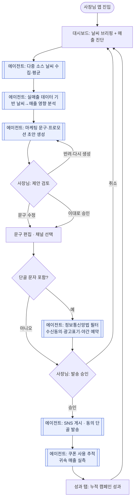

# WeatherPilot (웨더파일럿) 서비스 기획안

> **한 줄 정의**: 날씨 때문에 흔들리는 동네 가게 매출을, 사장님이 신경 쓰지 않아도 AI가 알아서 방어하는 자율 마케팅 에이전트.

---

## 1. 문제 정의 (Problem)

### 배경
동네 카페·식당의 매출은 날씨에 강하게 연동된다. 비 오는 날은 홀 방문이 줄고, 폭염·한파에는 아예 외출 자체가 줄어든다. 반대로 특정 날씨는 특정 메뉴(따뜻한 음료, 시원한 디저트, 뜨끈한 국물)의 수요를 끌어올린다. 즉 **날씨는 매출의 가장 큰 단기 변수이면서, 동시에 마케팅으로 방어·활용 가능한 변수**다.

### 페인포인트
소상공인은 이 변수를 활용할 **시간도, 전문성도, 채널 운영 여력도** 없다.

- 매일 아침 날씨를 확인하고 그날의 판매 전략을 짤 여유가 없다. (혼자 운영하거나 주방·홀에 매여 있음)
- 인스타/X 게시물, 단골 문자 발송은 "해야 하는 걸 알지만 안 하게 되는" 일이다.
- 어떤 문구가 먹히는지, 어떤 프로모션을 걸어야 하는지에 대한 감이 없다.

### 타깃 사용자 (페르소나)
**김사장 (42세) — 1인 운영 동네 카페**
- 오픈 준비, 응대, 마감까지 혼자 처리. 마케팅에 쓸 수 있는 시간은 하루 **10분 미만**.
- 스마트폰은 익숙하지만 '광고 관리자', 'CRM' 같은 도구는 부담스러움.
- 니즈: *"내가 뭘 배우지 않아도, 알아서 해주고 나는 확인만 하고 싶다."*

> **핵심 통찰**: 이들은 '더 좋은 마케팅 툴'을 원하지 않는다. **'마케팅을 안 해도 되는 상태'** 를 원한다. 그래서 제품의 목표는 기능 제공이 아니라 **의사결정 대행**이다.

---

## 2. 솔루션 & 핵심 가치 제안

WeatherPilot은 **에이전트가 먼저 일하고, 사장님은 확인만 하는** 구조다.

1. 여러 기상 소스를 수집·평균 내어 오늘의 날씨를 확정한다.
2. 날씨가 이 가게 매출에 미칠 영향을 **이 가게 실매출 데이터**를 근거로 분석한다. (일반론이 아니라 "이 가게는 비 오는 날 평균 −18%") — 매출 데이터는 MVP에서 **수동 입력·CSV 업로드**로 확보하고, POS 직접 연동은 로드맵 항목이다.
3. 그에 맞는 마케팅 문구와 프로모션 초안을 **미리 완성해 둔다.**
4. 사장님은 대시보드에서 **① 이대로 승인 / ② 문구만 수정 / ③ 반려** 중 하나만 누른다.
5. 승인된 콘텐츠를 SNS 게시·단골 메시지로 발송하되, 단골 문자는 **정보통신망법 요건(수신동의·(광고)표기·야간발송 금지)을 자동 적용**한다.
6. 발송 후 **쿠폰 사용(코드 기반)을 추적**해, 캠페인이 실제로 만든 매출을 사장님에게 되돌려준다.

**가치 제안: "확인 10초로 끝나는 오늘의 매출 방어 — 그리고 그게 정말 매출을 지켰다는 증명."**
경쟁 도구가 '기능'을 팔 때, WeatherPilot은 **'사장님의 판단과 실행 시간'** 을 대신 가져가고, **효과를 실측해 신뢰를 쌓는다.**

---

## 3. 사용자 흐름 (User Flow)

사용자(사장님)는 '생성'이 아니라 **'검토·승인'** 지점에만 개입한다. 아래 흐름에서 회색 영역은 에이전트가 자율 수행하는 구간이다.

> 사용자가 실제로 '조작'하는 노드는 **F(검토)**, **G(수정·채널)**, **I(발송 승인)** 세 개뿐이다. 매출 진단, 법적 필터, 쿠폰 추적은 모두 에이전트의 자율 영역.

### 3.1 왜 '에이전트'인가 — 자율성 레벨 설계

단순 조건부 자동발송 스크립트와의 차이는 **신뢰가 쌓일수록 자율성이 올라가는 구조**에 있다. 성과 탭의 쿠폰 실측 데이터가 그 신뢰의 근거다.

| 레벨 | 동작 | 전환 조건 |
|---|---|---|
| **L0 — 제안만** | 에이전트가 매일 초안을 준비, 발송은 전적으로 사장님 | 기본값 (온보딩 직후) |
| **L1 — 승인 후 실행** | 원탭 승인 시 채널 발송·추적까지 자율 수행 | 현재 프로토타입 기본 동작 |
| **L2 — 완전 자율 + 사후 보고** | 사전 설정 범위(할인율 상한·채널·빈도) 내에서 자율 발송, 사장님은 성과 리포트만 확인 | 승인율·쿠폰 사용률이 임계치 이상 유지될 때 사장님이 직접 승격 |

핵심 설계 원칙: **자율성 승격의 결정권은 항상 사장님에게 있고, 에이전트는 실측 성과로 그 결정을 설득한다.** 어떤 레벨에서도 법적 필터(§4 F5)는 서버에서 강제되어 우회 불가능하다.

---

## 4. 핵심 기능 (Core Features)

| # | 기능 | 설명 | 담당 |
|---|------|------|------|
| F1 | **다중 소스 날씨 앙상블** | 기상청·OpenWeather·AccuWeather 등 복수 소스를 수집해 평균/보정하여 신뢰도를 높임 | 에이전트 |
| F2 | **실매출 데이터 기반 진단** | 이 가게 매출 이력(수동 입력·CSV 업로드, 향후 POS 연동)을 근거로 "이 가게는 이 날씨에 몇 % 변동"을 진단하고 예측 매출·방어 목표를 제시 | 에이전트 |
| F3 | **날씨→매출 영향 분석 + 문구·프로모션 생성** | 진단을 바탕으로 방어 방향을 정하고 SNS 문구 + 프로모션(쿠폰) 초안을 완성 | 에이전트(LLM) |
| F4 | **검토·편집·채널 선택 워크플로우** | 문구 수정 + 인스타/X/단골 채널 선택. 승인 / 부분 수정 / 반려를 최소 조작으로 | 사용자 |
| F5 | **법적 안전장치 발송 (정보통신망법)** | 단골 문자 시 수신동의자 필터, (광고)·수신거부 자동 표기, 야간 발송 금지→예약 전환 | 에이전트 |
| F6 | **멀티채널 발송** | 인스타그램·X 게시, 동의 단골 대상 쿠폰 포함 맞춤 메시지 발송 | 에이전트 |
| F7 | **쿠폰 사용 추적 + 성과 리포트** | 쿠폰 코드 기반 귀속 매출 실측, 누적 캠페인 성과(승인·사용률·매출) 리포팅 | 에이전트 |

### MVP 범위 (프로토타입 구현 완료 기준)
`F1(모의) + F2 + F3 + F4 + F5 + F7`
→ **"날씨·매출 진단 → 맞춤 문구 생성 → 검토·수정·채널 선택 → 법적 준수 발송 → 쿠폰 추적"** 전 루프를 UI 프로토타입으로 구현.
실제 SNS 자동 게시 API 연동(F6의 완전 자동화)은 플랫폼 정책 검토 후 2차.

> **구현 이력**: v1(핵심 루프) → v2(매출 데이터 진단·성과 실측 추가) → v3(정보통신망법 안전장치 추가).

---

## 5. 화면 구성 (Screen Composition / IA)

모바일 우선. 상단 탭(**오늘 / 성과**) + 4개 핵심 화면 + 1개 설정.

### 5.1 대시보드 (오늘 탭)
- **날씨 브리핑 히어로**: 3개 소스 평균 표기, 오늘 기온·상태.
- **매출 진단 카드**: "이 가게는 비 오는 날 평균 −18%" + 최근 7일 매출 스파크라인(오늘 예측 강조) + 오늘 예측 매출·캠페인 방어 목표.
- **에이전트 추천 액션 카드**: 매출 영향 진단 + 완성된 문구·쿠폰 → `제안 검토하기`.

### 5.2 제안 검토·편집 화면
- **문구 편집기**: 완성된 초안이 채워진 편집 가능 필드.
- **채널 선택**: 인스타 / X / 단골 메시지 토글. (단골에는 '광고성' 뱃지)
- **법적 안전장치 패널** *(단골 선택 시 노출)*: 수신동의자 필터(142명 중 98명), (광고)·수신거부 자동 삽입 미리보기, 야간 발송 시 예약 전환 안내.
- **하단 액션 바**: `이대로 발송하기` / `예약발송 예약하기`(야간) / `돌아가기`. 채널 미선택 시 발송 잠금.

### 5.3 캠페인 진행 현황 (발송 완료)
- 발송 결과 요약(채널·동의 대상 수 또는 예약 안내).
- **쿠폰 사용 추적** *(단골 발송 시)*: 실시간 사용 진행률 + 귀속 매출 실측.

### 5.4 성과 탭
- 누적 캠페인 요약(발송 건수·평균 쿠폰 사용률·귀속 매출) + 캠페인 이력 리스트.

### 5.5 설정 (2차)
- 매장 정보(업종·메뉴·톤), 매출 데이터 입력·CSV 업로드(향후 POS 연동), 단골 데이터 연동, **자율성 레벨 전환 (§3.1의 L0↔L1↔L2)**.

---

## 6. 성공 지표 (제안)

- **North Star**: 주간 '승인→발송' 완료 캠페인 수 (실제로 실행됐는가)
- 제안 승인율 / 문구 수정률 (에이전트 초안 품질의 대리 지표)
- 검토→발송까지 걸린 시간 (목표: 30초 이내)
- **쿠폰 사용률 / 캠페인 귀속 매출** (효과 실측 — v2에서 프로토타입에 반영)
- 할인 발송 빈도·평균 할인율 (마진 방어 가드레일 — §8 카니발라이제이션 통제와 연동)
- (2차) 발송일 매출 vs 미발송일 매출 비교

---

## 7. 경쟁 구도와 기능 우선순위 근거

로컬 소상공인 마케팅·SNS·CRM 자동화 도구가 공통으로 갖는 기능 지형: 콘텐츠 자동 생성, 예약 발행, 멀티채널 통합 발행, 고객 세분화(CRM), 쿠폰 발급·사용 추적, 리뷰 관리, 성과 분석 대시보드, A/B 테스트, 조건 기반 자동화 워크플로우, 통합 인박스.

이 중 WeatherPilot이 걸어야 할 핵심은 두 개다.

- **콘텐츠 자동 생성 = 가치의 실현.** 나머지 기능은 전부 '사장님이 뭔가를 하게 만드는' 도구인 반면, 이 제품의 유일한 명제는 "사장님이 안 해도 되는 상태"다. 그 명제를 물리적으로 실현하는 것이 자동 생성이며, 이것이 빠지면 스케줄러에 불과하다.
- **쿠폰 사용 추적 = 가치의 증명.** 발송일 매출이 올라도 날씨 회복 때문인지 캠페인 때문인지 분리할 수 없다. 쿠폰 코드 사용은 캠페인에 직접 귀속되는 유일한 실측 신호이고, "이 쿠폰으로 오늘 37명 왔다"는 증거가 다음 날의 승인 버튼을 만든다.

즉 **생성이 리텐션의 시작을, 추적이 리텐션의 지속을 담당**하며, 멀티채널·세분화·A/B는 이 두 축을 거드는 후순위 부품이다.

---

## 8. 알려진 리스크와 통제 방안

| 리스크 | 인식 | 통제 |
|---|---|---|
| **쿠폰 카니발라이제이션** | 매일 할인을 뿌리면 정가 손님이 할인 손님으로 전환되어 마진이 침식된다 | 발송 빈도 상한·휴지기 규칙, 할인율 상한(기본 30%)을 에이전트 가드레일에 내장. 매출 방어가 아니라 마진 방어를 지표로 병행 |
| **인과 오귀속** | "비 오면 매출 하락"은 업종·입지에 따라 정반대일 수 있다 (역세권·배달 위주 매장) | 일반론이 아닌 이 가게 실매출×날씨 상관으로 진단. 데이터 부족 시 "추정치" 라벨 명시 |
| **콜드스타트** | 신규 가입 매장은 매출 이력도 단골 리스트도 없다 | 업종 기본 계수로 시작 + 추정치 표기, 매출 입력이 쌓일수록 개인화 강화. L0(제안만)로 시작해 신뢰 형성 |
| **SNS 플랫폼 정책** | Instagram 앱 리뷰·X API 유료화 등 자동 게시의 지속 가능성이 플랫폼에 종속 | 자동 게시 실패 시 "문구 복사" 폴백을 1급 시민으로 설계. 채널 다변화(문자·알림톡)로 종속 완화 |
| **에이전트 무시(리텐션 붕괴)** | 사장님이 반려·무시를 반복하면 제품이 죽는다 | 승인율·수정률을 초안 품질 지표로 추적, 반려 사유를 다음 생성에 반영하는 피드백 루프 (2차) |

---

## 9. 구현 전략 요약

상세 실행 계획·아키텍처·검증 절차는 별도 문서 **`WeatherPilot_기술로드맵.md`** 를 따른다. 기획 관점의 요지만 남긴다.

- **실연동 (챌린지 기간 내)**: 날씨 앙상블(기상청+OpenWeatherMap), LLM 제안 생성(Groq — 무료·OpenAI 호환, 원안 Claude API), 문자 발송(Solapi, 본인 번호 테스트), DB·스케줄러·백엔드.
- **대체 구현**: POS 직접 연동 → 수동 일매출 입력 + CSV 업로드 (국내 POS 오픈 API 부재로 인한 의도적 스코핑).
- **모의 유지**: 080 수신거부 실회선, 카카오 알림톡(사업자 심사 필요), 타인 계정 SNS 게시.
- **원칙**: 법적 필터는 UI가 아닌 서버에서 강제하며, 데모·심사 자료에서 실연동과 모의를 구분해 명시한다.

---

## 10. 프로토타입 개발 이력

### 버전 발전 과정
- **v1 — 핵심 루프**: 날씨 브리핑 → 에이전트 문구 생성 → 검토·수정·채널 선택 → 발송. 제품의 기본 명제("사장님은 확인만") 구현.
- **v2 — 매출 데이터 연동으로 신뢰도 강화**: 날씨 옆에 이 가게 실매출 진단·예측·방어 목표를 붙이고, 발송 후 쿠폰 사용을 실시간 추적해 귀속 매출을 실측. 성과 탭 신설. "일반론 → 이 가게 데이터", "발송하고 끝 → 효과 증명"으로 전환.
- **v3 — 정보통신망법 준수**: 단골 문자 발송 시 수신동의자 필터, (광고)·수신거부 자동 표기, 야간 발송 금지→예약 전환을 발송 플로우에 내장. 실제 출시 시의 법적 리스크(과태료)를 UI 단계에서 차단.

### 기술 스택 및 개발 노트
- **스택**: React + TypeScript (Vite). 외부 스타일링 라이브러리 없이 인라인 스타일로 구현.
- **개발 이슈 대응**: 코드 수정이 로컬 웹에 반영되지 않는 현상은 대부분 **TS 컴파일 오류로 Vite 빌드가 실패한 상태**가 원인이었음 → 터미널 에러 확인 후 `Ctrl+C`로 dev 서버 종료 → (필요 시 `node_modules/.vite` 캐시 삭제) → `npm run dev` 재시작 + 브라우저 하드 리프레시로 해결. `noUnusedLocals` 설정으로 미사용 변수·import도 빌드 오류로 잡히므로 즉시 제거.
