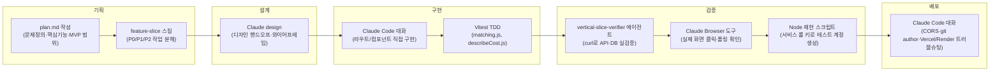

# Agent 협업 과정

4주간 실제로 어떤 도구를 어느 단계에서 썼는지, 그리고 그중 무엇을 내가 결정하고 무엇을 AI가 수행했는지 정리한다. `showcase.json`의 `agent` 섹션은 2~3주차의 "계획 → TDD → 검증" 흐름만 담고 있어서, 4주차에 압도적으로 많았던 "직접 대화하며 버그를 고친" 방식은 빠져 있었다 — 아래에서 그 부분을 채운다.

## 단계별 도구 사용

## 단계별 표

| 단계 | 사용한 도구 | 무엇에 썼나 |
|---|---|---|
| 기획 | `plan.md` 직접 작성, `feature-slice` 스킬 | 문제정의·핵심기능·MVP 경계는 직접 씀. 체크리스트를 하루 단위 작업으로 쪼갤 때만 스킬 사용 |
| 설계 | Claude design | 디자인 시스템 확정안(`design_handoff_ridesplit/README.md`), 와이어프레임·유저플로우 SVG |
| 구현 | Claude Code(이 대화), Vitest | 2~3주차 핵심 로직(매칭·신청/수락)은 테스트 먼저 작성 후 구현. 4주차 기능(탑승 확인·평점·동의 플로우 등)은 요구사항을 바로 라우트/컴포넌트에 배선 |
| 검증 | `vertical-slice-verifier` 에이전트, Claude Browser 도구, Node 재현 스크립트 | API 신규 구현은 에이전트로 curl 검증. 화면 버그는 실제 브라우저 조작(또는 두 계정을 만들어 재현) + 폴링/새로고침 후 화면 텍스트 비교 |
| 배포 | Claude Code(이 대화) | CORS 제한, 커밋 작성자 이메일 불일치로 인한 Vercel 배포 차단, Render 업스트림 저장소 오연결, Supabase 이메일 발송 제약(Resend 정책) 등 실제 배포 장애를 재현해서 원인 특정 |

## 사람이 결정한 것 vs AI가 수행한 것

| 사람(나) | AI |
|---|---|
| 문제 정의, 핵심 기능 2개 선정, MVP에서 뺄 것(결제 연동·보증금·실시간 위치공유 등) | 요구사항을 하루 단위 작업으로 분해하고 우선순위 표시(`feature-slice`) |
| 매칭 규칙(거점·시간대 ±10분, 성별 필터, 도착 소요시간 우선순위) | 규칙을 순수 함수로 구현하고 테스트 케이스 작성 |
| UI 문구·아이콘 반복 피드백("이 요금 아이콘 이상해", "채팅방보기 버튼 중복돼 보여" 등 다수) | 피드백을 반영한 구현 초안, 여러 번 재수정 |
| 이메일 발송 제약을 코드로 우회하지 않고 "그대로 두고 README에 기록"하기로 결정 | 우회 가능 여부를 실제 fetch로 재현·확인해서 판단 근거 제공 |
| 언제 Docker(4주차, 시간 남으면)처럼 범위를 미룰지 결정 | — |
| 최종적으로 무엇을 고치고 무엇을 "알려진 제약"으로 남길지 결정(예: 지각/취소 차등 차감, 마이페이지 이력 화면은 이번엔 보류) | 재현 스크립트로 버그를 실제로 확인·검증, 커밋 메시지·README 갱신 |

## 실제와 맞지 않아 고친 부분
- `showcase.json`의 `agent.summary`는 "기능 구현은 TDD로, 배선 후 검증은 Agent로"라고만 돼 있어 2~3주차 흐름만 반영돼 있었음. 4주차에 반복한 "재현 스크립트/브라우저로 직접 검증하며 대화로 고치는" 방식은 별도 Agent 없이 이 대화에서 직접 진행했으므로, 위 표의 "검증" 행에 `vertical-slice-verifier`뿐 아니라 Claude Browser 도구·Node 재현 스크립트를 함께 명시했다. (`showcase.json` 자체를 고칠지는 오늘 배포 작업과 별개로 판단 필요 — 원하면 `agent.summary`/`workflows`에 4주차 버그 수정 워크플로우를 한 항목 추가하는 걸 제안함)
