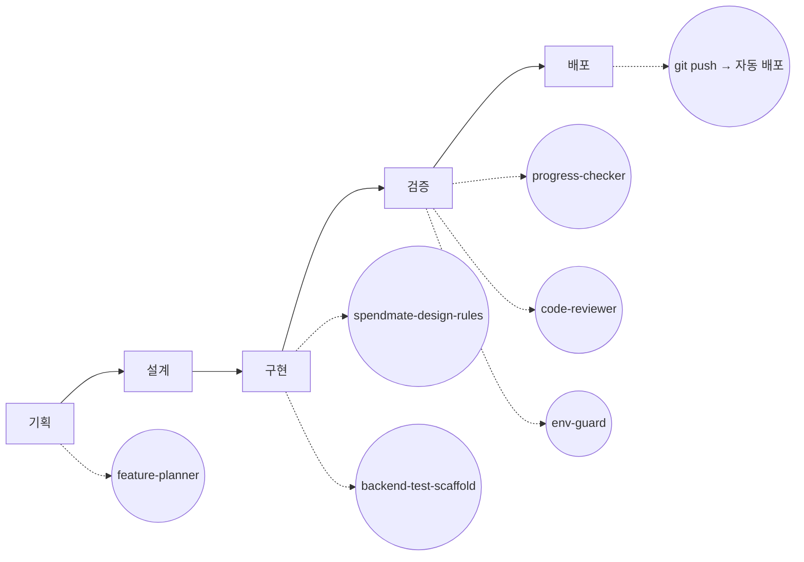

# Agent 협업 과정 시각화

4주간 17개 PR([connect-AIAgentChallenge-26-1/hub](https://github.com/connect-AIAgentChallenge-26-1/hub/pulls?q=is%3Apr+author%3Ajsoyeonj))을 기획→설계→구현→검증→배포 단계별로 다시 훑어보며, 각 단계에서 실제로 쓴 도구와 사람이 결정한 것/AI가 수행한 것을 정리한 문서.

## 전체 흐름

설계 단계엔 전담 Agent/Skill이 없다 — 실제로 안 그랬으니 억지로 안 넣음(아래 2번 참고).

아래 표는 각 단계에서 이 도구들이 실제로 무슨 역할을 했는지, 그리고 그 중 어디까지가 내 판단이고 어디부터가 AI 수행이었는지를 PR 근거와 함께 풀어놓은 것.

## 1. 기획

| 구분 | 내용 |
|---|---|
| 사용 도구 | `feature-planner` |
| 사람이 결정한 것 | 프로젝트 주제·스코프 확정([#181](https://github.com/connect-AIAgentChallenge-26-1/hub/pull/181) 기획안), 2주차 멘토링 피드백을 받아 레시피 추천·외부 최저가 비교를 스코프에서 제외, 매주 우선순위(P0/P1/P2) 확정 |
| AI가 수행한 것 | 요구사항을 하루 단위 작업으로 분해. [#803](https://github.com/connect-AIAgentChallenge-26-1/hub/pull/803)에서 직접 짠 계획과 `feature-planner`가 짠 계획을 나란히 비교했더니, 내 계획엔 없던 "인증/소유권 확인"을 요구사항 문서 기반으로 짚어냄 — 사람이 짠 계획도 이렇게 대조 검증이 필요하다는 걸 이때 체감함 |

## 2. 설계

| 구분 | 내용 |
|---|---|
| 사용 도구 | 없음 — Claude Code와의 대화로 직접 검토, 전담 Agent/Skill은 안 씀 |
| 사람이 결정한 것 | LLM 연동 방식(Spring AI 대신 WebClient 직접 호출, [#1892](https://github.com/connect-AIAgentChallenge-26-1/hub/pull/1892)), Tool 3종의 역할 분담. 백엔드 스택은 한 번 뒤집힌 적이 있음 — [#421](https://github.com/connect-AIAgentChallenge-26-1/hub/pull/421)에서 "Spring Boot → Express+Prisma"로 전환했다가, [#803](https://github.com/connect-AIAgentChallenge-26-1/hub/pull/803)에 가서 다시 Spring Boot/JPA로 돌아옴 — AI가 제안한 게 아니라 실제로 써보고 사람이 재판단한 결과 |
| AI가 수행한 것 | 설계 대안을 설명하고 트레이드오프를 정리해주는 대화 상대 역할 — 별도 Agent를 돌린 기록은 없음 |

## 3. 구현

| 구분 | 내용 |
|---|---|
| 사용 도구 | `spendmate-design-rules`, `backend-test-scaffold` |
| 사람이 결정한 것 | 이슈 단위로 손코딩할지 위임할지 판단. Tool 인터페이스([#38](https://github.com/connect-AIAgentChallenge-26-1/hub/issues/38))처럼 새로 배우는 패턴은 직접 타이핑, [#39](https://github.com/connect-AIAgentChallenge-26-1/hub/issues/39)/[#55](https://github.com/connect-AIAgentChallenge-26-1/hub/issues/55)처럼 이미 손에 익은 반복 구현은 위임 |
| AI가 수행한 것 | 위임된 반복 패턴 구현([#1469](https://github.com/connect-AIAgentChallenge-26-1/hub/pull/1469) — `ExpenseController` 패턴을 그대로 따라 `SubscriptionController` 작성), 화면 스타일이 기존 5개 화면과 맞는지 대조([#997](https://github.com/connect-AIAgentChallenge-26-1/hub/pull/997) `spendmate-design-rules`로 색상·radius 수정), TDD 테스트 스캐폴드 생성([#1759](https://github.com/connect-AIAgentChallenge-26-1/hub/pull/1759) `backend-test-scaffold`로 F6 Red→Green) |

## 4. 검증

| 구분 | 내용 |
|---|---|
| 사용 도구 | `progress-checker`, `code-reviewer`, `env-guard`, `code-analyzer` |
| 사람이 결정한 것 | 실제 DB 값·API 응답을 curl/psql로 직접 대조하는 걸 검증 기준으로 삼음([#1163](https://github.com/connect-AIAgentChallenge-26-1/hub/pull/1163) 이후 반복). 배포 서버 버그(Claude API 키 손상), CORS 403, 시간대(UTC/KST) 버그는 전부 배포 환경에 직접 요청을 재현해서 사람이 원인을 특정 |
| AI가 수행한 것 | 진행상황이 기획서 방향과 맞는지 사후 검증(`progress-checker` — [#803](https://github.com/connect-AIAgentChallenge-26-1/hub/pull/803)/[#1163](https://github.com/connect-AIAgentChallenge-26-1/hub/pull/1163)/[#1281](https://github.com/connect-AIAgentChallenge-26-1/hub/pull/1281)/[#1759](https://github.com/connect-AIAgentChallenge-26-1/hub/pull/1759)에 반복 등장), 커밋 전 코드 리뷰([#1978](https://github.com/connect-AIAgentChallenge-26-1/hub/pull/1978)에서 `code-reviewer`가 실제로 크래시 나는 버그를 커밋 전에 잡아냄). [#1608](https://github.com/connect-AIAgentChallenge-26-1/hub/pull/1608)에서는 `progress-checker`/`code-reviewer`/`env-guard` 3개를 병렬로 돌려 방향성·코드품질·보안을 동시에 검증받음. `code-analyzer`는 [#1163](https://github.com/connect-AIAgentChallenge-26-1/hub/pull/1163)에서 다른 2개와 같이 만들었지만, 이후 17개 PR 어디에서도 실제로 호출한 기록이 없음 — 만들어두고 거의 안 쓴 도구 |

## 5. 배포

| 구분 | 내용 |
|---|---|
| 사용 도구 | git push → Render/Vercel 자동 배포 |
| 사람이 결정한 것 | 배포 플랫폼·환경변수 분리 설계([#2242](https://github.com/connect-AIAgentChallenge-26-1/hub/pull/2242)), CORS+세션 쿠키 설정(SameSite=None+Secure 조합 필요) 이해 및 직접 디버깅, 실기기(폰) 테스트 중 CORS origin 불일치·서버 시간대(UTC) 문제를 발견하고 원인 특정 |
| AI가 수행한 것 | 원인 진단을 위한 재현 작업(배포 URL에 직접 요청을 보내 에러 재현), 커밋 이후의 빌드·배포 자체는 파이프라인이 자동 수행 |

## 실제 작업과 맞지 않아서 고친 부분

- 처음 버전은 각 단계를 "사람 결정 / AI 위임"으로 딱 잘라 색깔 박스로 나눈 다이어그램이었는데, 실제로는 설계 단계의 백엔드 스택처럼 "한 번 시도했다가 사람이 다시 뒤집은" 케이스가 많아서 이분법이 안 맞았음 → 각 단계별 표 + 실제 PR 근거 인용으로 교체
- `progress-checker`를 "설계" 단계 도구로 넣었었는데, 실제 PR 문구는 전부 "진행상황 검증"/"완료 여부 검증"이라 **검증** 단계가 맞음 → 이동
- `spendmate-design-rules`도 "설계"에 있었는데, 실제로는 화면을 만들면서 대조·수정한 것(#997)이라 **구현** 단계가 맞음 → 이동
- "설계" 단계에 억지로 도구를 채워넣지 않음 — 실제로 전담 Agent/Skill 없이 Claude Code와의 대화로만 진행했던 게 사실이라 그대로 남김
- `code-analyzer`가 아예 누락돼 있었음 → 검증 단계에 추가하되, #1163에서 만들기만 하고 이후 실제 사용 기록이 없다는 것까지 그대로 적음
