# Agent 협업 과정 시각화

SpendMate를 만들며 기획·설계·구현·검증·배포 각 단계에서 어떤 도구를 썼는지, 그리고 사람이 결정한 것과 AI(Claude Code)가 수행한 것을 구분한 문서. `workflow.md`가 "어떻게 일했는지"에 대한 서술이라면, 이 문서는 "무엇을 누가 했는지"를 단계별로 시각화한다.

## 전체 흐름

```mermaid
graph LR
    subgraph P["1. 기획"]
        P1["사람<br/>우선순위·스코프 결정<br/>(레시피/최저가 Tool 제외 등)"]:::human
        P2["feature-planner<br/>작업을 일 단위로 분해"]:::agent
    end

    subgraph D["2. 설계"]
        D1["사람<br/>Tool 인터페이스 방향 결정<br/>(Spring AI 대신 WebClient)"]:::human
        D2["progress-checker<br/>설계가 기획서와 맞는지 사후 검증"]:::agent
        D3["spendmate-design-rules Skill<br/>프론트 색상·톤 일관성"]:::skill
    end

    subgraph I["3. 구현"]
        I1["사람<br/>손코딩 vs 위임 판단<br/>(이슈 단위)"]:::human
        I2["Claude Code<br/>반복 패턴 구현·버그 수정·문서 갱신"]:::agent
        I3["backend-test-scaffold Skill<br/>TDD 테스트 스캐폴드 생성"]:::skill
    end

    subgraph V["4. 검증"]
        V1["사람<br/>curl·psql로 실제 값 직접 대조<br/>프로덕션 버그 재현(API 키 이슈)<br/>QA 4개 시나리오 실측(#65~68)"]:::human
        V2["code-reviewer<br/>커밋 전 리뷰"]:::agent
    end

    subgraph DP["5. 배포"]
        DP1["사람<br/>배포 설정·환경변수 관리<br/>CORS origin 오류 직접 디버깅"]:::human
        DP2["git push → Render/Vercel<br/>자동 배포"]:::auto
    end

    P --> D --> I --> V --> DP

    classDef human fill:#EBF2FF,stroke:#4F8EF7,stroke-width:2px
    classDef agent fill:#E8F8F6,stroke:#00A896,stroke-width:2px
    classDef skill fill:#FFF8E8,stroke:#FFC857,stroke-width:2px
    classDef auto fill:#F3F4F6,stroke:#6B7280,stroke-width:1px,stroke-dasharray: 3 3
```

- 🟦 **파란 박스**: 내가 직접 결정하거나 수행한 것
- 🟩 **초록 박스**: Agent에게 위임한 것
- 🟨 **노란 박스**: 프로젝트 전용 Skill
- ⬜ **회색 점선 박스**: 자동화(내가 직접 하지 않음)

## 단계별 상세

| 단계 | 사용 도구 | 사람이 결정한 것 | AI(Agent/Skill)가 수행한 것 |
|---|---|---|---|
| 기획 | `feature-planner` | 무엇을 만들지, 스코프를 어디까지 잡을지 (예: 2주차 멘토링 피드백으로 레시피 추천·외부 최저가 비교를 스코프에서 제외) | 결정된 기능을 하루 단위 작업으로 쪼개고 P0/P1/P2 우선순위 정리 |
| 설계 | `progress-checker`, `spendmate-design-rules` | LLM 연동 방식(Spring AI 대신 WebClient 직접 호출), Tool 3종의 역할 분담 | 이미 내린 설계 결정이 기획서 방향과 어긋나지 않는지 사후 검증, 새 화면/컴포넌트가 기존 5개 화면과 톤이 맞는지 점검 |
| 구현 | Claude Code, `backend-test-scaffold` | 이슈 단위로 손코딩할지 위임할지 판단 (새로 배우는 패턴은 직접 타이핑, 반복되는 패턴·버그 수정·문서 갱신은 위임) | 위임된 코드 작성, TDD 스캐폴드 생성 |
| 검증 | `code-reviewer` | 실제 DB 값·API 응답을 curl/psql로 직접 대조 (AI가 짠 코드를 그대로 믿지 않음), 배포 서버에 직접 요청을 재현해 프로덕션 버그(Claude API 키 손상) 원인 특정, QA(#65~68) 4개 Agent 판단 시나리오를 실제 API 호출로 리허설 | 커밋 전 코드 리뷰(버그·컨벤션 위반 탐지) — 이번 프로젝트에선 활용 빈도가 낮았던 부분 |
| 배포 | git push → Render/Vercel 자동 배포 | 배포 플랫폼·환경변수 분리 설계, 폰 실기기 테스트 중 발견한 CORS(허용 origin 불일치) 원인을 직접 특정하고 수정 | 커밋 이후의 빌드·배포 자체는 파이프라인이 자동 수행 |

## 실제 사례로 보는 사람/AI 경계

**오늘(4주차) CORS 디버깅 사례**
- 폰으로 로컬 서버 접속 시 로그인이 403으로 실패 → **AI가 브라우저에서 직접 fetch를 재현해 "Invalid CORS request" 응답을 확인**하고, `SecurityConfig`의 `allowed-origins` 설정이 `localhost:8443`으로 고정된 것을 코드에서 찾아냄
- **원인 진단과 `.env` 수정 방향은 사람이 최종 결정** (LAN IP를 허용 목록에 추가할지, 아니면 다른 방식으로 우회할지 판단)
- 이후 백엔드 재시작·검증은 AI가 수행

**QA 데이터 보정 사례**
- 데모 계정의 배달비 증가율을 처음에 300%대로 시딩했더니 Agent가 "예산 여유"임에도 개입해버리는 결과가 나옴 → **이 결과가 의도와 다르다는 판단은 사람이 내림**
- 수치를 현실적인 범위로 재보정하고 재검증하는 반복 작업은 AI가 수행
