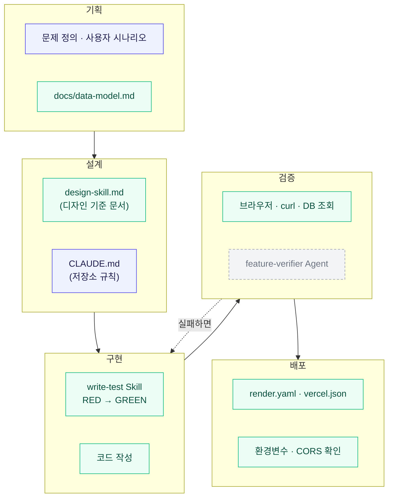

# Agent 협업 과정

기획부터 배포까지 각 단계에서 **무엇을 썼고, 누가 결정했고, AI가 무엇을 했는지** 정리한다.
실제로 쓴 것만 적는다. 만들어놓고 안 쓴 것은 그렇다고 표시했다.

---

## 1. 전체 그림

> 파란색 = 사람이 정한 것 · 초록색 = AI가 수행한 것 · 회색 점선 = 만들었지만 거의 안 쓴 것

---

## 2. 단계별 도구와 역할 분담

| 단계 | 쓴 도구 | 사람이 결정한 것 | AI가 수행한 것 |
|---|---|---|---|
| **기획** | — | 무슨 문제를 풀지, 누구를 위한 것인지, 핵심 기능 2개 | 시나리오·흐름도 문서화, 데이터 모델 초안 |
| **설계** | `design-skill.md` `CLAUDE.md` | 디자인 시스템 값(색·여백·폰트), 저장소 규칙(커밋 형식·언어·구조) | 규칙에 맞춰 화면 구성, 문서 작성 |
| **구현** | `write-test` Skill | 무엇을 만들지, 어디까지가 이번 범위인지 | 테스트 작성(RED) → 구현(GREEN) → 리팩터 |
| **검증** | 브라우저 · `curl` · DB 조회 ~~`feature-verifier`~~ | 무엇을 확인해야 완료인지 (확인 기준) | 실제 실행, 실패 케이스 확인, 근거 제시 |
| **배포** | `render.yaml` `vercel.json` Vercel CLI | 배포 여부, 계정 로그인, GitHub 권한 승인 | 설정 파일 작성, 배포 전 사전 검증, CLI 배포, 연결 확인 |

---

## 3. 만든 Skill · Agent

| 이름 | 위치 | 만든 시점 | 실제 사용 |
|---|---|---|---|
| `write-test` | `.claude/skills/write-test/SKILL.md` | 3주차 | **꾸준히 사용.** 4주차에 `parseCreditsInput`, `getDdayTone`, `buildExampleSubjects`, 서버 `subjectService` 테스트에 적용 |
| `feature-verifier` | `.claude/agents/feature-verifier.md` | 3주차 | **3주차에 1회.** 그때 테스트가 놓친 경계 케이스(`completedAt`이 빈 문자열)를 찾아냄. **4주차엔 한 번도 안 씀** |
| `design-skill.md` | 저장소 루트 | 1주차 | **Skill이 아니라 참고 문서.** 자동 트리거되지 않고 `CLAUDE.md`가 참조. UI 작업 때 기준으로 사용 |

> **정정**: 3주차 정리에서 `design-skill.md`를 Skill로 적었는데 틀렸다.
> `.claude/skills/`에 등록돼야 Skill로 동작한다. 이건 그냥 마크다운 문서다.

---

## 4. 사람과 AI의 경계 — 실제로 갈린 지점

### 사람만 한 것

- **무엇을 만들지 정하기** — 2단계에 무엇을 둘지(학점 → 공부 분량으로 바꾼 결정), 디폴트값을 "모르겠다"로 할지 중간값으로 할지
- **계정이 필요한 일** — Vercel·Render 로그인, GitHub 권한 승인, YouTube 업로드
- **공개 여부와 시점** — push할지, PR을 열지, 배포할지
- **삭제 승인** — 어떤 과목을 지울지

### AI가 한 것

- 코드 작성, 테스트 작성, 문서 작성
- 실행해서 확인하고 근거 제시 (HTTP 코드, DB 조회 결과, 스크린샷)
- 배포 전 사전 검증 (깨끗한 체크아웃에서 배포 명령 재현)
- 실패 케이스 설계 (엉뚱한 오리진으로 CORS 찔러보기 등)

### 경계가 애매했던 것

- **AI가 잘못 단정한 적이 있다.** "`~/.vercel`이 없으니 로그인 안 돼 있다" → 실제로는 로그인돼 있었다(macOS는 다른 경로에 저장). 파일 유무로 상태를 단정하면 안 된다.
- **AI가 잘못 알려준 적이 있다.** "`생리학`이라는 과목이 없다" → 완료 목록에 있었는데 활성 목록만 보고 답했다. 삭제 직전에 확인 절차 덕에 바로잡혔다.

---

## 5. 협업이 잘 된 방식

4주간 반복해서 효과가 있었던 것들이다.

**1) 확인 가능한 근거를 함께 요구했다**
"됐습니다"가 아니라 HTTP 코드·DB 조회 결과·스크린샷을 같이 내게 했다.
그러니 안 된 걸 됐다고 넘어가는 일이 없었다.

**2) 일부러 실패시켜 보게 했다**
CORS를 틀린 주소로 찔러 막히는 것까지 확인했다. 그 과정에서 CORS가 서버가 아니라
브라우저에서 막는다는 것도 알게 됐다.

**3) 되돌리기 어려운 일은 먼저 물어보게 했다**
push·PR·배포·삭제. 실제로 잘못된 삭제를 한 번 막았다.

**4) 판정 로직은 테스트부터 쓰게 했다**
`write-test` Skill에 절차를 박아두니 매번 "테스트 쓸까?"를 판단하지 않아도 됐다.

**5) 모호한 요청은 구현 전에 되묻게 했다**
"공부 분량이랑 이해도를 메인으로"가 학점을 남기는 건지 내리는 건지 갈렸는데,
먼저 물어봐서 두 번 일하지 않았다.

---

## 6. 다음에 고칠 것

- **`feature-verifier`를 검증 단계에 고정한다.** 만들어두는 것과 습관이 되는 것은 다르다는 걸 4주간 확인했다. 쓸지 말지 매번 판단하지 않도록 순서에 넣는다.
- **`design-skill.md`를 진짜 Skill로 옮긴다.** `.claude/skills/design/SKILL.md` 로 만들면 UI 작업에서 자동으로 트리거된다.
