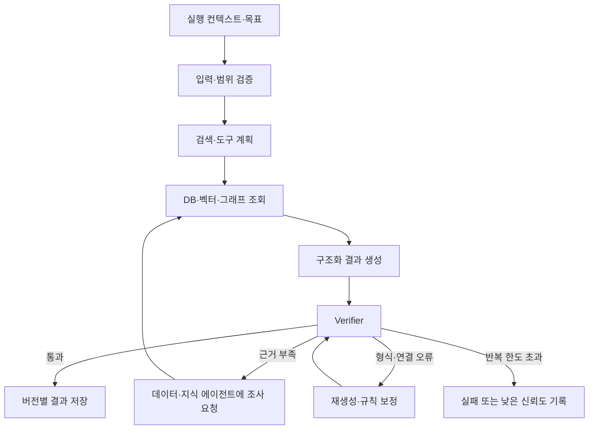
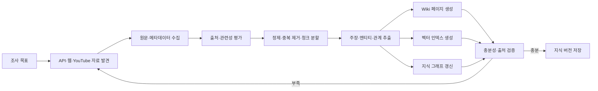

# CareerSignal 에이전트 설계

## 1. 문서 목적

이 문서는 CareerSignal의 다섯 에이전트가 받는 입력, 생성하는 출력, 사용하는 도구와 내부 제어 흐름을 정의한다. 시스템 배치와 런타임 경계는 [아키텍처](architecture.md), 자료의 출처와 신뢰도는 [데이터 전략](data-strategy.md)에서 다룬다.

## 2. 에이전트와 결정적 실행의 구분

에이전트는 목표에 따라 검색 대상과 도구를 선택하고, 근거의 충분성을 판단하며, 필요하면 검색과 생성을 반복한다. 파이프라인은 정해진 입력을 고정된 순서로 처리한다.

| 유형 | 판단 범위 | 구성 예 |
| --- | --- | --- |
| 에이전트 | 검색·도구 선택, 충분성 판단, 재검색·재생성 | 데이터·지식, 통계 분석, 채용공고 해설, 합격 전략, 준비 로드맵 |
| 분석 오케스트레이터 | 데이터 변경과 의존성에 따른 실행 순서 | 영향 범위 계산, 에이전트 호출, 버전 활성화 |
| 도구·노드 | 한 가지 결정적 작업 | HTTP 수집, HTML 정제, SQL 집계, 임베딩, DB 저장 |
| Express 조합기 | 사용자 체크 상태에 따른 규칙 계산 | 준비 현황 집계, 프로젝트·학습 순서 재조합 |

에이전트는 내부에 결정적 도구와 고정 순서의 하위 파이프라인을 포함할 수 있다. 분석 오케스트레이터는 LLM 판단을 사용하지 않는다.

## 3. 공통 실행 컨텍스트

```text
dataset_version
analysis_version
job_role_id
job_family_id
career_level
scope_level: overall | cluster | posting
scope_id
company_cluster_id
posting_id
model_version
prompt_version
retrieval_policy_version
```

모든 에이전트는 공통 식별자로 입력 범위를 제한한다. 백엔드·프론트엔드·데이터·AI·기획·디자인 등 직무 차이는 `job_role_id`와 직무별 분류체계로 표현하며, 코드와 프롬프트에 특정 직무명을 고정하지 않는다.

## 4. 공통 도구

| 도구 | 책임 |
| --- | --- |
| SQL 조회 | 범위별 공고·통계·분석 산출물 조회 |
| 키워드 검색 | 정확한 기술명·직무명·회사명 검색 |
| 벡터 검색 | 표현이 다른 유사 요구사항과 근거 검색 |
| 그래프 탐색 | 요구사항·역량·근거·준비 항목의 다단계 관계 검색 |
| 웹 검색 | 새 공식 자료와 외부 전략 자료 발견 |
| URL 수집 | 허용된 공개 원문과 메타데이터 수집 |
| YouTube 분석 | 공개 영상의 주장·요약·관련 구간 추출 |
| 구조화 출력 | Pydantic 스키마를 따르는 JSON 생성 |
| Verifier | 수치·근거·스키마·연결·신뢰도 검사 |

웹 검색과 외부 수집은 데이터·지식 에이전트를 통해 수행한다. 다른 에이전트는 부족한 자료의 조사 목표와 범위를 전달하고 갱신된 지식 저장소를 다시 조회한다.

## 5. 공통 제어 흐름



## 6. 에이전트 입출력 요약

| 에이전트 | 주 입력 | 주요 출력 | 주 소비자 |
| --- | --- | --- | --- |
| 데이터·지식 | 조사 목표, 출처 정책, URL·API 응답 | Raw 원문, 출처 평가, Wiki, 청크, 임베딩, 노드·엣지 | 나머지 네 에이전트 |
| 통계 분석 | 직무별 공고 원문, 용어사전 | 정형 공고, 직무·기업군·기간 통계, 통계 해석 | 채용공고 해설·합격 전략·준비 로드맵 |
| 채용공고 해설 | 통계, 공고, 공식 자료, Wiki·벡터·그래프 | 직무 기준선, 기업군·공고 편차, 숨은 요구, 근거, 신뢰도 | 합격 전략·준비 로드맵·화면 |
| 합격 전략 | 공고 해설, 통계, 공식·외부 전략 자료 | 체크리스트, 포트폴리오·자소서·면접 전략 | 준비 로드맵·화면 |
| 준비 로드맵 | 합격 전략, 공고 해설, 통계, 선수 관계, 학습 자료 | 기본 프로젝트 로드맵, 학습 전략, 항목 연결 | Express 조합기·화면 |

다섯 에이전트의 내부 처리는 다음 구조를 공유한다. 각 단계의 상세 입력·출력과 반복 조건은 7~11장에서 정의한다.

```mermaid
flowchart LR
    subgraph DK["데이터·지식 에이전트"]
        DK1["자료 발견·수집"] --> DK2["출처·관련성 평가"]
        DK2 --> DK3["정제·청크·주장 추출"]
        DK3 --> DK4["Wiki·벡터·원천 그래프"]
    end

    subgraph ST["통계 분석 에이전트"]
        ST1["공고 요구사항 추출"] --> ST2["용어·요구 수준 정규화"]
        ST2 --> ST3["규칙 기반 범위별 집계"]
        ST3 --> ST4["수치·근거 검증"]
    end

    subgraph RV["채용공고 해설 에이전트"]
        RV1["통계·근거 검색"] --> RV2["직무 기준선 구성"]
        RV2 --> RV3["기업군·공고 편차·숨은 요구 설명"]
        RV3 --> RV4["근거·신뢰도 검증"]
    end

    subgraph CD["합격 전략 에이전트"]
        CD1["요구사항 통합"] --> CD2["증명 방법·활용처 배정"]
        CD2 --> CD3["체크리스트·지원 전략 생성"]
        CD3 --> CD4["항목 연결 검증"]
    end

    subgraph RM["준비 로드맵 에이전트"]
        RM1["선수 관계·학습 자료 검색"] --> RM2["프로젝트·학습 후보 생성"]
        RM2 --> RM3["기본 순서·우선순위 계산"]
        RM3 --> RM4["누락·순환·연결 검증"]
    end

    DK4 --> ST1
    DK4 --> RV1
    ST4 --> RV1
    ST4 --> CD1
    ST4 --> RM1
    RV4 --> CD1
    RV4 --> RM1
    CD4 --> RM1
```



## 7. 데이터·지식 에이전트

### 7.1 목표

분석에 필요한 자료를 발견·수집·평가하고, 다른 에이전트가 재현 가능한 방식으로 검색할 수 있는 지식 자산을 구축한다.

### 7.2 입력

- 조사 목표와 대상 직무·기업·공고
- 허용·차단 도메인과 자료 계층
- 기존 자료의 URL·원문 해시·수집 시점
- 자료 부족을 보고한 에이전트와 필요한 근거 유형

### 7.3 내부 구조



### 7.4 출력

- 원문과 출처 메타데이터
- 자료 계층·신뢰도·허용 용도
- 버전이 있는 Wiki 페이지와 주장별 근거
- 검색 청크와 임베딩
- 지식 그래프 노드·엣지
- 실패 URL, 중복 자료, 수집·검증 기록

Wiki와 그래프는 원문을 대체하지 않는다. 생성된 주장과 관계는 원문 청크 식별자를 가진다.

## 8. 통계 분석 에이전트

### 8.1 목표

직무별 채용공고에서 요구사항을 구조화하고 전체·기업군·기간 통계를 생성한다.

### 8.2 입력

- 해당 `job_role_id`의 공고 원문과 메타데이터
- 직무·역량·도구 분류체계와 별칭
- 기업군과 기간 스냅샷
- 추출·집계 규칙

### 8.3 내부 구조

```text
범위별 공고 조회
→ 공고 섹션·요구사항 추출
→ 용어와 요구 수준 정규화
→ 근거 문장 연결
→ SQL·Python 규칙 집계
→ 직무·기업군·기간 통계 생성
→ 통계 자연어 해석
→ 수치·분모·근거 검증
→ 저장
```

빈도·비율·추세·조합은 규칙으로 계산하고 LLM이 숫자를 산출하지 않는다. LLM은 원문 추출, 용어 후보, 통계 해석에 사용한다.

### 8.4 출력

- 공고별 정형 요구사항과 근거 문장
- 직무 전체·기업군 빈도와 필수율
- 기간별 추세와 요구 수준 이동
- 기술·역량 동시 출현과 구현 수준 신호
- 표본 수와 신뢰도
- 정형 요구사항과 직무·기술·역량을 잇는 버전별 그래프 관계

통계 결과는 채용공고 해설·합격 전략·준비 로드맵 에이전트가 모두 직접 조회한다.

## 9. 채용공고 해설 에이전트

### 9.1 목표

직무 공통 기준선과 기업군·개별 공고의 편차를 근거와 함께 심층 해설한다.

### 9.2 입력

- 통계 분석 결과
- 공고 원문과 정형 요구사항
- 회사 공식 채용·기술 자료
- 공공·직무 표준 자료
- Wiki·키워드·벡터·그래프 검색 결과

### 9.3 내부 구조

```text
분석 범위 확인
→ 통계와 직무 기준 후보 조회
→ 원문·공식 근거 검색
→ 그래프로 요구사항·역량·회사 맥락 연결
→ 직무 기준선 확정
→ 기업군·공고 편차 탐지
→ 명시 요구와 암묵 기대 분리
→ 해설·근거·신뢰도 생성
→ 근거 부족 시 조사 요청
→ Verifier
→ 저장
```

### 9.4 출력

- 직무 공통 기준선
- 기업군별 편차와 편차 없음 항목
- 개별 공고 원문 주석과 종합 해설
- 통계 항목·원문·공식 자료를 연결한 근거
- 주장별 신뢰도와 지원 표본 수
- 요구사항·역량·공식 근거를 잇는 버전별 그래프 관계

## 10. 합격 전략 에이전트

### 10.1 목표

공고 해설에서 도출한 요구사항을 준비 체크리스트와 포트폴리오·자소서·면접 전략으로 변환한다.

### 10.2 입력

- 공고 해설 결과와 통계 분석 결과
- 회사 공식 자료
- 검증된 포트폴리오·자소서·면접 전략 자료
- 직무별 증명 산출물과 활용처 분류 규칙
- Wiki·벡터·그래프 검색 결과

### 10.3 내부 구조

```text
공고 해설 요구사항과 통계 우선순위 조회
→ 요구 항목 통합·중복 제거
→ 필수·우대와 증명 방법 결정
→ 프로젝트형·서사형·학습형 분류
→ 포트폴리오·자소서·면접 활용처 배정
→ 활용처별 전략 생성
→ 외부 전략 근거 부족 시 조사 요청
→ 체크리스트·전략 연결 검증
→ 저장
```

### 10.4 출력

- 요구 항목, 근거, 필요 산출물·활동, 필수 여부를 가진 체크리스트
- 체크리스트 항목과 연결된 포트폴리오 강조점
- 자소서 소재·서사 구조·작성 포인트
- 면접 질문·꼬리질문·답변 포인트
- 요구사항·증명 산출물·지원 활용처를 잇는 버전별 그래프 관계

사용자의 보유 체크는 이 에이전트의 생성 결과를 바꾸지 않는다.

## 11. 준비 로드맵 에이전트

### 11.1 목표

체크리스트 항목을 충족하는 기본 프로젝트 로드맵과 병행 학습 전략을 생성한다.

### 11.2 입력

- 합격 전략·공고 해설·통계 결과
- 직무별 선수 역량 그래프
- 검증된 학습 자료와 프로젝트 후보
- 기간·난이도·충족 항목 연결 규칙

### 11.3 내부 구조

```text
합격 전략과 통계 중요도 조회
→ 선수 관계와 학습 자료 검색
→ 항목별 학습·프로젝트 후보 생성
→ 후보별 fills 체크리스트 연결
→ 기본 프로젝트 순서 계산
→ 병행 학습 전략 생성
→ 순환·누락·근거 검증
→ 저장
```

### 11.4 출력

- 단계·기간·산출물·우선순위를 가진 기본 프로젝트 로드맵
- 주제·깊이·면접 검증 기준을 가진 학습 전략
- 선수 관계와 `fills_checklist_item_ids`
- 추천 이유와 근거
- 역량·선수 역량·학습·프로젝트를 잇는 버전별 그래프 관계

체크 상태에 따른 완료 표시와 순서 조정은 Express 조합기가 수행한다.

## 12. 지식 그래프 사용 범위

| 단계 | 사용 | 목적 |
| --- | --- | --- |
| 자료 수집·정제 | 생성 | 자료의 엔티티·주장·관계 저장 |
| 통계 집계 | 제한적 | 용어 통합과 항목 연결 보조 |
| 채용공고 해설 | 핵심 | 공고→요구사항→역량→공식 근거 연결 |
| 합격 전략 | 핵심 | 요구사항→증명 자료→활용처 연결 |
| 로드맵 | 핵심 | 역량→선수 역량→학습·프로젝트→체크리스트 연결 |
| 일반 화면 조회 | 미사용 | 저장된 분석 결과를 직접 조회 |
| 체크 상태 조합 | 미사용 | 규칙 기반 완료·우선순위 계산 |

벡터 검색은 의미가 유사한 문서와 청크를 찾고, 그래프 탐색은 여러 단계의 관계를 추적한다. 두 검색은 키워드 검색과 결합한 Hybrid RAG로 사용한다.

## 13. Verifier와 실행 제한

Verifier는 각 에이전트 내부의 검증 단계다.

| 검증 대상 | 검사 내용 |
| --- | --- |
| 스키마 | Pydantic 타입, 필수 필드, 허용 값 |
| 통계 | 분모, 표본 수, 비율, 기간 비교, 원문 집계 일치 |
| 근거 | 주장별 원문 청크와 출처 존재 |
| 범위 | 직무·기업군·공고 식별자 일치 |
| 연결 | 공고 해설→체크리스트→합격 전략→준비 로드맵 식별자 연속성 |
| 그래프 | 잘못된 노드 유형, 고립된 핵심 노드, 선수 관계 순환 |
| 신뢰도 | 자료 계층과 지원 근거에 맞는 신뢰도 |

검색·재생성은 실행별 최대 횟수와 비용 한도를 갖는다. 한도 안에서 충분한 근거를 확보하지 못한 결과는 낮은 신뢰도를 명시하거나 분석 버전을 실패 처리한다.

## 14. 모델과 버전

핵심 생성 모델은 OpenAI API를 사용한다. 모델은 에이전트 이름이 아니라 작업의 난이도와 평가 결과에 따라 배치한다.

| 작업 | 기본 모델 | 상향 조건 |
| --- | --- | --- |
| 분류·메타데이터 보완·단순 정형 추출 | `gpt-5.6-luna` | 구조화 정확도가 기준에 미달하면 Terra |
| 자료 평가·Wiki·복합 요구사항 추출 | `gpt-5.6-terra` | 근거 연결과 재현율이 기준에 미달하면 Sol |
| 공고 해설·합격 전략·준비 로드맵 생성과 LLM 검증 | `gpt-5.6-terra` | 복합 관계·근거 충실도가 기준에 미달하면 Sol |
| 최종 평가용 고난도 표본 | `gpt-5.6-sol` | 상향 없음 |

동일 작업은 개발·평가·배치 실행에서 같은 모델과 프롬프트 버전을 사용한다. 모델 변경은 평가 세트 비교와 새 분석 버전을 거쳐 반영한다.

Gemini API의 `gemini-3.5-flash`는 공개 YouTube 영상의 구조화 요약과 주장 추출에 사용한다. 모델 ID는 `GEMINI_VIDEO_MODEL` 환경변수로 관리하고, 변경 시 영상 평가 표본을 다시 검증한다. NVIDIA Build API는 핵심 생성 경로에 포함하지 않고 평가 결과의 교차 확인에 사용한다.

모든 산출물은 모델·프롬프트·검색 정책·데이터 버전을 기록한다.
