# Agent 협업 과정 시각화 (하소AI)

4주간 기획→설계→구현→검증→배포 단계에서 실제로 쓴 도구와, 그중 사람이 결정한 것과 AI가 수행한 것을 구분해 정리했다. `showcase.json`의 `developmentWithAI`/`agent` 필드, `docs/plan.md`, `docs/backlog.md`, 커밋 로그를 근거로 작성했고 — **실제와 다른 부분이 있으면 알려주면 바로 고친다.**

```mermaid
flowchart LR
    subgraph P["기획"]
        P1["문제 정의 · 감정온도 컨셉\n(사람)"]
        P2["ChatGPT로 프롬프트 PoC\n(AI 보조)"]
    end
    subgraph D["설계"]
        D1["기술스택 · API 구조 결정\n(사람)"]
        D2["Figma Make로 UI 목업\n(AI 보조)"]
    end
    subgraph I["구현"]
        I1["채널/온도별 프롬프트 작성\n(사람 검수 + AI 초안)"]
        I2["Claude Code: API 연동 코드 작성\n(AI 수행)"]
    end
    subgraph V["검증"]
        V1["Claude Code: curl로 배포 재현 테스트\n(AI 수행)"]
        V2["결과 최종 판단\n(사람)"]
    end
    subgraph R["배포"]
        R1["Claude Code: 원인 진단 → 수정\n(AI 수행)"]
        R2["커밋 승인 · git push\n(사람 승인, AI 실행)"]
        R3["Vercel/Render 자동 배포\n(자동화)"]
    end
    P --> D --> I --> V --> R
```

## 단계별 표

| 단계 | 사람이 결정한 것 | AI(도구)가 수행한 것 | 사용 도구 |
|---|---|---|---|
| 기획 | 문제 정의(소상공인 번아웃), 감정 온도 컨셉, 발행 채널 선정, 백로그 우선순위(P0/P1/P2) | 프롬프트 문구 초안 생성, 손님 저격 문제 등 규칙 개선 아이디어 | ChatGPT (프롬프트 PoC) |
| 설계 | 기술 스택(React/FastAPI/GPT), 콘텐츠 맥락 엔진 계층 구조(큐레이션 DB → 공휴일 API → 날씨 API 순) | UI 목업 초안 | Figma Make |
| 구현 | 어떤 기능을 언제 넣을지(주차별 백로그), 최종 코드 승인 | 라우터/서비스 코드 작성, GPT-5·GPT Image 연동 코드, 재시도 로직 구현 | Claude Code |
| 검증 | 재현된 증상이 실제 문제인지 최종 판단 | 배포 주소에 curl로 재현 테스트, 임시 python 스크립트로 원인 검증 | Claude Code |
| 배포 | 커밋·푸시 승인 | 원인 진단, 수정 코드 적용, git add/commit/push | Claude Code (push 시 Vercel/Render 자동 배포) |

## 메모

- 구현/검증/배포 단계는 사실상 하나로 이어진다 — Claude Code와 "증상 설명 → 재현 → 수정 → 배포"를 반복하는 루프였다 ([[workflow.md]] 워크플로우 B와 동일).
- 기획·설계 단계는 AI 도구를 참고용으로만 썼고, 핵심 의사결정(문제 정의, 온도 컨셉, 기술스택)은 전부 사람이 했다.
- 이 표에 없는 다른 Agent/Skill(예: 특정 Claude Code 서브에이전트, 커스텀 스킬)을 썼다면 알려줘 — 항목을 추가/수정한다.
