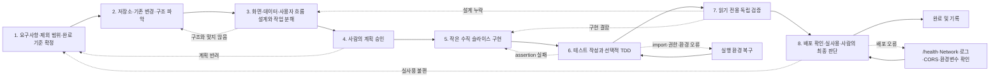

# TeamFlow를 만들며 정리한 AI 개발 흐름

TeamFlow를 만들 때 AI에게 계획부터 검증까지 한꺼번에 맡기지는 않았다. 먼저 무엇을
만들지 정하고, 현재 코드를 읽은 다음, 작은 기능부터 구현하고 마지막에는 다른 역할로
다시 확인했다. 이 문서는 실제로 반복해서 사용한 순서를 정리한 것이다. 프로젝트
이름과 기술만 바꾸면 다른 작업에도 비슷하게 사용할 수 있다.

자세한 내용은 이 문서에 적었고, 발표나 빠른 확인에는
[한 장짜리 요약본](./ai-development-workflow.html)을 사용한다.

## 1. 작업하면서 지킨 것

1. **목표와 최종 결정은 사람이 맡는다.**
   AI가 선택지를 제안할 수는 있지만 무엇을 만들고 어디까지 반영할지는 사람이 정한다.
2. **코드를 고치기 전에 현재 상태부터 본다.**
   저장소 구조, 프로젝트 지침, Git 상태, 관련 코드와 기존 테스트를 먼저 확인한다.
3. **화면·데이터·흐름을 따로 보지 않는다.**
   사용자 동작이 화면, 서버, DB를 거쳐 다시 화면에 반영되는 과정까지 함께 생각한다.
4. **기능 하나를 작은 크기로 끝까지 연결한다.**
   화면이나 API 한쪽만 만드는 대신 사용자가 직접 확인할 수 있는 한 흐름을 완성한다.
5. **테스트를 만드는 역할과 최종 확인 역할을 나눈다.**
   작성한 쪽이 자기 결과를 그대로 통과시키지 않도록 따로 검증한다.
6. **한 일과 확인하지 못한 일을 같이 적는다.**
   실행한 명령, 결과, 확인한 화면뿐 아니라 Mock 범위와 남은 한계도 남긴다.
7. **막히면 원인이 있는 단계로 돌아간다.**
   모든 문제를 코드부터 고치려 하지 않고 요구사항, 설계, 환경, 구현, 배포 중 어디가
   문제인지 먼저 찾는다.

## 2. 전체 작업 순서



항상 1단계부터 8단계까지 한 번에 끝나는 것은 아니다. 검증에서 문제가 나오거나 직접
써봤을 때 불편하면 원인이 있는 단계로 돌아간다.

## 3. 누가 무엇을 맡는지

| 역할 | 맡은 일 | 하지 않는 일 | 남기는 것 |
| --- | --- | --- | --- |
| 사람 | 목표, 범위, 우선순위와 최종 반영 여부 결정 | 확인하지 않은 AI 제안을 바로 반영하지 않음 | 확정한 계획과 최종 결정 |
| 상위 계획 대화 | 주간 목표와 현재 진행 상황을 비교하고 P0/P1/P2 정리 | 기능의 세부 구현까지 대신하지 않음 | 우선순위와 남은 일 |
| 구조 파악 도구 | 관련 파일, 연결 관계와 데이터 흐름 찾기 | 코드를 읽기 전에 새 구조를 가정하지 않음 | 구조 설명과 수정 예상 파일 |
| 코딩 Agent | 승인받은 범위만 구현하고 실행 결과 정리 | 승인 전 구현, 무관 파일 수정, 임의 라이브러리 추가를 하지 않음 | 코드 변경과 실행 결과 |
| 테스트 작성 Skill | 필요한 테스트 수준을 정하고 TDD와 회귀 테스트 관리 | 최종 검증까지 스스로 맡지 않음 | 테스트와 Red/Green 기록 |
| 검증 Agent | 요구사항별로 직접 확인하고 결과를 나눠 보고 | 코드·테스트·문서·설정을 수정하지 않음 | 통과/실패/확인 불가/범위 제외 |
| 배포 도구와 운영 화면 | 외부 주소, 로그와 환경 설정 확인 | 설정 파일만 보고 배포 성공이라 판단하지 않음 | 외부 실행 결과와 오류 기록 |

TeamFlow에서는 구조를 볼 때 Understand와 저장소 탐색을 사용했고, 테스트 작성에는
[`teamflow-test-authoring`](../.agents/skills/teamflow-test-authoring/SKILL.md), 독립
검증에는 [`verification_agent`](../.codex/agents/verification_agent.toml)를 사용했다.
지금은 없어진 계획 Agent나 실제로 실행했는지 확인하지 못한 Agent는 목록에서 뺐다.

## 4. 단계별로 확인할 것

각 단계마다 `입력 → AI 수행 → 사람 결정 → 확인 기준 → 결과물 → 실패 시 복귀`를
같이 적는다. 그래야 다음 Agent나 다른 사람이 이어서 작업할 때 다시 추측하지 않아도
된다.

### 1단계. 요구사항·제외 범위·완료 기준 확정

| 항목 | 내용 |
| --- | --- |
| 입력 | 해결할 문제, 대상 사용자, 원하는 기능, 일정, 기존 제약 |
| AI 수행 | 요청을 화면에서 확인 가능한 동작으로 바꾸고 포함·제외 범위와 질문을 정리 |
| 사람 결정 | 무엇을 이번 작업에 포함할지, 어떤 선택지를 채택할지, 언제 완료로 볼지 승인 |
| 확인 기준 | 요구사항이 행동과 결과로 표현되고 모호한 표현이 남지 않았는지 확인 |
| 결과물 | 기능 목표, 포함/제외 범위, 완료 기준, 가정 |
| 실패 시 복귀 | 정보가 부족하거나 선택에 따라 제품 동작이 달라지면 이 단계에서 질문하고 멈춤 |

좋은 완료 기준은 직접 확인할 수 있어야 한다.

```text
나쁨: AI 기능을 잘 만든다.
좋음: AI에게 할 일을 배정하고 실행 결과를 검토한 뒤, 승인한 경우에만 공유 노트가 생성된다.
```

### 2단계. 저장소·기존 변경·구조 파악

| 항목 | 내용 |
| --- | --- |
| 입력 | 승인된 요구사항, 저장소, 프로젝트 지침, 현재 Git 상태 |
| AI 수행 | 저장소 루트, 지침 문서, 관련 화면·API·데이터 코드, 인접 테스트와 기존 변경 확인 |
| 사람 결정 | 참고 자료의 신뢰 범위와 보존해야 할 사용자 작업을 확정 |
| 확인 기준 | 관련 계층과 데이터 흐름, 기존 패턴, 수정 금지 범위를 설명할 수 있는지 확인 |
| 결과물 | 현재 구조 요약, 관련 파일 지도, 위험과 미확인 사항 |
| 실패 시 복귀 | 구조가 불명확하면 더 좁은 질문으로 탐색하고, 근거 없이 구현 단계로 넘어가지 않음 |

구조 파악 도구는 전체 코드를 길게 나열하는 용도가 아니다. 사용자 행동에서 시작해
화면 상태, API, 저장소, DB와 다시 화면으로 돌아오는 관계를 필요한 깊이만큼 추적한다.

디자인 생성물도 같은 원칙을 적용한다. Figma 생성 코드는 제품 코드로 붙여 넣는 대상이
아니라 화면 구성, 상태, 상호작용과 디자인 토큰을 추출하는 **설계 입력**이다.

### 3단계. 화면·데이터·사용자 흐름 설계와 작업 분해

| 항목 | 내용 |
| --- | --- |
| 입력 | 완료 기준, 구조 지도, 기존 UI·API·DB 패턴 |
| AI 수행 | 화면, 데이터, 사용자 행동부터 화면 반영까지의 흐름을 설계하고 작업을 작은 단위로 분해 |
| 사람 결정 | 제품 동작, 데이터 소유권, 권한, 우선순위와 구현 순서를 선택 |
| 확인 기준 | 빠진 화면·데이터·흐름이 없고 각 작업이 독립적으로 확인 가능한지 검토 |
| 결과물 | 화면·데이터·흐름 설계, P0/P1/P2 작업, 변경 예상 지점 |
| 실패 시 복귀 | 계획이 기존 구조와 충돌하면 2단계로, 기능 동작이 정해지지 않았으면 1단계로 돌아감 |

기능은 다음 세 관점으로 함께 설계한다.

1. **화면:** 사용자가 무엇을 보고 어떤 조작을 하는가?
2. **데이터:** 어떤 값이 어디에 저장되고 누가 접근할 수 있는가?
3. **흐름:** 사용자 동작이 서버와 DB를 거쳐 어떤 결과로 화면에 반영되는가?

### 4단계. 사람의 계획 승인

| 항목 | 내용 |
| --- | --- |
| 입력 | 설계안, 작업 순서, 변경 예상 파일, 선택지와 위험 |
| AI 수행 | 작업이 너무 크지 않은지, 핵심 기능이 먼저인지, 직접 확인할 수 있는지 다시 점검 |
| 사람 결정 | 계획 승인, 수정 요청, 보류 또는 범위 축소 |
| 확인 기준 | 코딩 중에 다시 큰 결정을 하지 않아도 될 만큼 계획이 구체적인지 확인 |
| 결과물 | 승인된 구현 계획과 수정 허용 범위 |
| 실패 시 복귀 | 계획이 과하거나 핵심이 뒤로 밀렸으면 1~3단계를 수정하고 다시 승인받음 |

여기서 사람이 계획을 확인하고 구현을 시작해도 되는지 정한다. 계획만 요청한 상태라면
승인하기 전에는 파일을 수정하지 않는다.

### 5단계. 작은 수직 슬라이스 구현

| 항목 | 내용 |
| --- | --- |
| 입력 | 승인된 계획, 기존 코드 패턴, 관련 테스트 |
| AI 수행 | 가장 작은 사용자 흐름부터 화면·API·데이터를 연결하고 정해진 범위를 벗어나지 않는지 확인 |
| 사람 결정 | 구현 중 새로 정해야 하는 기능 동작이나 범위 확장이 나오면 반영 여부를 결정 |
| 확인 기준 | 사용자 행동부터 결과 반영까지 한 흐름을 직접 실행할 수 있는지 확인 |
| 결과물 | 구현 코드, 변경 파일 목록, 실행 결과와 남은 한계 |
| 실패 시 복귀 | 설계 문제는 3단계, 단순 구현 결함은 이 단계, 환경 문제는 실행 환경 복구로 이동 |

구현은 다음 원칙을 지킨다.

- 현재 작업과 무관한 변경을 되돌리거나 정리하지 않는다.
- 기존 상수, 컴포넌트, 저장소와 오류 처리 패턴을 우선 재사용한다.
- 새 라이브러리나 폴더 구조 변경은 필요성을 제안하고 승인받는다.
- 한 계층의 성공만 보고 전체 기능이 완성됐다고 판단하지 않는다.

### 6단계. 테스트 작성과 선택적 TDD

| 항목 | 내용 |
| --- | --- |
| 입력 | 요구사항, 변경 코드, 기존 테스트, 예상 회귀 범위 |
| AI 수행 | 테스트 방식을 선택하고 정상·빈 값·경계·실패 사례를 작성하며 관련 테스트부터 회귀 테스트까지 실행 |
| 사람 결정 | TDD 적용 범위와 비용 대비 충분한 테스트 수준을 승인 |
| 확인 기준 | 테스트 이름, assertion, 테스트 수준과 Mock 범위가 같은 요구사항을 증명하는지 검토 |
| 결과물 | 테스트 코드, 실행 명령과 결과, Mock 한계, 필요 시 Red/Green/Refactor 기록 |
| 실패 시 복귀 | 의미 있는 assertion 실패는 5단계, import·권한·설정 오류는 환경 복구 후 테스트 재실행 |

#### 테스트 방식 선택

| 방식 | 사용하는 경우 |
| --- | --- |
| TDD | 사용자가 명시했거나 입력 검증, 계산, 권한, 보안, API 계약처럼 기대 결과가 명확한 규칙 |
| 구현 후 테스트 | 여러 계층을 연결하는 일반 기능, 변경 가능성이 큰 기능, 기존 UI 확장 |
| 기존 테스트 활용 | 기존 테스트가 요구사항과 회귀 위험을 충분히 증명하고 중복 테스트의 가치가 낮을 때 |
| 자동화 테스트 제외 | 단순 문구, 색상·간격·레이아웃, 초기 프로토타입처럼 자동화 비용이 더 클 때 |

TDD는 다음 순서의 실행 근거가 있어야 한다.

```text
시나리오
→ 구현되지 않은 요구사항 때문에 실패하는 Red
→ 테스트를 통과하는 최소 구현
→ Green
→ 동작을 유지한 Refactor
→ 관련 및 전체 회귀 확인
```

설정, import, 파일 접근 권한 같은 오류는 요구사항이 실패한 것이 아니므로 Red로
인정하지 않는다. 최종 코드만으로는 구현 전에 Red를 실행했는지 알 수 없으므로 명령과
시간 순서가 드러나는 기록을 보존한다.

TeamFlow의 현재 테스트 실행기는 다음과 같다.

- Web: Vitest + Testing Library + jsdom
- API: `node:test` + `node:assert/strict`
- Shared: `node:test` + `node:assert/strict`
- 루트 `npm.cmd test`: 테스트 스크립트가 있는 Workspace의 테스트 실행
- 루트 `npm.cmd run lint`: `apps`, `packages`를 oxlint로 검사
- 루트 `npm.cmd run build`: Web production build

루트 build는 Web 빌드이며 API를 포함한 “모노레포 전체 빌드”라고 표현하지 않는다.
존재하지 않는 명령을 문서만 보고 추측해 실행하지 않는다.

### 7단계. 읽기 전용 독립 검증

| 항목 | 내용 |
| --- | --- |
| 입력 | 원래 요구사항, 제외 범위, 변경 결과, 테스트와 실행 기록 |
| AI 수행 | 요구사항별 검증 방법을 정하고 코드·테스트·명령·핵심 흐름을 독립적으로 확인 |
| 사람 결정 | 통과, 수정, 보류 또는 추가 확인 필요 여부를 최종 판단 |
| 확인 기준 | 각 결과 옆에 실제 실행, 테스트, 코드 확인 중 무엇을 보고 판단했는지 적었는지 확인 |
| 결과물 | 요구사항별 통과/실패/확인 불가/범위 제외 결과와 이유 |
| 실패 시 복귀 | 요구사항 누락은 3단계, 구현 결함은 5단계, 테스트 결함은 6단계로 전달 |

검증 Agent는 문제를 찾아도 구현과 테스트를 직접 고치지 않는다. 만든 쪽과 확인하는
쪽을 나눠 두기 위해서다.

검증은 다음 항목을 구분한다.

- **기능 검증:** 사용자 요구사항이 실제로 동작하는가?
- **테스트 품질 검증:** 테스트가 그 요구사항을 제대로 증명하는가?
- **TDD 증거 검증:** Red와 Green의 실행 순서가 남아 있는가?
- **환경 한계:** 독립적으로 실행하지 못한 항목은 무엇인가?

테스트가 통과했다는 사실만으로 기능 요구사항을 통과 처리하지 않고, 직접 실행할 수
없었다면 `확인 불가`와 다음 확인 방법을 남긴다.

### 8단계. 배포 확인·실사용·사람의 최종 판단

| 항목 | 내용 |
| --- | --- |
| 입력 | 검증된 변경, 배포 설정, 외부 URL, 환경변수 이름과 운영 제약 |
| AI 수행 | 배포 상태와 로그를 읽고 외부에서 핵심 흐름을 실행하며 오류 지점을 좁힘 |
| 사람 결정 | 배포 유지, 롤백, 수정, 공개 범위와 최종 완료 여부 판단 |
| 확인 기준 | 외부 화면, 서버 상태, Network, DB 저장·조회와 새로고침 유지가 연결되는지 확인 |
| 결과물 | 접근 가능한 배포, 핵심 흐름 실행 기록, 현재 남은 문제 |
| 실패 시 복귀 | 상태 확인 → Network → 서버 로그 → CORS → 환경변수 → DB 순으로 좁힌 뒤 해당 단계 수정 |

배포 확인의 기본 순서는 다음과 같다.

```text
1. 프론트 주소가 외부에서 열리는가?
2. 서버 /health가 응답하는가?
3. 브라우저 Network에서 요청 주소와 상태를 확인했는가?
4. 서버 로그에서 동일한 요청과 오류를 찾았는가?
5. CORS와 환경변수 이름·적용 범위가 맞는가?
6. DB에 저장되고 다시 조회되는가?
7. 새로고침 후에도 사용자 화면에 유지되는가?
```

설정 파일에 서비스가 적혀 있어도 실제로 배포됐다는 뜻은 아니다. TeamFlow의
[`render.yaml`](../render.yaml)은 API 서비스 설정만 담고 있다. 이 파일만 보고 Web
배포나 실제 환경변수 값까지 확인됐다고 보지 않는다.

## 5. 문제가 생겼을 때

| 증상 | 먼저 구분할 것 | 돌아갈 단계 | 다시 시작하는 기준 |
| --- | --- | --- | --- |
| 요구사항을 여러 방식으로 해석할 수 있음 | 사람이 정해야 할 기능 동작인지 단순 구현 방식인지 | 1단계 | 사람이 동작과 제외 범위를 승인 |
| 계획이 기존 구조와 맞지 않음 | 구조를 못 읽었는지 제품 요구가 바뀌었는지 | 2~3단계 | 관련 계층과 변경 지점을 설명 가능 |
| 테스트 assertion 실패 | 요구사항 미구현인지 확인 | 5단계 | 승인된 완료 기준과 assertion을 만족하는 최소 구현이 동작 |
| import·권한·환경 오류 | 테스트가 실행되기 전 환경 실패인지 | 실행 환경 복구 | 테스트가 assertion 단계까지 실행 |
| 검증 Agent가 문제를 발견함 | 설계가 빠졌는지 구현이 잘못됐는지 | 3단계 또는 5단계 | 어디를 고치고 다시 확인할지 정해짐 |
| 배포 화면만 열리고 기능은 실패 | `/health` → Network → 로그 → CORS → 환경변수 순서로 경계 확인 | 8단계 진단 후 해당 구현 단계 | 같은 외부 흐름을 처음부터 재실행 |
| 실사용이 불편하지만 테스트는 통과 | 요구사항이나 UX 기준이 빠졌는지 | 1단계 | 새 완료 기준이 정의되고 승인됨 |

## 6. TeamFlow에서 실제로 해본 것

### 사례 1. Figma를 코드가 아닌 설계 입력으로 사용

Figma AI가 만든 프로토타입은 화면, 모달, Mock 데이터와 네비게이션이 큰 단일 파일에
집중되어 있었다. 생성 코드를 그대로 제품 코드로 유지하지 않고 다음을 추출했다.

- 필요한 화면과 공통 레이아웃
- 사용자가 수행하는 동작
- 화면 상태와 도메인 데이터
- 반복되는 디자인 규칙

이 내용을 기존 React·Express·Shared 구조에 맞게 다시 나눴다. Figma 결과는 화면을
만들 때 참고했지만, 저장소 구조는 기존 프로젝트에 맞춰 정했다.

관련 자료: [Figma 참고본 안내](../references/figma-ai-prototype/README.md)

### 사례 2. 화면–API–DB 수직 슬라이스

프로젝트와 할 일 기능을 화면만 완성된 것으로 보지 않고 다음 흐름으로 연결했다.

```text
사용자 입력
→ React 상태와 Repository 호출
→ Express Route
→ 서버 Repository
→ Supabase와 RLS
→ JSON 응답
→ 화면 상태 갱신
→ 새로고침 후 재조회
```

기능을 프로젝트, 협업자, 할 일, 노트, 자료 단위로 확장하면서도 한 번에 확인 가능한
흐름을 우선했다. 구조와 데이터 흐름은 [아키텍처 문서](./architecture.md)와
[API 문서](./api.md)에 기록했다.

### 사례 3. 자료실 파일 크기 검증 TDD

파일 크기 검증은 입력과 기대 결과가 명확한 경계 규칙이어서 TDD를 선택했다.

1. null, 0바이트, 1바이트, 최대값, 최대값 초과 시나리오를 정의했다.
2. 동작하지 않는 최소 Stub으로 실제 assertion 실패를 확인했다.
3. 최소 validator를 구현해 관련 테스트를 Green으로 만들었다.
4. 모달의 중복 조건을 validator 사용으로 리팩터링했다.
5. 관련 테스트, Web 회귀, lint와 Web production build를 확인했다.

**당시 실행 기록:** 집중 테스트 6개, 관련 테스트 25개, Web 회귀 테스트 57개가
통과했다. 지금의 테스트 개수를 뜻하는 것이 아니라, 당시 TDD 순서를 확인하려고 남긴
기록이다.

### 사례 4. AI 할 일 잠금 규칙 재설계

처음에는 AI 실행 이력이 있으면 실패하거나 거절된 경우에도 수정과 삭제를 막았다.
규칙이 너무 강해서 현재 상태를 기준으로 다시 정했다.

- `시작 전` AI 할 일은 수정·삭제 가능
- `진행 중`, `검토 중`, `완료` AI 할 일은 수정·삭제 불가
- API 키 오류처럼 실행 전 상태로 복원된 경우 다시 수정 가능
- 사람 담당 할 일은 기존 수동 변경 규칙 유지

이 규칙을 Web UI에만 두지 않고 Web 정책 함수, API 오류 처리, Supabase 보호 RPC와
트랜잭션 롤백 DB 테스트에도 똑같이 적용했다.

**당시 실행 기록:** 대상 테스트와 API·Web·Shared 회귀 테스트, lint, Web production
build와 실제 DB 테스트를 실행했다. 테스트 개수보다 UI·API·DB의 규칙이 일치하고
fixture가 남지 않았다는 증거를 완료 기준으로 사용했다.

### 사례 5. 배포보다 데모 핵심 흐름 우선

초기에는 Web과 API를 다른 플랫폼으로 나누는 배포를 검토했지만, 플랫폼 전환 자체가
목표가 되지 않도록 시간을 제한했다. 최종 단계에서는 외부에서 실제로 열리는 Render
기반 데모를 유지하고 다음 흐름을 우선 검증했다.

```text
AI 팀원 생성
→ 역할과 참고 컨텍스트 저장
→ AI에게 할 일 배정
→ 작업 실행
→ 사람 검토
→ 공유 노트 반영 또는 보류
→ 새로고침 후 상태 유지
```

플랫폼 구성을 바꾸는 것보다 사용자가 핵심 기능을 끝까지 쓸 수 있는지를 먼저 봤다.

## 7. 관련 문서와 확인 기록

| 확인할 내용 | 어디서 볼 수 있는지 |
| --- | --- |
| 제품 문제와 사용자 흐름 | [기획서](./plan.md) |
| 시스템 계층과 데이터 흐름 | [아키텍처 문서](./architecture.md) |
| HTTP 인터페이스 | [API 문서](./api.md) |
| 배포 단계와 환경변수 이름 | [배포 가이드](./deployment.md), [`render.yaml`](../render.yaml) |
| 테스트 작성 기준 | [`teamflow-test-authoring`](../.agents/skills/teamflow-test-authoring/SKILL.md) |
| 독립 검증 기준 | [`verification_agent`](../.codex/agents/verification_agent.toml) |
| 초기 발표용 역할 분리 | [기존 요약 HTML](./agent-workflow.html) |
| 실제 변경 순서 | Git 커밋과 PR 기록, 실행 로그 |

문서와 설정은 해야 할 일을 보여주고, 실행 로그와 배포 화면은 실제로 해봤는지를
보여준다. 둘 중 하나만 보고 끝났다고 판단하지 않는다.

## 8. 다음 작업에도 쓸 수 있는 양식

### 8.1 기능 요청 입력

```markdown
# 기능 요청

## 목표
- 해결할 문제:
- 대상 사용자:
- 사용자가 하게 될 핵심 행동:

## 범위
- 포함:
- 제외:
- 유지해야 할 기존 동작:

## 완료 기준
- [ ] 화면에서 직접 확인할 결과
- [ ] 저장·조회 또는 상태 변화
- [ ] 오류·권한·빈 상태 기준

## 제약
- 기술·구조:
- 수정 금지:
- 일정:

아직 코드를 수정하지 말고 현재 구조를 확인한 뒤
화면, 데이터, 사용자 행동부터 결과 반영까지의 흐름과 구현 계획을 제안해줘.
내가 승인하기 전에는 구현하지 마.
```

### 8.2 구현 계획 승인 체크

```markdown
- [ ] 요구사항과 제외 범위가 분리되어 있다.
- [ ] 화면·데이터·전체 흐름이 함께 설계되어 있다.
- [ ] 기존 구조와 사용자 변경사항을 보존한다.
- [ ] 작업이 직접 확인 가능한 작은 단위로 나뉘어 있다.
- [ ] 핵심 흐름이 P0이고 부가 개선이 뒤로 분리되어 있다.
- [ ] 테스트 방식과 완료 확인 방법이 정해져 있다.
- [ ] 새 파일·라이브러리·마이그레이션의 필요성이 설명되어 있다.
```

### 8.3 코딩 Agent 결과 인계

```markdown
## 구현 결과

- 구현한 요구사항:
- 변경한 파일:
- 유지한 기존 동작:

## 테스트

- 방식: TDD / 구현 후 테스트 / 기존 테스트 활용
- 실행 명령:
- 결과:
- Mock·Stub과 검증 한계:

## 직접 확인

- 실행한 사용자 흐름:
- 확인한 결과:
- 확인하지 못한 항목:

## 다음 검증

- 검증 Agent가 확인할 요구사항:
- 회귀 위험:
- 알려진 한계:
```

### 8.4 검증 Agent 요청

```markdown
verification_agent를 사용해 현재 구현을 읽기 전용으로 검증해줘.

## 요구사항
- 요구사항 1
- 요구사항 2

## 완료 기준
- 직접 확인 가능한 결과

## 검증 범위
- 관련 코드와 테스트 품질
- 관련 테스트와 전체 회귀
- lint와 Web production build
- 필요한 경우 핵심 사용자 흐름

## 제외 범위
- 이번 작업에서 검증하지 않을 항목

문제를 발견해도 코드와 테스트를 수정하지 말고
통과, 실패, 확인 불가, 범위 제외와 근거만 보고해줘.
```

### 8.5 배포 확인 체크리스트

```markdown
- [ ] 외부 프론트 주소가 열린다.
- [ ] 서버 상태 확인 API가 응답한다.
- [ ] 브라우저 Network에서 API 주소와 상태가 정상이다.
- [ ] 서버 로그에 반복 오류나 비밀값 노출이 없다.
- [ ] CORS와 공개 환경변수의 범위가 맞다.
- [ ] 화면 입력이 DB 저장·조회까지 이어진다.
- [ ] 새로고침 후 데이터가 유지된다.
- [ ] 권한이 없는 사용자와 게스트의 제한이 유지된다.
- [ ] 핵심 흐름 실패 시 사용자에게 이해 가능한 상태가 표시된다.
```

### 8.6 Definition of Done

```markdown
- [ ] 승인된 요구사항이 모두 구현되었다.
- [ ] 제외 범위가 의도치 않게 구현되지 않았다.
- [ ] 화면·API·데이터 흐름을 직접 실행했다.
- [ ] 요구사항에 맞는 테스트와 회귀 테스트를 실행했다.
- [ ] TDD를 주장하는 경우 Red·Green 순서의 실행 근거가 있다.
- [ ] 독립 검증 결과의 실패와 확인 불가를 처리했다.
- [ ] 외부 배포가 필요한 경우 운영 환경에서 핵심 흐름을 확인했다.
- [ ] 비밀값, 사용자 데이터와 무관 파일을 노출하거나 수정하지 않았다.
- [ ] 남은 한계와 다음 작업이 기록되어 있다.
- [ ] 사람이 결과를 검토하고 최종 반영을 승인했다.
```

## 9. 언제 끝났다고 볼지

목표는 AI로 코드를 최대한 많이 만드는 것이 아니다. 내가 이해할 수 있는 크기로 일을
나누고, 만든 뒤 다시 확인하고, 문제가 생기면 어디로 돌아가야 할지 알 수 있게 하는
것이다.

커밋이나 파일이 있다는 이유만으로 끝났다고 보지 않는다. 아래 질문에 답할 수 있어야
한다.

1. 어떤 요구사항을 왜 선택했는가?
2. AI는 무엇을 했고 사람은 무엇을 결정했는가?
3. 어떤 실행 근거로 동작을 판단했는가?
4. 무엇을 확인하지 못했고 어떤 한계가 남았는가?
5. 문제가 생기면 어느 단계로 돌아가야 하는가?
