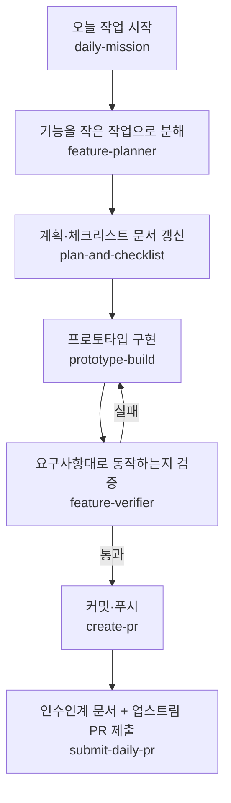
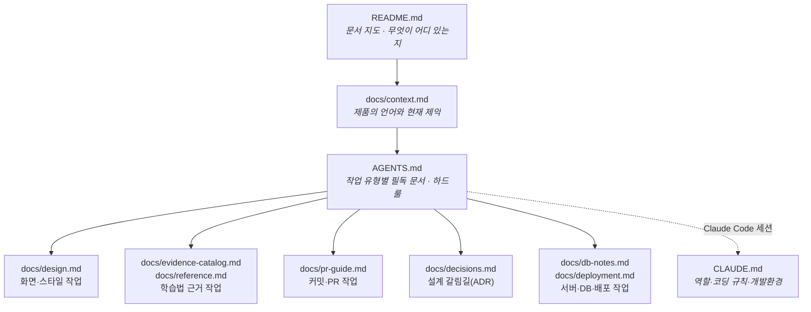
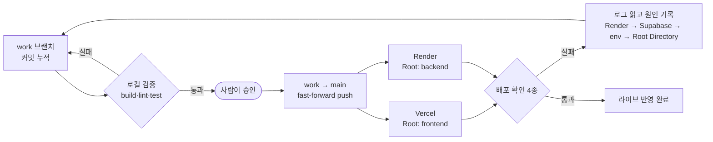
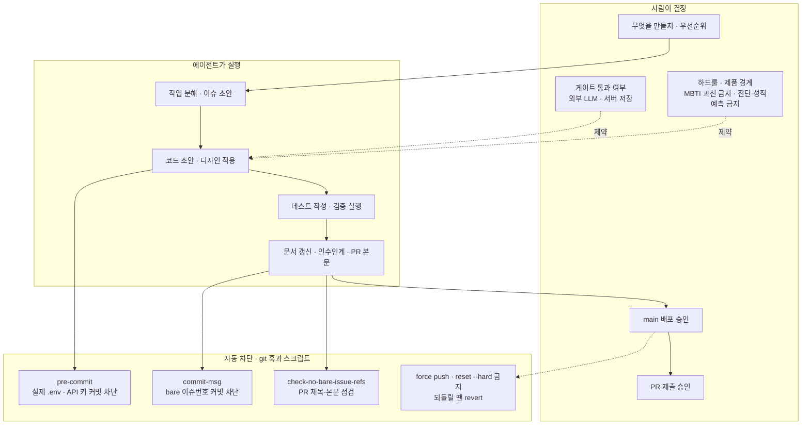

# ai-workflow.md — AI와 함께 일하는 나만의 워크플로우

이 프로젝트는 사람이 **문제·기능·판단 기준**을 정하고, AI(Claude Code / Codex)가 **작업 분해·초안·검증·PR**을 맡는 방식으로 진행한다.
아래는 4주간 실제로 굴려본 순서를 그대로 정리한 것이다. **캠프가 끝난 뒤 다른 저장소에 그대로 옮겨 쓰는 것**을 목표로 쓴다.

Skill·Agent 원본은 [`.agents/skills/`](../.agents/skills)(Codex)·[`.claude/skills/`](../.claude/skills)(Claude Code)에 있다.

---

## 1. 이 워크플로우가 풀려는 문제

AI 에이전트에게 저장소를 맡기면 반복해서 겪는 세 가지 문제가 있었다.

| 문제 | 이 워크플로우의 대응 |
|---|---|
| 매번 프로젝트 맥락을 처음부터 다시 설명해야 한다 | 저장소 안에 **읽기 경로**를 설계해 둔다 (§3) |
| 에이전트가 되돌리기 어려운 일(강제 푸시, 시크릿 커밋, 잘못된 PR)을 저질러도 막을 방법이 없다 | 되돌리기 어려운 지점마다 **승인 게이트 + git 훅** (§5) |
| "다 됐습니다"라고 하는데 실제로 되는지 알 수 없다 | 기능 추가를 하지 않는 **검증 전용 에이전트**와 명시적 확인 기준 (§2·§4) |

---

## 2. 하루 개발 루프



1. **daily-mission** — 저장소 상태·열린 이슈를 점검하고 오늘 할 작업을 정한다. 전체 컨텍스트를 매번 반복하지 않도록 시작점을 고정한다.
2. **feature-planner** — 기능 요구사항을 우선순위·의존성이 있는 **작은 검증 가능한 작업**으로 나누고 이슈 초안을 만든다. (코드는 만들지 않음 → 계획과 구현의 분리)
3. **plan-and-checklist** — `docs/plan.md`·`docs/checklist.md`·README 요약·MVP 범위를 최신화한다.
4. **prototype-build** — Vite + React 프로토타입에 화면·설문·규칙 기반 점수·추천·localStorage를 구현한다. 새 프레임워크·외부 AI API는 임의로 붙이지 않는다.
5. **feature-verifier** — `npm run build`·`npm run lint`·단위 테스트·백엔드 health·end-to-end 흐름을 돌려 **요구사항대로 동작하는지 증거와 함께 검증**한다. 기능을 추가하지 않는 검증 전용 에이전트.
6. **create-pr** — 브랜치 상태 확인, 의도한 파일만 스테이징, 커밋·푸시.
7. **submit-daily-pr** — 인수인계 문서를 쓰고 4섹션 템플릿으로 업스트림 저장소에 PR을 제출한다. (**사용자 승인 후에만**)

---

## 3. 에이전트가 읽는 경로를 설계한다

에이전트가 저장소에 들어와 아무 문서나 뒤지지 않게, **무엇을 어떤 순서로 읽을지**를 문서 구조 자체로 정해뒀다.



작업 유형별 진입점:

| 작업 유형 | 먼저 읽을 문서 |
|---|---|
| 아무 작업이나 시작할 때 | `AGENTS.md` "Read first" → `docs/context.md` → `docs/plan.md` → `docs/checklist.md` |
| 화면·컴포넌트·스타일 | `docs/design.md` (토큰·컴포넌트 패턴·§9 자기점검 체크리스트) |
| 추천 로직·학습법 표현 | `docs/evidence-catalog.md`(불변원칙 P-A/P-B/P-C) + `docs/reference.md` |
| 서버·DB·배포 | `docs/db-notes.md`, `docs/supabase-setup.md`, `docs/deployment.md` |
| 커밋·PR | `docs/pr-guide.md` |
| "왜 이렇게 했더라?" | `docs/decisions.md` (ADR-001~009, 선택지·장단점·채택 이유 표) |

**핵심은 문서를 많이 두는 게 아니라, 낡은 문서를 남기지 않는 것**이다. 그래서 `plan-and-checklist`가 매 PR마다 기획서·체크리스트·README를 코드에 맞춘다.

---

## 4. 배포·검증 루프

개발 루프와 배포 루프는 **분리**한다. 커밋은 `work`에 계속 쌓고, `main`은 push 즉시 라이브에 반영되므로 사람이 승인한 뒤에만 옮긴다.



### 배포 구성 (현재)

| 구성 | 주소 | 배포 설정 |
|---|---|---|
| 프런트 | https://hub-theta-brown.vercel.app | Vercel · Root Directory `frontend` · env `VITE_API_BASE_URL` |
| 백엔드 | https://hub-backend-kymx.onrender.com | Render · Root Directory `backend` · 포트는 `process.env.PORT` |
| DB | Supabase (`research_results`) | env `SUPABASE_URL`·`SUPABASE_SERVICE_ROLE_KEY` |

모노레포이므로 **배포 서비스마다 기준 폴더를 따로 지정**해야 한다. 백엔드 → 프런트 → 백엔드 CORS 갱신 순서인 이유는 [`docs/deployment.md`](./deployment.md)에 있다.

### 확인 기준 (이 4개를 통과해야 "배포됐다"고 본다)

1. **프런트 공개 접속** — 로그인 없는 시크릿 모드에서 공개 URL이 200으로 열리고 콘솔 에러가 없다.
2. **백엔드 상태 확인 API**
   ```bash
   curl -m 90 https://hub-backend-kymx.onrender.com/api/health
   ```
   `{"status":"ok","backend":"supabase",...}` 여야 한다. **`backend:"in-memory"`면 실패로 본다** — 앱은 살아 있지만 DB에 붙지 못하고 폴백으로 돌고 있다는 뜻이다.
3. **화면 → 서버 → DB 라운드트립** — 결과 화면에서 동의 후 익명 저장 → `/api/health`의 `storedCount` 증가 → "내 서버 기록 보기" 조회 → "내 서버 기록 삭제" 후 `storedCount` 복귀.
4. **실패한 배포는 로그를 읽고 원인을 이슈에 기록한다.** 읽는 순서: **Render 배포 로그 → Supabase 프로젝트 상태 → 환경변수 → Root Directory**.

### 무료 티어에서 실제로 겪은 실패

| 증상 | 원인 | 조치 |
|---|---|---|
| `/api/health` 502, 0.3초 만에 응답(콜드스타트 아님) | Supabase가 7일 미사용으로 일시정지 → 백엔드가 DB 연결 실패로 `Exited with status 1` | Supabase Resume → Render Manual Deploy |
| 첫 요청만 10초 이상 | Render 무료 티어 15분 슬립 후 콜드스타트 | 정상. 데모 전 미리 한 번 깨워둔다 |

**데모·발표 전에는 반드시 프런트와 `/api/health`를 미리 한 번씩 호출해 워밍업한다.**

---

## 5. 사람이 결정하는 지점과 안전장치

에이전트가 잘하는 일(반복·정형)과 사람이 해야 하는 일(우선순위·되돌리기 어려운 실행)을 명시적으로 갈랐다.



훅은 한 번만 켜면 된다.

```bash
npm run hooks:install
```

- **`pre-commit`** — 스테이징에 실제 `.env`나 API 키·개인키 패턴이 있으면 커밋을 막는다 (`.env.example`은 허용).
- **`commit-msg`** — 커밋 메시지의 bare `#27` 표기를 막는다. 이 저장소의 PR은 공용 업스트림으로 올라가므로 bare 번호가 **다른 참가자의 이슈**로 오링크된다(2026-07-21 실제 사고). 자기 이슈는 `bricepark94/hub#27` full path나 URL로 쓴다.
- **`check:pr-refs`** — PR 제목·본문은 git 훅 대상이 아니라 자동으로 막히지 않는다. `gh pr create` 직전에 수동으로 돌린다.
  ```bash
  npm run check:pr-refs -- <본문파일>
  ```

---

## 6. 4주간 만든 Agent·Skill·규칙 문서

### Skill·Agent

| 이름 | 유형 | 역할 | 파일 | 도입 |
| --- | --- | --- | --- | --- |
| `daily-mission` | Skill | 저장소 점검 + 오늘 작업 선정(컨텍스트 반복 제거) | `.agents/skills/daily-mission/` | 1주차 (07-09) |
| `plan-and-checklist` | Skill | 기획·체크리스트·README·MVP 범위 문서 유지 | `.agents/skills/plan-and-checklist/` | 1주차 (07-09) |
| `prototype-build` | Skill | 화면·설문·점수·추천·localStorage 구현 | `.agents/skills/prototype-build/` | 1주차 (07-09) |
| `create-pr` | Skill | 스테이징·커밋·푸시·PR 판단 | `.agents/skills/create-pr/` | 1주차 (07-09) |
| `feature-planner` | Agent(계획) | 요구사항 → 작은 작업·이슈 초안 (코드 없음) | `.agents/skills/feature-planner/` | 2주차 (07-14) |
| `feature-verifier` | Agent(검증) | build/lint·테스트·E2E·요구사항 대조 검증(증거 기반) | `.agents/skills/feature-verifier/` | 2주차 (07-14) |
| `submit-daily-pr` | Skill | 인수인계 + 업스트림 PR 제출(**승인 게이트**) | `.claude/skills/submit-daily-pr/` | 3주차 (07-21) |

### 규칙·기준 문서

| 문서 | 역할 | 도입 |
| --- | --- | --- |
| `AGENTS.md` | 작업 유형별 읽기 순서 + 하드룰 + 검증 명령 | 1주차 |
| `CLAUDE.md` | Claude Code 역할·코딩 규칙·개발환경·커밋 컨벤션 | 1주차 |
| `docs/design.md` | 색·타이포·스페이싱 토큰, 컴포넌트 패턴, 자기점검 체크리스트 | 1주차 (07-09) |
| `docs/pr-guide.md` | 커밋·푸시·PR 절차, bare 이슈번호 금지 | 1주차 (07-09) |
| `docs/evidence-catalog.md`·`docs/reference.md` | 학습법 근거와 불변원칙(P-A 만족도≠효과 / P-B 선호≠효과 / P-C 빅데이터≠타당도) | 2주차 |
| `docs/decisions.md` | ADR-001~009 — 선택지·장단점·채택 이유 표 | 2주차 (07-15) |
| `.githooks/pre-commit` | 시크릿 커밋 차단 | 2주차 (07-15) |
| `.githooks/commit-msg` + `scripts/check-no-bare-issue-refs.mjs` | 업스트림 오링크 차단 | 3주차 (07-21) |
| `docs/demo-scenario.md` | 데모 대본과 "아직 안 되는 것" 목록 | 4주차 (07-27) |

### 테스트

4주차에 `vitest`를 도입했다. 순수 함수는 **실패하는 테스트를 먼저 쓰고 통과시키는 TDD**로 다룬다.

```bash
npm --prefix frontend test    # 현재 22개 통과
```

- `frontend/src/data/mbtiMethodMatching.test.js` — `matchMethods()` 정상·빈 값·경계값·실패 케이스 17개
- `frontend/src/lib/schedule.test.js` — `buildDayPlan()` 과부하 판정 5개(TDD)

---

## 7. 사람이 지키는 원칙(가드레일)

- **비식별만 저장**: 이름·자유응답·PII는 서버/커밋/PR/이슈에 넣지 않는다(`docs/security-secrets.md`, ADR-001).
- **테스트 우선 시도**: 순수 함수는 실패 테스트를 먼저 쓰고 통과시킨다.
- **bare 이슈번호 금지**: 커밋·PR 제목/본문에 `#27` 같은 번호를 쓰지 않는다(`docs/pr-guide.md`).
- **검증 후 PR**: `feature-verifier` 통과 없이는 PR을 올리지 않는다.
- **확인 전엔 main에 올리지 않는다**: `main`은 push 즉시 라이브다. 화면 단위로 브라우저 확인 → 승인 → push.
- **되돌릴 땐 `git revert`**: 이미 올라간 커밋에 `reset --hard`·force push를 쓰지 않는다.

---

## 8. 다른 프로젝트로 옮기는 방법

1. `.agents/skills/`·`.claude/skills/`를 복사하고, 각 SKILL.md의 **저장소 경로·브랜치명·PR 대상**만 바꾼다.
2. `AGENTS.md`를 새 프로젝트 기준으로 다시 쓴다 — **Read first 순서와 Hard rules 두 절이 핵심**이다. 나머지는 없어도 돌아간다.
3. `.githooks/`와 `scripts/check-no-bare-issue-refs.mjs`를 복사하고 `npm run hooks:install`. 공용 업스트림에 PR을 올리지 않는 프로젝트라면 `commit-msg` 훅은 빼도 된다.
4. `docs/decisions.md`를 빈 ADR 템플릿(맥락 → 옵션 표 → 결론)으로 시작한다. **설계가 갈리는 순간마다 한 개씩** 쌓는 게 나중에 "왜 그렇게 했는지"를 설명할 수 있는 유일한 방법이었다.
5. 배포가 있는 프로젝트면 §4의 **확인 기준 4종**을 그 프로젝트 버전으로 바꿔 적어둔다. "배포됨"의 정의를 미리 못 박아두면 "올라갔는데 안 된다"를 훨씬 빨리 잡는다.
