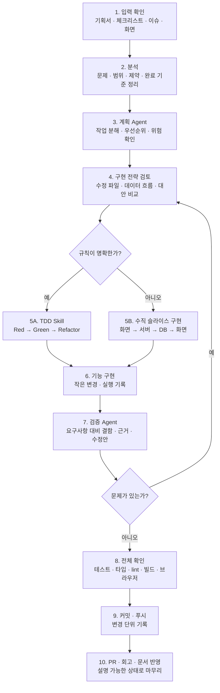

# 나의 AI 개발 워크플로우

## 목적

바로진료 개발에서는 AI에게 기능 전체를 한 번에 맡기지 않고, 내가 문제와 기준을 정한 뒤 Agent와 Skill을 사용해 작은 작업 단위로 설계, 구현, 검증, 배포를 반복한다.

이 워크플로우의 목표는 세 가지다.

- 내가 만들 기능의 범위와 완료 기준을 설명할 수 있게 한다.
- Agent가 만든 결과를 문서, 테스트, 화면으로 검증한다.
- 문제가 생겼을 때 어느 단계로 돌아가야 하는지 알 수 있게 한다.

## 모은 자료

4주 동안 아래 자료를 기준으로 작업 흐름을 만들었다.

| 자료 | 사용 목적 |
|---|---|
| `docs/plan.md` | 문제 정의, 사용자 시나리오, 핵심 기능 확인 |
| `docs/feature-spec.md` | 대기열 규칙, 상태 전이, 예외 상황 확인 |
| `docs/checklist.md` | 남은 작업과 우선순위 확인 |
| `docs/tasks.md` | 백로그, P0-P2 작업 범위 확인 |
| `docs/weekly-plan.md` | 주차별 목표와 일정 확인 |
| `docs/weekly-summary.md` | 완료 작업, 회고, 다음 작업 정리 |
| GitHub Issue / PR | 작업 단위, 완료 기준, 변경 내역 기록 |
| `.agents/skills/*/SKILL.md` | 반복 작업 절차와 검증 기준 저장 |

## 전체 흐름

## 단계별 워크플로우

| 단계 | 입력 | 작업 순서 | 확인 기준 | 결과물 |
|---|---|---|---|---|
| 1. 입력 확인 | 기획서, 기능 명세, 체크리스트, 이슈 | 최신 문서를 읽고 작업 범위를 고른다. 충돌이 있으면 기획서를 우선한다. | 어떤 문제를 해결하는 작업인지 한 문장으로 말할 수 있다. | 작업 목표 |
| 2. 분석 | 현재 코드, 화면, 로그, DB 상태 | 바꿀 화면, 저장할 데이터, API 흐름, 위험을 정리한다. | 화면, 서버, DB 중 어디가 바뀌는지 구분된다. | 분석 메모 |
| 3. 계획 | 작업 목표, 완료 기준 | `plan-development`로 작업을 FE, BE, DB, TEST, DOC로 나눈다. | 작업 하나가 검토 가능한 크기다. | 작업 목록, 우선순위 |
| 4. 전략 검토 | 계획, 기존 코드 구조 | 만들거나 고칠 파일, 데이터 흐름, 대안의 장단점을 먼저 확인한다. | 내가 왜 이 구조인지 설명할 수 있다. | 구현 전략 |
| 5. TDD 또는 수직 슬라이스 | 구현 전략 | 규칙 로직은 테스트를 먼저 쓰고, 화면 흐름은 한 바퀴 단위로 만든다. | 새로고침 후에도 데이터가 남거나 상태가 유지된다. | 코드, 테스트 |
| 6. 검증 | 요구사항, 변경 파일 | `verify-feature`로 누락, 예외, 회귀 위험을 점검한다. | 결함, 근거, 수정안이 분리되어 나온다. | 검증 보고 |
| 7. 전체 확인 | 코드, 앱 실행 환경 | 테스트, 타입 체크, lint, 빌드, 브라우저 시연을 확인한다. | 사용자가 핵심 흐름을 끝까지 실행할 수 있다. | 확인 결과 |
| 8. 기록 | 변경 내역, 확인 결과 | 체크리스트와 주간 결과를 갱신하고 커밋한다. | PR에 작업 내용과 설명 가능한 부분을 쓸 수 있다. | 커밋, PR 본문 |

## 문제 발생 시 돌아갈 단계

| 문제 | 먼저 확인할 위치 | 돌아갈 단계 |
|---|---|---|
| 요구사항과 구현이 다름 | `docs/plan.md`, `docs/feature-spec.md` | 1. 입력 확인 |
| 작업 범위가 커짐 | `docs/checklist.md`, Git diff | 3. 계획 |
| 구조를 설명하기 어려움 | 구현 전략, 수정 파일 목록 | 4. 전략 검토 |
| 테스트가 실패함 | 실패한 테스트 이름과 기대값/실제값 | 5. TDD 또는 수직 슬라이스 |
| 화면은 되는데 DB에 안 남음 | API 요청, 서버 로그, Supabase 테이블 | 5. 수직 슬라이스 |
| 배포에서만 실패함 | Render/Vercel 로그, 환경변수, CORS | 7. 전체 확인 |
| PR 설명이 막힘 | 커밋 단위, 검증 결과, 회고 | 8. 기록 |

## 사용하는 Agent와 Skill

| 이름 | 역할 | 사용하는 시점 |
|---|---|---|
| 계획 수립 Agent | 요구사항을 작업 단위로 나누고 우선순위와 완료 기준을 정리한다. | 주간 계획, 기능 시작 전 |
| 기능 검증 Agent | 구현 결과를 요구사항과 비교하고 결함, 근거, 수정 방향을 보고한다. | 구현 후 커밋 전 |
| `plan-development` Skill | 백로그, 일정, 작업 분해를 같은 형식으로 정리한다. | 계획 수립 시 |
| `build-clinic-ui` Skill | 바로진료의 색, 간격, 카드, 버튼 규칙을 UI에 일관되게 적용한다. | 화면 구현·수정 시 |
| `test-driven-development` Skill | 규칙이 명확한 로직을 Red-Green-Refactor 순서로 만든다. | 검증, 계산, 변환 로직 구현 시 |
| `verify-feature` Skill | 요구사항, 테스트, 화면, API, DB 관점에서 완료 여부를 점검한다. | 기능 검증 시 |

## 함께 정한 개발 규칙

- 최신 기획서와 체크리스트를 먼저 확인한다.
- 방향, 우선순위, MVP 범위는 내가 결정한다.
- 구현 전에는 파일, 데이터 흐름, 대안을 먼저 검토한다.
- 검증, 계산, 변환처럼 결과가 명확한 로직은 TDD를 권장한다.
- 한 작업은 한 목적만 다루고, 끝나면 테스트와 화면으로 확인한다.
- 외부 API가 어렵거나 비용이 있으면 MVP에서는 mock으로 두고 P2 확장으로 기록한다.
- PR 생성은 내가 직접 진행하고, Agent는 PR 본문 초안과 검증 내용을 제공한다.

## 바로진료에서 반복한 실제 작업 순서

1. 문제와 사용자 시나리오를 기획서에 정리했다.
2. 핵심 기능을 원격 웨이팅과 병원 관리자 대기열 관리로 좁혔다.
3. 기능을 수직 슬라이스로 나눴다.
4. React 화면에서 시작해 Express API와 Supabase DB까지 연결했다.
5. 병원 관리자 화면의 상태 변경이 환자 화면에 반영되는지 확인했다.
6. mock 알림톡, 자동 만료, 상태 전이처럼 규칙이 있는 기능은 테스트를 추가했다.
7. 검증 Agent로 빠진 예외와 수정 방향을 점검했다.
8. 배포 후 Vercel, Render, Supabase, 브라우저 화면을 다시 확인했다.
9. 오류와 해결 과정을 회고와 PR 본문에 남겼다.

## 완료 기준

이 워크플로우를 적용한 작업은 아래 조건을 만족해야 완료로 본다.

- 사용자가 어떤 순서로 기능을 사용하는지 설명할 수 있다.
- 화면, 서버, DB 중 어떤 부분이 바뀌었는지 설명할 수 있다.
- 완료 기준을 테스트, 빌드, 브라우저 확인 중 하나 이상으로 검증했다.
- 실패했을 때 다시 확인할 단계가 문서나 PR에 남아 있다.
- 남은 위험이나 P2 확장 기능을 숨기지 않고 기록했다.

## 한 문장 정리

문제와 기준은 내가 정하고, Agent와 Skill은 계획·구현·검증을 반복 가능하게 만들며, 완료 여부는 테스트와 실제 화면으로 증명한다.
