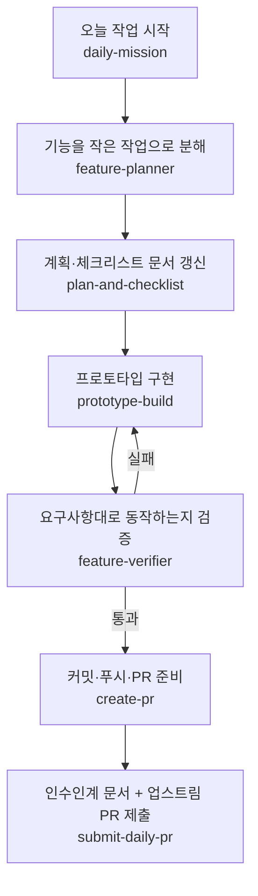

# ai-workflow.md — AI와 함께 일하는 나만의 워크플로우

이 프로젝트는 사람이 **문제·기능·판단 기준**을 정하고, AI(Claude Code / Codex)가 **작업 분해·초안·검증·PR**을 맡는 방식으로 진행한다.
아래는 하루 작업 한 바퀴에서 실제로 쓰는 **작업 순서**와 그 순서에 묶인 **Skill·Agent**다. Skill 원본은 [`.agents/skills/`](../.agents/skills)·[`.claude/skills/`](../.claude/skills)에 있다.

## 작업 순서 (하루 한 바퀴)

1. **daily-mission** — 저장소 상태를 점검하고 오늘 할 작업을 정한다. 전체 컨텍스트를 매번 반복하지 않도록 시작점을 고정한다.
2. **feature-planner** — 기능 요구사항을 우선순위·의존성이 있는 **작은 검증 가능한 작업**으로 나누고 이슈 초안을 만든다. (코드는 만들지 않음 → 이슈 단위 개발의 입구)
3. **plan-and-checklist** — `docs/plan.md`·`docs/checklist.md`·README 요약·MVP 범위를 최신화한다.
4. **prototype-build** — Vite + React 프로토타입에 화면·설문·규칙 기반 점수·추천·localStorage를 구현한다. 새 프레임워크·외부 AI API는 임의로 붙이지 않는다.
5. **feature-verifier** — `npm run build`·`npm run lint`·백엔드 health·end-to-end 흐름을 돌려 **요구사항대로 동작하는지 증거와 함께 검증**한다. 기능을 추가하지 않는 검증 전용 Agent.
6. **create-pr** — 브랜치 상태 확인, 의도한 파일만 스테이징, 커밋·푸시, 기존/신규 PR 판단.
7. **submit-daily-pr** — 인수인계 문서 작성 후 4섹션 템플릿으로 업스트림(course) 저장소에 PR을 제출한다. (사용자 승인 후 제출)

## Skill·Agent 목록

| 이름 | 유형 | 역할 |
| --- | --- | --- |
| `daily-mission` | Skill | 저장소 점검 + 오늘 작업 선정(컨텍스트 반복 제거) |
| `feature-planner` | Agent(계획) | 요구사항 → 작은 작업·이슈 초안 (코드 없음) |
| `plan-and-checklist` | Skill | 기획·체크리스트·README·MVP 범위 문서 유지 |
| `prototype-build` | Skill | 화면·설문·점수·추천·localStorage 구현 |
| `feature-verifier` | Agent(검증) | build/lint·E2E·요구사항 대조 검증(증거 기반) |
| `create-pr` | Skill | 스테이징·커밋·푸시·PR 판단 |
| `submit-daily-pr` | Skill | 인수인계 + 업스트림 PR 제출(승인 게이트) |

## 사람이 지키는 원칙(가드레일)

- **비식별만 저장**: 이름·자유응답·PII는 서버/커밋/PR에 넣지 않는다(`docs/security-secrets.md`, ADR-001).
- **테스트 우선 시도**: 순수 함수는 실패 테스트를 먼저 쓰고 통과시키는 TDD로 다룬다(예: `frontend/src/lib/schedule.test.js`의 `overloaded` 판정).
- **bare 이슈번호 금지**: 커밋·PR 제목/본문에 `#27` 같은 번호를 쓰지 않는다(업스트림 오링크 방지, `docs/pr-guide.md`).
- **검증 후 PR**: `feature-verifier` 통과 없이는 PR을 올리지 않는다.
