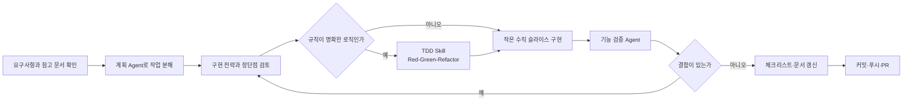

# 나의 AI 개발 워크플로우

## 목적

AI에게 기능 전체를 한 번에 맡기지 않고, 내가 요구사항과 완료 기준을 정한 뒤 작은 작업 단위로 설계·구현·검증합니다.

## 작업 순서

## 1. 요구사항 확인

- `docs/plan.md`에서 문제와 핵심 사용자 시나리오를 확인합니다.
- `docs/feature-spec.md`에서 상태 전이, 예외와 API 계약을 확인합니다.
- `docs/checklist.md`에서 아직 끝나지 않은 작은 작업을 선택합니다.
- 문서끼리 충돌하면 최신 기획과 사용자의 결정을 우선하고 먼저 문서를 동기화합니다.

## 2. 작업 계획

`plan-development` Skill을 사용해 작업을 FE·BE·DB·TEST 단위로 나눕니다.

- P0·P1·P2 우선순위를 구분합니다.
- 하루 안에 구현하고 검증할 수 있는 크기로 나눕니다.
- 각 작업에 관찰 가능한 완료 기준을 둡니다.
- 일정과 마감은 내가 확정합니다.

## 3. 구현 전략 검토

코드를 만들기 전에 AI에게 다음 내용을 먼저 받습니다.

1. 수정할 파일과 각 파일의 역할
2. 화면·서버·DB 사이의 데이터 흐름
3. 선택한 방식의 이유와 다른 방법의 장단점

기존 폴더 구조를 따르는지, 작은 기능에 지나치게 많은 파일이나 새 라이브러리가 필요한지 확인합니다. 내가 설명할 수 없는 전략은 질문한 뒤 진행합니다.

## 4. TDD 적용

검증·계산·변환·상태 규칙처럼 입력과 결과가 명확하면 `test-driven-development` Skill을 사용합니다.

1. 시나리오와 기대 결과를 먼저 정합니다.
2. 실패하는 테스트로 Red를 확인합니다.
3. 최소 구현으로 Green을 만듭니다.
4. 테스트를 유지한 채 중복과 책임을 정리합니다.

시각 디자인이나 큰 화면 구성은 TDD를 강제하지 않고 컴포넌트 테스트와 브라우저 확인을 사용합니다.

## 5. 수직 슬라이스 구현

사용자가 확인할 수 있는 한 바퀴를 기준으로 구현합니다.

`React 화면 → fetch → Express route → service → repository → Supabase → JSON 응답 → React state 갱신`

한 계층만 만든 상태를 완료로 보지 않습니다. 저장한 데이터가 새로고침과 서버 재시작 후에도 남고 다시 조회되는지 확인합니다.

## 6. 기능 검증

`verify-feature` Skill로 요구사항과 구현을 독립적으로 비교합니다.

- 타입 검사, 린트와 관련 단위 테스트
- API·DB 통합 테스트
- 핵심 브라우저 흐름과 오류 상태
- 개인정보 노출, 중복 요청과 경계값
- 전체 회귀 테스트와 프로덕션 빌드

검증 Agent는 코드를 직접 고치지 않고 결함, 근거와 권장 수정안을 보고합니다. 결함이 있으면 새 회귀 테스트를 추가해 다시 구현합니다.

## 7. 마무리

- 실제 결과와 `docs/checklist.md`, 주간 계획을 일치시킵니다.
- 구현 이유와 아직 이해하지 못한 부분을 PR 본문에 적습니다.
- 관련 변경만 하나의 커밋으로 만들고 푸시합니다.
- PR 생성과 최종 제출은 내가 직접 확인합니다.

## 사용하는 Agent와 Skill

| 이름 | 역할 | 사용하는 시점 |
|---|---|---|
| 개발 계획 Agent (`plan-development`) | 작업 분해, 우선순위, 완료 기준과 일정 점검 | 기능·주간 계획 시작 전 |
| 디자인 Skill (`build-clinic-ui`) | 바로진료 디자인 시스템과 화면 규칙 적용 | 환자·직원 UI 구현 시 |
| TDD Skill (`test-driven-development`) | 시나리오, Red-Green-Refactor와 회귀 검증 | 규칙이 명확한 작은 로직 |
| 기능 검증 Agent (`verify-feature`) | 요구사항 추적, 결함과 수정 방향 보고 | 구현 완료 후 커밋 전 |

## 내가 결정하는 부분

- 어떤 문제를 해결할지와 MVP 범위
- 상태 정책, 우선순위와 일정
- 구현 전략 중 사용할 방법
- 검증 결과를 반영할지와 최종 완료 판정

AI는 계획 분해, 코드 초안, 테스트와 누락 점검을 돕지만 최종 결정은 내가 합니다.

## 이번 주에 강화한 부분

이번 주에는 기능 수를 늘리기보다 핵심 흐름의 신뢰성과 설명 가능성을 높였습니다.

| 강화 영역 | 적용 내용 | 확인 방법 |
|---|---|---|
| 수직 슬라이스 | 환자 원격 등록부터 병원 직원의 도착·호출까지 React, Express, Supabase를 연결 | 등록 후 새로고침해도 같은 대기 정보가 조회됨 |
| 자동 만료 | 1분 주기 작업과 PostgreSQL advisory lock으로 미도착 이동·취소의 중복 처리 방지 | 실제 Supabase 통합 테스트 |
| 인증과 역할 | 환자·병원 관리자·플랫폼 관리자 화면과 권한을 분리 | 역할이 다른 계정의 접근 차단 테스트 |
| 오류 복구 | 네트워크 실패 시 기존 화면을 유지하고 자동·수동 재시도 제공 | 컴포넌트 테스트와 브라우저 확인 |
| 코드 구조 | 공통 웹 코드를 `web-shared`로 모으고 큰 병원 대기열 화면을 역할별 컴포넌트로 분리 | lint, 타입 검사, 전체 빌드 |
| 검증 체계 | DB 테스트를 별도 명령으로 분리하고 플랫폼 관리자 로그인 회귀 테스트 추가 | 오프라인 테스트 139개와 DB 통합 테스트 13개 |

## 10분 발표 구성

처음 보는 동료가 문제와 구현 이유를 이해한 뒤, 실제 동작과 AI 협업 방식을 확인할 수 있도록 아래 순서로 발표합니다.

| 순서 | 시간 | 전달할 내용 |
|---|---:|---|
| 프로젝트 소개 | 50초 | 동네병원에서 접수 후 오래 기다리는 문제와 `바로진료`의 원격 웨이팅 방식 |
| 사용자 흐름 | 1분 10초 | 환자 등록, 통합 순번 확인, 병원 도착, 데스크 접수 완료까지의 흐름 |
| 시스템 구조 | 1분 20초 | 역할별 React 화면, Express API, Supabase Auth·PostgreSQL의 책임 |
| 이번 주 강화 기능 | 2분 | 수직 슬라이스, 자동 만료·잠금, 오류 복구, 테스트와 구조 개선 |
| 나의 AI 워크플로우 | 1분 20초 | 요구 확인, 작업 분해, 전략 비교, TDD, 검증, 문서·Git |
| 실제 시연 | 2분 | 환자 등록 데이터가 병원 화면과 DB를 거쳐 다시 환자 화면에 반영되는 과정 |
| 한계·다음 단계 | 40초 | mock 알림톡·병원 검색, Polling과 프로세스 내 자동 작업의 운영 한계 |
| 질의응답 | 40초 | 설계 선택, 테스트, AI 협업 방식에 대한 질문 |

## 시연 시나리오

시연은 기능을 많이 보여주는 대신 하나의 데이터가 화면·서버·DB를 통과하는 한 바퀴에 집중합니다.

1. 병원 관리자 화면에서 원격 웨이팅을 시작합니다.
2. 환자 계정으로 로그인해 서울이비인후과를 선택하고 원격 웨이팅을 등록합니다.
3. 병원 관리자 화면을 새로고침해 같은 웨이팅이 통합 대기열에 추가된 것을 확인합니다.
4. 병원 관리자가 환자를 도착 확인 또는 호출 상태로 변경합니다.
5. 환자 화면에서 순번과 안내 문구가 바뀐 것을 확인합니다.
6. 화면을 새로고침해도 상태가 유지되어 실제 DB에 저장됐음을 보여줍니다.

시연 전에는 환자·병원 관리자·플랫폼 관리자 웹과 API를 실행하고 Supabase 연결 상태를 확인합니다. 실시간 시연이 실패할 경우 발표 자료의 캡처 화면으로 같은 흐름을 설명합니다.

## 예상 질의응답

### React가 Supabase DB를 직접 조회하지 않는 이유는 무엇인가요?

브라우저에 업무 규칙과 DB 권한을 노출하지 않기 위해서입니다. React는 로그인과 세션만 Supabase Auth에 요청하고, 대기열 데이터는 Express가 역할·입력·상태 규칙을 검증한 뒤 Repository를 통해 조회합니다.

### 왜 Realtime 대신 10초 Polling을 사용했나요?

4주 MVP에서는 구현과 장애 원인을 단순하게 유지하기 위해 Polling을 선택했습니다. 사용자와 병원이 늘면 반복 요청 비용이 커지므로 P2에서 Supabase Realtime 또는 SSE와 비교할 예정입니다.

### 동시에 자동 만료 작업이 실행되면 데이터가 두 번 바뀌지 않나요?

PostgreSQL advisory lock으로 같은 만료 작업의 동시 실행을 막고, 상태 변경과 이력 저장을 하나의 트랜잭션에서 처리합니다. 이 규칙은 실제 Supabase 통합 테스트로 검증합니다.

### 실제 카카오 알림톡이 발송되나요?

현재 MVP는 mock Provider로 발송 결과와 이력만 저장합니다. 실제 알림톡·SMS는 P2에서 통합 제공업체 Adapter로 교체할 계획입니다.

### AI가 만든 코드의 품질을 어떻게 판단했나요?

기획서와 완료 기준을 먼저 정하고, 구현 전략의 장단점을 질문한 뒤 작은 단위로 구현했습니다. 이후 기능 검증 Agent의 보고와 자동 테스트·브라우저 확인을 통과해야 커밋했습니다.

### AI와 작업하면서 본인이 직접 결정한 것은 무엇인가요?

문제 정의, MVP 범위, 상태 정책, 우선순위, 구현 전략 선택과 최종 완료 여부는 직접 결정했습니다. AI는 작업 분해, 코드 초안과 누락 검토를 담당했습니다.
