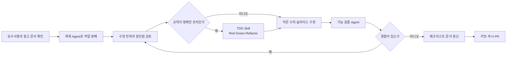

# 나의 AI 개발 워크플로우

## 목적

AI에게 기능 전체를 한 번에 맡기지 않고, 내가 요구사항과 완료 기준을 정한 뒤 작은 작업 단위로 설계·구현·검증합니다.

## 작업 순서

## 1. 요구사항 확인

- `docs/plan.md`에서 문제와 핵심 사용자 시나리오를 확인합니다.
- `docs/feature-spec.md`에서 상태 전이, 예외와 API 계약을 확인합니다.
- `docs/checklist.md`에서 아직 끝나지 않은 작은 작업을 선택합니다.
- 문서끼리 충돌하면 최신 기획과 사용자의 결정을 우선하고 먼저 문서를 동기화합니다.

## 2. 작업 계획

`plan-development` Skill을 사용해 작업을 FE·BE·DB·TEST 단위로 나눕니다.

- P0·P1·P2 우선순위를 구분합니다.
- 하루 안에 구현하고 검증할 수 있는 크기로 나눕니다.
- 각 작업에 관찰 가능한 완료 기준을 둡니다.
- 일정과 마감은 내가 확정합니다.

## 3. 구현 전략 검토

코드를 만들기 전에 AI에게 다음 내용을 먼저 받습니다.

1. 수정할 파일과 각 파일의 역할
2. 화면·서버·DB 사이의 데이터 흐름
3. 선택한 방식의 이유와 다른 방법의 장단점

기존 폴더 구조를 따르는지, 작은 기능에 지나치게 많은 파일이나 새 라이브러리가 필요한지 확인합니다. 내가 설명할 수 없는 전략은 질문한 뒤 진행합니다.

## 4. TDD 적용

검증·계산·변환·상태 규칙처럼 입력과 결과가 명확하면 `test-driven-development` Skill을 사용합니다.

1. 시나리오와 기대 결과를 먼저 정합니다.
2. 실패하는 테스트로 Red를 확인합니다.
3. 최소 구현으로 Green을 만듭니다.
4. 테스트를 유지한 채 중복과 책임을 정리합니다.

시각 디자인이나 큰 화면 구성은 TDD를 강제하지 않고 컴포넌트 테스트와 브라우저 확인을 사용합니다.

## 5. 수직 슬라이스 구현

사용자가 확인할 수 있는 한 바퀴를 기준으로 구현합니다.

`React 화면 → fetch → Express route → service → repository → Supabase → JSON 응답 → React state 갱신`

한 계층만 만든 상태를 완료로 보지 않습니다. 저장한 데이터가 새로고침과 서버 재시작 후에도 남고 다시 조회되는지 확인합니다.

## 6. 기능 검증

`verify-feature` Skill로 요구사항과 구현을 독립적으로 비교합니다.

- 타입 검사, 린트와 관련 단위 테스트
- API·DB 통합 테스트
- 핵심 브라우저 흐름과 오류 상태
- 개인정보 노출, 중복 요청과 경계값
- 전체 회귀 테스트와 프로덕션 빌드

검증 Agent는 코드를 직접 고치지 않고 결함, 근거와 권장 수정안을 보고합니다. 결함이 있으면 새 회귀 테스트를 추가해 다시 구현합니다.

## 7. 마무리

- 실제 결과와 `docs/checklist.md`, 주간 계획을 일치시킵니다.
- 구현 이유와 아직 이해하지 못한 부분을 PR 본문에 적습니다.
- 관련 변경만 하나의 커밋으로 만들고 푸시합니다.
- PR 생성과 최종 제출은 내가 직접 확인합니다.

## 사용하는 Agent와 Skill

| 이름 | 역할 | 사용하는 시점 |
|---|---|---|
| 개발 계획 Agent (`plan-development`) | 작업 분해, 우선순위, 완료 기준과 일정 점검 | 기능·주간 계획 시작 전 |
| 디자인 Skill (`build-clinic-ui`) | 바로진료 디자인 시스템과 화면 규칙 적용 | 환자·직원 UI 구현 시 |
| TDD Skill (`test-driven-development`) | 시나리오, Red-Green-Refactor와 회귀 검증 | 규칙이 명확한 작은 로직 |
| 기능 검증 Agent (`verify-feature`) | 요구사항 추적, 결함과 수정 방향 보고 | 구현 완료 후 커밋 전 |

## 내가 결정하는 부분

- 어떤 문제를 해결할지와 MVP 범위
- 상태 정책, 우선순위와 일정
- 구현 전략 중 사용할 방법
- 검증 결과를 반영할지와 최종 완료 판정

AI는 계획 분해, 코드 초안, 테스트와 누락 점검을 돕지만 최종 결정은 내가 합니다.
