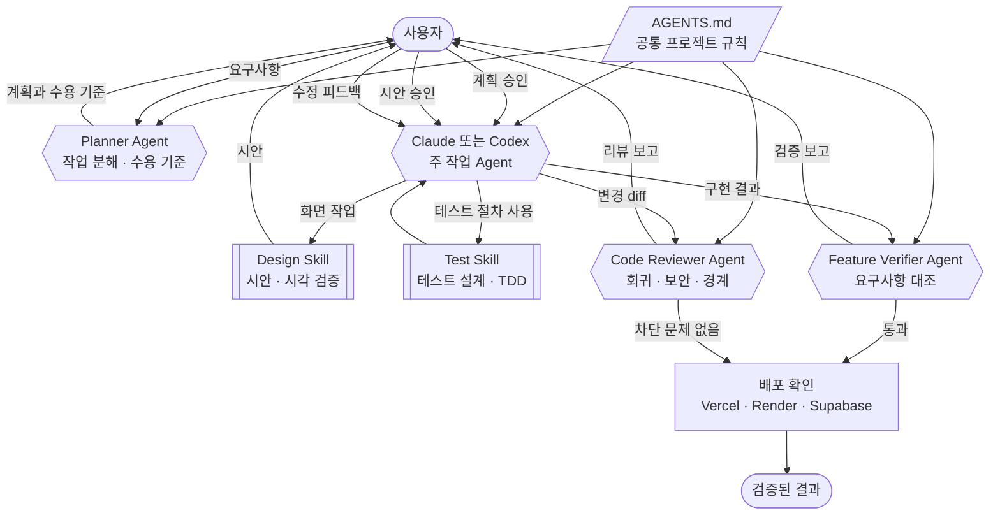
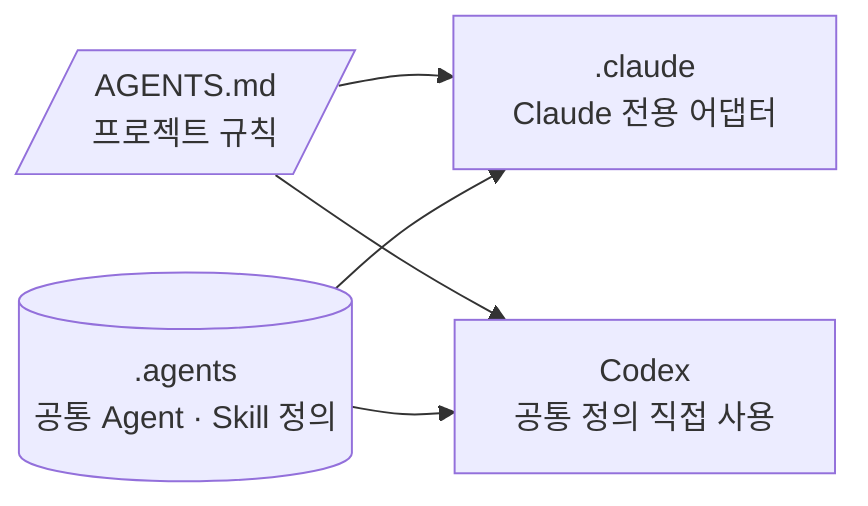

# CareerSignal AI 협업 구조

## 1. 핵심 메시지

CareerSignal의 개발 협업은 하나의 AI가 계획부터 배포까지 결정하는 구조가 아니다. Claude와 Codex는 같은 프로젝트 규칙을 공유하고, 계획·기능 검증·코드 리뷰 Agent와 디자인·테스트 Skill을 단계별로 사용한다. 사용자는 각 승인 지점에서 작업 범위와 반영 여부를 결정한다.

## 2. 사용 관계

| 도형 | 의미 |
| --- | --- |
| 평행사변형 | 모든 단계가 공유하는 규칙 문서 |
| 육각형 | 판단하는 Agent |
| 서브루틴 | Agent가 불러 사용하는 Skill |
| 사각형 | 결정적 확인 단계 |
| 스타디움 | 사용자 접점과 종료 상태 |

## 3. Claude와 Codex의 공통 기준

Claude와 Codex의 파일 형식은 다르지만 역할, 절차, 출력 형식은 `.agents`의 공통 정의를 따른다. `CLAUDE.md`는 `AGENTS.md`를 참조하고 `.claude`의 파일은 대응하는 `.agents` 정의를 불러온다.

## 4. 전시 설명

CareerSignal은 Claude와 Codex를 오가며 개발하므로 도구마다 계획과 검증 기준이 달라지지 않도록 공통 규칙을 둔다. Planner가 작업과 수용 기준을 정리하고 사용자가 범위를 검토한다. 주 작업 Agent는 필요할 때 디자인과 테스트 Skill을 사용하며, Feature Verifier와 Code Reviewer가 결과를 독립적으로 점검한다. 실패 결과는 구현 단계로 돌아가고 사용자가 최종 반영과 공개 여부를 결정한다.

