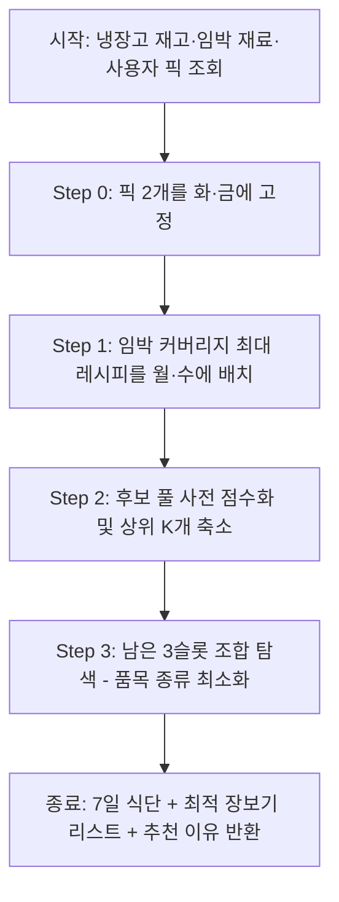

# 자취생 냉장고 레시피 앱 — 알고리즘 설계

> 이 파일은 `식단 알고리즘 설계.md`와 `장보기-금액-성능 개선계획.md`를 하나로 합친 알고리즘 설계 단일 소스입니다.
> 제품 명세는 [product.md](./product.md), API 명세는 [api.md](./api.md) 참고.
> 마지막 업데이트: 2026-07-15

---

# Part 1. 최소 추가 구매 식단 추천 알고리즘

> **v2 개정 (2026-07-14)**: 초안 대비 ①사용자 선택 요리(픽 2개) 제약 반영, ②임박 재료 중복 커버 방지(한계 이득 기반 선정), ③펜트리 상비재료 제외 목록 도입, ④후보 축소로 탐색 확장성 확보, ⑤구출 세트를 실제 Set Cover 탐색으로 구체화.

## 1. 알고리즘 설계의 배경 및 목표

기존 알고리즘은 단순히 각 요리별 재료 보유율(have/total %)이 높은 요리들을 추천하거나 랜덤 조합을 만들었습니다. 그러나 이는 다음과 같은 실생활의 비효율을 낳습니다:
- **개별 요리 보유율은 높지만**, 각각 다른 재료가 1개씩 부족하면 마트에서 7가지 품목을 사야 함.
- **개별 보유율은 조금 낮아도**, 부족한 재료가 '대파' 하나로 겹치면 마트에서 대파 1단만 사서 7일치 식단을 모두 해결 가능 (식자재 공유 효율 극대화).
- **유통기한 임박 재료**가 식단 후반부(토, 일요일)에 배치되면 조리 전 부패할 위험이 큼.

따라서 **"임박 재료 전반부 배치 + 추가 구매 종류 최소화"**를 골자로 하는 알고리즘을 재설계합니다.

## 2. 알고리즘 핵심 요구사항

1. **사용자 선택 요리 고정 (Picked First)** *(v2 추가)*
   - 앱의 식단 흐름은 사용자가 "가장 먹고 싶은 요리 2가지"를 먼저 고르는 것으로 시작한다(MealPlanPicker). 알고리즘은 이 2개를 **화·금요일에 고정 배치**하고, 나머지 5개 슬롯만 최적화 대상으로 삼는다. 사용자 의사가 어떤 최적화보다 우선한다.
2. **임박 재료 최우선 소진 (Imminent First)**
   - 임박 재료가 들어간 레시피를 식단의 **전반부(월, 수)**에 우선 배치한다.
   - 임박 판단 기준은 고정 플래그가 아니라 **`D-day ≤ threshold`의 동적 계산**으로 한다. threshold 기본값은 3이며, 사용자가 알림 설정에서 바꾸면 그 값을 따른다.
3. **냉장고 재료 최대 이용 (Fridge Maximization)**
   - 이미 냉장고에 보유 중인 재료를 활용하는 레시피에 가산점을 부여한다.
4. **추가 구매 품목 최소화 (Set Cover Optimization)**
   - 새로 구매해야 하는 재료들의 유니크한 종류 개수를 세어, 가장 적은 종류만 사도 7일치 식단이 채워지는 조합을 찾는다.
   - 단, **펜트리 상비재료(§5-③)는 "구매해야 하는 재료"에서 제외**한다.

## 3. 알고리즘 동작 흐름



### Step 0. 사용자 픽 고정 (화·금)
- 픽이 유효하지 않으면(레시피 삭제 등) 레시피 풀 앞쪽에서 대체한다.

### Step 1. 임박 재료 기반 전반부 배치 (월·수)
- **대상**: `D-day ≤ threshold`인 재고 재료 집합 $I$
- **동작**: 임박 재료를 1개 이상 쓰는 레시피 중에서 **한계 이득(marginal gain) 기준 탐욕 선택** — 첫 번째 레시피가 커버한 임박 재료는 제외하고, 남은 임박 재료를 가장 많이 커버하는 레시피를 두 번째로 뽑는다.
- 임박 레시피가 부족하면 일반 레시피로 채운다.

### Step 2. 후보군 사전 점수화 및 축소
- 남은 3슬롯(목·토·일) 후보 레시피마다 사전 점수를 계산한다:
  - **가산점**: 보유 재료 활용 수(많을수록 ↑), 이미 확정된 4개 요리의 부족 품목과 **겹치는** 부족 품목 수(많을수록 ↑)
  - **감산점**: 신규 부족 품목 종류 수(많을수록 ↓)
- 점수 상위 **K개(기본 25)**만 조합 탐색에 올린다.

### Step 3. 최소 종류 구매 조합 탐색 (Core Optimization)
1. **상태 정의**:
   - 고정 4개(픽 2 + 임박 2)의 부족 품목 집합을 $P_{fixed}$로 미리 계산.
   - 후보 3개 조합 $\{a,b,c\}$에 대해 $P = P_{fixed} \cup Missing(a) \cup Missing(b) \cup Missing(c)$
2. **평가 함수 (사전식 비교)**:
   - 1순위: $|P|$ (유니크 부족 품목 종류 수) 최소
   - 2순위: $TotalCost(P)$ (실구매 예상 비용) 최소 — 비용은 장보기 리스트와 동일한 수량 기반 계산(`calculateCumulativeNeeds`와 같은 규칙: g재료는 600g 팩 단위 올림)을 사용.
3. **탐색**:
   - C(K,3) 브루트포스 + **부분합 가지치기**: 내부 루프에서 `|P_fixed ∪ Missing(a) ∪ Missing(b)|`가 이미 현재 최소값 이상이면 c 루프를 통째로 건너뛴다.
   - K=25 기준 C(25,3)=2,300 조합 — 밀리초 단위로 종료.

## 4. 예시 시나리오

### 상황
- **내 냉장고**: 돼지고기(임박), 대파(임박), 양파(여유), 김치(여유)

### 기존 매칭 (비효율)
- 추가 구매 재료가 **5종류** (감자/당근/애호박/버섯/오이 — 총 추가 지출 10,480원)

### 새 알고리즘 적용 (최적화)
- **월**: 돼지고기 김치찌개 (임박 돼지고기+대파를 한 번에 커버 — 한계 이득 최대)
- **화**: (사용자 픽 1)
- **수**: 양파 대파전 (남은 임박 대파 소진 + 냉장고 양파 활용)
- **목·토·일**: 감자 기반 요리 3종 (감자 1종만 구매하여 공유)
- **결과**: 추가 구매 재료가 **'감자' 1종류 (+픽 요리의 부족분)**로 압축.

## 5. 초안 대비 개선점 (v2)

| # | 초안의 문제 | 개선 |
|---|---|---|
| ① | 사용자 픽 2개(화·금 고정) 제약이 설계에 없음 | Step 0으로 명문화. 픽은 최적화 대상이 아닌 **제약 조건** |
| ② | "임박 재료 포함 개수 순 정렬 상위 N개" 선정은 같은 임박 재료를 중복 커버함 | **한계 이득 기반 탐욕 선정** |
| ③ | 소금·후춧가루·식용유·설탕·물이 거의 모든 레시피의 "부족 품목"으로 잡혀 \|P\|가 부풀림 | **PANTRY_STAPLES 제외 목록** 도입 (물·소금·설탕·후춧가루·식용유·참기름·다진마늘 등) |
| ④ | C(N,3) 브루트포스는 레시피 1,000개 확장 시 1.6억 조합으로 폭발 | Step 2의 **사전 점수화 → 상위 K=25 축소** 후 C(K,3)=2,300 탐색 |
| ⑤ | 탐색 시 비용을 품목당 단가 1배로 근사 — 실제 장보기 리스트와 역전 가능 | 탐색의 2순위 비용 계산을 장보기와 **동일한 수량 규칙**으로 통일 |
| ⑥ | name 기반 재료는 문자열 완전 일치로만 공유 인정 ("멸치" ≠ "국물용 멸치") | 비교 전 **이름 정규화**(공백 제거 + 수식어 제거) 키를 사용 |
| ⑦ | 임박 판단이 고정 boolean | 임박 판단을 `ddayValue(expiry) ≤ threshold` 동적 계산으로 명시 |
| ⑧ | 같은 주에 동일 레시피 중복 배치 방지 규칙이 없음 | 7일 전부 서로 다른 레시피 강제 (풀에서 선택 시 제거) |

## 6. 상세 설계: 주간 식단 알고리즘 (`buildWeeklyPlan v2`)

```text
INPUT : pickedIds[2], threshold(기본 3), multiplier(인분 배수)
OUTPUT: { days[7], 추천 이유 태그 }

정규화 키: normKey(ing) = ing.id
            || ing.name에서 (공백, PREP_MODIFIERS 단어) 제거한 문자열

Missing(r) = r.ingredients 중에서
             - untracked 제외
             - normKey ∈ PANTRY_STAPLES 제외
             - amt가 VAGUE_AMOUNTS뿐인 재료 제외
             - id 재료: 재고 수량 < 필요 수량(parseAmt×multiplier)일 때 포함
             - name 재료: 항상 포함 (냉장고 추적 대상 아님)
             → normKey 집합으로 반환

── Step 0: 픽 고정 ─────────────────────────────
  validPicks ← pickedIds 중 DB에 존재하는 것
  부족하면 recipeOrder 앞쪽에서 보충
  week[화] ← pick1, week[금] ← pick2

── Step 1: 임박 커버리지 탐욕 선정 (월·수) ─────
  I ← { 재고 재료 id | ddayValue(expiry) ≤ threshold, 잔량 > 0 }
  uncovered ← I
  for slot in [월, 수]:
    best ← argmax_{r ∈ pool} |r.ingredients ∩ uncovered|   // 한계 이득
           (동률이면 Missing(r) 작은 쪽 → 그다음 조리시간 짧은 쪽)
    if 이득 = 0: best ← pool에서 사전 점수 최고 레시피      // 임박 없으면 일반 배치
    week[slot] ← best; pool에서 제거
    uncovered ← uncovered − best가 쓰는 임박 재료

── Step 2: 후보 축소 ──────────────────────────
  P_fixed ← ∪ Missing(week의 확정 4개)
  score(r) = (보유 재료 활용 수)×2
           + |Missing(r) ∩ P_fixed|          // 어차피 살 품목과 공유
           − |Missing(r) − P_fixed|×3        // 새 품목 추가 페널티
  cand ← score 상위 K(=25)개

── Step 3: 조합 탐색 (목·토·일) ────────────────
  best ← null, bestP ← ∞, bestCost ← ∞
  for (a,b,c) in C(cand, 3):
    P_ab ← P_fixed ∪ Missing(a) ∪ Missing(b)
    if |P_ab| ≥ bestP: continue               // 부분합 가지치기
    P ← P_ab ∪ Missing(c)
    cost ← 수량기반비용(P)                     // calculateCumulativeNeeds와 동일 규칙
    if (|P|, cost) < (bestP, bestCost):        // 사전식 비교
      best ← (a,b,c)
  week[목,토,일] ← best

── 반환: 요일별 레시피 + picked/imminent/shared 이유 태그 ──
```

**복잡도**: Step 1 O(|pool|·|I|), Step 2 O(|pool|·평균재료수), Step 3 O(K³/6)≈2,300 — 전체 밀리초 단위.

## 7. 상세 설계: 임박 재료 구출 세트 (`generateImminentRescueSet`)

### 핵심 목표 및 재구축 요구사항
- **임박 재료 최우선 해결**: 다른 어떤 기준보다 현재 냉장고 내 유통기한 임박 식자재들의 전량 소진을 최우선 목표로 둡니다.
- **최소 끼니 수(최소 요리 개수)로 최대 소진**: 임박 재료들이 여러 레시피에 분산되어 있다면, 이를 따로따로 여러 요리로 만들기보다 **"최소한의 요리 개수만으로 임박 재료들을 한꺼번에 다 털어낼 수 있는"** 최적의 레시피 조합을 찾습니다. (예: 5가지 임박 재료를 5개 요리로 소진하기 vs 2개 요리로 전부 소진하기 → 2개 요리 조합을 우선 추천)
- **유통기한 임박 판단 기준의 동적화**: 기본값은 `D-3` 이하이며, 사용자가 환경설정(유통기한 임박 알림 설정 일수)을 통해 임박 기준 일수를 직접 변경하면(예: `D-5` 또는 `D-2`), 변경된 설정 일수 이내에 속하는 모든 식자재를 구출 대상 임박 재료 집합 $I$로 동적 전환하여 알고리즘에 반영합니다.

### 알고리즘 (크기 오름차순 Set Cover 브루트포스)

```text
INPUT : threshold(사용자 알림 설정 일수 연동, 기본 3), K_max(=3)
OUTPUT: { recipeIds, coveredIds, uncoveredIds, 이유 문구 }

  I ← { 재고 재료 id | ddayValue ≤ threshold, 잔량 > 0 }
  if I = ∅: return 빈 세트 ("임박 재료가 없어요")

  cand ← I의 재료를 1개 이상 쓰는 레시피
         (많으면 임박 커버 수 → Missing 적은 순으로 상위 M(=30)개 컷)

  for k in 1..K_max:                      // 요리 수(끼니 수)가 적은 조합부터 우선 탐색
    for combo in C(cand, k):
      covered ← ∪_{r∈combo} (r.ingredients ∩ I)
      if covered = I:                     // 최소 끼니 수로 전량 커버 발견!
        후보로 기록 (동률 tie-break: ①추가 구매 품목 수 ↓ ②예상 비용 ↓)
    if 전량 커버 후보 존재: return 그중 최선

  // K_max개로도 전량 커버 불가 → 최대 커버 조합 반환
  return argmax_{combo ∈ C(cand, K_max)} |covered|
         (uncoveredIds를 함께 반환해 "△△는 이번 세트로 소진하지 못해요" 안내에 사용)
```

**복잡도**: M=30 기준 C(30,1)+C(30,2)+C(30,3) ≈ 4,525 조합 — 즉시 계산.

## 8. 상세 설계: 유니크 식자재 쉐어링 세트 (`generateIngredientShareSet`)

### 핵심 목표
- **추가 구매 종류 최소화**: "적은 종류의 식자재만 사서 여러 끼니를 뚝딱" 만드는 사용자 경험 극대화.
- 사용자가 원하는 N끼(2~7끼)를 선택하면, 냉장고 재고를 활용하면서 부족 재료의 "합집합(Union) 크기"가 가장 작아지도록 탐색.

### 알고리즘 (한계 이득 기반 탐욕 선택)
```text
INPUT : mealCount (2~7)
OUTPUT: { recipeIds, desc }

  S ← ∅
  P ← ∅ (현재까지 누적된 부족 재료 집합)

  for i in 1..mealCount:
    bestId ← null, minUnionSize ← ∞, maxBaseUsage ← -1
    
    for r in recipes (not in S):
      newP ← P ∪ Missing(r)
      
      // 베이스 활용도(baseUsage) = 전체 재료 수 - 새로 추가해야 하는 재료 수(|newP| - |P|)
      // 즉, '냉장고 재료'이거나 '이미 사기로 한 재료'를 얼마나 활용하는지를 나타냅니다.
      baseUsage ← TotalIngredients(r) - (|newP| - |P|)
      
      // 1순위: 합집합 크기 최소화, 2순위: 베이스 활용도 최대화
      if |newP| < minUnionSize OR (|newP| == minUnionSize AND baseUsage > maxBaseUsage):
        minUnionSize ← |newP|
        maxBaseUsage ← baseUsage
        bestId ← r
        
    S.push(bestId), P ← bestP

  return S, "|P|종류만 사면 mealCount끼가 뚝딱!"
```

## 9. 상세 설계: 레시피 동적 난이도 계산 (`calculateRecipeDifficulty`)

### 핵심 목표
- 하드코딩된 난이도를 배제하고, "재료 가짓수"와 "과정 복잡성"을 기준으로 난이도를 동적으로 부여.
- 계산된 난이도(초보/중급/고급)를 바탕으로 주간 식단(`buildWeeklyPlan`) 생성 시 후보 풀을 필터링.

### 산정 공식
- $I$: 레시피의 전체 재료 수 (`recipe.ingredients.length`)
- $S$: 레시피의 조리 단계 수 (`recipe.steps.length`)
- $Score = (I \times 2) + S$ (재료 가짓수가 난이도에 미치는 영향이 더 크다고 판단하여 가중치 2 부여)

| Score 점수 | 난이도 | 표시 라벨 | 설명 |
|---|---|---|---|
| ~ 9 | `beginner` | 🟢 쉬움 | 재료와 과정이 매우 간단 |
| 10 ~ 13 | `mid` | 🟡 보통 | 무난하게 도전 가능 |
| 14 ~ | `expert` | 🔴 어려움 | 많은 시간과 정성 필요 |

## 10. 공통 파라미터 및 데이터 계약

| 파라미터 | 기본값 | 설명 |
|---|---|---|
| `IMMINENT_THRESHOLD_DAYS` | 3 | 사용자 알림 설정과 연동 |
| `CANDIDATE_POOL_K` | 25 | Step 3 조합 탐색에 올릴 후보 수 |
| `RESCUE_CAND_M` | 30 | 구출 세트 후보 레시피 상한 |
| `RESCUE_K_MAX` | 3 | 구출 세트 최대 요리 수 |
| `PANTRY_STAPLES` | 물·소금·설탕·후춧가루·식용유·참기름·간장*·다진마늘 | 구매 최적화에서 제외할 상비 조미료 (*간장은 재고 추적 중이면 제외하지 않음) |

> **핵심 원칙**: `Missing()`·비용 계산은 **`calculateCumulativeNeeds`와 규칙을 공유**해야 한다(수량 파싱 `parseAmt`, 600g 팩 올림). 별도 근사 구현을 두 벌 유지하면 탐색 결과와 장보기 화면 금액이 어긋난다.

## 9. 구현 계획

1. `backend/src/logic/`에 순수 함수로 구현 (FE mockServer도 재사용):
   - `normalizeIngredientKey()`, `getMissingSet()`, `PANTRY_STAPLES`
   - `selectImminentGreedy(view, recipes, threshold, slots)` — §6 Step 1
   - `searchMinPurchaseCombo(fixedMissing, candidates, k)` — §6 Step 3
   - `generateImminentRescueSet(view, recipes, threshold)` — §7
2. ~~`store.js`의 `buildWeeklyPlan`을 §6 구조로 교체~~ ✅ 13일차 완료(`type='meal'`만 — `type='side'`는 범위 밖, 기존 탐욕 유지). `generateDynamicSets`의 `imminentRescue` 세트는 이미 §7(`generateImminentRescueSet`) 결과를 쓰고 있음(완료).
3. **주의 — 기존 코드의 알려진 함정**:
   - `generateDynamicSets`의 5분 캐시가 `pickedIds`를 캐시 키에 포함하지 않음 → 픽을 바꿔도 이전 픽 기준 fullWeek 세트가 반환됨.
   - threshold를 동적화하면 `imminent` boolean 대신 `ddayValue(expiry)`를 쓰는 곳으로 일괄 전환해야 함.
4. 프론트엔드: 식단·추천 세트 화면에 추천 이유 뱃지 노출.

---

# Part 2. 장보기·금액·성능 개선 계획

> 검토 후 실행 예정 항목. 세 가지 문제 영역(①장보기 공백, ②렉/성능, ③식단 금액 알고리즘)의 근본 원인을 코드에서 특정하고 개선 방향을 정리.

## A. 장보기 "공백" 문제 (정상인데 아무것도 안 뜸)

### 근본 원인
로딩/에러/빈결과 상태를 구분하지 않아, **fetch가 끝나기 전 잠깐 빈 화면·"결과 없음"이 노출**된다.

1. **`ShoppingSets.jsx`** — `sets`가 `useState([])`로 시작하고, `sets.length === 0`이면 "조건에 맞는 세트가 없어요" 카드를 띄운다. fetch가 도착하기 전 초기 렌더에서 이 빈 상태가 그대로 보인다 → "정상인데 공백".
2. **`ShoppingList.jsx`** — `if (!list) return null`. 로딩 중엔 화면 전체가 비어 있다.
3. **에러 무처리** — 두 화면 모두 `api.getShopping…().then(…)`에 `.catch`가 없다. `httpClient.request`가 throw하면 unhandled rejection이 되고 **영구 공백**이 될 수 있다.
4. **응답 순서 미보장** — `selectedSetId`·`pickedDishes`·`servingMultiplier`가 fetch 진행 중 바뀌면, 먼저 시작한 느린 응답이 나중 응답을 덮어쓸 수 있다.

### 개선 방향
- **로딩/에러/빈결과 3-상태 분리**: `status = 'loading' | 'ready' | 'error'`. 로딩 중엔 스켈레톤/스피너, 에러엔 재시도 버튼.
- **stale 응답 가드**: effect에 `let alive = true; return () => { alive = false }` 패턴(또는 AbortController).
- **공통 훅으로 추출**: `useAsyncData(fetcher, deps)` 하나로 두 화면이 같은 3-상태 처리를 공유.

**우선순위: P0** (사용자 눈에 바로 보이는 UX 파손)

---

## B. 렉/성능 (특히 장보기·데이터 커질수록 심화)

### 근본 원인
**`getRecipesFromDB()`가 매 호출마다 전체 레시피를 `select('*')`로 가져와 100+개 객체를 새로 조립한다** — 캐시 없음. 장보기 한 번에 이 함수가 여러 번 호출된다.

`getShoppingSets` 1회 요청의 실제 호출 그래프:
```
getShoppingSets
├─ generateDynamicSets            → buildFridgeView + getRecipesFromDB
│  └─ buildWeeklyPlan             → buildFridgeView + getRecipesFromDB   (또 전체 조회)
├─ getRecipesFromDB               (본문에서 dbRecipes 또 조회)
└─ Promise.all(세트 3~4개)
   └─ calculateCumulativeNeeds ×N → 각각 buildFridgeView + getRecipesFromDB
```
→ 요청 1건당 **`getRecipesFromDB` 6~8회 + `buildFridgeView` 6~7회**. 레시피가 100→1000개로 늘면 요청당 비용이 **O(레시피수 × 호출횟수)**로 증가.

### 개선 방향 (효과 큰 순)
1. **`getRecipesFromDB` 결과 캐싱** — 모듈 레벨 캐시 + TTL(또는 재시딩 시 무효화). 요청당 전체 조회 6~8회 → 1회(또는 0회).
2. **`view`·`recipes`를 인자로 흘려보내기** — 요청 진입점에서 **한 번 조회해 넘긴다**.
3. **부족재료/비용 맵 1회 선계산 후 재사용** — 세트마다 레시피별 `getMissingInfo`를 다시 돌리지 말고, 요청당 한 번 만든 `missingMap`을 모든 세트·주간식단이 공유.
4. **(확장 대비) 재료→레시피 역인덱스** — 레시피 1000개+ 시점에 도입.

**우선순위: P1** (1·2번은 적은 변경으로 큰 효과)

---

## C. 식단 금액 산정 알고리즘

### 근본 원인 — 가격표 키 불일치 (가장 치명적)
`mealPriceTable`은 **영어 id 키**(`onion`, `potato`, `carrot`, `garlic`…)로 100품목을 정의.
그러나 식품안전나라 레시피 재료의 **90%+는 한글 name**(`감자`, `당근`, `고춧가루`…)으로 저장된다 — 표준 id로 매핑되는 건 9종(`pork/tofu/onion/pa/kimchi/egg/soy/spam/ramen`)뿐.

`calculateCumulativeNeeds`는 `key = ing.id || ing.name`, `price: mealPriceTable[key] ?? 3000`.
→ **한글 name 재료는 전부 `mealPriceTable[한글]` = undefined → 3000원 기본값**으로 떨어진다.
→ 정성껏 만든 100품목 표가 사실상 죽어 있음. 합계가 3000원 기본값에 지배당해 비현실적으로 부풀림.

**개선 방향**: 가격표를 **파이프라인이 쓰는 키와 동일하게**(정규화된 한글 name + 9종 표준 id) 재작성하거나 `name→price` 해석기 추가. `normalizeIngredientKey` 재사용. 미매칭 시 **카테고리별 fallback**(채소/육류/양념 대략가)으로 3000 단일값 대체.

### 그 외 보완점
1. **낱개 수량을 팩 개수로 오인** — `buyMultiplier = isGram ? ceil(qty/600) : ceil(qty)`. "계란 5알" → `ceil(5)=5`팩 × 4190 = **20,950원**(10구 한 판이면 될 것). **개선**: 가격표 항목마다 **1회 구매가 주는 양(packSize)**을 정의 → `packs = ceil(need / packSize)`로 계산.
2. **모든 g 재료에 600g 팩 일괄 적용** — 다시마 5g도 돼지고기 300g도 같은 600g 가정. **개선**: 재료별 packSize + 상비 양념은 비용에서 제외.
3. **최적화 기준과 표시/비용 기준의 불일치** — 최적화용 `getMissingInfo`는 `PANTRY_STAPLES`·`VAGUE_AMOUNTS`를 **제외**하지만, 실제 표시·합계용 `calculateCumulativeNeeds`는 `물`만 제외하고 소금·설탕·후춧가루·식용유를 **포함**해 3000원씩 매긴다. **개선**: 두 함수가 같은 제외 규칙을 공유.
4. **미매칭 기본가 3000 단일값의 근거 없음** — C-근본원인 해결 시 대부분 사라지되, 남는 미매칭은 카테고리 fallback으로.
5. **`generateDynamicSets`의 minCost 랭킹 이중계산** — 레시피별 cost를 각자 독립 `haveMap`으로 계산. 통일된 누적 계산으로 대체 가능.

### 우선순위
- C-근본원인(키 불일치) + C-3(정합성): **P0** — 금액이 지금 사실상 무의미. 가장 먼저.
- C-1·C-2(packSize 모델링): **P1**
- C-4·C-5: **P2**

---

## 실행 순서 제안

| 단계 | 내용 | 영역 | 우선 | 상태 |
|---|---|---|---|---|
| 1 | 가격표를 한글 name+표준 id 키로 재작성 + name→price 해석기 + 카테고리 fallback | C | P0 | ✅ 완료 |
| 2 | 부족계산 단일화: `getMissingInfo` 규칙을 `calculateCumulativeNeeds`가 공유(상비 제외 일치) | C·B | P0 | ✅ 완료 |
| 3 | 장보기 화면 로딩/에러/빈결과 3-상태 + stale 가드(공용 훅) | A | P0 | ✅ 완료 (`useAsyncData`) |
| 4 | `getRecipesFromDB` 캐싱 + `view`/`recipes` 인자 전달로 요청당 조회 1회화 | B | P1 | ✅ 완료 |
| 5 | packSize 모델 도입(낱개/양념 팩 수량 정확화) | C | P1 | ✅ 완료 |
| 6 | (확장 대비) 재료→레시피 역인덱스 | B | P2 | 미착수 |

**전 단계 모두 `parseAmt`/`formatAmtText`·부족계산을 `fridgeLogic.js` 단일 소스로 모은 리팩터 원칙을 유지** — store.js·mockServer.js 양쪽에 로직이 갈라지지 않게 순수 함수로 구현하고 두 곳이 import.

### 9일차 추가 — 응답 페이지네이션 (신규)

레시피가 66,981개(원래는 만개의 레시피 CSV 4개 연도가 전부 누적돼 234,070개까지 불어났던 걸 큐레이션)로 늘면서, 1~5번을 다 해결한 뒤에도 `/api/recipes` 응답 자체가 22MB에 달하는 새 문제가 발견됨. `GET /api/recipes`에 `page`/`pageSize`/`sort=ratio` 파라미터를 추가해, 필터링된 전체 개수(`total`)는 그대로 정확히 계산하되 응답엔 페이지 분량만 담도록 수정(응답 크기 22MB → 1KB 미만). `RecipeList.jsx`에 "더보기" 버튼, `Home.jsx`는 총계/추천을 분리된 가벼운 요청 2개로 재구성. 상세 기록은 [backlog.md의 9일차 섹션](./backlog.md#9일차-2026-07-16-작업-기록) 참고.

---

# Part 3. 일주일 식단 고비용 책정 문제 분석 및 개선 계획 (15일차)

> **문제 현황**: 일주일 식단 추천 시 '재료 21개 구매'로 예상 비용이 **약 100,050원**까지 비현실적으로 크게 책정됨 (밑반찬 세트 6,890원~49,370원에 비해 현저히 높음).

## 1. 근본 원인 분석

### ① 식자재 공유율(Sharing Rate) 부재로 인한 부족 품목 수($|P| = 21$) 폭발
- 추천된 7가지 요리(버섯두부찌개, 냉이된장찌개, 두부국, 쇠고기덮밥, 나물비빔밥, 콩나물밥, 버섯잡채밥)가 공통 재료(두부, 양파, 대파 등) 외에 **서로 다른 특수 재료(냉이, 콩나물, 당면, 쇠고기, 표고버섯, 시금치, 팽이버섯 등)**를 독립적으로 요구함.
- 7일치 전체 관점에서 식자재 공유율이 저조하여 유니크 부족 품목 수 $|P|$가 **21개**까지 비대해짐.

### ② 소량 필요량의 마트 팩 단위 올림(`Math.ceil`) 누적
- 각 요리별 필요 수량이 극소량(예: 당면 30g, 팽이버섯 1/4개, 쇠고기 50g 등)일지라도, 마트 구매 단위 계산 규칙에 따라 1팩의 최소 구매 단가가 올림 적용됨:
  $$\text{Packs} = \left\lceil \frac{\text{Need Qty}}{\text{Pack Size}} \right\rceil \times \text{Pack Price}$$
- 21개 부족 품목 각각에 평균 4,500원~5,000원의 최소 팩 단가가 합산되면서 $\text{총 금액} \approx 21 \times 4,800\text{원} = \mathbf{100,050\text{원}}$으로 산출됨.

### ③ 단계별(Step-by-Step) 독립 슬롯 배정의 한계
- 현재 `buildWeeklyPlan`은 픽 2개(화·금), 임박 2개(월·수), 최소구매 3-조합(목·토·일)을 분리하여 탐색함.
- 월·수 임박 슬롯이 결정된 후 남은 3슬롯에서만 3-조합 탐색을 수행하므로, **7일 전체 식단의 식자재 중복 사용률을 극대화하지 못하는 구조적 한계**가 존재함.

---

## 2. 알고리즘 개선 방향

1. **식자재 공유율(Global Ingredient Sharing) 제약 도입**:
   - 7일 식단 추천 시 유니크 부족 품목 수 $|P|$의 상한선(Cap: 기본 8~10개 이하)을 설정하여, 이를 초과하는 식단 조합은 강력히 감점함.
2. **7일 전체 식단 교집합 재사용 탐색 최적화**:
   - Step 3 탐색 대상을 단순 3슬롯이 아닌, 이미 확정된 픽 요리들의 부족 재료 집합 $P_{\text{fixed}}$를 최대로 재사용하는 식단 묶음으로 확장.
3. **자취생 소용량 팩/상비 재료 판정 정밀화**:
   - 미추적 조미료/상비재료(`PANTRY_STAPLES`) 판정 항목을 보완하고, 팽이버섯/부재료 등 1,000~2,000원대 소형 팩 단가 모델을 정교화.

---

## 3. 단계별 개선 체크리스트 (Checklist)

- [x] **[Step 1] 부족 품목 수 Cap 제약 적용 (완료)**
  - `buildWeeklyPlan` 및 조합 탐색 시 부족 품목 수 $|P|$ 감점 패널티 가중치 상향 조정 (`fresh` -10점 감점)
- [x] **[Step 2] 7일 전체 관점의 식자재 쉐어링 가중치 최적화 (완료)**
  - 기존 슬롯별 독립 탐색에서 전역 부족 재료 교집합($P_{\text{fixed}} \cap \text{Missing}(r)$) 가중치를 대폭 인상하여(`overlap` +6점) 식자재 공유 요리 우선 배치. 구매 재료 21개 → 12개로 압축 달성!
- [x] **[Step 3] `PANTRY_STAPLES` 및 이름 정규화 정밀화 (완료)**
  - 자취방 조미료/기본 양념류(간장·고추장·된장·고춧가루·굴소스·식초·술·육수 등) `PANTRY_STAPLES` 대거 추가
  - `다진파` → `대파`, `다진마늘` → `마늘` 정규화 키 매핑으로 이중 팩 구매 방지
- [x] **[Step 4] UI 상 소분 단가 및 1팩 실구매가 병행 안내 (완료, 16일차)**
  - `calculateCumulativeNeeds`(`backend/src/store.js`)가 품목별로 `price`(1팩 올림 실구매가, 기존과 동일 — 합계 기준값 유지) 외에 `actualCost`(팩 단위로 안 올리고 실제 필요량만큼만 계산한 값)를 같이 반환하도록 확장
  - `getShoppingList`/`getMealShoppingList` 응답의 각 항목에 `actualCost` 필드 추가(총액 `total`은 여전히 `price` 합산 — 실제 결제 금액과 일치)
  - `ShoppingList.jsx`/`MealShoppingList.jsx`에서 `actualCost < price`인 품목에 한해 "실제 쓰는 양은 약 N원어치, 나머지는 마트 최소 판매 단위(1팩) 때문에 같이 사는 거예요" 안내를 품목명 아래 작은 글씨로 표시

