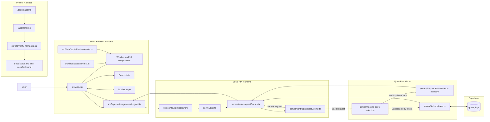
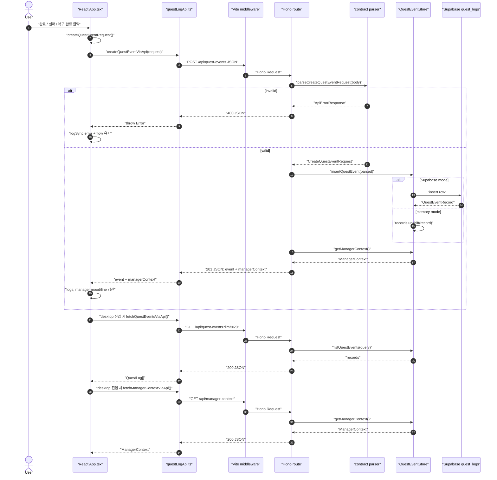
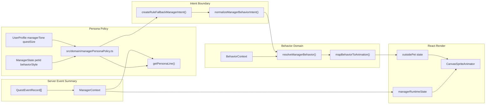
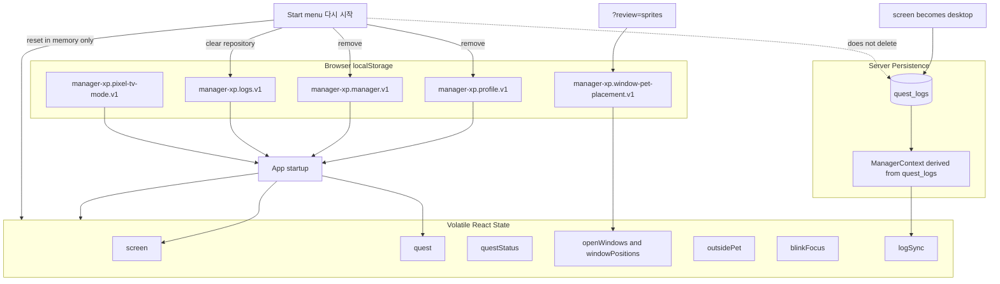
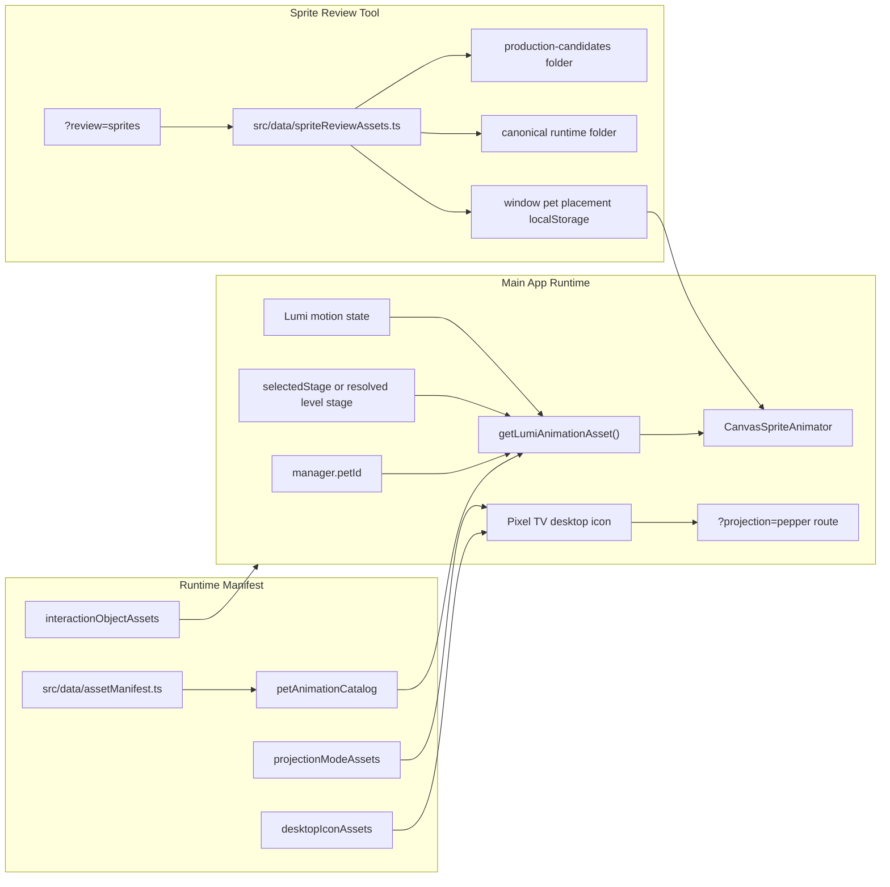

# Architecture Data Flow

이 문서는 현재 React, Hono, Supabase, asset manifest, Agent workflow가 어떻게 연결되는지 코드 기준으로 설명한다.

Mermaid 다이어그램은 GitHub Markdown 또는 Mermaid Live Editor에 그대로 붙여 넣어 확인할 수 있도록 작성했다.

## 1. 전체 아키텍처

### 설명

사용자는 React 화면에서 퀘스트를 실행하고, React는 즉시 화면 상태를 바꾸면서 기록 저장이 필요한 이벤트만 `questLogApi.ts`를 통해 `/api/*`로 보낸다. Vite middleware는 로컬 개발 환경에서 `/api/*` 요청을 Hono app으로 넘긴다. Hono route는 contract parser를 통과한 요청만 `QuestEventStore`에 전달한다. Supabase 환경 변수가 있으면 `quest_logs`에 저장하고, 없으면 memory store로 fallback한다.

Agent workflow는 런타임 데이터 경로가 아니라 개발 운영 경로다. `.codex/agents`, `.agents/skills`, `scripts/verify-harness.ps1`, `docs/status.md`, `docs/tasks.md`가 요구사항 분석, 계획, 구현, 검증, 문서 갱신의 기준을 제공한다.

대표 코드:

- `src/App.tsx`: React state, localStorage, 화면 flow
- `src/layers/storage/questLogApi.ts`: frontend API adapter
- `vite.config.ts`: `/api/*`를 Hono로 넘기는 middleware
- `server/routes/questEvents.ts`: Hono route
- `server/contracts/questEvents.ts`: 요청/응답 contract parser
- `server/lib/questEventStore.ts`, `server/lib/supabase.ts`: memory/Supabase store

## 2. Quest Event 저장과 조회

### 설명

`POST /api/quest-events`는 완료, 실패, 복구 완료를 저장하는 단일 진입점이다. route는 JSON을 읽은 뒤 `parseCreateQuestEventRequest()`로 `type`, `quest`, `amount`, `difficulty`, `result`, `expDelta`, `managerMoodAfter`를 검증한다. 유효하지 않으면 store를 호출하지 않고 400을 반환한다. 유효한 경우만 store에 저장하고, 저장 직후 최신 `ManagerContext`를 함께 반환한다.

데스크톱 진입 시 React는 `GET /api/quest-events`와 `GET /api/manager-context`를 함께 호출한다. 이때 localStorage에 있던 기록 목록은 서버 조회 결과로 교체된다.

대표 코드:

- `src/App.tsx`: `createQuestEventRequest()`, `saveQuestEvent()`, desktop 진입 `useEffect`
- `src/layers/storage/questLogApi.ts`: `createQuestEventViaApi()`, `fetchQuestEventsViaApi()`, `fetchManagerContextViaApi()`
- `server/routes/questEvents.ts`: POST/GET route
- `server/contracts/questEvents.ts`: parser와 `buildManagerContext()`

## 3. Manager Persona와 Behavior

### 설명

현재 Persona의 핵심은 animation 종류가 아니라 말투, 피드백 방식, 퀘스트 제안 성향이다. `managerPersonaPolicy.ts`는 `calm`, `friendly`, `firm`을 각각 `gentle`, `playful`, `direct` 피드백 스타일로 바꾸고, animation에는 `balanced`, `adventurous`, `shy` behavior bias만 약하게 준다.

LLM이 붙더라도 LLM은 sprite path, 좌표, DOM 상태를 직접 만들지 않는다. LLM 또는 rule fallback은 제한된 `ManagerBehaviorIntent`만 만들고, `normalizeManagerBehaviorIntent()`가 허용된 값만 통과시킨다. React runtime은 이 intent를 `resolveManagerBehavior()`로 통과시켜 최종 behavior/animation만 사용한다.

대표 코드:

- `src/domain/managerPersonaPolicy.ts`: 말투/피드백/behaviorStyle policy
- `src/domain/managerBehaviorIntent.ts`: LLM/rule intent 정규화
- `src/domain/managerBehaviorAdapter.ts`: intent와 behavior context 결합
- `src/domain/petBehaviorStateMachine.ts`: 후보 행동과 animation mapping
- `src/App.tsx`: `createRuleFallbackManagerIntent()`, `getNextOutsidePetRoamAnimation()`, `managerRuntimeState`

## 4. Persistence Lifecycle

### 설명

새로고침 또는 웹사이트 재접속 시 `profileKey`가 있으면 앱은 바로 desktop으로 들어간다. `managerKey`, `questLogsKey`, `pixelTvModeKey`도 localStorage에서 읽는다. 이후 desktop 진입 effect가 서버 기록과 manager context를 다시 불러오며, 기록 목록은 서버 응답으로 갱신된다.

시작 메뉴의 `다시 시작`은 로컬 onboarding reset이다. profile/manager localStorage를 삭제하고 local quest log repository를 비우지만, Supabase `quest_logs`는 삭제하지 않는다. 따라서 서버 기록은 계정/세션 정책이 생기기 전까지 별도 초기화 대상이 아니다.

대표 코드:

- `src/App.tsx`: `readStorage()`, `writeStorage()`, startup state, `restartService()`
- `src/layers/storage/questLogRepository.ts`: `manager-xp.logs.v1`
- `src/data/windowPetPlacements.ts`: sprite review placement localStorage
- `server/lib/supabase.ts`: Supabase `quest_logs` persistence

## 5. Asset Runtime, Review Tool, Pixel TV

### 설명

런타임은 `petId + stage + motion`으로 animation asset을 찾는다. React 컴포넌트는 sprite path를 직접 조립하지 않고 manifest에서 asset metadata를 받아 `CanvasSpriteAnimator`에 넘긴다. Review tool은 candidate folder와 canonical runtime folder를 모두 볼 수 있지만, candidate가 곧 runtime으로 승격되는 것은 아니다.

Pixel TV는 `pixelTvMode`를 localStorage에 저장한다. projection mode로 변환된 상태에서 Pixel TV 아이콘을 실행하면 URL query에 `projection=pepper`를 붙여 projection route로 이동한다. photo capture는 아직 후속 계획이며 현재 구현 흐름에는 포함되지 않는다.

대표 코드:

- `src/data/assetManifest.ts`: animation/icon/projection/interaction manifest
- `src/data/spriteReviewAssets.ts`: review tool asset set
- `src/components/SpriteSheetReviewTool.tsx`: review playback과 placement 저장
- `src/components/CanvasSpriteAnimator.tsx`: sprite sheet playback
- `src/App.tsx`: Pixel TV mode, projection launch, window pet interaction
