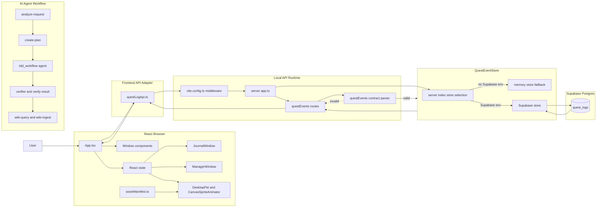
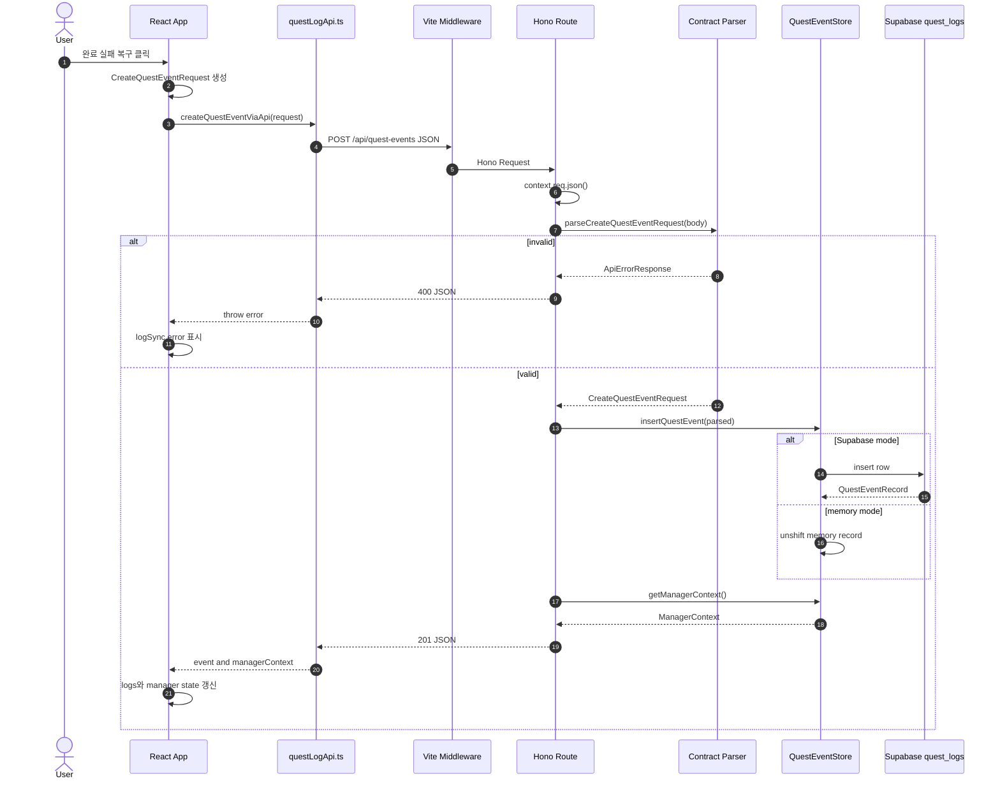
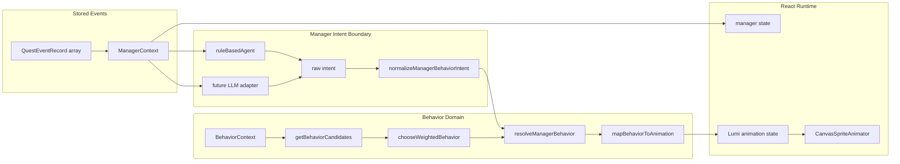
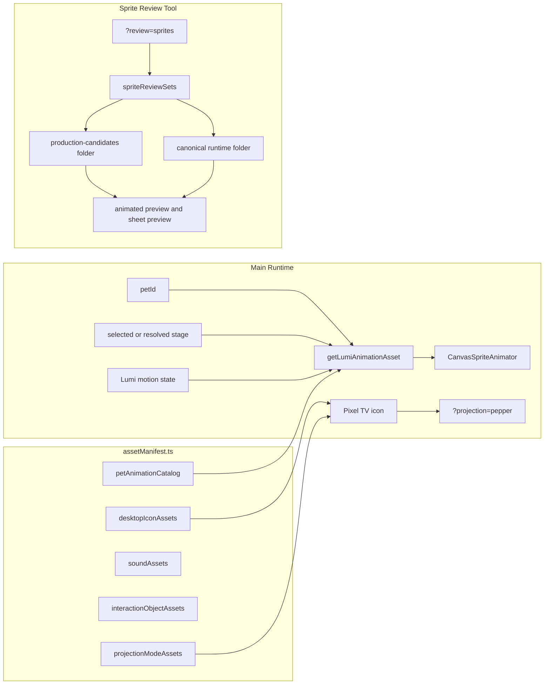
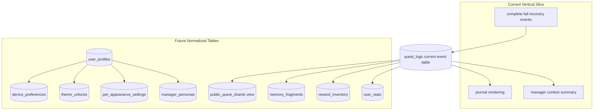

# Architecture Data Flow

## 문서 목적

이 문서는 현재 React, Hono, Supabase, asset manifest, Agent workflow가 어떻게 연결되는지 한 단계 자세한 구조도로 설명한다. Mermaid는 GitHub Markdown, Wiki, PR에서 바로 렌더링되므로 이 문서의 다이어그램은 GitHub와 Mermaid Live Editor 양쪽에서 동작하도록 작성했다.

## 1. 전체 구조



### 설명

사용자는 React 화면에서 퀘스트를 완료, 실패, 복구한다. React는 즉시 화면 상태를 바꾸되, 기록 저장은 `questLogApi.ts`를 통해 Hono API로 보낸다. Vite dev server는 `/api/*` 요청을 로컬 Hono app으로 넘긴다. Hono route는 JSON body를 읽고 contract parser에서 검증한 뒤, 환경 변수 상태에 따라 memory store 또는 Supabase store를 사용한다. React는 저장 응답과 manager context를 받아 기록 노트와 Lumi 상태를 갱신한다.

Agent workflow는 코드 실행 경로가 아니라 개발 운영 경로다. `analyze-request`가 요구사항을 좁히고, `create-plan`이 파일 범위와 검증법을 정리하고, `tdd_workflow`가 테스트 우선 도메인 작업을 수행하고, `verifier`가 완료 판단을 분리한다.

### 대표 코드

```ts
// vite.config.ts
server.middlewares.use(async (request, response, next) => {
  const requestUrl = request.url ?? "";
  if (!requestUrl.startsWith("/api/")) {
    next();
    return;
  }

  const body = request.method === "GET" || request.method === "HEAD" ? undefined : await readRequestBody(request);
  const apiResponse = await api(new Request(`http://localhost${requestUrl}`, { method: request.method, body }));
  response.statusCode = apiResponse.status;
  apiResponse.headers.forEach((value, key) => response.setHeader(key, value));
  response.end(await apiResponse.text());
});
```

## 2. Quest Event 저장과 조회



### 설명

`POST /api/quest-events`는 완료, 실패, 복구 완료 이벤트를 모두 저장하는 단일 진입점이다. Hono route가 먼저 JSON을 읽고 contract parser가 `type`, `quest`, `amount`, `difficulty`, `result`, `expDelta`, `managerMoodAfter` 같은 값을 검증한다. invalid이면 store로 가지 않고 바로 `400 VALIDATION_ERROR`를 반환한다. valid일 때만 `QuestEventStore.insertQuestEvent()`가 호출된다.

### 대표 코드

```ts
// server/routes/questEvents.ts
const parsed = parseCreateQuestEventRequest(body);
if (isApiErrorResponse(parsed)) return context.json(parsed, 400);

const record = await store.insertQuestEvent(parsed);
const managerContext = await store.getManagerContext();
return context.json({ ok: true, data: toQuestEventResponseItem(record), managerContext }, 201);
```

```ts
// server/contracts/questEvents.ts
if (!Number.isInteger(quest.amount) || Number(quest.amount) < 1) {
  return createErrorResponse("VALIDATION_ERROR", "quest.amount must be a positive integer.", { field: "quest.amount" });
}
```

## 3. Manager Context와 Behavior Animation



### 설명

`ManagerContext`는 최근 Quest Event를 요약한 현재 매니저 상태다. 지금은 성공/실패/복구 개수와 최근 결과로 mood와 reward hint를 만든다. 앞으로 LLM이 붙어도 LLM이 직접 좌표나 sprite path를 정하지 않는다. LLM 또는 rule agent는 `ManagerBehaviorIntent`만 준다. 이 intent는 `normalizeManagerBehaviorIntent()`에서 허용된 `behaviorStyle`, `tone`, `line`, `suggestedBehaviorBias`로 정규화된다. 그 뒤 `resolveManagerBehavior()`가 현재 오브젝트 상황과 weight를 합쳐 최종 behavior와 animation state를 고른다.

### 대표 코드

```ts
// src/domain/managerBehaviorAdapter.ts
const intent = normalizeManagerBehaviorIntent(input.rawIntent, input.fallbackIntent ?? defaultManagerBehaviorIntent);
const behaviorContext = {
  ...input.context,
  behaviorStyle: intent.behaviorStyle,
  behaviorBias: intent.suggestedBehaviorBias,
};
const candidates = getBehaviorCandidates(behaviorContext);
const selectedBehavior = chooseWeightedBehavior(candidates, input.randomValue);
const behavior = getNextBehaviorState(selectedBehavior, behaviorContext);
```

```ts
// src/domain/managerBehaviorIntent.ts
return {
  behaviorStyle: input.behaviorStyle,
  tone: isTone(input.tone) ? input.tone : fallback.tone,
  line: typeof input.line === "string" ? input.line : fallback.line,
  suggestedBehaviorBias: Array.isArray(input.suggestedBehaviorBias) ? input.suggestedBehaviorBias.flatMap(normalizeBehaviorBias) : [],
};
```

## 4. Asset Runtime, Review Tool, Projection Mode



### 설명

런타임은 `petId + stage + motion state`로 sprite sheet를 찾는다. React 컴포넌트가 문자열 path를 직접 조립하지 않고 manifest 함수를 통해 asset metadata를 받는다. Review tool은 런타임과 분리되어 있으며, canonical 폴더와 candidate 폴더를 모두 검수할 수 있다. Pixel TV projection mode는 `projectionModeAssets`와 desktop icon 상태를 사용해 기본 TV와 projection-connected 상태를 구분한다.

### 대표 코드

```ts
// src/data/assetManifest.ts
export interface ProjectionModeAsset {
  id: string;
  mode: "single_plane_pepper";
  iconId: DesktopIconId;
  connectedIconSrc: string;
  connectedIconHoverSrc: string;
  projectionRoot: string;
  defaultSpriteId: string;
  background: "#000000";
  glowStrength: "medium" | "high";
  reducedMotion: "fade" | "still";
}
```

```ts
// src/data/spriteReviewAssets.ts
export interface SpriteReviewSet {
  id: string;
  label: string;
  description: string;
  petId: PetId;
  stage: PetStageId;
  path: string;
  fileForState: (state: PetMotionState) => string;
}
```

## 5. 현재 DB와 확장 정규화 계획



### 설명

지금은 `quest_logs` 하나가 수직 슬라이스의 중심이다. 이 테이블은 완료/실패/복구 이벤트를 저장하고, 기록 노트와 manager context가 같은 데이터를 읽는다. 남은 확장 기능을 고려하면 모든 것을 `metadata`에 계속 넣는 대신, 반복 조회가 필요한 데이터는 별도 테이블로 승격해야 한다. 예를 들어 능력치는 `user_stats`, 보상은 `reward_inventory`, 외형 선택은 `pet_appearance_settings`, 기억 조각은 `memory_fragments`, 공개 탐색은 private 기본값을 유지한 `public_quest_shards` view로 분리하는 계획이 필요하다.

### 대표 코드

```sql
-- current table
create table if not exists public.quest_logs (
  id uuid primary key default gen_random_uuid(),
  user_id uuid null,
  anonymous_session_id text null,
  event_type text not null,
  title text not null,
  result text null,
  exp_delta integer not null,
  visibility text not null default 'private',
  metadata jsonb not null default '{}'::jsonb,
  created_at timestamptz not null default now()
);
```

```ts
// server/lib/questEventStore.ts
export interface QuestEventStore {
  insertQuestEvent(input: CreateQuestEventRequest): Promise<QuestEventRecord>;
  listQuestEvents(query: GetQuestEventsQuery): Promise<{ records: QuestEventRecord[]; nextCursor: string | null }>;
  getManagerContext(): Promise<ManagerContext>;
}
```

## 내가 설명할 때의 핵심 문장

- React는 즉시 화면 상태를 관리하지만, 기록 저장은 Hono API를 통해 서버로 보낸다.
- Hono route는 contract parser를 통과한 요청만 store에 전달한다.
- Supabase는 현재 `quest_logs` 이벤트 테이블 하나로 완료/실패/복구 기록을 저장한다.
- ManagerContext는 최근 이벤트를 Lumi가 사용할 수 있는 요약 상태로 바꾼 것이다.
- LLM은 직접 animation path나 좌표를 만들지 않고, 제한된 ManagerBehaviorIntent만 반환해야 한다.
- Asset runtime과 sprite review tool은 분리되어 있어서 후보 검수와 실제 런타임 경로가 섞이지 않는다.

## 현재 남은 구조적 과제

- `ManagerBehaviorAdapter`를 React Lumi animation state와 연결한다.
- Quest Event metadata에서 능력치, 보상, 기억 조각으로 승격할 데이터를 정한다.
- 상호작용 오브젝트의 rect/state machine을 실제 UI layer와 연결한다.
- public exploration과 webcam/gesture 기능은 privacy, consent, fallback 정책을 먼저 확정한다.
