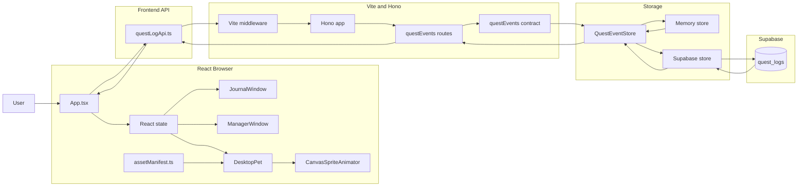
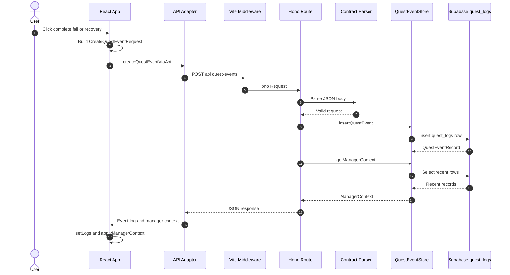
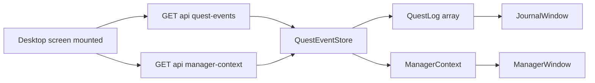
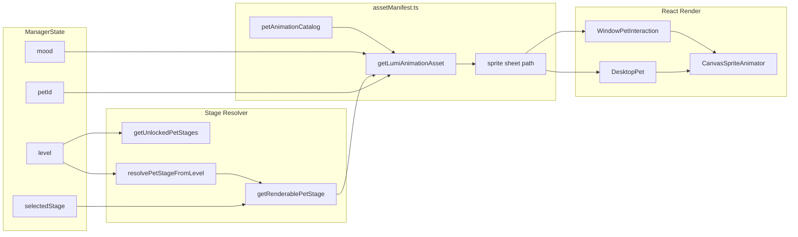
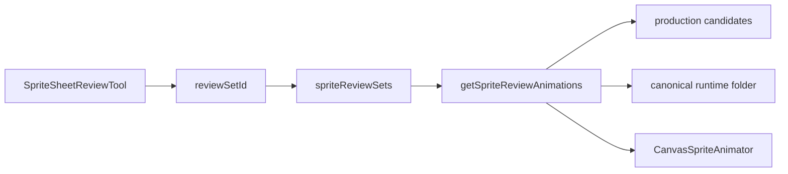

# Architecture Data Flow

## Why Mermaid

This document uses Mermaid because GitHub renders Mermaid diagrams directly in Markdown, README pages, Issues, PRs, and Wikis. To keep the diagrams portable across GitHub and Mermaid Live Editor, the diagrams below avoid HTML tags such as `<br/>` and keep node labels short.

References:

- GitHub Docs: https://docs.github.com/en/get-started/writing-on-github/working-with-advanced-formatting/creating-diagrams
- GitHub Blog: https://github.blog/developer-skills/github/include-diagrams-markdown-files-mermaid/
- Mermaid flowchart syntax: https://mermaid.ai/docs/build-and-edit/write-diagram-syntax

## One Page Structure



## Quest Event Save Flow



## Refresh And Journal Read Flow



## Character Asset Runtime

The character runtime is now keyed by `petId`, `stage`, and `state`. The React component does not build asset paths directly. It passes typed values into `assetManifest.ts`, and the manifest returns the sprite sheet metadata.



## Sprite Review Tool

The review tool is separate from the main runtime. Runtime assets use canonical folders, while review sets can point to candidate folders such as `pink-manager-stage-1-production-candidates`.



## Representative Code Schema

These are the key shapes that connect the layers. Keep them small and stable; add fields only when a real feature needs them.

### React Manager State

Path: `src/App.tsx`

```ts
interface ManagerState {
  name: string;
  petId: PetId;
  level: number;
  exp: number;
  mood: "waiting" | "focused" | "happy" | "recovering";
  line: string;
  unlockedStages: PetStageId[];
  selectedStage: PetStageId | null;
}
```

### Asset Lookup

Path: `src/data/assetManifest.ts`

```ts
export function getLumiAnimationAsset(
  state: LumiSpriteState,
  petId: PetId = defaultLumiPetId,
  stage: PetStageId = fallbackLumiStage,
) {
  const renderableStage = getAvailablePetStage(petId, stage);
  return getPetAnimationAsset(petId, renderableStage, state);
}
```

### Review Set

Path: `src/data/spriteReviewAssets.ts`

```ts
export interface SpriteReviewSet {
  id: string;
  label: string;
  description: string;
  petId: PetId;
  stage: PetStageId;
  path: string;
  fileForState: (state: PetMotionState) => string;
}
```

### React Event Request

Path: `src/layers/storage/questLogApi.ts`

```ts
export interface CreateQuestEventRequest {
  type: QuestEventType;
  quest: {
    title: string;
    type: "time" | "quantity" | "action";
    amount: number;
    unit: string;
    difficulty: "easy" | "normal" | "hard";
    deadlineAt: string | null;
  };
  result?: "success" | "failed" | "recovery" | null;
  expDelta: number;
  failureReason?: string | null;
  previousQuestTitle?: string | null;
  recoveryFromEventId?: string | null;
  managerMoodAfter?: "waiting" | "focused" | "happy" | "recovering" | null;
  managerLine?: string | null;
  clientCreatedAt?: string | null;
  metadata?: Record<string, unknown>;
}
```

### API Response To React

Path: `src/layers/storage/questLogApi.ts`

```ts
interface CreateQuestEventResponse {
  ok: true;
  data: QuestEventResponseItem;
  managerContext: ManagerContext;
}

export interface ManagerContext {
  currentMood: "waiting" | "focused" | "happy" | "recovering";
  recentEventCount: number;
  lastQuestResult: "success" | "failed" | "recovery" | null;
  memorySummary: string;
  rewardHints: string[];
}
```

### Store Interface

Path: `server/lib/questEventStore.ts`

```ts
export interface QuestEventStore {
  insertQuestEvent(input: CreateQuestEventRequest): Promise<QuestEventRecord>;
  listQuestEvents(query: GetQuestEventsQuery): Promise<{
    records: QuestEventRecord[];
    nextCursor: string | null;
  }>;
  getManagerContext(): Promise<ManagerContext>;
}
```

### Supabase Row Mapping

Path: `server/lib/supabase.ts`

```ts
function toQuestEventInsertRow(input: CreateQuestEventRequest) {
  return {
    event_type: input.type,
    title: input.quest.title,
    quest_type: input.quest.type,
    amount: input.quest.amount,
    unit: input.quest.unit,
    difficulty: input.quest.difficulty,
    deadline_at: input.quest.deadlineAt ?? null,
    result: input.result ?? null,
    exp_delta: input.expDelta,
    failure_reason: input.failureReason ?? null,
    previous_quest_title: input.previousQuestTitle ?? null,
    recovery_from_event_id: input.recoveryFromEventId ?? null,
    manager_mood_after: input.managerMoodAfter ?? null,
    manager_line: input.managerLine ?? null,
    client_created_at: input.clientCreatedAt ?? null,
    visibility: "private",
    event_version: 1,
    metadata: input.metadata ?? {},
  };
}
```

### Database Table

Path: `supabase/migrations/001_create_quest_logs.sql`

```sql
create table if not exists public.quest_logs (
  id uuid primary key default gen_random_uuid(),
  user_id uuid null,
  anonymous_session_id text null,
  quest_id uuid null,
  event_type text not null,
  title text not null,
  quest_type text not null,
  amount integer not null,
  unit text not null,
  difficulty text not null,
  result text null,
  exp_delta integer not null,
  failure_reason text null,
  previous_quest_title text null,
  recovery_from_event_id uuid null,
  manager_mood_after text null,
  manager_line text null,
  client_created_at timestamptz null,
  created_at timestamptz not null default now(),
  visibility text not null default 'private',
  event_version integer not null default 1,
  metadata jsonb not null default '{}'::jsonb
);
```

## What To Explain In Your Own Words

- The browser owns immediate XP desktop state: open windows, quest status, manager mood, selected pet, selected stage, and rendered logs.
- React sends Quest Events through Hono. React does not talk to Supabase directly.
- Supabase stores durable Quest Events in `quest_logs`.
- `ManagerContext` is a summarized view of recent Quest Events, so Lumi can react now and an LLM adapter can reuse the same summary later.
- Character rendering uses `petId + stage + state`; components pass typed values and the manifest returns stable asset paths.
- The review tool can inspect candidate sprite sets without changing the runtime asset path.

## Gaps To Watch

- Browser UI verification for Supabase save/read still needs a manual Network pass before closing the Project review card.
- The API currently has no user auth; `user_id` and RLS user policies are future work.
- `metadata` is intentionally flexible, but new fields should graduate into typed columns only when repeated features need querying.
- Stage 2 to Stage 4 are structurally supported but currently fall back to Stage 1 until real sheets are added.
- Projection, sound, and interaction object slots are planned in the manifest but should not appear in visible UI until implemented.
