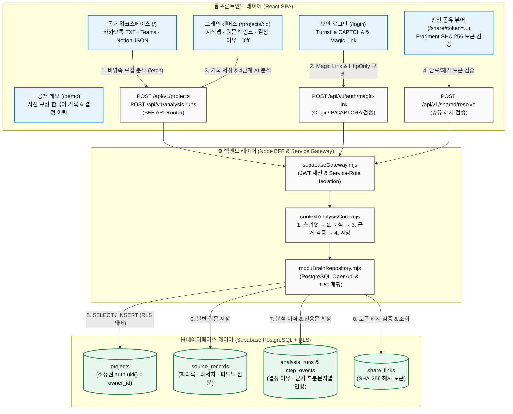
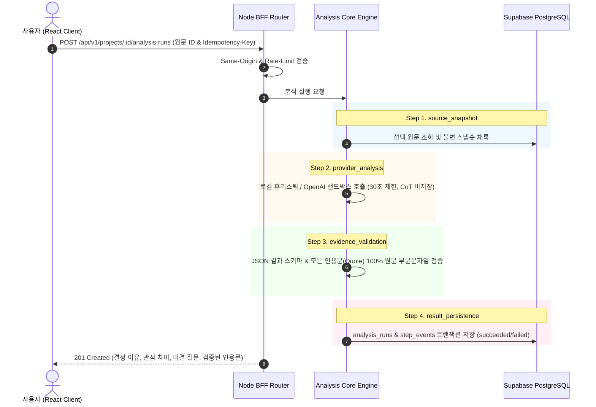

# Modu Brain (`modu-brain-tjwnsdhfz.onrender.com`) 데이터 흐름 및 3계층 아키텍처 시각화

본 문서는 실제 배포 서비스인 **[modu-brain-tjwnsdhfz.onrender.com](https://modu-brain-tjwnsdhfz.onrender.com/)**의 시스템 아키텍처, 3계층 구조, 데이터 흐름, 및 보안 검증 파이프라인을 시각화한 명세서입니다.

---

## 1. 3계층 아키텍처 다이어그램 (Mermaid)

---

## 2. 4단계 AI 분석 파이프라인 시퀀스 (Sequence Diagram)

---

## 3. 계층별 세부 역할 명세

1. **프론트엔드 (React SPA)**:
   - `/`: 비영속 수신 및 붙여넣기 정규화
   - `/demo`: 시연용 사전 구성 데모
   - `/login`: Magic Link & HttpOnly 세션 발급
   - `/projects/:id`: 브레인 캔버스, 지식맵 탐색, 이력 diff 비교
   - `/share#token=...`: URL Fragment 기반 SHA-256 해시 검증 및 읽기 전용 공유
2. **백엔드 (Node BFF Router)**:
   - HttpOnly 쿠키 인증, Same-Origin 검증, CAPTCHA 확인, Rate Limit (IP/User HMAC 해시), IDOR 차단
3. **데이터베이스 (Supabase PostgreSQL + RLS)**:
   - `auth.uid() = owner_id` RLS 정책 기반의 멀티테넌트 데이터 격리 및 OpenApi/RPC 보안 제어
