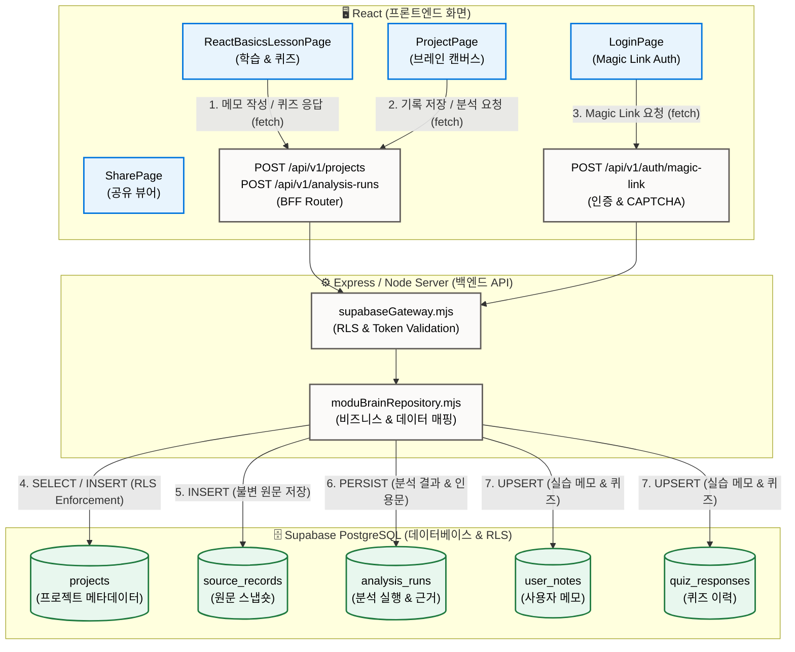

# Modu Brain 데이터 흐름 및 아키텍처 시각화

본 문서는 Modu Brain 서비스의 **화면(React) — 서버(Vite/Node API) — 데이터베이스(Supabase PostgreSQL)** 간의 수직 슬라이스 연결 및 데이터 흐름을 시각화한 아키텍처 명세입니다.

---

## 1. 전체 시스템 아키텍처 다이어그램 (Mermaid)

---

## 2. 데이터 흐름 세부 시나리오

### 1) 메모 작성 및 자가 진단 퀴즈 응답 흐름
- **화면(React)**: 사용자가 `ReactBasicsLessonPage`에서 메모를 입력하거나 퀴즈 답안을 제출하면, `useState`로 로컬 상태를 관리함과 동시에 `fetch('/api/v1/...')`를 통해 백엔드로 전송합니다.
- **서버(Node/Worker)**: `authSession` 미들웨어가 HttpOnly 쿠키의 세션을 검증하고 `moduBrainRepository.mjs`에 데이터 처리를 위임합니다.
- **DB(Supabase)**: `user_notes` 및 `quiz_responses` 테이블에 `auth.uid() = user_id` RLS(Row Level Security) 정책에 따라 본인의 계정 데이터로 안전하게 영구 저장됩니다.

### 2) 외부 맥락 분석 및 근거 인용 흐름
- **화면(React)**: `ProjectPage`에서 외부 문서/기록을 가져와 "분석 실행"을 누르면, 백엔드로 분석 요청이 전달됩니다.
- **서버(Node/Worker)**: `contextAnalysisCore.mjs`가 4단계 이벤트(`source_snapshot` -> `provider_analysis` -> `evidence_validation` -> `result_persistence`)를 차례로 수행합니다.
- **DB(Supabase)**: 분석 결과와 실제 원문 부분 문자열 인용문이 `analysis_runs` 테이블에 저장되며, 타 계정 접근은 RLS로 100% 차단됩니다.
