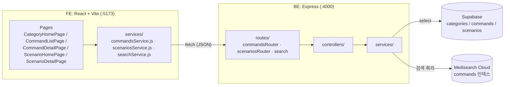

# 데이터 흐름 / 아키텍처 — 시각화 도구용 내보내기

시각화 도구(예: Mermaid Live Editor, Excalidraw, Whimsical 등)에 붙여넣어 다시 그릴 때 참고할 원본 설명.
`docs/plan.md` §5-1의 mermaid 다이어그램과 같은 내용을 시각화 도구가 다루기 쉬운 형태(구조 설명 + 순서 있는 흐름)로 풀어썼다.

## 시스템 구성 요소

1. **FE — React + Vite (`:5173`)**
   - Pages: `CategoryHomePage`, `CommandListPage`, `CommandDetailPage`, `ScenarioHomePage`, `ScenarioDetailPage`
   - Services(fetch 래퍼): `commandsService.js`, `scenariosService.js`, `searchService.js`
2. **BE — Express (`:4000`)**
   - Routes: `commandsRouter.js`, `scenariosRouter.js`, `search.js`
   - Controllers → Services(BE) — router→controller→service 계층 구조
3. **외부 저장소**
   - **Supabase (Postgres)** — `categories`, `commands`, `scenarios` 테이블
   - **Meilisearch Cloud** — `commands` 검색 인덱스

## 연결 관계 (누가 누구를 부르는가)

- FE Pages → FE Services (같은 프론트엔드 안에서 함수 호출)
- FE Services → BE Routes (`fetch`, HTTP/JSON)
- BE Routes → Controllers → Services (같은 백엔드 안에서 함수 호출)
- BE Services → Supabase (`select`, 명령어/카테고리/시나리오 조회)
- BE Services → Meilisearch (검색 쿼리, `search.js` 경로만 해당)

## 요청이 실제로 흐르는 예시 (명령어 상세 페이지 진입)

1. `CommandDetailPage.jsx`가 `commandsService.js`의 `fetchCommandById(id)` 호출
2. FE → BE `GET /api/commands/:id` 요청 전송
3. BE: `commandsRouter.js` → `commandsController.js` → `commandsService.js` → Supabase `commands` 테이블 조회
4. 응답이 같은 경로를 거꾸로 타고 FE state에 반영 → 화면 갱신

검색은 같은 구조에서 BE가 Supabase 대신 Meilisearch를 조회하는 것만 다르다(`search.js`). 시나리오는 `commands`와 동일한 계층으로 병렬 구성되어 있다(`scenariosRouter.js` → `scenariosController.js` → `scenariosService.js` → Supabase `scenarios` 테이블).

## 참고: 기존 mermaid 소스 (`docs/plan.md` §5-1)

