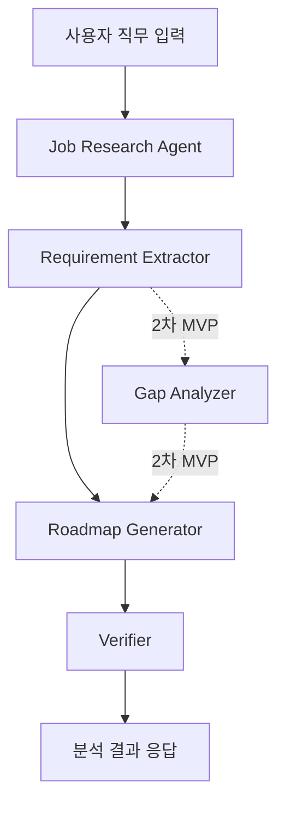
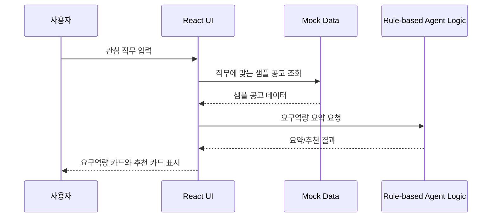
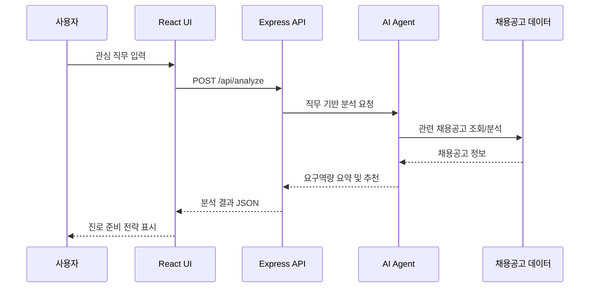

# 채용공고 기반 대학생 진로탐색 리서치 에이전트 설계 문서

## 1. 문서 목적

이 문서는 `docs/plan.md`에서 분리한 기술 구조와 시스템 흐름을 정리합니다. 기획 문서는 문제, 사용자, 기능, 화면 흐름에 집중하고, 이 문서는 AI Agent 구조와 이후 확장 가능한 시스템 흐름을 다룹니다.

<!-- TODO: plan.md와 상호 참조 링크를 문서 내 네비게이션 형식으로 정리합니다. -->

## 2. AI Agent 구조

초기 프로토타입은 mock data와 rule 기반 로직으로 시작하지만, 전체 구조는 Agent 역할을 분리해 확장 가능하게 설계합니다.

### 2.1 Agent 역할

| 역할 | 설명 | 1주차 포함 여부 |
| --- | --- | --- |
| Job Research Agent | 직무에 맞는 샘플 공고를 선택 | mock data 기반 포함 |
| Requirement Extractor | 기술, 경험, 자격요건, 우대사항 추출 | rule/mock 기반 포함 |
| Roadmap Generator | 학습 방향과 프로젝트 아이디어 생성 | rule/mock 기반 포함 |
| Verifier | 결과가 입력 직무와 공고 근거에 맞는지 확인 | 간단한 검토 문구로 포함 |
| Gap Analyzer | 사용자 역량과 요구 역량 비교 | 2차 MVP로 제외 |

Verifier를 포함하는 이유는 결과가 단순 AI 조언이 아니라 입력 직무와 채용공고 근거에 맞는지 확인하는 Agent 흐름을 보여주기 위해서입니다.

## 3. 시스템 흐름

1주차 프로토타입은 React 내부 mock data 기반으로 구현합니다. Express API는 이후 단계에서 추가합니다.

### 3.1 1주차 프로토타입 흐름

### 3.2 이후 Express 연동 흐름

## 4. 기술 구조 관련 메모

- 1주차 프로토타입은 React 내부 mock data와 rule 기반 로직으로 핵심 흐름을 검증한다.
- 이후 단계에서 Express API를 추가하고, UI와 분석 로직의 책임을 분리한다.
- 실제 LLM API 호출, 채용공고 수집, DB 저장, 로그인 기능은 1주차 프로토타입 범위에서 제외한다.
- Gap Analyzer는 사용자 현재 역량 입력 기능과 함께 2차 MVP 이후로 분리한다.

<!-- TODO: 실제 폴더 구조와 API 엔드포인트가 정해지면 기술 구조 다이어그램을 보강합니다. -->
