# SUBZIP 아키텍처 다이어그램

현재 코드베이스에 **실제로 구현된** 화면 → 서버 → DB 흐름만을 기준으로 그린 as-is 다이어그램. 만족도 설문/AI 리포트 등 `docs/api-spec.md`에 명세 자체가 없는 영역은 포함하지 않는다.

## 다이어그램

```mermaid
flowchart TB
    subgraph FE["Frontend Screens (react-router-dom)"]
        Layout["Layout\n(공통 레이아웃 + 인증 체크)"]
        Home["Home /\n(Dashboard + SubscriptionList)"]
        About["ProjectInfo\n/about"]
        New["SubscriptionForm\n/subscriptions/new"]
        Detail["SubscriptionDetail\n/subscriptions/:id"]
        Edit["SubscriptionEdit\n/subscriptions/:id/edit"]
        SettlementDetail["SettlementDetail\n/subscriptions/:id/settlements/:settlementId"]
        Join["SubscriptionJoin\n/join/:id"]
        NotFound["NotFound\n*"]
        OAuthCB["OAuthCallback\n/oauth/callback (Layout 밖)"]

        Layout --> Home
        Layout --> About
        Layout --> New
        Layout --> Detail
        Layout --> Edit
        Layout --> SettlementDetail
        Layout --> Join
        Layout --> NotFound
    end

    subgraph LIB["API 클라이언트 (frontend/src/lib)"]
        subsJs["subscriptions.js"]
        authJs["auth.js"]
        partyMembersJs["partyMembers.js"]
        settlementsJs["settlements.js"]
    end

    Google(["Google OAuth"])

    subgraph BE["Backend (Express 4, ESM)"]
        Health["GET /api/health"]
        AuthRoutes["/api/auth\nGET /google\nGET /google/callback"]
        UsersRoutes["/api/users\nGET /me"]
        SubsRoutes["/api/subscriptions\nPOST / · GET / · GET /dashboard\nGET /:id · PATCH /:id · DELETE /:id"]
        PreviewRoute["GET /api/subscriptions/:id/preview\n(인증 불필요)"]
        JoinRoute["POST /api/subscriptions/:id/join"]
        MembersRoutes["GET /api/subscriptions/:id/members\nDELETE /:id/members/:memberId"]
        SettlementsRoutes["/api/subscriptions/:id/settlements\nPOST / · GET / · GET /:settlementId\nPOST /:settlementId/members/:memberId/report\nPATCH /:settlementId/members/:memberId"]
        MW["requireAuth\n(JWT, middleware/auth.js)"]
        RateLimit["rateLimit.js\n(google 인증/콜백, preview)"]
        Crypto["crypto.js\nencrypt/decrypt (AES-256-GCM)"]
    end

    Prisma[["Prisma Client"]]

    subgraph DB["PostgreSQL"]
        UsersTbl[("users")]
        SubsTbl[("subscriptions")]
        PartyTbl[("party_members")]
        SettlementsTbl[("settlements")]
        SettlementMembersTbl[("settlement_members")]
    end

    Home --> subsJs
    Detail --> subsJs
    Detail --> partyMembersJs
    Detail --> settlementsJs
    New --> subsJs
    Edit --> subsJs
    Join --> subsJs
    SettlementDetail --> settlementsJs
    Layout --> authJs
    Home -. "로그인 링크(a href)" .-> AuthRoutes

    subsJs -->|"GET/POST/PATCH/DELETE /api/subscriptions..."| SubsRoutes
    subsJs -->|"GET /:id/preview"| PreviewRoute
    subsJs -->|"POST /:id/join"| JoinRoute
    partyMembersJs -->|"GET/DELETE /:id/members..."| MembersRoutes
    settlementsJs -->|"POST/GET/PATCH /:id/settlements..."| SettlementsRoutes
    authJs -->|"GET /api/users/me"| UsersRoutes

    AuthRoutes <--> Google
    AuthRoutes --> RateLimit
    AuthRoutes -->|"user.upsert"| Prisma
    AuthRoutes -. "JWT 발급 후 redirect" .-> OAuthCB

    SubsRoutes --> MW
    SubsRoutes --> Crypto
    UsersRoutes --> MW
    JoinRoute --> MW
    MembersRoutes --> MW
    SettlementsRoutes --> MW
    SettlementsRoutes --> Crypto
    PreviewRoute --> RateLimit
    MW --> Prisma
    PreviewRoute --> Prisma

    Prisma --> UsersTbl
    Prisma --> SubsTbl
    Prisma --> PartyTbl
    Prisma --> SettlementsTbl
    Prisma --> SettlementMembersTbl
    SubsRoutes -. "role 체크용 read, 삭제 시 cascade" .-> PartyTbl
    SubsRoutes -. "삭제 시 cascade" .-> SettlementsTbl
    SubsRoutes -. "삭제 시 cascade" .-> SettlementMembersTbl
    JoinRoute -. "가입 시 insert" .-> PartyTbl
    MembersRoutes -. "조회/삭제" .-> PartyTbl
    SettlementsRoutes -. "생성/조회/상태변경" .-> SettlementsTbl
    SettlementsRoutes -. "생성/조회/상태변경" .-> SettlementMembersTbl
```

## 레이어 요약

### Frontend — 화면 (`frontend/src/App.jsx`)

| 경로 | 컴포넌트 | 비고 |
| --- | --- | --- |
| `/` | `Home` (`Dashboard` + `SubscriptionList`) | Layout 하위 |
| `/about` | `ProjectInfo` | Layout 하위 |
| `/subscriptions/new` | `SubscriptionForm` | Layout 하위 |
| `/subscriptions/:id` | `SubscriptionDetail` | Layout 하위, 파티원 관리·정산 생성/이력 UI 포함 |
| `/subscriptions/:id/edit` | `SubscriptionEdit` | Layout 하위, 소유자 전용 |
| `/subscriptions/:id/settlements/:settlementId` | `SettlementDetail` | Layout 하위, 정산 상세(토스 연결 버튼+QR 폴백, 이체 확인 요청) |
| `/join/:id` | `SubscriptionJoin` | Layout 하위, 초대 링크로 진입 |
| `/oauth/callback` | `OAuthCallback` | Layout 밖 (OAuth 리다이렉트 전용) |
| `*` | `NotFound` | Layout 하위 |

API 호출은 4개 lib 모듈이 담당하며 전부 axios 없이 순수 `fetch` 기반:

- `frontend/src/lib/subscriptions.js`: `createSubscription`, `getSubscriptions`, `getDashboardSummary`, `getSubscription`, `updateSubscription`, `deleteSubscription`, `previewSubscription`, `joinSubscription`
- `frontend/src/lib/auth.js`: `fetchMe` 등 토큰/인증 헬퍼
- `frontend/src/lib/partyMembers.js`: `getMembers`, `deleteMember`
- `frontend/src/lib/settlements.js`: `createSettlement`, `getSettlements`, `getSettlementDetail`, `reportSettlementMember`, `updateSettlementMemberStatus` (+ QR/딥링크 폴백 훅 `useTossQrCode`, `useTossTransferFallback`)

### Backend — 라우트 (`backend/src/index.js` 마운트 기준)

`subscriptions.routes.js`, `partyMembers.routes.js`, `settlements.routes.js` 세 라우터가 모두 `/api/subscriptions` prefix를 공유한다.

| 라우트 | 파일 | 인증/제한 |
| --- | --- | --- |
| `GET /api/health` | `index.js` (인라인) | 불필요 |
| `GET /api/auth/google`, `GET /api/auth/google/callback` | `routes/auth.routes.js` | 불필요(로그인 자체) + `rateLimit.js` (google 인증/콜백용 별도 인스턴스) |
| `GET /api/users/me` | `routes/users.routes.js` | `requireAuth` |
| `POST /api/subscriptions`, `GET /api/subscriptions`, `GET /api/subscriptions/dashboard`, `GET /api/subscriptions/:id` | `routes/subscriptions.routes.js` | `requireAuth` |
| `PATCH /api/subscriptions/:id`, `DELETE /api/subscriptions/:id` | `routes/subscriptions.routes.js` | `requireAuth` (소유자만) |
| `GET /api/subscriptions/:id/preview` | `routes/partyMembers.routes.js` | 불필요(초대 링크 미리보기) + `previewRateLimiter` |
| `POST /api/subscriptions/:id/join` | `routes/partyMembers.routes.js` | `requireAuth` |
| `GET /api/subscriptions/:id/members` | `routes/partyMembers.routes.js` | `requireAuth` (파티장만) |
| `DELETE /api/subscriptions/:id/members/:memberId` | `routes/partyMembers.routes.js` | `requireAuth` (파티장 또는 본인) |
| `POST /api/subscriptions/:id/settlements` | `routes/settlements.routes.js` | `requireAuth` (파티장만, 해당 청구월 1회) |
| `GET /api/subscriptions/:id/settlements` | `routes/settlements.routes.js` | `requireAuth` (파티장은 전체, 파티원은 본인 항목만) |
| `GET /api/subscriptions/:id/settlements/:settlementId` | `routes/settlements.routes.js` | `requireAuth` (파티장 또는 해당 정산의 파티원) |
| `POST /api/subscriptions/:id/settlements/:settlementId/members/:settlementMemberId/report` | `routes/settlements.routes.js` | `requireAuth` (본인만, 이체 확인 요청) |
| `PATCH /api/subscriptions/:id/settlements/:settlementId/members/:settlementMemberId` | `routes/settlements.routes.js` | `requireAuth` (파티장만, 상태 변경) |

`requireAuth`는 `backend/src/middleware/auth.js`에서 JWT(`backend/src/lib/jwt.js`)를 검증. `Subscription.accountNumber`/`accountHolderName`은 `backend/src/lib/crypto.js`(AES-256-GCM)로 암호화되어 저장되며, `subscriptions.routes.js`·`settlements.routes.js`에서 조회 시 복호화한다.

### DB — Prisma / PostgreSQL (`backend/prisma/schema.prisma`)

| 모델 | 테이블 | 비고 |
| --- | --- | --- |
| `User` | `users` | Google OAuth 시 upsert |
| `Subscription` | `subscriptions` | 생성/목록/상세/수정/삭제 구현됨 (삭제 시 정산·정산항목·파티원 데이터 트랜잭션 cascade) |
| `PartyMember` | `party_members` | 초대 링크 가입 시 insert, 목록 조회/삭제 API 구현됨 |
| `Settlement` | `settlements` | 생성(청구월당 1회)/조회 API 구현됨 |
| `SettlementMember` | `settlement_members` | 생성/조회/이체 확인 요청/상태 변경(pending↔done) API 구현됨 |

## docs/api-spec.md 대비 구현 범위

- **1. Auth `[확정]`**: 구현된 라우트와 일치.
- **2. Subscription `[초안]`**: 등록/목록/상세/수정/삭제, 초대 링크 미리보기/가입, 월별 실지출 대시보드(`GET /dashboard`, `createdAt` 기준 추정치)까지 구현.
- **3. Party Member `[초안]`**: 초대 링크를 통한 가입, 목록 조회, 삭제(파티장 또는 본인)까지 구현.
- **4. Settlement `[초안]`**: 생성/조회/이체 확인 요청/상태 변경까지 구현. 만족도 설문 연동 등 후속 기능만 미구현.

새 기능을 구현하며 이 표가 달라지면 이 문서도 함께 갱신할 것.
