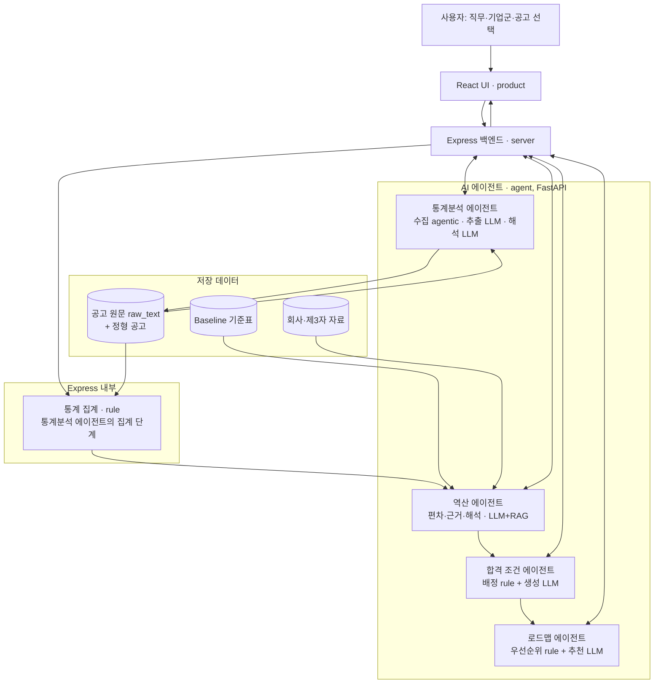
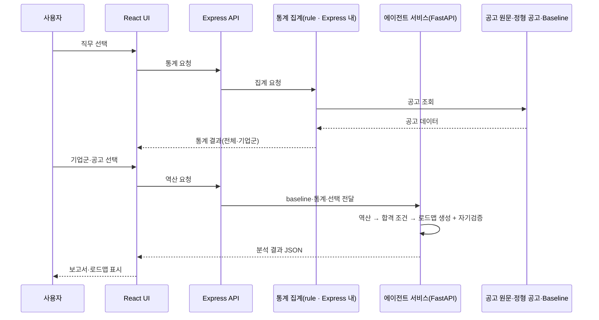

# CareerSignal 설계 문서

## 1. 문서 목적

이 문서는 프로토타입과 MVP의 기술 구조, 그리고 데이터 설계를 기록합니다. 문제 정의와 화면 목적은 [기획서](plan.md)에서, 확정된 시각 구조는 [디자인 컨셉](design-concept.md)에서 확인합니다. 기획서가 "무엇을·누구에게·왜"라면, 이 문서는 "어떻게 만드나"를 다룹니다.

## 2. 프로토타입

`prototype/`은 사용자 흐름과 정보 구조를 시연하기 위한 HTML/CSS 프로토타입입니다.

- 페이지: 직무 선택 · 통계 분석 · 인재상 역산 · 합격 조건 · 준비 로드맵
- 공통 스타일: `style.css`
- 배포: [Vercel 데모](https://careersignal-prototype.vercel.app/)
- 데이터: 백엔드 직무 mock

프로토타입에는 JavaScript, 데이터 조회, rule 분석, LLM 에이전트, Express API가 없습니다. 예시 직무 버튼과 분석 결과는 화면 흐름을 보여 주는 표현입니다.

## 3. MVP

`product/`의 React UI, `server/`의 Express 백엔드, `agent/`의 AI 에이전트 서비스를 운영합니다. 에이전트는 Python·FastAPI 위에서 LangChain·LangGraph로 오케스트레이션합니다. 초기 MVP에서는 샘플 공고 데이터를 사용하되, 입력 직무·기업군·개별 공고에 따라 분석 결과와 로드맵이 달라지도록 구현합니다.

**미리 저장하는 것**: 샘플 공고, baseline 기준표, 회사 공식·제3자 자료, rule로 집계한 통계. **요청 시 동적으로 생성하는 것**: 역산 해석, 합격 조건 체크리스트, 로드맵. 실제 채용공고·회사 자료를 웹에서 동적으로 수집하는 것은 확장입니다.

AI 에이전트는 네 개입니다.

| 에이전트 | 내부 단계 |
| --- | --- |
| 통계분석 | 수집(agentic) → 추출(LLM: 공고 원문 → 정형 데이터) → 집계(rule) → 해석(LLM) |
| 역산 | baseline·통계 대비 편차 탐지, 근거 추출, 해석 생성(LLM·RAG) |
| 합격 조건 | 활용처 배정(rule) → 활용처별 내용 생성(LLM) |
| 로드맵 | 우선순위 정렬(rule) → 학습·프로젝트 추천(LLM) |

역산의 전체·기업군·개별은 같은 역산 에이전트의 범위 입력이고, 결과 검증(Verifier)은 각 에이전트의 내부 단계입니다.

에이전트의 LLM·agentic 단계는 `agent/`(Python·FastAPI)에서 실행합니다. `server/`(Express)는 데이터 계약 관리, 응답 조립, 에이전트 중계(React → Express → FastAPI), 캐싱, 오류 처리를 맡고, 통계분석의 집계(rule) 단계를 `server/src/stats.js`에 둡니다. 프론트는 Express 하나만 호출합니다.

| 구성 | 책임 | 유형 | 위치 |
| --- | --- | --- | --- |
| React UI | 입력, 결과, 로딩·오류 상태 표시 | 화면 | `product/` |
| Express | 데이터 계약·응답 조립·에이전트 중계·캐싱·오류 처리 | 백엔드 | `server/` |
| 통계분석 에이전트 | 수집(agentic)·추출(LLM)·해석(LLM). 집계(rule) 단계만 Express 통계 모듈에 위치 | 에이전트 | `agent/` + `server/src/stats.js` |
| 역산 에이전트 | baseline·통계 대비 편차·근거·해석 생성(전체·기업군·개별) | 에이전트(LLM+RAG) | `agent/` |
| 합격 조건 에이전트 | 요구 항목의 활용처 배정(rule)과 활용처별 내용 생성(LLM) | 에이전트 | `agent/` |
| 로드맵 에이전트 | 미체크 항목 우선순위(rule)와 학습·프로젝트 추천(LLM) | 에이전트 | `agent/` |
| Baseline 기준표 | 직무 공통 기대치(1·2차로 구축) | 데이터 | 저장소 |
| Verifier | 각 에이전트 출력의 일관성 자기검증 | 에이전트 내부 단계 | `agent/` |

## 4. 목표 데이터 흐름

API 엔드포인트와 데이터 스키마는 11장(데이터 계약)을 따르고, LLM 프롬프트는 각 에이전트를 구현하는 슬라이스에서 정의합니다.

## 5. 데이터 자산과 베이스라인

### 5.1 데이터 자산 구분

- **베이스라인 자료**(`baseline/backend-baseline.md` 등): 직무 단위 기준표입니다. 회사·공고와 무관하게 유지되며, 아래 5.2 절차로 만듭니다.
- **샘플 채용공고 자료**(`server/data/backend-postings.sample.json`): 추출이 끝난 정형 형태의 표본 공고 집합입니다. 통계 분석과 편차 탐지의 입력으로 쓰며, 시계열을 위해 두 시점 스냅샷(최근 1년 / 이전 1년)으로 구성합니다. 실데이터는 공고 **원문(raw_text)을 함께 보관**합니다. 원문은 추출 재실행, 역산 근거 인용 검증, RAG(pgvector 임베딩)의 입력입니다.

### 5.2 베이스라인 구축

베이스라인은 직무 공통 기대치이며, 두 갈래로 만듭니다.

1. **통계 기반 후보 추출**: 통계 분석 결과(1차 공고 원문 집계)에서 다수 공고에 공통으로 등장하는 항목을 자동으로 베이스라인 후보로 뽑습니다.
2. **회사 공식 자료로 검증·보완**: 여러 회사의 채용·기술 자료(2차)를 참고해 후보를 다듬습니다. 같은 요구가 회사마다 크게 다르게 해석되지 않으므로 공통 기대치를 다지는 데 활용합니다.

제3자 자료(3차, 현직자 특강·트렌드 리포트·커뮤니티·커리큘럼 등)로 보완하는 것은 확장입니다. 베이스라인은 고정 자료가 아니라 주기적으로(예: 분기 1회) 갱신하는 것을 원칙으로 합니다.

## 6. 자료 계층

역산의 근거는 신뢰도가 다른 세 계층으로 나눕니다.

| 계층 | 자료 | 용도 |
| --- | --- | --- |
| 1차 | 채용공고 원문 | 통계 집계, baseline 후보, 역산 편차 파싱 |
| 2차 | 회사 공식 자료(채용 페이지, 기술 블로그) | baseline 검증·보완, 편차 근거·해석 |
| 3차 | 제3자 자료(잡플래닛·블라인드·커뮤니티·트렌드 리포트·유튜브/블로그) | 보조 신호, 신뢰도 낮게, 확장 |

통계는 1차만 씁니다. baseline과 역산(전체·기업군·개별)은 1·2차를 쓰고, 3차는 확장입니다. 근거가 약하면 신뢰도를 낮춰 표시합니다.

계층별 확보 소스는 다음과 같습니다.

| 계층 | 소스 | 확보 범위 |
| --- | --- | --- |
| 1차 (메타·라벨·시계열 축) | 사람인 오픈 API, 고용24/워크넷 API | 공고 메타데이터, 경력·학력 라벨, 게시일 |
| 1차 (본문 문장) | 고용24 상세 API, 원티드 OpenAPI(인증 신청제), 화이트리스트 기업 공식 채용 페이지 | 자격요건·우대사항 원문 |
| 2차 | 화이트리스트 기업의 기술 블로그·채용 사이트 | baseline 검증, 역산 근거 |
| 3차 | NCS·SW 직무 표준 역량, 워크넷 직무데이터사전 | baseline 검증, 용어 정규화 사전 |

수집 정책: 포털 사이트(사람인·잡코리아 등)는 크롤링하지 않고, 기업이 자기 사이트에 공개한 자료는 robots.txt·약관 준수 하에 수집합니다. 시계열은 수집 시점 기록으로 축적하며, MVP의 이전 스냅샷은 샘플·큐레이션으로 구성하고 출처를 화면에 표기합니다. 사용자가 역산 화면에서 직접 입력한 공고는 통계 baseline에 넣지 않고 개별 역산으로만 처리합니다.

## 7. 데이터 정의와 사용 시기

**fixture**: 검증을 위해 미리 준비해 두는 고정 데이터·응답. mock 데이터, 샘플 데이터, 에이전트의 고정 응답이 fixture로 쓰인다.

| 데이터 | 진짜/가짜 | 생성 주체 | 출처 | 규모 | 저장 위치 | 용도 |
| --- | --- | --- | --- | --- | --- | --- |
| mock | 가짜 | 개발 시 작성 | 창작 | 화면 표시분 | 화면 코드 하드코딩(`product/src/data/mock.js`, 프로토타입 HTML) | 화면·정보 구조 검증. 서버 불필요 |
| 샘플 | 가짜(데이터 계약 준수) | 생성 스크립트(시드 고정) | 현실을 모사한 창작 | 54건(최근 30 / 이전 24) | Supabase. 원본 fixture는 `server/data/backend-postings.sample.json` | 연결성 검증 — 집계·API·화면이 계약대로 동작 |
| 평가 세트 | 진짜 | 수동 큐레이션, 기대 정답은 사람이 작성 | 원티드·기업 채용 페이지의 실제 공고 원문 | 18~30건(기업군 6종 × 각 3~5건 커버리지) | `agent/eval/` | 성능 검증 — 에이전트 추출·해석 채점과 프롬프트 개선 |
| 실데이터 | 진짜 | 수집 에이전트(자동) | 사람인·고용24·원티드 API, 화이트리스트 기업 사이트 | 수백 건 이상, 지속 증가 | Supabase | 규모 확보 — 실서비스 |

개발 단계별 사용 데이터:

| 단계 | 사용 데이터 |
| --- | --- |
| 프로토타입, 프론트 화면 검증 | mock |
| 수직 슬라이스(프론트·계약·백·DB·에이전트 경로) | 샘플 + 에이전트 fixture 응답 |
| 에이전트 내부 구현·테스팅 | 평가 세트(입력·채점 기준). 서비스 통계는 샘플 유지 |
| 배포 후 확장 | 실데이터(샘플을 교체) |

연결성(fixture) · 성능(평가 세트) · 규모(실데이터)는 별도 축으로 검증한다. 평가 세트는 통계적 균일 표본이 아니라 기업군별 패턴 커버리지를 기준으로 구성한다. 스냅샷은 샘플 단계에서 최근 1년 / 이전 1년 두 시점으로 두고, 실데이터 전환 시 연도별 추이로 확장한다.

## 8. 기업군 태그

회사는 사람이 정한 태그로 묶습니다.

| 태그 | 특성(백엔드 기준 강조점) |
| --- | --- |
| 빅테크·플랫폼 | 대규모 트래픽·동시성, CS 기본기, 코드 품질·리뷰 문화 |
| 스타트업 | 넓은 범위·빠른 실행, 오너십, 풀스택 성향 |
| B2B SaaS | 도메인 이해, API 설계·안정성, 데이터 모델링 |
| 핀테크·금융 | 보안·정합성, 트랜잭션 정확성, 규제 대응 |
| SI·대기업 IT계열 | B2B 프로젝트, 프로세스·문서, 규모 |
| 게임사 | 실시간 처리·성능 최적화, 대용량 동시 접속, 클라이언트·서버 협업 |

## 9. 개발 순서

기획 → 디자인·프로토타입(mock) → **프론트(`product`, React·mock)** → **샘플 데이터(데이터 모델·계약 정형화)** → **백+DB(`server`, Express·Supabase, rule 통계·API)** → AI 에이전트(LLM 역산·문구, 샘플) → MVP 배포 → 확장(백엔드 외 직군 데이터·실데이터 수집).

프론트는 가짜(mock) 데이터로 화면과 흐름을 먼저 검증한다. '샘플 데이터'는 프론트가 기대하고 백엔드가 돌려줄 **응답 데이터 모양**을 정형화하는 단계로, 프론트와 백엔드가 만나는 접점이다. 백+DB부터는 계층을 한꺼번에 완성하기보다 기능 하나를 화면→서버→DB→화면으로 잇는 **수직 슬라이스**로 진행한다. rule 뼈대를 먼저 만들고 그 위에 LLM 에이전트를 얹으며, LLM 도입과 실데이터 수집은 분리해 에이전트는 샘플 데이터 위에서 먼저 검증한다.

저장소는 Supabase(Postgres + pgvector)다. 샘플 데이터를 적재해 시작하고, 실데이터 수집 시 데이터만 교체한다. pgvector 테이블은 역산 RAG에서 사용한다. 데이터 계약이 고정돼 있으므로 저장소·에이전트 구현이 바뀌어도 화면·API는 바뀌지 않는다. 슬라이스 단위와 진행 상태는 [백로그](backlog.md)에서 관리한다.

## 10. 기능별 구현 세부

기획서 6장의 사용자 기준 설명에 대응하는 출력·데이터·분석 방법입니다. 각 화면의 정보 구성은 기획서 9장, 시각 규칙은 [디자인 컨셉](design-concept.md)에서 다룹니다.

### 10.1 통계 분석

- **출력**: 10블록(기획서 9.2) — KPI·직무 외 요구·필수 인플레이션·숨은 난이도·기술 빈도·조합·추이·라벨 vs 현실·기업군 히트맵·요구 항목 전체표. 전체·기업군.
- **데이터**: 정형 샘플 공고(두 시점 스냅샷, `server/data/`). 실데이터 전환 시 원문(raw_text) 포함.
- **분석**: 통계분석 에이전트 파이프라인 = 수집(agentic) → 추출(LLM) → 집계(rule) → 해석(LLM). 집계 규칙과 계약은 11장을 따른다.

### 10.2 인재상 역산

- **출력**: 항목별 [항목명 | baseline 수준 | 편차 여부 | 근거 문장 | 해석 | 신뢰도 | 같은 직군 내 등장 비율]. 전체·기업군·개별 공고(원문+해석).
- **데이터**: 샘플 공고 + 회사 공식 자료(있는 경우) + 통계 결과.
- **분석**: LLM 에이전트가 baseline 비교, 근거 추출, 자연어 해석 생성.

### 10.3 합격 조건 정의

- **출력**: 체크리스트 [요구 항목 | 필요 산출물/활동 | 활용처 | 보유 여부]와 활용처별 내용(자소서 소재·포트폴리오 강조점·예상 면접 질문). 목표 기업군·회사 맞춤 조정.
- **데이터**: 역산 출력만 사용(추가 수집 불필요).
- **분석**: 활용처 배정은 rule 기반(항목 성격 태그), 예상 면접 질문 문구 생성은 LLM.

### 10.4 준비 로드맵

- **출력**: 단계별 [목표 미체크 항목 | 기간 | 권장 구현 범위·산출물 | 우선순위 | 추천 이유], 완료 항목 표시, 목표 기업군 토글. 각 추천은 채워지는 체크리스트 항목과 연결.
- **데이터**: 합격 조건 출력만 사용.
- **분석**: 우선순위(필수 우선)는 rule, 학습·프로젝트 추천 문구는 LLM.

## 11. 데이터 계약

프론트↔백↔에이전트가 주고받는 JSON의 접점 약속. 원칙: **계약 우선(contract-first), 확장은 키 추가만**(기존 키는 바꾸지 않음).

- **정형 공고 스키마**(`server/data/*.sample.json`, 추출이 끝난 형태 기준): posting_id · title · company · cluster_tag(기업군 6종) · snapshot(recent/prev) · posted_at · source · **raw_text(원문 — 실데이터 전환 시 필수)** · entry/edu/career_label · skills[{name, slug, requirement}] · out_of_role_tags[] · advanced_spans[{type, text}] · impl_level_signals[] · axis_mentions[] · reality_tags[]
- **통계 API 응답**(`GET /api/stats?job=…`): meta(스냅샷·출처·표본 수·disclaimer) · kpi · scope_expansion · inflation(이동 없으면 stable) · trend3(증가/유지/감소, 개수 동적) · labels · advanced · combos · reality · cluster_axes(히트맵) · tech_freq · **items**(요구 항목 전체) · error(UNSUPPORTED_JOB 등)
- **역산 입력 통계값**: items 배열이 그대로 역산 에이전트의 입력이다(블록 ⑩과 동일 데이터). 항목별: item_id(안정 slug) · name · aliases(용어 정규화) · category · scope(직무 내/외) · is_advanced · freq_overall · required_ratio(등장 공고 중 필수 표기 비율 %) · freq_by_cluster · trend{prev_pct(표본 없으면 null), recent_pct, direction, requirement_shift} · impl_level · evidence[{text, posting_id, source_url}] · support(표본 수) · confidence
- **추출 에이전트 계약**(`POST /extract`, FastAPI): 입력 { posting_id, raw_text } → 출력은 정형 공고 스키마의 추출 필드(skills, out_of_role_tags, advanced_spans, reality_tags, axis_mentions, impl_level_signals)와 confidence.
- **역산 계약**(`POST /api/reverse` → 에이전트 `POST /reverse`): 요청 { job, scope{level: overall|cluster|posting, cluster_tag?, posting_id?} }. Express가 통계 items와 baseline 기준표를 첨부해 에이전트로 전달하고, 공고 목록(postings_in_cluster[{posting_id, company, title, posted_at}])은 저장소 조회이므로 Express가 응답에 합성한다. 에이전트 응답: { job, scope, baseline[{item_id, title, desc, freq_pct, required_ratio}], deviations[{item_id, topic, baseline, deviation, evidence, explanation, confidence, ratio, related_stat}], unchanged[{item_id, title, note}], posting|null, agent_version, source }. posting의 원문 각 줄은 세 종류 주석 중 하나를 가진다 — mark_n(회사 특징, 편차 해설 interpretations와 짝) · base_n(직무 공통, baseline_notes와 짝, base_ref 라벨 병기) · note_n(숨은 의미, signal_notes와 짝). posting = { posting_id, company, title, summary, raw_sections[{section, lines[{text, mark_n, base_n, base_ref, note_n}]}], interpretations[{n, title, body, confidence, ratio, sources[{type: posting|company_blog|official, url}]}], baseline_notes[{n, base_ref, body}], signal_notes[{n, title, body}], unchanged_note }.
- **합격 조건 계약**(`POST /api/conditions` → 에이전트 `POST /conditions`): 요청 { job, scope }. Express가 에이전트 `/reverse`를 먼저 호출해 그 응답 전체를 reverse 필드로 첨부한다(합격 조건의 유일한 분석 입력). 응답: { job, scope, checklist[{item_id, title, subtitle, reason, evidence_needed, channels[essay|portfolio|interview], kind(project|story|study), is_deviation, dev_n, required, have}], portfolio{highlights[{title, body, tips[], linked_item_ids[]}], intro_orders[{cluster, steps[]}]}, essay[{kind, title, body, narrative{problem, solve, growth}|null, sample_sentence, tips[], linked_item_ids[]}], interview[{kicker, question, followups[], point, linked_item_ids[]}], agent_version, source }. checklist는 학습형 항목(kind=study, 면접 검증)을 포함한다. intro_orders는 overall 범위면 전 기업군, cluster·posting 범위면 해당 기업군만 담는다. 준비 현황 집계(보유·필수 미보유 수)는 화면이 체크 상태에서 계산한다.
- **준비 로드맵 계약**(`POST /api/roadmap` → 에이전트 `POST /roadmap`): 요청 { job, scope, checks{item_id: bool} }. Express가 `/reverse` → `/conditions` 사슬을 거친 합격 조건 응답을 conditions 필드로, 적용된 체크 상태를 checks로 첨부한다. 응답: { job, scope, project_steps[{n, phase, weeks, priority, title, body, deliverable, fills[{item_id, label, kind}], reason_title, reason, tags[]}], study_tracks[{phase, priority, title, depth, reason_title, reason, fills[]}], check_rows[{item_id, title, kind, is_deviation, dev_n, required, source_step}], agent_version, source }. 로드맵은 프로젝트 트랙(순서형)과 학습 트랙(병행형)으로 나뉜다.
- **화면 간 공유 상태**: 범위(scope)와 체크 상태(checks)는 앱 최상위에서 소유해 합격 조건·로드맵 화면이 공유한다. 체크는 즉시 저장되고 현황 숫자는 바로 갱신되며, 로드맵 재구성은 명시적 적용 동작으로만 반영된다.

집계 규칙: 모든 %의 분모는 recent 스냅샷, 우대→필수 이동은 prev 필수율 <40%이고 델타 ≥+20%p(양쪽 표본 n≥3), 추이 방향은 |델타| ≥8%p일 때만 판정, prev 표본 없음은 0이 아니라 null.

## 12. 제외 및 확장

MVP 이후 백엔드 외 직군 데이터, 실제 채용공고 수집, 연도별 추이를 추가합니다. 개인화 Gap 분석, 로그인·저장, 자동 클러스터링, 제3자 자료 연동, 권고/선택 구분, 직무 자유 입력은 백로그에 두고 착수 시 기획서에 반영합니다. 이 기능들은 현재 정적 프로토타입이나 MVP 완료 기능으로 표현하지 않습니다.
