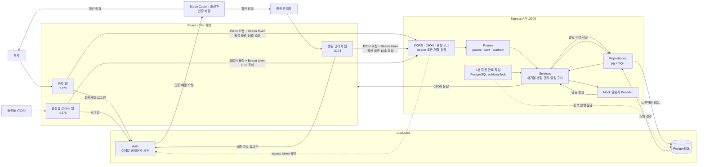

# 바로진료 데이터 흐름과 아키텍처

작성 기준: 2026년 7월 22일 현재 코드

## 시각화 도구

Mermaid를 사용합니다. GitHub Markdown에서 바로 렌더링되고, 다이어그램 원본을 코드와 함께 버전 관리할 수 있기 때문입니다.

- [GitHub 공식 문서](https://docs.github.com/en/get-started/writing-on-github/working-with-advanced-formatting/creating-diagrams)는 Markdown의 `mermaid` 코드 블록 렌더링을 지원합니다.
- [Mermaid 공식 문서](https://mermaid.js.org/intro/)에 따르면 텍스트 정의로 다이어그램을 만들고 수정할 수 있어 코드 구조가 바뀔 때 함께 갱신하기 쉽습니다.
- draw.io도 세밀한 수동 배치에는 유리하지만 별도 다이어그램 파일을 편집해야 합니다. 이번 미션은 README에서 바로 확인하고 지속적으로 수정하는 것이 중요하므로 Mermaid를 선택했습니다.

## 전체 구조

## 화면에서 DB까지 한 바퀴

원격 웨이팅 등록을 예로 들면 다음 순서로 흐릅니다.

1. 환자가 환자 웹에서 로그인하고 병원과 인원 구성을 선택합니다.
2. React가 Supabase 세션의 access token과 입력값을 Express에 보냅니다.
3. Express 인증 미들웨어가 Supabase Auth로 토큰을 확인하고, `profiles`에서 활성 환자 계정인지 검사합니다.
4. Route가 요청 형식을 검증한 뒤 `PatientWaitingService`를 호출합니다.
5. Service가 병원, 오늘 대기열, 환자 분류와 활성 웨이팅 제한을 확인합니다.
6. Repository가 하나의 PostgreSQL 트랜잭션에서 웨이팅, 인원 구성, 이벤트와 mock 알림 이력을 저장합니다.
7. Express가 현재 순서와 예상 시간을 JSON으로 응답합니다.
8. React가 응답을 state에 반영하고, 이후 활성 화면에서 10초마다 최신 상태를 조회합니다.

## 주요 데이터

| 영역 | 주요 테이블 | 저장 내용 |
|---|---|---|
| 계정·권한 | `auth.users`, `profiles`, `hospital_members` | 로그인 계정, 서비스 역할, 병원 소속 |
| 병원 입점 | `hospital_inquiries`, `hospital_applications`, `hospital_documents` | 입점 문의, 상세 신청, 증빙 메타데이터 |
| 병원 운영 | `hospitals`, `hospital_change_requests` | 승인된 병원 정보와 변경 승인 요청 |
| 환자 분류 | `patient_category_sets`, `patient_categories` | 병원별 인원 입력 방식과 적용일 |
| 통합 대기열 | `daily_queues`, `waiting_entries`, `waiting_entry_counts` | 날짜별 대기열, 가족 웨이팅, 실제 환자 수 |
| 상태·알림 | `waiting_events`, `notification_logs` | 상태 변경 이력과 중복 방지된 알림 결과 |

## 경계와 책임

- React는 화면과 사용자 입력을 담당하며, 업무 데이터를 Supabase DB에서 직접 조회하지 않습니다.
- React가 Supabase에 직접 연결하는 범위는 회원가입, 로그인과 세션 관리뿐입니다.
- Express는 인증·역할 검증, 입력 검증, 대기열 규칙과 트랜잭션을 담당합니다.
- SQL은 Repository에만 두고 Route와 React에는 두지 않습니다.
- 원격 환자와 현장 환자는 같은 `daily_queues`와 `waiting_entries`에 저장됩니다.
- 자동 만료 작업도 Service와 Repository를 사용하므로 화면 요청과 같은 상태 규칙을 따릅니다.

## 확인하면서 발견한 보완 지점

| 발견한 점 | 현재 영향 | 다음 작업 방향 |
|---|---|---|
| 환자 병원 검색 목록 일부가 React mock 데이터입니다. | 개발용 서울이비인후과만 API 정보와 연결되고 전체 검색은 DB 조회가 아닙니다. | P2에서 병원 검색 API와 PostgreSQL 조회로 교체하고 승인 병원만 노출합니다. |
| 병원 입점 문의·상세 신청 일부가 Express 메모리 mock 저장소를 사용합니다. | 서버를 재시작하면 해당 mock 신청 데이터가 사라질 수 있습니다. | 입점 관련 실제 Repository와 테이블 흐름으로 통합합니다. |
| 알림톡은 `MockNotificationProvider`입니다. | 알림 이력은 DB에 남지만 실제 카카오 메시지는 발송되지 않습니다. | P2에서 알림톡·SMS 통합 제공업체 Adapter로 교체합니다. |
| 세 화면은 10초 Polling으로 갱신합니다. | 구현은 단순하지만 사용자와 병원이 늘면 반복 요청이 증가합니다. | MVP에서는 유지하고, 운영 규모가 커지면 Realtime 또는 SSE를 비교합니다. |
| 자동 만료 작업이 Express 프로세스 안에서 실행됩니다. | 로컬 MVP에는 적합하지만 외부 다중 서버 배포에서는 실행 주체 관리가 필요합니다. | P2 배포 설계에서 별도 worker 또는 Supabase Cron을 검토합니다. |

## 내가 설명할 수 있는 요약

바로진료에는 역할별 React 화면이 세 개 있지만 업무 서버는 하나입니다. 각 화면은 Supabase에서 로그인한 뒤 access token을 Express에 보내고, Express가 사용자 역할과 요청을 검증합니다. 실제 병원과 대기열 데이터는 Express의 Service와 Repository를 거쳐 Supabase PostgreSQL에 저장됩니다. 환자와 병원 관리자는 같은 통합 대기열을 서로 다른 화면에서 조회하며, 화면은 10초마다 상태를 갱신합니다. Express는 별도로 1분마다 미도착 환자를 처리하고, PostgreSQL 잠금으로 같은 작업의 중복 실행을 막습니다. 현재 인증 메일은 Brevo로 실제 발송하지만 알림톡과 일부 입점·병원 검색 데이터는 MVP mock입니다.
