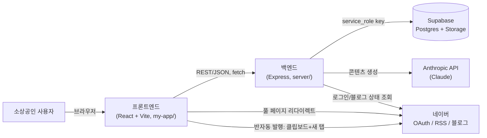
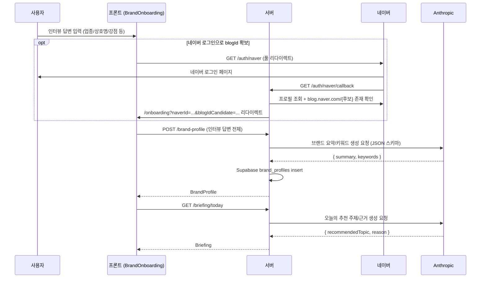
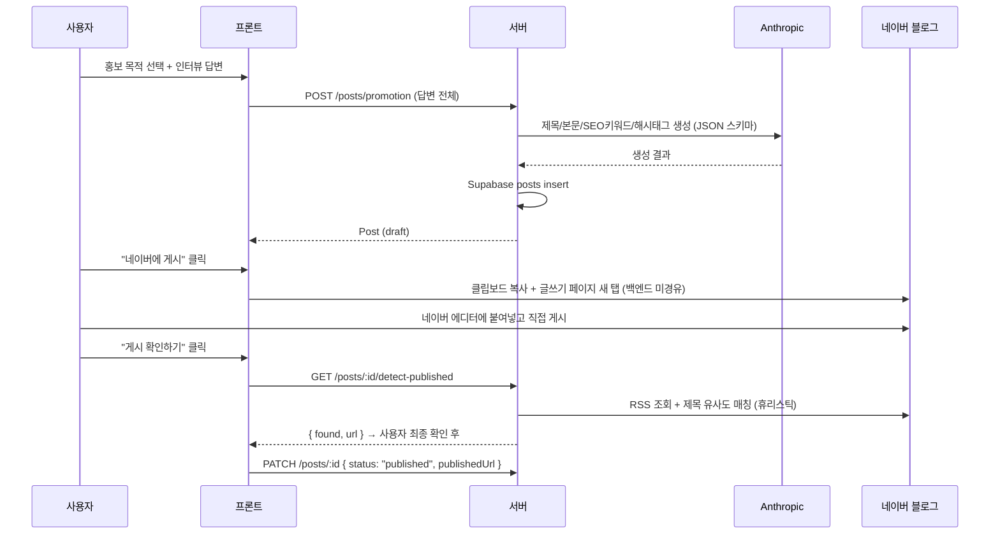

# 알리장 아키텍처 개요

전체 시스템의 큰 그림을 담은 문서. 프론트엔드 상세는 [my-app/ARCHITECTURE.md](../my-app/ARCHITECTURE.md), 백엔드 상세는 [server/ARCHITECTURE.md](../server/ARCHITECTURE.md) 참고. 기능 정의는 [PROJECT.md](../my-app/PROJECT.md), API 계약은 [api-spec.md](api-spec.md).

## 시스템 구성

- 프론트엔드와 백엔드는 완전히 분리된 두 개의 Node 프로젝트(`my-app/`, `server/`)이며, `docs/api-spec.md`를 계약으로 삼아 독립적으로 개발한다.
- 프론트엔드는 Supabase나 Anthropic을 직접 호출하지 않는다 — 모든 외부 연동은 백엔드를 거친다. 예외는 네이버 OAuth 로그인(브라우저 풀 리다이렉트)과 반자동 발행(클립보드 복사 + 네이버 새 탭)으로, 둘 다 브라우저가 네이버와 직접 상호작용한다.
- 단일 사장님 = 단일 브랜드를 가정한 MVP라 인증(세션/JWT)이 없다. 네이버 로그인은 지금은 `blogId`를 알아내기 위한 용도로만 쓰인다.

## 기술 스택

| 영역 | 기술 |
| --- | --- |
| 프론트엔드 | Vite, React 19, React Router, Tailwind CSS v4 |
| 백엔드 | Node.js, Express 5 |
| DB | Supabase (Postgres), 서버만 `service_role key`로 접근 |
| 파일 저장 | Supabase Storage (`post-images` 버킷) |
| AI | Anthropic API (`@anthropic-ai/sdk`, 모델 `claude-sonnet-5`), JSON 스키마 강제 출력 |
| 외부 연동 | 네이버 OAuth("네이버 아이디로 로그인"), 네이버 블로그 RSS |
| 테스트 | vitest + supertest (백엔드), 실제 Supabase 프로젝트에 연결하는 통합 테스트 |

## 핵심 데이터 흐름

### 1. 브랜드 온보딩 → 오늘의 AI 브리핑

### 2. 홍보글 작성 → 반자동 발행

## 알려진 제약 / 미정 사항

- **인증 없음**: MVP는 단일 브랜드 가정이라 세션/JWT가 없다. 필요해지면 별도 도입 예정 ([api-spec.md 미결정 사항](api-spec.md#미결정-사항-다음에-정하기)).
- **완전 자동 발행 불가**: 네이버 블로그 포스팅 공식 API가 폐지되어 서버가 대신 글을 올릴 수 없다. 클립보드 복사 + 새 탭이라는 반자동 방식을 쓴다.
- **네이버 연동은 전부 휴리스틱**: blogId 확정, RSS 기반 게시 확인, RSS 기반 삭제 확인 모두 공식 API가 없어 정규식/문자열 매칭으로 추정한다. 그래서 서버 응답을 최종 신뢰 소스로 쓰지 않고 항상 사용자 확인 단계를 거친다.
- **일부 인사이트는 여전히 규칙/고정값 기반**: 블로그 건강도의 `seasonalContent`/`monthlyPlanCompletion`, 발행 시간 추천(`scheduleSuggestion.js`)은 아직 LLM이 아니라 고정 규칙이다. 추천 문구(브리핑 주제/이유, 홍보글/공지 본문)만 LLM으로 생성한다.
- **배포 환경 미정**: 현재는 로컬 개발 단계 (`localhost:5173` ↔ `localhost:4000`)이며, 호스팅/CI 등 실제 배포 구성은 아직 정해지지 않았다.

## 문서 지도

| 문서 | 내용 |
| --- | --- |
| [my-app/PROJECT.md](../my-app/PROJECT.md) | 서비스 기획, 기능 정의 |
| [docs/api-spec.md](api-spec.md) | 프론트-백엔드 API 계약 |
| [my-app/ARCHITECTURE.md](../my-app/ARCHITECTURE.md) | 프론트엔드 구조 |
| [server/ARCHITECTURE.md](../server/ARCHITECTURE.md) | 백엔드 구조, AI/외부 연동 |
| [my-app/DESIGN.md](../my-app/DESIGN.md), [my-app/WIREFRAME.md](../my-app/WIREFRAME.md) | 디자인 시스템, 화면 구조 |
| [server/TESTING.md](../server/TESTING.md) | 백엔드 테스트 컨벤션 |
| [docs/backlog-12days.md](backlog-12days.md) | 진행 백로그 |
