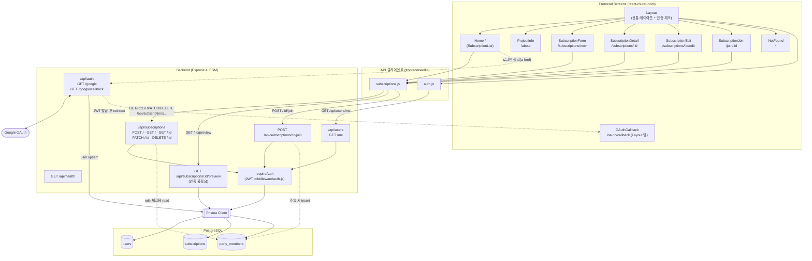

# SUBZIP 아키텍처 다이어그램

현재 코드베이스에 **실제로 구현된** 화면 → 서버 → DB 흐름만을 기준으로 그린 as-is 다이어그램. `docs/api-spec.md`에 `[초안]`으로만 존재하고 아직 라우트가 없는 영역(정산, 파티원 관리 API 등)은 포함하지 않는다.

## 다이어그램

## 레이어 요약

### Frontend — 화면 (`frontend/src/App.jsx`)

| 경로 | 컴포넌트 | 비고 |
| --- | --- | --- |
| `/` | `Home` (`SubscriptionList`) | Layout 하위 |
| `/about` | `ProjectInfo` | Layout 하위 |
| `/subscriptions/new` | `SubscriptionForm` | Layout 하위 |
| `/subscriptions/:id` | `SubscriptionDetail` | Layout 하위 |
| `/subscriptions/:id/edit` | `SubscriptionEdit` | Layout 하위, 소유자 전용 |
| `/join/:id` | `SubscriptionJoin` | Layout 하위, 초대 링크로 진입 |
| `/oauth/callback` | `OAuthCallback` | Layout 밖 (OAuth 리다이렉트 전용) |
| `*` | `NotFound` | Layout 하위 |

API 호출은 `frontend/src/lib/subscriptions.js`(`createSubscription`, `getSubscriptions`, `getSubscription`, `updateSubscription`, `deleteSubscription`, `previewSubscription`, `joinSubscription`)와 `frontend/src/lib/auth.js`(`fetchMe`)가 담당. 둘 다 axios 없이 순수 `fetch` 기반.

### Backend — 라우트 (`backend/src/index.js` 마운트 기준)

| 라우트 | 파일 | 인증 |
| --- | --- | --- |
| `GET /api/health` | `index.js` (인라인) | 불필요 |
| `GET /api/auth/google`, `GET /api/auth/google/callback` | `routes/auth.routes.js` | 불필요 (로그인 자체) |
| `GET /api/users/me` | `routes/users.routes.js` | `requireAuth` |
| `POST /api/subscriptions`, `GET /api/subscriptions`, `GET /api/subscriptions/:id` | `routes/subscriptions.routes.js` | `requireAuth` |
| `PATCH /api/subscriptions/:id`, `DELETE /api/subscriptions/:id` | `routes/subscriptions.routes.js` | `requireAuth` (소유자만) |
| `GET /api/subscriptions/:id/preview` | `routes/subscriptions.routes.js` | 불필요 (초대 링크 미리보기) |
| `POST /api/subscriptions/:id/join` | `routes/subscriptions.routes.js` | `requireAuth` |

`requireAuth`는 `backend/src/middleware/auth.js`에서 JWT(`backend/src/lib/jwt.js`)를 검증.

### DB — Prisma / PostgreSQL (`backend/prisma/schema.prisma`)

| 모델 | 테이블 | 비고 |
| --- | --- | --- |
| `User` | `users` | Google OAuth 시 upsert |
| `Subscription` | `subscriptions` | 생성/목록/상세/수정/삭제 구현됨 (삭제 시 파티원 데이터 트랜잭션 cascade) |
| `PartyMember` | `party_members` | 초대 링크 가입(`POST /:id/join`) 시 insert, role 체크용 read — 목록 조회/삭제 전용 API는 아직 미구현 |
| `Settlement` | `settlements` | 스키마만 존재, API 라우트 없음 |
| `SettlementMember` | `settlement_members` | 스키마만 존재, API 라우트 없음 |

## docs/api-spec.md 대비 구현 범위

- **1. Auth `[확정]`**: 구현된 라우트와 일치.
- **2. Subscription `[초안]`**: 등록/목록/상세/수정/삭제, 초대 링크 미리보기/가입까지 구현. 월별 실지출 대시보드 엔드포인트는 아직 미구현.
- **3. Party Member `[초안]`**: 초대 링크를 통한 가입은 구현됨. 파티원 목록 조회/삭제 전용 API는 미구현.
- **4. Settlement `[초안]`**: DB 스키마(`Settlement`, `SettlementMember`)만 존재, API 라우트 없음.

새 기능을 구현하며 이 표가 달라지면 이 문서도 함께 갱신할 것.
