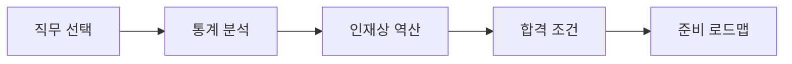
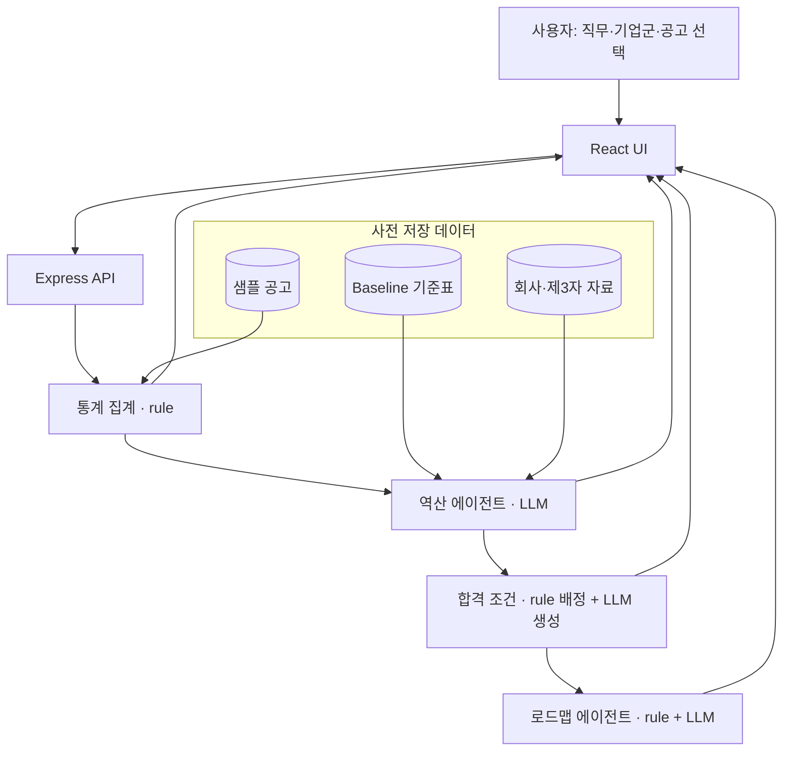
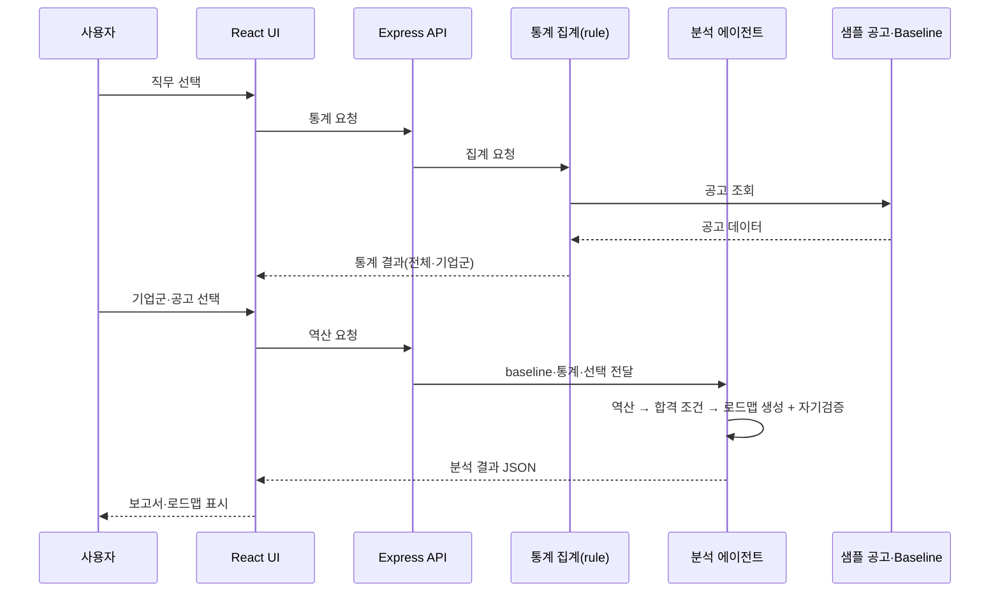

# CareerSignal 설계 문서

## 1. 문서 목적

이 문서는 프로토타입과 MVP의 기술 구조, 그리고 데이터 설계를 기록합니다. 문제 정의와 화면 목적은 [기획서](plan.md)에서, 확정된 시각 구조는 [디자인 컨셉](design-concept.md)에서 확인합니다. 기획서가 "무엇을·누구에게·왜"라면, 이 문서는 "어떻게 만드나"를 다룹니다.

## 2. 프로토타입

`prototype/`은 사용자 흐름과 정보 구조를 시연하기 위한 HTML/CSS 프로토타입입니다.

- 페이지: 직무 선택 · 통계 분석 · 인재상 역산 · 합격 조건 · 준비 로드맵
- 공통 스타일: `style.css`
- 배포: [Vercel 데모](https://careersignal-prototype.vercel.app/)
- 데이터: 백엔드 직무 mock

프로토타입에는 JavaScript, 데이터 조회, rule 분석, LLM 에이전트, Express API가 없습니다. 예시 직무 버튼과 분석 결과는 화면 흐름을 보여 주는 표현입니다.

## 3. MVP

`product/`의 React UI, `server/`의 Express API, 그리고 분석 에이전트를 운영합니다. 에이전트는 Python·FastAPI 위에서 LangChain·LangGraph로 오케스트레이션합니다. 초기 MVP에서는 샘플 공고 데이터를 사용하되, 입력 직무·기업군·개별 공고에 따라 분석 결과와 로드맵이 달라지도록 구현합니다.

**미리 저장하는 것**: 샘플 공고, baseline 기준표, 회사 공식·제3자 자료, rule로 집계한 통계. **요청 시 동적으로 생성하는 것**: 역산 해석, 합격 조건 체크리스트, 로드맵. 실제 채용공고·회사 자료를 웹에서 동적으로 수집하는 것은 확장입니다.

LLM 에이전트는 판단·생성이 필요한 세 곳에 둡니다 — 역산, 합격 조건 내용 생성, 로드맵 추천. 통계 집계·활용처 배정·우선순위는 rule로 처리합니다. 역산의 전체·기업군·개별은 별도 에이전트가 아니라 같은 역산 에이전트의 범위 입력이고, 결과 검증(Verifier)은 각 에이전트의 내부 단계입니다.

| 구성 | MVP 책임 | 유형 |
| --- | --- | --- |
| React UI | 입력, 결과, 로딩·오류 상태 표시 | 화면 |
| Express API | 분석 요청과 응답 계약 분리 | 서버 |
| 통계 집계 | 샘플 공고에서 빈도·조합·시계열 집계·저장(전체·기업군) | rule |
| Baseline 기준표 | 직무 공통 기대치(1·2차로 구축) | 데이터 |
| 역산 에이전트 | baseline·통계 대비 편차·근거·해석 생성(전체·기업군·개별) | LLM |
| 합격 조건 | 요구 항목을 활용처로 배정하고 활용처별 내용 생성 | rule + LLM |
| 로드맵 에이전트 | 미체크 항목 우선순위와 학습·프로젝트 추천 | rule + LLM |
| Verifier | 각 에이전트 출력의 일관성 자기검증 | 에이전트 내부 |

## 4. 목표 데이터 흐름

실제 API 엔드포인트, 데이터 스키마, LLM 프롬프트는 와이어프레임과 MVP 요구사항을 확정한 뒤 정의합니다.

## 5. 데이터 자산과 베이스라인

### 5.1 데이터 자산 구분

- **베이스라인 자료**(`baseline/backend-baseline.md` 등): 직무 단위 기준표입니다. 회사·공고와 무관하게 유지되며, 아래 5.2 절차로 만듭니다.
- **샘플 채용공고 자료**(`mock-data/backend-postings.json` 등): 특정 회사를 흉내 낸 표본 공고 집합입니다. 통계 분석과 편차 탐지의 입력으로 씁니다. 시계열 분석을 위해 최소 두 시점 스냅샷(최근 1년 / 이전 1년)으로 구성합니다.

### 5.2 베이스라인 구축

베이스라인은 직무 공통 기대치이며, 두 갈래로 만듭니다.

1. **통계 기반 후보 추출**: 통계 분석 결과(1차 공고 원문 집계)에서 다수 공고에 공통으로 등장하는 항목을 자동으로 베이스라인 후보로 뽑습니다.
2. **회사 공식 자료로 검증·보완**: 여러 회사의 채용·기술 자료(2차)를 참고해 후보를 다듬습니다. 같은 요구가 회사마다 크게 다르게 해석되지 않으므로 공통 기대치를 다지는 데 활용합니다.

제3자 자료(3차, 현직자 특강·트렌드 리포트·커뮤니티·커리큘럼 등)로 보완하는 것은 확장입니다. 베이스라인은 고정 자료가 아니라 주기적으로(예: 분기 1회) 갱신하는 것을 원칙으로 합니다.

## 6. 자료 계층

역산의 근거는 신뢰도가 다른 세 계층으로 나눕니다.

| 계층 | 자료 | 용도 |
| --- | --- | --- |
| 1차 | 채용공고 원문 | 통계 집계, baseline 후보, 역산 편차 파싱 |
| 2차 | 회사 공식 자료(채용 페이지, 기술 블로그) | baseline 검증·보완, 편차 근거·해석 |
| 3차 | 제3자 자료(잡플래닛·블라인드·커뮤니티·트렌드 리포트·유튜브/블로그) | 보조 신호, 신뢰도 낮게, 확장 |

통계는 1차만 씁니다. baseline과 역산(전체·기업군·개별)은 1·2차를 쓰고, 3차는 확장입니다. 근거가 약하면 신뢰도를 낮춰 표시합니다.

## 7. 데이터 변화

| 단계 | 데이터 | 목적 |
| --- | --- | --- |
| mock | 프로토타입 하드코딩 | 화면·정보 구조 검증 |
| 샘플 | 백엔드+DB ~ MVP, 정형화된 표본 공고 | rule 집계·역산이 동작하는 계약 검증 |
| 실제 | MVP → 확장 전환 시 수집 데이터 | 지속 사용 가능한 서비스 |

스냅샷은 샘플 단계에서 최근 1년 / 이전 1년 두 시점으로 두고, 실데이터 전환 시 연도별 추이로 확장합니다.

## 8. 기업군 태그

회사는 사람이 정한 태그로 묶습니다.

| 태그 | 특성(백엔드 기준 강조점) |
| --- | --- |
| 빅테크·플랫폼 | 대규모 트래픽·동시성, CS 기본기, 코드 품질·리뷰 문화 |
| 스타트업 | 넓은 범위·빠른 실행, 오너십, 풀스택 성향 |
| B2B SaaS | 도메인 이해, API 설계·안정성, 데이터 모델링 |
| 핀테크·금융 | 보안·정합성, 트랜잭션 정확성, 규제 대응 |
| SI·대기업 IT계열 | B2B 프로젝트, 프로세스·문서, 규모 |
| 게임사 | 실시간 처리·성능 최적화, 대용량 동시 접속, 클라이언트·서버 협업 |

## 9. 개발 순서

기획 → 디자인·프로토타입(mock) → **프론트(`product`, React·mock)** → **샘플 데이터(데이터 모델·계약 정형화)** → **백+DB(`server`, Express·Supabase, rule 통계·API)** → AI 에이전트(LLM 역산·문구, 샘플) → MVP 배포 → 확장(백엔드 외 직군 데이터·실데이터 수집).

프론트는 가짜(mock) 데이터로 화면과 흐름을 먼저 검증한다. '샘플 데이터'는 프론트가 기대하고 백엔드가 돌려줄 **응답 데이터 모양**을 정형화하는 단계로, 프론트와 백엔드가 만나는 접점이다. 백+DB부터는 계층을 한꺼번에 완성하기보다 기능 하나를 화면→서버→DB→화면으로 잇는 **수직 슬라이스**로 진행한다. rule 뼈대를 먼저 만들고 그 위에 LLM 에이전트를 얹으며, LLM 도입과 실데이터 수집은 분리해 에이전트는 샘플 데이터 위에서 먼저 검증한다.

## 10. 기능별 구현 세부

기획서 6장의 사용자 기준 설명에 대응하는 출력·데이터·분석 방법입니다. 각 화면의 정보 구성은 기획서 9장, 시각 규칙은 [디자인 컨셉](design-concept.md)에서 다룹니다.

### 10.1 통계 분석

- **출력**: 공고 수·지표, 함께 요구되는 기술 조합, 기술 빈도, 시계열 추이. 전체·기업군.
- **데이터**: 샘플 공고 자료(두 시점 스냅샷).
- **분석**: 공고 원문(1차)만으로 rule 기반 집계. 회사 규모·산업 같은 비정형 태깅에만 보조 해석. LLM 확장은 후속.

### 10.2 인재상 역산

- **출력**: 항목별 [항목명 | baseline 수준 | 편차 여부 | 근거 문장 | 해석 | 신뢰도 | 같은 직군 내 등장 비율]. 전체·기업군·개별 공고(원문+해석).
- **데이터**: 샘플 공고 + 회사 공식 자료(있는 경우) + 통계 결과.
- **분석**: LLM 에이전트가 baseline 비교, 근거 추출, 자연어 해석 생성.

### 10.3 합격 조건 정의

- **출력**: 체크리스트 [요구 항목 | 필요 산출물/활동 | 활용처 | 보유 여부]와 활용처별 내용(자소서 소재·포트폴리오 강조점·예상 면접 질문). 목표 기업군·회사 맞춤 조정.
- **데이터**: 역산 출력만 사용(추가 수집 불필요).
- **분석**: 활용처 배정은 rule 기반(항목 성격 태그), 예상 면접 질문 문구 생성은 LLM.

### 10.4 준비 로드맵

- **출력**: 단계별 [목표 미체크 항목 | 기간 | 권장 구현 범위·산출물 | 우선순위 | 추천 이유], 완료 항목 표시, 목표 기업군 토글. 각 추천은 채워지는 체크리스트 항목과 연결.
- **데이터**: 합격 조건 출력만 사용.
- **분석**: 우선순위(필수 우선)는 rule, 학습·프로젝트 추천 문구는 LLM.

## 11. 제외 및 확장

MVP 이후 백엔드 외 직군 데이터, 실제 채용공고 수집, 연도별 추이를 추가합니다. 개인화 Gap 분석, 로그인·저장, 자동 클러스터링, 제3자 자료 연동, 권고/선택 구분, 직무 자유 입력은 백로그에 두고 착수 시 기획서에 반영합니다. 이 기능들은 현재 정적 프로토타입이나 MVP 완료 기능으로 표현하지 않습니다.
