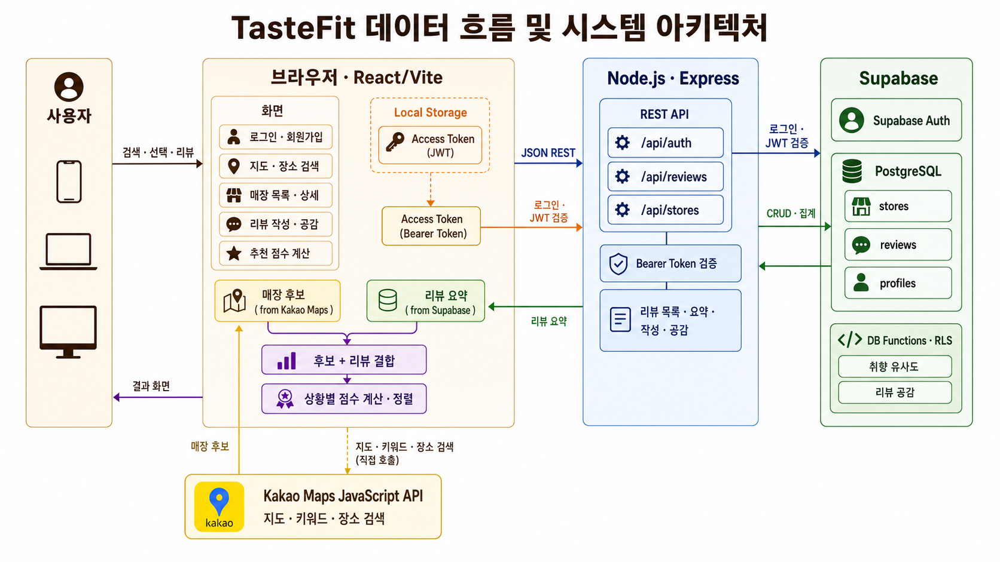
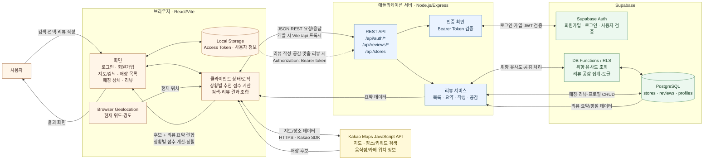

# TasteFit 데이터 흐름 및 시스템 아키텍처

## 편집 가능한 원본

## 핵심 흐름

1. 사용자의 현재 위치 또는 검색어를 브라우저가 Kakao Maps API에 전달해 음식점·카페 후보를 받습니다.
2. React 화면은 후보의 Kakao Place ID를 Express의 리뷰 요약 API로 보내고, 서버는 Supabase의 `stores`, `reviews` 데이터를 집계해 반환합니다.
3. 브라우저가 장소 정보와 리뷰 요약을 합치고, 선택한 상황에 맞는 추천 점수를 계산·정렬하여 지도와 매장 목록에 표시합니다.
4. 로그인·회원가입은 Express를 거쳐 Supabase Auth에서 처리합니다. 로그인 결과의 Access Token과 사용자 정보는 브라우저 Local Storage에 저장됩니다.
5. 리뷰 조회·작성·공감 시 Express가 토큰을 검증하고 Supabase 테이블 및 DB 함수를 호출합니다. 취향 유사도와 공감 결과가 다시 매장 상세 화면에 표시됩니다.

> 실선은 주요 요청·응답 또는 데이터 흐름이고, 점선은 인증이 필요한 요청에 토큰이 추가되는 흐름입니다. 이 문서는 현재 저장소의 구현을 기준으로 작성했습니다.
