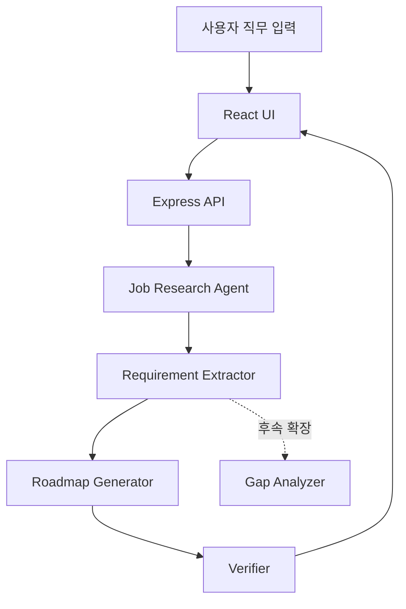
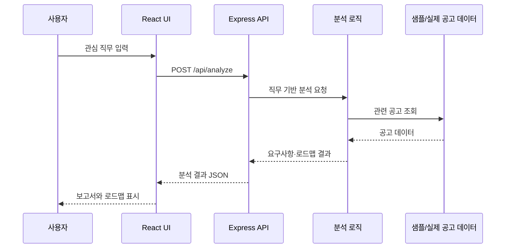

# CareerSignal 설계 문서

## 1. 문서 목적

이 문서는 현재 정적 프로토타입과 이후 실제 제품의 기술 구조를 구분해 기록합니다. 문제 정의와 화면 목적은 [기획서](plan.md)에서, 확정된 시각 구조는 [디자인 컨셉](design-concept.md)에서 확인합니다.

## 2. 현재: 정적 프로토타입

현재 `prototype/`은 사용자 흐름과 정보 구조를 시연하기 위한 HTML/CSS 정적 프로토타입입니다.

- 페이지: `index.html`, `report.html`, `roadmap.html`
- 공통 스타일: `style.css`
- 배포: [Vercel 정적 데모](https://careersignal-prototype.vercel.app/)
- 데이터 표기: 최근 3개월 주니어 프론트엔드 공고 24건을 가정한 mock 리서치

현재 프로토타입에는 React UI, JavaScript 이벤트 처리, mock data 조회, rule 기반 분석, Verifier, Express API가 구현되어 있지 않습니다. 예시 직무 버튼과 분석 결과는 화면 흐름을 보여 주는 정적 표현입니다.

## 3. 다음: 실제 제품 MVP

실제 제품은 `src/product/`의 React UI와 `server/`의 Express API를 독립적으로 운영합니다. 초기 MVP에서는 샘플 공고 데이터를 사용하되, 입력 직무에 따라 분석 결과와 로드맵이 달라지도록 구현합니다.

| 역할 | MVP 책임 | 현재 상태 |
| --- | --- | --- |
| React UI | 입력, 결과, 로딩·오류 상태 표시 | 미구현 |
| Express API | 분석 요청과 응답 계약 분리 | 미구현 |
| Job Research Agent | 직무에 맞는 샘플 공고 선택 | 미구현 |
| Requirement Extractor | 필수·우대사항과 구현 범위 추출 | 미구현 |
| Roadmap Generator | 우선순위와 학습 로드맵 생성 | 미구현 |
| Verifier | 입력·데이터·추천 결과의 일관성 확인 | 미구현 |
| Gap Analyzer | 사용자 역량과 요구 역량 비교 | 후속 확장 |

## 4. 목표 데이터 흐름

실제 API 엔드포인트, 데이터 스키마, LLM 도입 여부는 와이어프레임과 MVP 요구사항을 확정한 뒤 정의합니다.

## 5. 제외 및 확장

MVP 이후 실제 채용공고 수집, LLM 분석, DB 저장, 로그인, 사용자 역량 기반 Gap 분석을 단계적으로 추가합니다. 이 기능들은 현재 정적 프로토타입이나 MVP 완료 기능으로 표현하지 않습니다.
